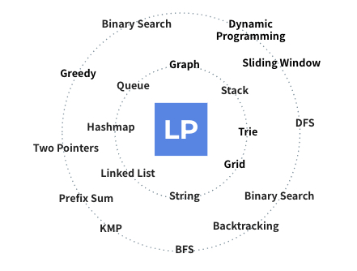

---
hide:
  - navigation
  - toc
---

# Welcome to 🚀LeetPattern

- Your ultimate guide to mastering coding interviews with LeetPattern.
- Learn essential problem-solving patterns and practice with real interview questions to boost your confidence and skills.

{ width=500px }

## Why 🚀LeetPattern?

- Comprehensive Guides: Dive into detailed tutorials that cover all major coding patterns you need to know for interviews.
- Structured Learning: Organized by difficulty and topic, our content helps you learn efficiently and effectively.
- Real Interview Questions: Practice with problems that are frequently asked in top tech interviews.
- Community Support: Join our community of learners and mentors. Get support, share insights, and grow together.
