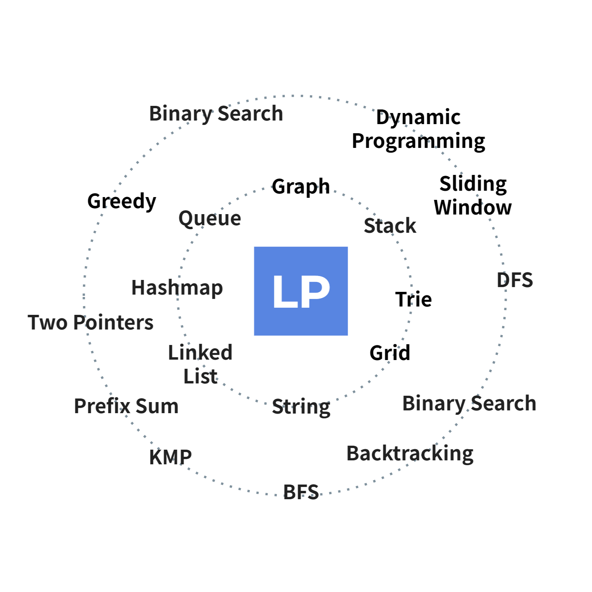

# Welcome to 🚀LeetPattern

   

Thank you for visiting this project! If you find it helpful or interesting, please consider giving it a ⭐️ on GitHub. It helps others discover the project and motivates me to keep improving it. Your support means a lot! 😊

  

    
  

  

    📚 This is a collection of patterns for solving LeetCode problems. The goal is to provide a structured approach to solving problems and to help you build a strong foundation in algorithms and data structures.
  

## Prerequisites

-   Python Basics: [Python Distilled](https://www.dabeaz.com/python-distilled/)

## Resources

-   [算法竞赛模板库 by 灵茶山艾府](https://github.com/EndlessCheng/codeforces-go)
-   [[Leetcode Discuss] Solved all two pointers problems in 100 days](https://leetcode.com/discuss/study-guide/1688903/solved-all-two-pointers-problems-in-100-days)

<iframe src="https://docs.google.com/presentation/d/e/2PACX-1vTn_gElbkX3P669Dq7pBKHaQdmKhq8oWuf6NGq6imJxujw1eexYkpMgtw7GKlN_3xjle6jqBUPUpPkp/embed?start=false&loop=false&delayms=3000" frameborder="0" width="960" height="569" allowfullscreen="true" mozallowfullscreen="true" webkitallowfullscreen="true"></iframe>
