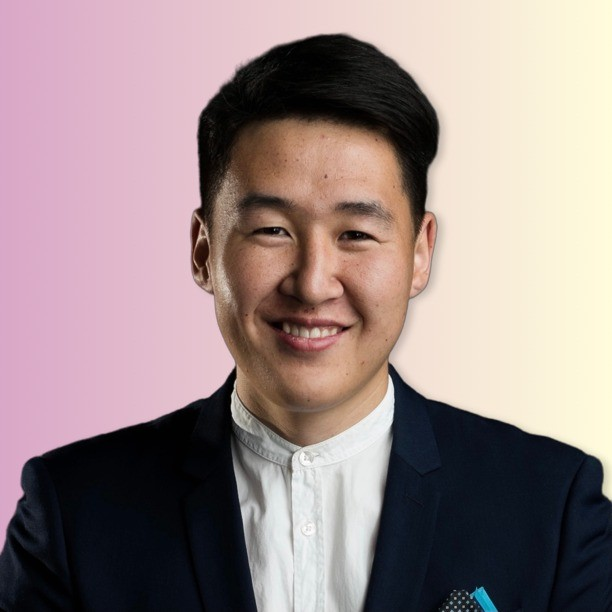

# Meet your Instructor

{ style="display: block; margin-left: auto; margin-right: auto; border-radius: 50%; width: 200px;" }

  Hi, I am Sihan. Connect with me on
  
  

I've spent my career diving into the world of AI and machine learning, working on everything from optimizing DNN algorithms to deploying AI models on hardware. Right now, I'm at Sony, where I get to play with TensorRT, ONNX, and OpenVINO to create some pretty cool stuff. I’ve built full-stack systems, set up MLOps pipelines, and delivered high-performance models for AI camera chips.

Before Sony, I did a bunch of internships and research gigs, working on things like fine-tuning language models and industrial anomaly detection. I also have a Master’s in Electrical and Electronic Engineering from Tokyo Tech, where I focused on self-supervised learning and edge computing.

I love tackling tough problems and pushing the boundaries of what AI can do. It's been a fun ride so far, and I'm excited to keep making an impact in the AI world.
