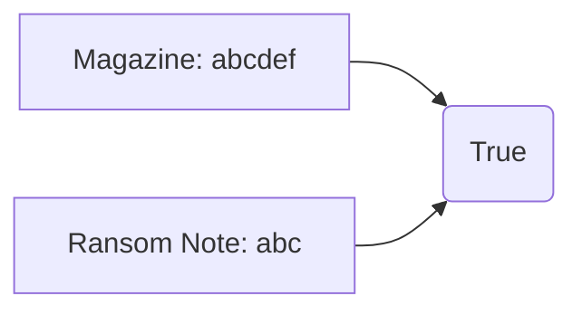

# LeetPattern

## 1. Two Sum


=== "Python"

    ```python
    --8<-- "0001_two_sum.py"
    ```

=== "C++"

    ```cpp
    --8<-- "cpp/0001_two_sum.cc"
    ```

=== "TypeScript"

    ```typescript
    --8<-- "ts/0001_two_sum.ts"
    ```

## 2. Add Two Numbers


=== "Python"

    ```python
    --8<-- "0002_add_two_numbers.py"
    ```

=== "C++"

    ```cpp
    --8<-- "cpp/0002_add_two_numbers.cc"
    ```

=== "TypeScript"

    ```typescript
    --8<-- "ts/0002_add_two_numbers.ts"
    ```

## 3. Longest Substring Without Repeating Characters


=== "Python"

    ```python
    --8<-- "0003_longest_substring_without_repeating_characters.py"
    ```

=== "C++"

    ```cpp
    --8<-- "cpp/0003_longest_substring_without_repeating_characters.cc"
    ```

=== "TypeScript"

    ```typescript
    --8<-- "ts/0003_longest_substring_without_repeating_characters.ts"
    ```

## 4. Median Of Two Sorted Arrays


=== "Python"

    ```python
    --8<-- "0004_median_of_two_sorted_arrays.py"
    ```

=== "C++"

    ```cpp
    --8<-- "cpp/0004_median_of_two_sorted_arrays.cc"
    ```

=== "TypeScript"

    ```typescript
    --8<-- "ts/0004_median_of_two_sorted_arrays.ts"
    ```

## 5. Longest Palindromic Substring


=== "Python"

    ```python
    --8<-- "0005_longest_palindromic_substring.py"
    ```

=== "C++"

    ```cpp
    --8<-- "cpp/0005_longest_palindromic_substring.cc"
    ```

=== "TypeScript"

    ```typescript
    --8<-- "ts/0005_longest_palindromic_substring.ts"
    ```

## 7. Reverse Integer


=== "Python"

    ```python
    --8<-- "0007_reverse_integer.py"
    ```

=== "C++"

    ```cpp
    --8<-- "cpp/0007_reverse_integer.cc"
    ```

=== "TypeScript"

    ```typescript
    --8<-- "ts/0007_reverse_integer.ts"
    ```

## 9. Palindrome Number

=== "Python"

    ```python
    --8<-- "0009_palindrome_number.py"
    ```

=== "C++"

    ```cpp
    --8<-- "cpp/0009_palindrome_number.cc"
    ```

=== "TypeScript"

    ```typescript
    --8<-- "ts/0009_palindrome_number.ts"
    ```

## 11. Container With Most Water


=== "Python"

    ```python
    --8<-- "0011_container_with_most_water.py"
    ```

=== "C++"

    ```cpp
    --8<-- "cpp/0011_container_with_most_water.cc"
    ```

=== "TypeScript"

    ```typescript
    --8<-- "ts/0011_container_with_most_water.ts"
    ```

## 15. 3Sum


=== "Python"

    ```python
    --8<-- "0015_3sum.py"
    ```

=== "C++"

    ```cpp
    --8<-- "cpp/0015_3sum.cc"
    ```

=== "TypeScript"

    ```typescript
    --8<-- "ts/0015_3sum.ts"
    ```

## 17. Letter Combinations Of A Phone Number


=== "Python"

    ```python
    --8<-- "0017_letter_combinations_of_a_phone_number.py"
    ```

=== "C++"

    ```cpp
    --8<-- "cpp/0017_letter_combinations_of_a_phone_number.cc"
    ```

=== "TypeScript"

    ```typescript
    --8<-- "ts/0017_letter_combinations_of_a_phone_number.ts"
    ```

## 18. 4Sum


=== "Python"

    ```python
    --8<-- "0018_4sum.py"
    ```

=== "C++"

    ```cpp
    --8<-- "cpp/0018_4sum.cc"
    ```

=== "TypeScript"

    ```typescript
    --8<-- "ts/0018_4sum.ts"
    ```

## 19. Remove Nth Node From End Of List


=== "Python"

    ```python
    --8<-- "0019_remove_nth_node_from_end_of_list.py"
    ```

=== "C++"

    ```cpp
    --8<-- "cpp/0019_remove_nth_node_from_end_of_list.cc"
    ```

=== "TypeScript"

    ```typescript
    --8<-- "ts/0019_remove_nth_node_from_end_of_list.ts"
    ```

## 20. Valid Parentheses


=== "Python"

    ```python
    --8<-- "0020_valid_parentheses.py"
    ```

=== "C++"

    ```cpp
    --8<-- "cpp/0020_valid_parentheses.cc"
    ```

=== "TypeScript"

    ```typescript
    --8<-- "ts/0020_valid_parentheses.ts"
    ```

## 21. Merge Two Sorted Lists


=== "Python"

    ```python
    --8<-- "0021_merge_two_sorted_lists.py"
    ```

=== "C++"

    ```cpp
    --8<-- "cpp/0021_merge_two_sorted_lists.cc"
    ```

=== "TypeScript"

    ```typescript
    --8<-- "ts/0021_merge_two_sorted_lists.ts"
    ```

## 22. Generate Parentheses


=== "Python"

    ```python
    --8<-- "0022_generate_parentheses.py"
    ```

=== "C++"

    ```cpp
    --8<-- "cpp/0022_generate_parentheses.cc"
    ```

=== "TypeScript"

    ```typescript
    --8<-- "ts/0022_generate_parentheses.ts"
    ```

## 23. Merge K Sorted Lists


=== "Python"

    ```python
    --8<-- "0023_merge_k_sorted_lists.py"
    ```

=== "C++"

    ```cpp
    --8<-- "cpp/0023_merge_k_sorted_lists.cc"
    ```

=== "TypeScript"

    ```typescript
    --8<-- "ts/0023_merge_k_sorted_lists.ts"
    ```

## 24. Swap Nodes In Pairs


=== "Python"

    ```python
    --8<-- "0024_swap_nodes_in_pairs.py"
    ```

=== "C++"

    ```cpp
    --8<-- "cpp/0024_swap_nodes_in_pairs.cc"
    ```

=== "TypeScript"

    ```typescript
    --8<-- "ts/0024_swap_nodes_in_pairs.ts"
    ```

## 26. Remove Duplicates From Sorted Array


=== "Python"

    ```python
    --8<-- "0026_remove_duplicates_from_sorted_array.py"
    ```

=== "C++"

    ```cpp
    --8<-- "cpp/0026_remove_duplicates_from_sorted_array.cc"
    ```

=== "TypeScript"

    ```typescript
    --8<-- "ts/0026_remove_duplicates_from_sorted_array.ts"
    ```

## 27. Remove Element


=== "Python"

    ```python
    --8<-- "0027_remove_element.py"
    ```

=== "C++"

    ```cpp
    --8<-- "cpp/0027_remove_element.cc"
    ```

=== "TypeScript"

    ```typescript
    --8<-- "ts/0027_remove_element.ts"
    ```

## 28. Find The Index Of The First Occurrence In A String


=== "Python"

    ```python
    --8<-- "0028_find_the_index_of_the_first_occurrence_in_a_string.py"
    ```

=== "C++"

    ```cpp
    --8<-- "cpp/0028_find_the_index_of_the_first_occurrence_in_a_string.cc"
    ```

=== "TypeScript"

    ```typescript
    --8<-- "ts/0028_find_the_index_of_the_first_occurrence_in_a_string.ts"
    ```

## 34. Find First And Last Position Of Element In Sorted Array


=== "Python"

    ```python
    --8<-- "0034_find_first_and_last_position_of_element_in_sorted_array.py"
    ```

=== "C++"

    ```cpp
    --8<-- "cpp/0034_find_first_and_last_position_of_element_in_sorted_array.cc"
    ```

=== "TypeScript"

    ```typescript
    --8<-- "ts/0034_find_first_and_last_position_of_element_in_sorted_array.ts"
    ```

## 35. Search Insert Position


=== "Python"

    ```python
    --8<-- "0035_search_insert_position.py"
    ```

=== "C++"

    ```cpp
    --8<-- "cpp/0035_search_insert_position.cc"
    ```

=== "TypeScript"

    ```typescript
    --8<-- "ts/0035_search_insert_position.ts"
    ```

## 36. Valid Sudoku


=== "Python"

    ```python
    --8<-- "0036_valid_sudoku.py"
    ```

=== "C++"

    ```cpp
    --8<-- "cpp/0036_valid_sudoku.cc"
    ```

=== "TypeScript"

    ```typescript
    --8<-- "ts/0036_valid_sudoku.ts"
    ```

## 37. Sudoku Solver


=== "Python"

    ```python
    --8<-- "0037_sudoku_solver.py"
    ```

=== "C++"

    ```cpp
    --8<-- "cpp/0037_sudoku_solver.cc"
    ```

=== "TypeScript"

    ```typescript
    --8<-- "ts/0037_sudoku_solver.ts"
    ```

## 39. Combination Sum


=== "Python"

    ```python
    --8<-- "0039_combination_sum.py"
    ```

=== "C++"

    ```cpp
    --8<-- "cpp/0039_combination_sum.cc"
    ```

=== "TypeScript"

    ```typescript
    --8<-- "ts/0039_combination_sum.ts"
    ```

## 40. Combination Sum Ii


=== "Python"

    ```python
    --8<-- "0040_combination_sum_ii.py"
    ```

=== "C++"

    ```cpp
    --8<-- "cpp/0040_combination_sum_ii.cc"
    ```

=== "TypeScript"

    ```typescript
    --8<-- "ts/0040_combination_sum_ii.ts"
    ```

## 42. Trapping Rain Water


=== "Python"

    ```python
    --8<-- "0042_trapping_rain_water.py"
    ```

=== "C++"

    ```cpp
    --8<-- "cpp/0042_trapping_rain_water.cc"
    ```

=== "TypeScript"

    ```typescript
    --8<-- "ts/0042_trapping_rain_water.ts"
    ```

## 43. Multiply Strings


=== "Python"

    ```python
    --8<-- "0043_multiply_strings.py"
    ```

=== "C++"

    ```cpp
    --8<-- "cpp/0043_multiply_strings.cc"
    ```

=== "TypeScript"

    ```typescript
    --8<-- "ts/0043_multiply_strings.ts"
    ```

## 45. Jump Game Ii


=== "Python"

    ```python
    --8<-- "0045_jump_game_ii.py"
    ```

=== "C++"

    ```cpp
    --8<-- "cpp/0045_jump_game_ii.cc"
    ```

=== "TypeScript"

    ```typescript
    --8<-- "ts/0045_jump_game_ii.ts"
    ```

## 46. Permutations


=== "Python"

    ```python
    --8<-- "0046_permutations.py"
    ```

=== "C++"

    ```cpp
    --8<-- "cpp/0046_permutations.cc"
    ```

=== "TypeScript"

    ```typescript
    --8<-- "ts/0046_permutations.ts"
    ```

## 47. Permutations Ii


=== "Python"

    ```python
    --8<-- "0047_permutations_ii.py"
    ```

=== "C++"

    ```cpp
    --8<-- "cpp/0047_permutations_ii.cc"
    ```

=== "TypeScript"

    ```typescript
    --8<-- "ts/0047_permutations_ii.ts"
    ```

## 48. Rotate Image


=== "Python"

    ```python
    --8<-- "0048_rotate_image.py"
    ```

=== "C++"

    ```cpp
    --8<-- "cpp/0048_rotate_image.cc"
    ```

=== "TypeScript"

    ```typescript
    --8<-- "ts/0048_rotate_image.ts"
    ```

## 49. Group Anagrams


=== "Python"

    ```python
    --8<-- "0049_group_anagrams.py"
    ```

=== "C++"

    ```cpp
    --8<-- "cpp/0049_group_anagrams.cc"
    ```

=== "TypeScript"

    ```typescript
    --8<-- "ts/0049_group_anagrams.ts"
    ```

## 50. Powx N


=== "Python"

    ```python
    --8<-- "0050_powx_n.py"
    ```

=== "C++"

    ```cpp
    --8<-- "cpp/0050_powx_n.cc"
    ```

=== "TypeScript"

    ```typescript
    --8<-- "ts/0050_powx_n.ts"
    ```

## 51. N Queens


=== "Python"

    ```python
    --8<-- "0051_n_queens.py"
    ```

=== "C++"

    ```cpp
    --8<-- "cpp/0051_n_queens.cc"
    ```

=== "TypeScript"

    ```typescript
    --8<-- "ts/0051_n_queens.ts"
    ```

## 53. Maximum Subarray


=== "Python"

    ```python
    --8<-- "0053_maximum_subarray.py"
    ```

=== "C++"

    ```cpp
    --8<-- "cpp/0053_maximum_subarray.cc"
    ```

=== "TypeScript"

    ```typescript
    --8<-- "ts/0053_maximum_subarray.ts"
    ```

## 54. Spiral Matrix


=== "Python"

    ```python
    --8<-- "0054_spiral_matrix.py"
    ```

=== "C++"

    ```cpp
    --8<-- "cpp/0054_spiral_matrix.cc"
    ```

=== "TypeScript"

    ```typescript
    --8<-- "ts/0054_spiral_matrix.ts"
    ```

## 55. Jump Game


=== "Python"

    ```python
    --8<-- "0055_jump_game.py"
    ```

=== "C++"

    ```cpp
    --8<-- "cpp/0055_jump_game.cc"
    ```

=== "TypeScript"

    ```typescript
    --8<-- "ts/0055_jump_game.ts"
    ```

## 56. Merge Intervals


=== "Python"

    ```python
    --8<-- "0056_merge_intervals.py"
    ```

=== "C++"

    ```cpp
    --8<-- "cpp/0056_merge_intervals.cc"
    ```

=== "TypeScript"

    ```typescript
    --8<-- "ts/0056_merge_intervals.ts"
    ```

## 57. Insert Interval


=== "Python"

    ```python
    --8<-- "0057_insert_interval.py"
    ```

=== "C++"

    ```cpp
    --8<-- "cpp/0057_insert_interval.cc"
    ```

=== "TypeScript"

    ```typescript
    --8<-- "ts/0057_insert_interval.ts"
    ```

## 58. Length Of Last Word


=== "Python"

    ```python
    --8<-- "0058_length_of_last_word.py"
    ```

=== "C++"

    ```cpp
    --8<-- "cpp/0058_length_of_last_word.cc"
    ```

=== "TypeScript"

    ```typescript
    --8<-- "ts/0058_length_of_last_word.ts"
    ```

## 59. Spiral Matrix Ii


=== "Python"

    ```python
    --8<-- "0059_spiral_matrix_ii.py"
    ```

=== "C++"

    ```cpp
    --8<-- "cpp/0059_spiral_matrix_ii.cc"
    ```

=== "TypeScript"

    ```typescript
    --8<-- "ts/0059_spiral_matrix_ii.ts"
    ```

## 62. Unique Paths


=== "Python"

    ```python
    --8<-- "0062_unique_paths.py"
    ```

=== "C++"

    ```cpp
    --8<-- "cpp/0062_unique_paths.cc"
    ```

=== "TypeScript"

    ```typescript
    --8<-- "ts/0062_unique_paths.ts"
    ```

## 63. Unique Paths Ii


=== "Python"

    ```python
    --8<-- "0063_unique_paths_ii.py"
    ```

=== "C++"

    ```cpp
    --8<-- "cpp/0063_unique_paths_ii.cc"
    ```

=== "TypeScript"

    ```typescript
    --8<-- "ts/0063_unique_paths_ii.ts"
    ```

## 66. Plus One


=== "Python"

    ```python
    --8<-- "0066_plus_one.py"
    ```

=== "C++"

    ```cpp
    --8<-- "cpp/0066_plus_one.cc"
    ```

=== "TypeScript"

    ```typescript
    --8<-- "ts/0066_plus_one.ts"
    ```

## 69. Sqrtx


=== "Python"

    ```python
    --8<-- "0069_sqrtx.py"
    ```

=== "C++"

    ```cpp
    --8<-- "cpp/0069_sqrtx.cc"
    ```

=== "TypeScript"

    ```typescript
    --8<-- "ts/0069_sqrtx.ts"
    ```

## 70. Climbing Stairs


=== "Python"

    ```python
    --8<-- "0070_climbing_stairs.py"
    ```

=== "C++"

    ```cpp
    --8<-- "cpp/0070_climbing_stairs.cc"
    ```

=== "TypeScript"

    ```typescript
    --8<-- "ts/0070_climbing_stairs.ts"
    ```

## 72. Edit Distance


=== "Python"

    ```python
    --8<-- "0072_edit_distance.py"
    ```

=== "C++"

    ```cpp
    --8<-- "cpp/0072_edit_distance.cc"
    ```

=== "TypeScript"

    ```typescript
    --8<-- "ts/0072_edit_distance.ts"
    ```

## 73. Set Matrix Zeroes


=== "Python"

    ```python
    --8<-- "0073_set_matrix_zeroes.py"
    ```

=== "C++"

    ```cpp
    --8<-- "cpp/0073_set_matrix_zeroes.cc"
    ```

=== "TypeScript"

    ```typescript
    --8<-- "ts/0073_set_matrix_zeroes.ts"
    ```

## 74. Search A 2D Matrix


=== "Python"

    ```python
    --8<-- "0074_search_a_2d_matrix.py"
    ```

=== "C++"

    ```cpp
    --8<-- "cpp/0074_search_a_2d_matrix.cc"
    ```

=== "TypeScript"

    ```typescript
    --8<-- "ts/0074_search_a_2d_matrix.ts"
    ```

## 75. Sort Colors


=== "Python"

    ```python
    --8<-- "0075_sort_colors.py"
    ```

=== "C++"

    ```cpp
    --8<-- "cpp/0075_sort_colors.cc"
    ```

=== "TypeScript"

    ```typescript
    --8<-- "ts/0075_sort_colors.ts"
    ```

## 76. Minimum Window Substring


=== "Python"

    ```python
    --8<-- "0076_minimum_window_substring.py"
    ```

=== "C++"

    ```cpp
    --8<-- "cpp/0076_minimum_window_substring.cc"
    ```

=== "TypeScript"

    ```typescript
    --8<-- "ts/0076_minimum_window_substring.ts"
    ```

## 77. Combinations


=== "Python"

    ```python
    --8<-- "0077_combinations.py"
    ```

=== "C++"

    ```cpp
    --8<-- "cpp/0077_combinations.cc"
    ```

=== "TypeScript"

    ```typescript
    --8<-- "ts/0077_combinations.ts"
    ```

## 78. Subsets


=== "Python"

    ```python
    --8<-- "0078_subsets.py"
    ```

=== "C++"

    ```cpp
    --8<-- "cpp/0078_subsets.cc"
    ```

=== "TypeScript"

    ```typescript
    --8<-- "ts/0078_subsets.ts"
    ```

## 79. Word Search


=== "Python"

    ```python
    --8<-- "0079_word_search.py"
    ```

=== "C++"

    ```cpp
    --8<-- "cpp/0079_word_search.cc"
    ```

=== "TypeScript"

    ```typescript
    --8<-- "ts/0079_word_search.ts"
    ```

## 80. Remove Duplicates From Sorted Array Ii


=== "Python"

    ```python
    --8<-- "0080_remove_duplicates_from_sorted_array_ii.py"
    ```

=== "C++"

    ```cpp
    --8<-- "cpp/0080_remove_duplicates_from_sorted_array_ii.cc"
    ```

=== "TypeScript"

    ```typescript
    --8<-- "ts/0080_remove_duplicates_from_sorted_array_ii.ts"
    ```

## 84. Largest Rectangle In Histogram


=== "Python"

    ```python
    --8<-- "0084_largest_rectangle_in_histogram.py"
    ```

=== "C++"

    ```cpp
    --8<-- "cpp/0084_largest_rectangle_in_histogram.cc"
    ```

=== "TypeScript"

    ```typescript
    --8<-- "ts/0084_largest_rectangle_in_histogram.ts"
    ```

## 85. Maximal Rectangle


=== "Python"

    ```python
    --8<-- "0085_maximal_rectangle.py"
    ```

=== "C++"

    ```cpp
    --8<-- "cpp/0085_maximal_rectangle.cc"
    ```

=== "TypeScript"

    ```typescript
    --8<-- "ts/0085_maximal_rectangle.ts"
    ```

## 88. Merge Sorted Array


=== "Python"

    ```python
    --8<-- "0088_merge_sorted_array.py"
    ```

=== "C++"

    ```cpp
    --8<-- "cpp/0088_merge_sorted_array.cc"
    ```

=== "TypeScript"

    ```typescript
    --8<-- "ts/0088_merge_sorted_array.ts"
    ```

## 90. Subsets Ii


=== "Python"

    ```python
    --8<-- "0090_subsets_ii.py"
    ```

=== "C++"

    ```cpp
    --8<-- "cpp/0090_subsets_ii.cc"
    ```

=== "TypeScript"

    ```typescript
    --8<-- "ts/0090_subsets_ii.ts"
    ```

## 91. Decode Ways


=== "Python"

    ```python
    --8<-- "0091_decode_ways.py"
    ```

=== "C++"

    ```cpp
    --8<-- "cpp/0091_decode_ways.cc"
    ```

=== "TypeScript"

    ```typescript
    --8<-- "ts/0091_decode_ways.ts"
    ```

## 93. Restore Ip Addresses


=== "Python"

    ```python
    --8<-- "0093_restore_ip_addresses.py"
    ```

=== "C++"

    ```cpp
    --8<-- "cpp/0093_restore_ip_addresses.cc"
    ```

=== "TypeScript"

    ```typescript
    --8<-- "ts/0093_restore_ip_addresses.ts"
    ```

## 94. Binary Tree Inorder Traversal


=== "Python"

    ```python
    --8<-- "0094_binary_tree_inorder_traversal.py"
    ```

=== "C++"

    ```cpp
    --8<-- "cpp/0094_binary_tree_inorder_traversal.cc"
    ```

=== "TypeScript"

    ```typescript
    --8<-- "ts/0094_binary_tree_inorder_traversal.ts"
    ```

## 97. Interleaving String


=== "Python"

    ```python
    --8<-- "0097_interleaving_string.py"
    ```

=== "C++"

    ```cpp
    --8<-- "cpp/0097_interleaving_string.cc"
    ```

=== "TypeScript"

    ```typescript
    --8<-- "ts/0097_interleaving_string.ts"
    ```

## 98. Validate Binary Search Tree


=== "Python"

    ```python
    --8<-- "0098_validate_binary_search_tree.py"
    ```

=== "C++"

    ```cpp
    --8<-- "cpp/0098_validate_binary_search_tree.cc"
    ```

=== "TypeScript"

    ```typescript
    --8<-- "ts/0098_validate_binary_search_tree.ts"
    ```

## 100. Same Tree


=== "Python"

    ```python
    --8<-- "0100_same_tree.py"
    ```

=== "C++"

    ```cpp
    --8<-- "cpp/0100_same_tree.cc"
    ```

=== "TypeScript"

    ```typescript
    --8<-- "ts/0100_same_tree.ts"
    ```

## 101. Symmetric Tree


=== "Python"

    ```python
    --8<-- "0101_symmetric_tree.py"
    ```

=== "C++"

    ```cpp
    --8<-- "cpp/0101_symmetric_tree.cc"
    ```

=== "TypeScript"

    ```typescript
    --8<-- "ts/0101_symmetric_tree.ts"
    ```

## 102. Binary Tree Level Order Traversal


=== "Python"

    ```python
    --8<-- "0102_binary_tree_level_order_traversal.py"
    ```

=== "C++"

    ```cpp
    --8<-- "cpp/0102_binary_tree_level_order_traversal.cc"
    ```

=== "TypeScript"

    ```typescript
    --8<-- "ts/0102_binary_tree_level_order_traversal.ts"
    ```

## 103. Binary Tree Zigzag Level Order Traversal


=== "Python"

    ```python
    --8<-- "0103_binary_tree_zigzag_level_order_traversal.py"
    ```

=== "C++"

    ```cpp
    --8<-- "cpp/0103_binary_tree_zigzag_level_order_traversal.cc"
    ```

=== "TypeScript"

    ```typescript
    --8<-- "ts/0103_binary_tree_zigzag_level_order_traversal.ts"
    ```

## 104. Maximum Depth Of Binary Tree


=== "Python"

    ```python
    --8<-- "0104_maximum_depth_of_binary_tree.py"
    ```

=== "C++"

    ```cpp
    --8<-- "cpp/0104_maximum_depth_of_binary_tree.cc"
    ```

=== "TypeScript"

    ```typescript
    --8<-- "ts/0104_maximum_depth_of_binary_tree.ts"
    ```

## 105. Construct Binary Tree From Preorder And Inorder Traversal


=== "Python"

    ```python
    --8<-- "0105_construct_binary_tree_from_preorder_and_inorder_traversal.py"
    ```

=== "C++"

    ```cpp
    --8<-- "cpp/0105_construct_binary_tree_from_preorder_and_inorder_traversal.cc"
    ```

=== "TypeScript"

    ```typescript
    --8<-- "ts/0105_construct_binary_tree_from_preorder_and_inorder_traversal.ts"
    ```

## 106. Construct Binary Tree From Inorder And Postorder Traversal


=== "Python"

    ```python
    --8<-- "0106_construct_binary_tree_from_inorder_and_postorder_traversal.py"
    ```

=== "C++"

    ```cpp
    --8<-- "cpp/0106_construct_binary_tree_from_inorder_and_postorder_traversal.cc"
    ```

=== "TypeScript"

    ```typescript
    --8<-- "ts/0106_construct_binary_tree_from_inorder_and_postorder_traversal.ts"
    ```

## 107. Binary Tree Level Order Traversal Ii


=== "Python"

    ```python
    --8<-- "0107_binary_tree_level_order_traversal_ii.py"
    ```

=== "C++"

    ```cpp
    --8<-- "cpp/0107_binary_tree_level_order_traversal_ii.cc"
    ```

=== "TypeScript"

    ```typescript
    --8<-- "ts/0107_binary_tree_level_order_traversal_ii.ts"
    ```

## 108. Convert Sorted Array To Binary Search Tree


=== "Python"

    ```python
    --8<-- "0108_convert_sorted_array_to_binary_search_tree.py"
    ```

=== "C++"

    ```cpp
    --8<-- "cpp/0108_convert_sorted_array_to_binary_search_tree.cc"
    ```

=== "TypeScript"

    ```typescript
    --8<-- "ts/0108_convert_sorted_array_to_binary_search_tree.ts"
    ```

## 109. Convert Sorted List To Binary Search Tree


=== "Python"

    ```python
    --8<-- "0109_convert_sorted_list_to_binary_search_tree.py"
    ```

=== "C++"

    ```cpp
    --8<-- "cpp/0109_convert_sorted_list_to_binary_search_tree.cc"
    ```

=== "TypeScript"

    ```typescript
    --8<-- "ts/0109_convert_sorted_list_to_binary_search_tree.ts"
    ```

## 110. Balanced Binary Tree


=== "Python"

    ```python
    --8<-- "0110_balanced_binary_tree.py"
    ```

=== "C++"

    ```cpp
    --8<-- "cpp/0110_balanced_binary_tree.cc"
    ```

=== "TypeScript"

    ```typescript
    --8<-- "ts/0110_balanced_binary_tree.ts"
    ```

## 111. Minimum Depth Of Binary Tree


=== "Python"

    ```python
    --8<-- "0111_minimum_depth_of_binary_tree.py"
    ```

=== "C++"

    ```cpp
    --8<-- "cpp/0111_minimum_depth_of_binary_tree.cc"
    ```

=== "TypeScript"

    ```typescript
    --8<-- "ts/0111_minimum_depth_of_binary_tree.ts"
    ```

## 112. Path Sum


=== "Python"

    ```python
    --8<-- "0112_path_sum.py"
    ```

=== "C++"

    ```cpp
    --8<-- "cpp/0112_path_sum.cc"
    ```

=== "TypeScript"

    ```typescript
    --8<-- "ts/0112_path_sum.ts"
    ```

## 115. Distinct Subsequences


=== "Python"

    ```python
    --8<-- "0115_distinct_subsequences.py"
    ```

=== "C++"

    ```cpp
    --8<-- "cpp/0115_distinct_subsequences.cc"
    ```

=== "TypeScript"

    ```typescript
    --8<-- "ts/0115_distinct_subsequences.ts"
    ```

## 116. Populating Next Right Pointers In Each Node


=== "Python"

    ```python
    --8<-- "0116_populating_next_right_pointers_in_each_node.py"
    ```

=== "C++"

    ```cpp
    --8<-- "cpp/0116_populating_next_right_pointers_in_each_node.cc"
    ```

=== "TypeScript"

    ```typescript
    --8<-- "ts/0116_populating_next_right_pointers_in_each_node.ts"
    ```

## 117. Populating Next Right Pointers In Each Node Ii


=== "Python"

    ```python
    --8<-- "0117_populating_next_right_pointers_in_each_node_ii.py"
    ```

=== "C++"

    ```cpp
    --8<-- "cpp/0117_populating_next_right_pointers_in_each_node_ii.cc"
    ```

=== "TypeScript"

    ```typescript
    --8<-- "ts/0117_populating_next_right_pointers_in_each_node_ii.ts"
    ```

## 118. Pascals Triangle


=== "Python"

    ```python
    --8<-- "0118_pascals_triangle.py"
    ```

=== "C++"

    ```cpp
    --8<-- "cpp/0118_pascals_triangle.cc"
    ```

=== "TypeScript"

    ```typescript
    --8<-- "ts/0118_pascals_triangle.ts"
    ```

## 119. Pascals Triangle Ii


=== "Python"

    ```python
    --8<-- "0119_pascals_triangle_ii.py"
    ```

=== "C++"

    ```cpp
    --8<-- "cpp/0119_pascals_triangle_ii.cc"
    ```

=== "TypeScript"

    ```typescript
    --8<-- "ts/0119_pascals_triangle_ii.ts"
    ```

## 121. Best Time To Buy And Sell Stock


=== "Python"

    ```python
    --8<-- "0121_best_time_to_buy_and_sell_stock.py"
    ```

=== "C++"

    ```cpp
    --8<-- "cpp/0121_best_time_to_buy_and_sell_stock.cc"
    ```

=== "TypeScript"

    ```typescript
    --8<-- "ts/0121_best_time_to_buy_and_sell_stock.ts"
    ```

## 122. Best Time To Buy And Sell Stock Ii


=== "Python"

    ```python
    --8<-- "0122_best_time_to_buy_and_sell_stock_ii.py"
    ```

=== "C++"

    ```cpp
    --8<-- "cpp/0122_best_time_to_buy_and_sell_stock_ii.cc"
    ```

=== "TypeScript"

    ```typescript
    --8<-- "ts/0122_best_time_to_buy_and_sell_stock_ii.ts"
    ```

## 123. Best Time To Buy And Sell Stock Iii


=== "Python"

    ```python
    --8<-- "0123_best_time_to_buy_and_sell_stock_iii.py"
    ```

=== "C++"

    ```cpp
    --8<-- "cpp/0123_best_time_to_buy_and_sell_stock_iii.cc"
    ```

=== "TypeScript"

    ```typescript
    --8<-- "ts/0123_best_time_to_buy_and_sell_stock_iii.ts"
    ```

## 124. Binary Tree Maximum Path Sum


=== "Python"

    ```python
    --8<-- "0124_binary_tree_maximum_path_sum.py"
    ```

=== "C++"

    ```cpp
    --8<-- "cpp/0124_binary_tree_maximum_path_sum.cc"
    ```

=== "TypeScript"

    ```typescript
    --8<-- "ts/0124_binary_tree_maximum_path_sum.ts"
    ```

## 125. Valid Palindrome


=== "Python"

    ```python
    --8<-- "0125_valid_palindrome.py"
    ```

=== "C++"

    ```cpp
    --8<-- "cpp/0125_valid_palindrome.cc"
    ```

=== "TypeScript"

    ```typescript
    --8<-- "ts/0125_valid_palindrome.ts"
    ```

## 127. Word Ladder


=== "Python"

    ```python
    --8<-- "0127_word_ladder.py"
    ```

=== "C++"

    ```cpp
    --8<-- "cpp/0127_word_ladder.cc"
    ```

=== "TypeScript"

    ```typescript
    --8<-- "ts/0127_word_ladder.ts"
    ```

## 128. Longest Consecutive Sequence


=== "Python"

    ```python
    --8<-- "0128_longest_consecutive_sequence.py"
    ```

=== "C++"

    ```cpp
    --8<-- "cpp/0128_longest_consecutive_sequence.cc"
    ```

=== "TypeScript"

    ```typescript
    --8<-- "ts/0128_longest_consecutive_sequence.ts"
    ```

## 130. Surrounded Regions


=== "Python"

    ```python
    --8<-- "0130_surrounded_regions.py"
    ```

=== "C++"

    ```cpp
    --8<-- "cpp/0130_surrounded_regions.cc"
    ```

=== "TypeScript"

    ```typescript
    --8<-- "ts/0130_surrounded_regions.ts"
    ```

## 131. Palindrome Partitioning


=== "Python"

    ```python
    --8<-- "0131_palindrome_partitioning.py"
    ```

=== "C++"

    ```cpp
    --8<-- "cpp/0131_palindrome_partitioning.cc"
    ```

=== "TypeScript"

    ```typescript
    --8<-- "ts/0131_palindrome_partitioning.ts"
    ```

## 133. Clone Graph


=== "Python"

    ```python
    --8<-- "0133_clone_graph.py"
    ```

=== "C++"

    ```cpp
    --8<-- "cpp/0133_clone_graph.cc"
    ```

=== "TypeScript"

    ```typescript
    --8<-- "ts/0133_clone_graph.ts"
    ```

## 134. Gas Station


=== "Python"

    ```python
    --8<-- "0134_gas_station.py"
    ```

=== "C++"

    ```cpp
    --8<-- "cpp/0134_gas_station.cc"
    ```

=== "TypeScript"

    ```typescript
    --8<-- "ts/0134_gas_station.ts"
    ```

## 135. Candy


=== "Python"

    ```python
    --8<-- "0135_candy.py"
    ```

=== "C++"

    ```cpp
    --8<-- "cpp/0135_candy.cc"
    ```

=== "TypeScript"

    ```typescript
    --8<-- "ts/0135_candy.ts"
    ```

## 138. Copy List With Random Pointer


=== "Python"

    ```python
    --8<-- "0138_copy_list_with_random_pointer.py"
    ```

=== "C++"

    ```cpp
    --8<-- "cpp/0138_copy_list_with_random_pointer.cc"
    ```

=== "TypeScript"

    ```typescript
    --8<-- "ts/0138_copy_list_with_random_pointer.ts"
    ```

## 139. Word Break


=== "Python"

    ```python
    --8<-- "0139_word_break.py"
    ```

=== "C++"

    ```cpp
    --8<-- "cpp/0139_word_break.cc"
    ```

=== "TypeScript"

    ```typescript
    --8<-- "ts/0139_word_break.ts"
    ```

## 141. Linked List Cycle


=== "Python"

    ```python
    --8<-- "0141_linked_list_cycle.py"
    ```

=== "C++"

    ```cpp
    --8<-- "cpp/0141_linked_list_cycle.cc"
    ```

=== "TypeScript"

    ```typescript
    --8<-- "ts/0141_linked_list_cycle.ts"
    ```

## 142. Linked List Cycle Ii


=== "Python"

    ```python
    --8<-- "0142_linked_list_cycle_ii.py"
    ```

=== "C++"

    ```cpp
    --8<-- "cpp/0142_linked_list_cycle_ii.cc"
    ```

=== "TypeScript"

    ```typescript
    --8<-- "ts/0142_linked_list_cycle_ii.ts"
    ```

## 143. Reorder List


=== "Python"

    ```python
    --8<-- "0143_reorder_list.py"
    ```

=== "C++"

    ```cpp
    --8<-- "cpp/0143_reorder_list.cc"
    ```

=== "TypeScript"

    ```typescript
    --8<-- "ts/0143_reorder_list.ts"
    ```

## 144. Binary Tree Preorder Traversal


=== "Python"

    ```python
    --8<-- "0144_binary_tree_preorder_traversal.py"
    ```

=== "C++"

    ```cpp
    --8<-- "cpp/0144_binary_tree_preorder_traversal.cc"
    ```

=== "TypeScript"

    ```typescript
    --8<-- "ts/0144_binary_tree_preorder_traversal.ts"
    ```

## 145. Binary Tree Postorder Traversal


=== "Python"

    ```python
    --8<-- "0145_binary_tree_postorder_traversal.py"
    ```

=== "C++"

    ```cpp
    --8<-- "cpp/0145_binary_tree_postorder_traversal.cc"
    ```

=== "TypeScript"

    ```typescript
    --8<-- "ts/0145_binary_tree_postorder_traversal.ts"
    ```

## 146. Lru Cache


=== "Python"

    ```python
    --8<-- "0146_lru_cache.py"
    ```

=== "C++"

    ```cpp
    --8<-- "cpp/0146_lru_cache.cc"
    ```

=== "TypeScript"

    ```typescript
    --8<-- "ts/0146_lru_cache.ts"
    ```

## 150. Evaluate Reverse Polish Notation


=== "Python"

    ```python
    --8<-- "0150_evaluate_reverse_polish_notation.py"
    ```

=== "C++"

    ```cpp
    --8<-- "cpp/0150_evaluate_reverse_polish_notation.cc"
    ```

=== "TypeScript"

    ```typescript
    --8<-- "ts/0150_evaluate_reverse_polish_notation.ts"
    ```

## 151. Reverse Words In A String


=== "Python"

    ```python
    --8<-- "0151_reverse_words_in_a_string.py"
    ```

=== "C++"

    ```cpp
    --8<-- "cpp/0151_reverse_words_in_a_string.cc"
    ```

=== "TypeScript"

    ```typescript
    --8<-- "ts/0151_reverse_words_in_a_string.ts"
    ```

## 152. Maximum Product Subarray


=== "Python"

    ```python
    --8<-- "0152_maximum_product_subarray.py"
    ```

=== "C++"

    ```cpp
    --8<-- "cpp/0152_maximum_product_subarray.cc"
    ```

=== "TypeScript"

    ```typescript
    --8<-- "ts/0152_maximum_product_subarray.ts"
    ```

## 155. Min Stack


=== "Python"

    ```python
    --8<-- "0155_min_stack.py"
    ```

=== "C++"

    ```cpp
    --8<-- "cpp/0155_min_stack.cc"
    ```

=== "TypeScript"

    ```typescript
    --8<-- "ts/0155_min_stack.ts"
    ```

## 160. Intersection Of Two Linked Lists


=== "Python"

    ```python
    --8<-- "0160_intersection_of_two_linked_lists.py"
    ```

=== "C++"

    ```cpp
    --8<-- "cpp/0160_intersection_of_two_linked_lists.cc"
    ```

=== "TypeScript"

    ```typescript
    --8<-- "ts/0160_intersection_of_two_linked_lists.ts"
    ```

## 166. Fraction To Recurring Decimal


=== "Python"

    ```python
    --8<-- "0166_fraction_to_recurring_decimal.py"
    ```

=== "C++"

    ```cpp
    --8<-- "cpp/0166_fraction_to_recurring_decimal.cc"
    ```

=== "TypeScript"

    ```typescript
    --8<-- "ts/0166_fraction_to_recurring_decimal.ts"
    ```

## 167. Two Sum Ii Input Array Is Sorted


=== "Python"

    ```python
    --8<-- "0167_two_sum_ii_input_array_is_sorted.py"
    ```

=== "C++"

    ```cpp
    --8<-- "cpp/0167_two_sum_ii_input_array_is_sorted.cc"
    ```

=== "TypeScript"

    ```typescript
    --8<-- "ts/0167_two_sum_ii_input_array_is_sorted.ts"
    ```

## 169. Majority Element


=== "Python"

    ```python
    --8<-- "0169_majority_element.py"
    ```

=== "C++"

    ```cpp
    --8<-- "cpp/0169_majority_element.cc"
    ```

=== "TypeScript"

    ```typescript
    --8<-- "ts/0169_majority_element.ts"
    ```

## 173. Binary Search Tree Iterator


=== "Python"

    ```python
    --8<-- "0173_binary_search_tree_iterator.py"
    ```

=== "C++"

    ```cpp
    --8<-- "cpp/0173_binary_search_tree_iterator.cc"
    ```

=== "TypeScript"

    ```typescript
    --8<-- "ts/0173_binary_search_tree_iterator.ts"
    ```

## 188. Best Time To Buy And Sell Stock Iv


=== "Python"

    ```python
    --8<-- "0188_best_time_to_buy_and_sell_stock_iv.py"
    ```

=== "C++"

    ```cpp
    --8<-- "cpp/0188_best_time_to_buy_and_sell_stock_iv.cc"
    ```

=== "TypeScript"

    ```typescript
    --8<-- "ts/0188_best_time_to_buy_and_sell_stock_iv.ts"
    ```

## 190. Reverse Bits


=== "Python"

    ```python
    --8<-- "0190_reverse_bits.py"
    ```

=== "C++"

    ```cpp
    --8<-- "cpp/0190_reverse_bits.cc"
    ```

=== "TypeScript"

    ```typescript
    --8<-- "ts/0190_reverse_bits.ts"
    ```

## 191. Number Of 1 Bits


=== "Python"

    ```python
    --8<-- "0191_number_of_1_bits.py"
    ```

=== "C++"

    ```cpp
    --8<-- "cpp/0191_number_of_1_bits.cc"
    ```

=== "TypeScript"

    ```typescript
    --8<-- "ts/0191_number_of_1_bits.ts"
    ```

## 198. House Robber


=== "Python"

    ```python
    --8<-- "0198_house_robber.py"
    ```

=== "C++"

    ```cpp
    --8<-- "cpp/0198_house_robber.cc"
    ```

=== "TypeScript"

    ```typescript
    --8<-- "ts/0198_house_robber.ts"
    ```

## 199. Binary Tree Right Side View


=== "Python"

    ```python
    --8<-- "0199_binary_tree_right_side_view.py"
    ```

=== "C++"

    ```cpp
    --8<-- "cpp/0199_binary_tree_right_side_view.cc"
    ```

=== "TypeScript"

    ```typescript
    --8<-- "ts/0199_binary_tree_right_side_view.ts"
    ```

## 200. Number Of Islands


=== "Python"

    ```python
    --8<-- "0200_number_of_islands.py"
    ```

=== "C++"

    ```cpp
    --8<-- "cpp/0200_number_of_islands.cc"
    ```

=== "TypeScript"

    ```typescript
    --8<-- "ts/0200_number_of_islands.ts"
    ```

## 202. Happy Number


=== "Python"

    ```python
    --8<-- "0202_happy_number.py"
    ```

=== "C++"

    ```cpp
    --8<-- "cpp/0202_happy_number.cc"
    ```

=== "TypeScript"

    ```typescript
    --8<-- "ts/0202_happy_number.ts"
    ```

## 203. Remove Linked List Elements


=== "Python"

    ```python
    --8<-- "0203_remove_linked_list_elements.py"
    ```

=== "C++"

    ```cpp
    --8<-- "cpp/0203_remove_linked_list_elements.cc"
    ```

=== "TypeScript"

    ```typescript
    --8<-- "ts/0203_remove_linked_list_elements.ts"
    ```

## 206. Reverse Linked List


=== "Python"

    ```python
    --8<-- "0206_reverse_linked_list.py"
    ```

=== "C++"

    ```cpp
    --8<-- "cpp/0206_reverse_linked_list.cc"
    ```

=== "TypeScript"

    ```typescript
    --8<-- "ts/0206_reverse_linked_list.ts"
    ```

## 207. Course Schedule


=== "Python"

    ```python
    --8<-- "0207_course_schedule.py"
    ```

=== "C++"

    ```cpp
    --8<-- "cpp/0207_course_schedule.cc"
    ```

=== "TypeScript"

    ```typescript
    --8<-- "ts/0207_course_schedule.ts"
    ```

## 208. Implement Trie Prefix Tree


=== "Python"

    ```python
    --8<-- "0208_implement_trie_prefix_tree.py"
    ```

=== "C++"

    ```cpp
    --8<-- "cpp/0208_implement_trie_prefix_tree.cc"
    ```

=== "TypeScript"

    ```typescript
    --8<-- "ts/0208_implement_trie_prefix_tree.ts"
    ```

## 209. Minimum Size Subarray Sum


=== "Python"

    ```python
    --8<-- "0209_minimum_size_subarray_sum.py"
    ```

=== "C++"

    ```cpp
    --8<-- "cpp/0209_minimum_size_subarray_sum.cc"
    ```

=== "TypeScript"

    ```typescript
    --8<-- "ts/0209_minimum_size_subarray_sum.ts"
    ```

## 210. Course Schedule Ii


=== "Python"

    ```python
    --8<-- "0210_course_schedule_ii.py"
    ```

=== "C++"

    ```cpp
    --8<-- "cpp/0210_course_schedule_ii.cc"
    ```

=== "TypeScript"

    ```typescript
    --8<-- "ts/0210_course_schedule_ii.ts"
    ```

## 211. Add And Search Word Data Structure Design


=== "Python"

    ```python
    --8<-- "0211_add_and_search_word_data_structure_design.py"
    ```

=== "C++"

    ```cpp
    --8<-- "cpp/0211_add_and_search_word_data_structure_design.cc"
    ```

=== "TypeScript"

    ```typescript
    --8<-- "ts/0211_add_and_search_word_data_structure_design.ts"
    ```

## 212. Word Search Ii


=== "Python"

    ```python
    --8<-- "0212_word_search_ii.py"
    ```

=== "C++"

    ```cpp
    --8<-- "cpp/0212_word_search_ii.cc"
    ```

=== "TypeScript"

    ```typescript
    --8<-- "ts/0212_word_search_ii.ts"
    ```

## 213. House Robber Ii


=== "Python"

    ```python
    --8<-- "0213_house_robber_ii.py"
    ```

=== "C++"

    ```cpp
    --8<-- "cpp/0213_house_robber_ii.cc"
    ```

=== "TypeScript"

    ```typescript
    --8<-- "ts/0213_house_robber_ii.ts"
    ```

## 214. Shortest Palindrome


=== "Python"

    ```python
    --8<-- "0214_shortest_palindrome.py"
    ```

=== "C++"

    ```cpp
    --8<-- "cpp/0214_shortest_palindrome.cc"
    ```

=== "TypeScript"

    ```typescript
    --8<-- "ts/0214_shortest_palindrome.ts"
    ```

## 215. Kth Largest Element In An Array


=== "Python"

    ```python
    --8<-- "0215_kth_largest_element_in_an_array.py"
    ```

=== "C++"

    ```cpp
    --8<-- "cpp/0215_kth_largest_element_in_an_array.cc"
    ```

=== "TypeScript"

    ```typescript
    --8<-- "ts/0215_kth_largest_element_in_an_array.ts"
    ```

## 216. Combination Sum Iii


=== "Python"

    ```python
    --8<-- "0216_combination_sum_iii.py"
    ```

=== "C++"

    ```cpp
    --8<-- "cpp/0216_combination_sum_iii.cc"
    ```

=== "TypeScript"

    ```typescript
    --8<-- "ts/0216_combination_sum_iii.ts"
    ```

## 217. Contains Duplicate


=== "Python"

    ```python
    --8<-- "0217_contains_duplicate.py"
    ```

=== "C++"

    ```cpp
    --8<-- "cpp/0217_contains_duplicate.cc"
    ```

=== "TypeScript"

    ```typescript
    --8<-- "ts/0217_contains_duplicate.ts"
    ```

## 219. Contains Duplicate Ii


=== "Python"

    ```python
    --8<-- "0219_contains_duplicate_ii.py"
    ```

=== "C++"

    ```cpp
    --8<-- "cpp/0219_contains_duplicate_ii.cc"
    ```

=== "TypeScript"

    ```typescript
    --8<-- "ts/0219_contains_duplicate_ii.ts"
    ```

## 222. Count Complete Tree Nodes


=== "Python"

    ```python
    --8<-- "0222_count_complete_tree_nodes.py"
    ```

=== "C++"

    ```cpp
    --8<-- "cpp/0222_count_complete_tree_nodes.cc"
    ```

=== "TypeScript"

    ```typescript
    --8<-- "ts/0222_count_complete_tree_nodes.ts"
    ```

## 224. Basic Calculator


=== "Python"

    ```python
    --8<-- "0224_basic_calculator.py"
    ```

=== "C++"

    ```cpp
    --8<-- "cpp/0224_basic_calculator.cc"
    ```

=== "TypeScript"

    ```typescript
    --8<-- "ts/0224_basic_calculator.ts"
    ```

## 225. Implement Stack Using Queues


=== "Python"

    ```python
    --8<-- "0225_implement_stack_using_queues.py"
    ```

=== "C++"

    ```cpp
    --8<-- "cpp/0225_implement_stack_using_queues.cc"
    ```

=== "TypeScript"

    ```typescript
    --8<-- "ts/0225_implement_stack_using_queues.ts"
    ```

## 226. Invert Binary Tree


=== "Python"

    ```python
    --8<-- "0226_invert_binary_tree.py"
    ```

=== "C++"

    ```cpp
    --8<-- "cpp/0226_invert_binary_tree.cc"
    ```

=== "TypeScript"

    ```typescript
    --8<-- "ts/0226_invert_binary_tree.ts"
    ```

## 227. Basic Calculator Ii


=== "Python"

    ```python
    --8<-- "0227_basic_calculator_ii.py"
    ```

=== "C++"

    ```cpp
    --8<-- "cpp/0227_basic_calculator_ii.cc"
    ```

=== "TypeScript"

    ```typescript
    --8<-- "ts/0227_basic_calculator_ii.ts"
    ```

## 229. Majority Element Ii


=== "Python"

    ```python
    --8<-- "0229_majority_element_ii.py"
    ```

=== "C++"

    ```cpp
    --8<-- "cpp/0229_majority_element_ii.cc"
    ```

=== "TypeScript"

    ```typescript
    --8<-- "ts/0229_majority_element_ii.ts"
    ```

## 230. Kth Smallest Element In A Bst


=== "Python"

    ```python
    --8<-- "0230_kth_smallest_element_in_a_bst.py"
    ```

=== "C++"

    ```cpp
    --8<-- "cpp/0230_kth_smallest_element_in_a_bst.cc"
    ```

=== "TypeScript"

    ```typescript
    --8<-- "ts/0230_kth_smallest_element_in_a_bst.ts"
    ```

## 232. Implement Queue Using Stacks


=== "Python"

    ```python
    --8<-- "0232_implement_queue_using_stacks.py"
    ```

=== "C++"

    ```cpp
    --8<-- "cpp/0232_implement_queue_using_stacks.cc"
    ```

=== "TypeScript"

    ```typescript
    --8<-- "ts/0232_implement_queue_using_stacks.ts"
    ```

## 235. Lowest Common Ancestor Of A Binary Search Tree


=== "Python"

    ```python
    --8<-- "0235_lowest_common_ancestor_of_a_binary_search_tree.py"
    ```

=== "C++"

    ```cpp
    --8<-- "cpp/0235_lowest_common_ancestor_of_a_binary_search_tree.cc"
    ```

=== "TypeScript"

    ```typescript
    --8<-- "ts/0235_lowest_common_ancestor_of_a_binary_search_tree.ts"
    ```

## 236. Lowest Common Ancestor Of A Binary Tree


=== "Python"

    ```python
    --8<-- "0236_lowest_common_ancestor_of_a_binary_tree.py"
    ```

=== "C++"

    ```cpp
    --8<-- "cpp/0236_lowest_common_ancestor_of_a_binary_tree.cc"
    ```

=== "TypeScript"

    ```typescript
    --8<-- "ts/0236_lowest_common_ancestor_of_a_binary_tree.ts"
    ```

## 237. Delete Node In A Linked List


=== "Python"

    ```python
    --8<-- "0237_delete_node_in_a_linked_list.py"
    ```

=== "C++"

    ```cpp
    --8<-- "cpp/0237_delete_node_in_a_linked_list.cc"
    ```

=== "TypeScript"

    ```typescript
    --8<-- "ts/0237_delete_node_in_a_linked_list.ts"
    ```

## 238. Product Of Array Except Self


=== "Python"

    ```python
    --8<-- "0238_product_of_array_except_self.py"
    ```

=== "C++"

    ```cpp
    --8<-- "cpp/0238_product_of_array_except_self.cc"
    ```

=== "TypeScript"

    ```typescript
    --8<-- "ts/0238_product_of_array_except_self.ts"
    ```

## 239. Sliding Window Maximum


=== "Python"

    ```python
    --8<-- "0239_sliding_window_maximum.py"
    ```

=== "C++"

    ```cpp
    --8<-- "cpp/0239_sliding_window_maximum.cc"
    ```

=== "TypeScript"

    ```typescript
    --8<-- "ts/0239_sliding_window_maximum.ts"
    ```

## 242. Valid Anagram


=== "Python"

    ```python
    --8<-- "0242_valid_anagram.py"
    ```

=== "C++"

    ```cpp
    --8<-- "cpp/0242_valid_anagram.cc"
    ```

=== "TypeScript"

    ```typescript
    --8<-- "ts/0242_valid_anagram.ts"
    ```

## 252. Meeting Rooms


=== "Python"

    ```python
    --8<-- "0252_meeting_rooms.py"
    ```

=== "C++"

    ```cpp
    --8<-- "cpp/0252_meeting_rooms.cc"
    ```

=== "TypeScript"

    ```typescript
    --8<-- "ts/0252_meeting_rooms.ts"
    ```

## 253. Meeting Rooms Ii


=== "Python"

    ```python
    --8<-- "0253_meeting_rooms_ii.py"
    ```

=== "C++"

    ```cpp
    --8<-- "cpp/0253_meeting_rooms_ii.cc"
    ```

=== "TypeScript"

    ```typescript
    --8<-- "ts/0253_meeting_rooms_ii.ts"
    ```

## 257. Binary Tree Paths


=== "Python"

    ```python
    --8<-- "0257_binary_tree_paths.py"
    ```

=== "C++"

    ```cpp
    --8<-- "cpp/0257_binary_tree_paths.cc"
    ```

=== "TypeScript"

    ```typescript
    --8<-- "ts/0257_binary_tree_paths.ts"
    ```

## 261. Graph Valid Tree


=== "Python"

    ```python
    --8<-- "0261_graph_valid_tree.py"
    ```

=== "C++"

    ```cpp
    --8<-- "cpp/0261_graph_valid_tree.cc"
    ```

=== "TypeScript"

    ```typescript
    --8<-- "ts/0261_graph_valid_tree.ts"
    ```

## 264. Ugly Number Ii


=== "Python"

    ```python
    --8<-- "0264_ugly_number_ii.py"
    ```

=== "C++"

    ```cpp
    --8<-- "cpp/0264_ugly_number_ii.cc"
    ```

=== "TypeScript"

    ```typescript
    --8<-- "ts/0264_ugly_number_ii.ts"
    ```

## 268. Missing Number


=== "Python"

    ```python
    --8<-- "0268_missing_number.py"
    ```

=== "C++"

    ```cpp
    --8<-- "cpp/0268_missing_number.cc"
    ```

=== "TypeScript"

    ```typescript
    --8<-- "ts/0268_missing_number.ts"
    ```

## 269. Alien Dictionary


=== "Python"

    ```python
    --8<-- "0269_alien_dictionary.py"
    ```

=== "C++"

    ```cpp
    --8<-- "cpp/0269_alien_dictionary.cc"
    ```

=== "TypeScript"

    ```typescript
    --8<-- "ts/0269_alien_dictionary.ts"
    ```

## 271. Encode And Decode Strings


=== "Python"

    ```python
    --8<-- "0271_encode_and_decode_strings.py"
    ```

=== "C++"

    ```cpp
    --8<-- "cpp/0271_encode_and_decode_strings.cc"
    ```

=== "TypeScript"

    ```typescript
    --8<-- "ts/0271_encode_and_decode_strings.ts"
    ```

## 278. First Bad Version


=== "Python"

    ```python
    --8<-- "0278_first_bad_version.py"
    ```

=== "C++"

    ```cpp
    --8<-- "cpp/0278_first_bad_version.cc"
    ```

=== "TypeScript"

    ```typescript
    --8<-- "ts/0278_first_bad_version.ts"
    ```

## 279. Perfect Squares


=== "Python"

    ```python
    --8<-- "0279_perfect_squares.py"
    ```

=== "C++"

    ```cpp
    --8<-- "cpp/0279_perfect_squares.cc"
    ```

=== "TypeScript"

    ```typescript
    --8<-- "ts/0279_perfect_squares.ts"
    ```

## 283. Move Zeroes


=== "Python"

    ```python
    --8<-- "0283_move_zeroes.py"
    ```

=== "C++"

    ```cpp
    --8<-- "cpp/0283_move_zeroes.cc"
    ```

=== "TypeScript"

    ```typescript
    --8<-- "ts/0283_move_zeroes.ts"
    ```

## 286. Walls And Gates


=== "Python"

    ```python
    --8<-- "0286_walls_and_gates.py"
    ```

=== "C++"

    ```cpp
    --8<-- "cpp/0286_walls_and_gates.cc"
    ```

=== "TypeScript"

    ```typescript
    --8<-- "ts/0286_walls_and_gates.ts"
    ```

## 287. Find The Duplicate Number


=== "Python"

    ```python
    --8<-- "0287_find_the_duplicate_number.py"
    ```

=== "C++"

    ```cpp
    --8<-- "cpp/0287_find_the_duplicate_number.cc"
    ```

=== "TypeScript"

    ```typescript
    --8<-- "ts/0287_find_the_duplicate_number.ts"
    ```

## 295. Find Median From Data Stream


=== "Python"

    ```python
    --8<-- "0295_find_median_from_data_stream.py"
    ```

=== "C++"

    ```cpp
    --8<-- "cpp/0295_find_median_from_data_stream.cc"
    ```

=== "TypeScript"

    ```typescript
    --8<-- "ts/0295_find_median_from_data_stream.ts"
    ```

## 297. Serialize And Deserialize Binary Tree


=== "Python"

    ```python
    --8<-- "0297_serialize_and_deserialize_binary_tree.py"
    ```

=== "C++"

    ```cpp
    --8<-- "cpp/0297_serialize_and_deserialize_binary_tree.cc"
    ```

=== "TypeScript"

    ```typescript
    --8<-- "ts/0297_serialize_and_deserialize_binary_tree.ts"
    ```

## 300. Longest Increasing Subsequence


=== "Python"

    ```python
    --8<-- "0300_longest_increasing_subsequence.py"
    ```

=== "C++"

    ```cpp
    --8<-- "cpp/0300_longest_increasing_subsequence.cc"
    ```

=== "TypeScript"

    ```typescript
    --8<-- "ts/0300_longest_increasing_subsequence.ts"
    ```

## 303. Range Sum Query Immutable


=== "Python"

    ```python
    --8<-- "0303_range_sum_query_immutable.py"
    ```

=== "C++"

    ```cpp
    --8<-- "cpp/0303_range_sum_query_immutable.cc"
    ```

=== "TypeScript"

    ```typescript
    --8<-- "ts/0303_range_sum_query_immutable.ts"
    ```

## 304. Range Sum Query 2D Immutable


=== "Python"

    ```python
    --8<-- "0304_range_sum_query_2d_immutable.py"
    ```

=== "C++"

    ```cpp
    --8<-- "cpp/0304_range_sum_query_2d_immutable.cc"
    ```

=== "TypeScript"

    ```typescript
    --8<-- "ts/0304_range_sum_query_2d_immutable.ts"
    ```

## 305. Number Of Islands Ii


=== "Python"

    ```python
    --8<-- "0305_number_of_islands_ii.py"
    ```

=== "C++"

    ```cpp
    --8<-- "cpp/0305_number_of_islands_ii.cc"
    ```

=== "TypeScript"

    ```typescript
    --8<-- "ts/0305_number_of_islands_ii.ts"
    ```

## 309. Best Time To Buy And Sell Stock With Cooldown


=== "Python"

    ```python
    --8<-- "0309_best_time_to_buy_and_sell_stock_with_cooldown.py"
    ```

=== "C++"

    ```cpp
    --8<-- "cpp/0309_best_time_to_buy_and_sell_stock_with_cooldown.cc"
    ```

=== "TypeScript"

    ```typescript
    --8<-- "ts/0309_best_time_to_buy_and_sell_stock_with_cooldown.ts"
    ```

## 316. Remove Duplicate Letters


=== "Python"

    ```python
    --8<-- "0316_remove_duplicate_letters.py"
    ```

=== "C++"

    ```cpp
    --8<-- "cpp/0316_remove_duplicate_letters.cc"
    ```

=== "TypeScript"

    ```typescript
    --8<-- "ts/0316_remove_duplicate_letters.ts"
    ```

## 322. Coin Change


=== "Python"

    ```python
    --8<-- "0322_coin_change.py"
    ```

=== "C++"

    ```cpp
    --8<-- "cpp/0322_coin_change.cc"
    ```

=== "TypeScript"

    ```typescript
    --8<-- "ts/0322_coin_change.ts"
    ```

## 323. Number Of Connected Components In An Undirected Graph


=== "Python"

    ```python
    --8<-- "0323_number_of_connected_components_in_an_undirected_graph.py"
    ```

=== "C++"

    ```cpp
    --8<-- "cpp/0323_number_of_connected_components_in_an_undirected_graph.cc"
    ```

=== "TypeScript"

    ```typescript
    --8<-- "ts/0323_number_of_connected_components_in_an_undirected_graph.ts"
    ```

## 325. Maximum Size Subarray Sum Equals K


=== "Python"

    ```python
    --8<-- "0325_maximum_size_subarray_sum_equals_k.py"
    ```

=== "C++"

    ```cpp
    --8<-- "cpp/0325_maximum_size_subarray_sum_equals_k.cc"
    ```

=== "TypeScript"

    ```typescript
    --8<-- "ts/0325_maximum_size_subarray_sum_equals_k.ts"
    ```

## 329. Longest Increasing Path In A Matrix


=== "Python"

    ```python
    --8<-- "0329_longest_increasing_path_in_a_matrix.py"
    ```

=== "C++"

    ```cpp
    --8<-- "cpp/0329_longest_increasing_path_in_a_matrix.cc"
    ```

=== "TypeScript"

    ```typescript
    --8<-- "ts/0329_longest_increasing_path_in_a_matrix.ts"
    ```

## 332. Reconstruct Itinerary


=== "Python"

    ```python
    --8<-- "0332_reconstruct_itinerary.py"
    ```

=== "C++"

    ```cpp
    --8<-- "cpp/0332_reconstruct_itinerary.cc"
    ```

=== "TypeScript"

    ```typescript
    --8<-- "ts/0332_reconstruct_itinerary.ts"
    ```

## 338. Counting Bits


=== "Python"

    ```python
    --8<-- "0338_counting_bits.py"
    ```

=== "C++"

    ```cpp
    --8<-- "cpp/0338_counting_bits.cc"
    ```

=== "TypeScript"

    ```typescript
    --8<-- "ts/0338_counting_bits.ts"
    ```

## 343. Integer Break


=== "Python"

    ```python
    --8<-- "0343_integer_break.py"
    ```

=== "C++"

    ```cpp
    --8<-- "cpp/0343_integer_break.cc"
    ```

=== "TypeScript"

    ```typescript
    --8<-- "ts/0343_integer_break.ts"
    ```

## 344. Reverse String


=== "Python"

    ```python
    --8<-- "0344_reverse_string.py"
    ```

=== "C++"

    ```cpp
    --8<-- "cpp/0344_reverse_string.cc"
    ```

=== "TypeScript"

    ```typescript
    --8<-- "ts/0344_reverse_string.ts"
    ```

## 347. Top K Frequent Elements


=== "Python"

    ```python
    --8<-- "0347_top_k_frequent_elements.py"
    ```

=== "C++"

    ```cpp
    --8<-- "cpp/0347_top_k_frequent_elements.cc"
    ```

=== "TypeScript"

    ```typescript
    --8<-- "ts/0347_top_k_frequent_elements.ts"
    ```

## 349. Intersection Of Two Arrays


=== "Python"

    ```python
    --8<-- "0349_intersection_of_two_arrays.py"
    ```

=== "C++"

    ```cpp
    --8<-- "cpp/0349_intersection_of_two_arrays.cc"
    ```

=== "TypeScript"

    ```typescript
    --8<-- "ts/0349_intersection_of_two_arrays.ts"
    ```

## 350. Intersection Of Two Arrays Ii


=== "Python"

    ```python
    --8<-- "0350_intersection_of_two_arrays_ii.py"
    ```

=== "C++"

    ```cpp
    --8<-- "cpp/0350_intersection_of_two_arrays_ii.cc"
    ```

=== "TypeScript"

    ```typescript
    --8<-- "ts/0350_intersection_of_two_arrays_ii.ts"
    ```

## 353. Design Snake Game


=== "Python"

    ```python
    --8<-- "0353_design_snake_game.py"
    ```

=== "C++"

    ```cpp
    --8<-- "cpp/0353_design_snake_game.cc"
    ```

=== "TypeScript"

    ```typescript
    --8<-- "ts/0353_design_snake_game.ts"
    ```

## 354. Russian Doll Envelopes


=== "Python"

    ```python
    --8<-- "0354_russian_doll_envelopes.py"
    ```

=== "C++"

    ```cpp
    --8<-- "cpp/0354_russian_doll_envelopes.cc"
    ```

=== "TypeScript"

    ```typescript
    --8<-- "ts/0354_russian_doll_envelopes.ts"
    ```

## 355. Design Twitter


=== "Python"

    ```python
    --8<-- "0355_design_twitter.py"
    ```

=== "C++"

    ```cpp
    --8<-- "cpp/0355_design_twitter.cc"
    ```

=== "TypeScript"

    ```typescript
    --8<-- "ts/0355_design_twitter.ts"
    ```

## 362. Design Hit Counter


=== "Python"

    ```python
    --8<-- "0362_design_hit_counter.py"
    ```

=== "C++"

    ```cpp
    --8<-- "cpp/0362_design_hit_counter.cc"
    ```

=== "TypeScript"

    ```typescript
    --8<-- "ts/0362_design_hit_counter.ts"
    ```

## 367. Valid Perfect Square


=== "Python"

    ```python
    --8<-- "0367_valid_perfect_square.py"
    ```

=== "C++"

    ```cpp
    --8<-- "cpp/0367_valid_perfect_square.cc"
    ```

=== "TypeScript"

    ```typescript
    --8<-- "ts/0367_valid_perfect_square.ts"
    ```

## 370. Range Addition


=== "Python"

    ```python
    --8<-- "0370_range_addition.py"
    ```

=== "C++"

    ```cpp
    --8<-- "cpp/0370_range_addition.cc"
    ```

=== "TypeScript"

    ```typescript
    --8<-- "ts/0370_range_addition.ts"
    ```

## 371. Sum Of Two Integers


=== "Python"

    ```python
    --8<-- "0371_sum_of_two_integers.py"
    ```

=== "C++"

    ```cpp
    --8<-- "cpp/0371_sum_of_two_integers.cc"
    ```

=== "TypeScript"

    ```typescript
    --8<-- "ts/0371_sum_of_two_integers.ts"
    ```

## 373. Find K Pairs With Smallest Sums


=== "Python"

    ```python
    --8<-- "0373_find_k_pairs_with_smallest_sums.py"
    ```

=== "C++"

    ```cpp
    --8<-- "cpp/0373_find_k_pairs_with_smallest_sums.cc"
    ```

=== "TypeScript"

    ```typescript
    --8<-- "ts/0373_find_k_pairs_with_smallest_sums.ts"
    ```

## 376. Wiggle Subsequence


=== "Python"

    ```python
    --8<-- "0376_wiggle_subsequence.py"
    ```

=== "C++"

    ```cpp
    --8<-- "cpp/0376_wiggle_subsequence.cc"
    ```

=== "TypeScript"

    ```typescript
    --8<-- "ts/0376_wiggle_subsequence.ts"
    ```

## 377. Combination Sum Iv


=== "Python"

    ```python
    --8<-- "0377_combination_sum_iv.py"
    ```

=== "C++"

    ```cpp
    --8<-- "cpp/0377_combination_sum_iv.cc"
    ```

=== "TypeScript"

    ```typescript
    --8<-- "ts/0377_combination_sum_iv.ts"
    ```

## 378. Kth Smallest Element In A Sorted Matrix


=== "Python"

    ```python
    --8<-- "0378_kth_smallest_element_in_a_sorted_matrix.py"
    ```

=== "C++"

    ```cpp
    --8<-- "cpp/0378_kth_smallest_element_in_a_sorted_matrix.cc"
    ```

=== "TypeScript"

    ```typescript
    --8<-- "ts/0378_kth_smallest_element_in_a_sorted_matrix.ts"
    ```

## 380. Insert Delete Getrandom O1


=== "Python"

    ```python
    --8<-- "0380_insert_delete_getrandom_o1.py"
    ```

=== "C++"

    ```cpp
    --8<-- "cpp/0380_insert_delete_getrandom_o1.cc"
    ```

=== "TypeScript"

    ```typescript
    --8<-- "ts/0380_insert_delete_getrandom_o1.ts"
    ```

## 383. Ransom Note

-   Return `True` if the ransom note can be constructed from the magazines, otherwise, return `False`.



=== "Python"

    ```python
    --8<-- "0383_ransom_note.py"
    ```

=== "C++"

    ```cpp
    --8<-- "cpp/0383_ransom_note.cc"
    ```

=== "TypeScript"

    ```typescript
    --8<-- "ts/0383_ransom_note.ts"
    ```

## 392. Is Subsequence


=== "Python"

    ```python
    --8<-- "0392_is_subsequence.py"
    ```

=== "C++"

    ```cpp
    --8<-- "cpp/0392_is_subsequence.cc"
    ```

=== "TypeScript"

    ```typescript
    --8<-- "ts/0392_is_subsequence.ts"
    ```

## 394. Decode String


=== "Python"

    ```python
    --8<-- "0394_decode_string.py"
    ```

=== "C++"

    ```cpp
    --8<-- "cpp/0394_decode_string.cc"
    ```

=== "TypeScript"

    ```typescript
    --8<-- "ts/0394_decode_string.ts"
    ```

## 399. Evaluate Division


=== "Python"

    ```python
    --8<-- "0399_evaluate_division.py"
    ```

=== "C++"

    ```cpp
    --8<-- "cpp/0399_evaluate_division.cc"
    ```

=== "TypeScript"

    ```typescript
    --8<-- "ts/0399_evaluate_division.ts"
    ```

## 404. Sum Of Left Leaves


=== "Python"

    ```python
    --8<-- "0404_sum_of_left_leaves.py"
    ```

=== "C++"

    ```cpp
    --8<-- "cpp/0404_sum_of_left_leaves.cc"
    ```

=== "TypeScript"

    ```typescript
    --8<-- "ts/0404_sum_of_left_leaves.ts"
    ```

## 406. Queue Reconstruction By Height


=== "Python"

    ```python
    --8<-- "0406_queue_reconstruction_by_height.py"
    ```

=== "C++"

    ```cpp
    --8<-- "cpp/0406_queue_reconstruction_by_height.cc"
    ```

=== "TypeScript"

    ```typescript
    --8<-- "ts/0406_queue_reconstruction_by_height.ts"
    ```

## 409. Longest Palindrome


=== "Python"

    ```python
    --8<-- "0409_longest_palindrome.py"
    ```

=== "C++"

    ```cpp
    --8<-- "cpp/0409_longest_palindrome.cc"
    ```

=== "TypeScript"

    ```typescript
    --8<-- "ts/0409_longest_palindrome.ts"
    ```

## 414. Third Maximum Number


=== "Python"

    ```python
    --8<-- "0414_third_maximum_number.py"
    ```

=== "C++"

    ```cpp
    --8<-- "cpp/0414_third_maximum_number.cc"
    ```

=== "TypeScript"

    ```typescript
    --8<-- "ts/0414_third_maximum_number.ts"
    ```

## 416. Partition Equal Subset Sum


=== "Python"

    ```python
    --8<-- "0416_partition_equal_subset_sum.py"
    ```

=== "C++"

    ```cpp
    --8<-- "cpp/0416_partition_equal_subset_sum.cc"
    ```

=== "TypeScript"

    ```typescript
    --8<-- "ts/0416_partition_equal_subset_sum.ts"
    ```

## 417. Pacific Atlantic Water Flow


=== "Python"

    ```python
    --8<-- "0417_pacific_atlantic_water_flow.py"
    ```

=== "C++"

    ```cpp
    --8<-- "cpp/0417_pacific_atlantic_water_flow.cc"
    ```

=== "TypeScript"

    ```typescript
    --8<-- "ts/0417_pacific_atlantic_water_flow.ts"
    ```

## 424. Longest Repeating Character Replacement


=== "Python"

    ```python
    --8<-- "0424_longest_repeating_character_replacement.py"
    ```

=== "C++"

    ```cpp
    --8<-- "cpp/0424_longest_repeating_character_replacement.cc"
    ```

=== "TypeScript"

    ```typescript
    --8<-- "ts/0424_longest_repeating_character_replacement.ts"
    ```

## 429. N Ary Tree Level Order Traversal


=== "Python"

    ```python
    --8<-- "0429_n_ary_tree_level_order_traversal.py"
    ```

=== "C++"

    ```cpp
    --8<-- "cpp/0429_n_ary_tree_level_order_traversal.cc"
    ```

=== "TypeScript"

    ```typescript
    --8<-- "ts/0429_n_ary_tree_level_order_traversal.ts"
    ```

## 433. Minimum Genetic Mutation


=== "Python"

    ```python
    --8<-- "0433_minimum_genetic_mutation.py"
    ```

=== "C++"

    ```cpp
    --8<-- "cpp/0433_minimum_genetic_mutation.cc"
    ```

=== "TypeScript"

    ```typescript
    --8<-- "ts/0433_minimum_genetic_mutation.ts"
    ```

## 435. Non Overlapping Intervals


=== "Python"

    ```python
    --8<-- "0435_non_overlapping_intervals.py"
    ```

=== "C++"

    ```cpp
    --8<-- "cpp/0435_non_overlapping_intervals.cc"
    ```

=== "TypeScript"

    ```typescript
    --8<-- "ts/0435_non_overlapping_intervals.ts"
    ```

## 438. Find All Anagrams In A String


=== "Python"

    ```python
    --8<-- "0438_find_all_anagrams_in_a_string.py"
    ```

=== "C++"

    ```cpp
    --8<-- "cpp/0438_find_all_anagrams_in_a_string.cc"
    ```

=== "TypeScript"

    ```typescript
    --8<-- "ts/0438_find_all_anagrams_in_a_string.ts"
    ```

## 450. Delete Node In A Bst


=== "Python"

    ```python
    --8<-- "0450_delete_node_in_a_bst.py"
    ```

=== "C++"

    ```cpp
    --8<-- "cpp/0450_delete_node_in_a_bst.cc"
    ```

=== "TypeScript"

    ```typescript
    --8<-- "ts/0450_delete_node_in_a_bst.ts"
    ```

## 451. Sort Characters By Frequency


=== "Python"

    ```python
    --8<-- "0451_sort_characters_by_frequency.py"
    ```

=== "C++"

    ```cpp
    --8<-- "cpp/0451_sort_characters_by_frequency.cc"
    ```

=== "TypeScript"

    ```typescript
    --8<-- "ts/0451_sort_characters_by_frequency.ts"
    ```

## 452. Minimum Number Of Arrows To Burst Balloons


=== "Python"

    ```python
    --8<-- "0452_minimum_number_of_arrows_to_burst_balloons.py"
    ```

=== "C++"

    ```cpp
    --8<-- "cpp/0452_minimum_number_of_arrows_to_burst_balloons.cc"
    ```

=== "TypeScript"

    ```typescript
    --8<-- "ts/0452_minimum_number_of_arrows_to_burst_balloons.ts"
    ```

## 454. 4Sum Ii


=== "Python"

    ```python
    --8<-- "0454_4sum_ii.py"
    ```

=== "C++"

    ```cpp
    --8<-- "cpp/0454_4sum_ii.cc"
    ```

=== "TypeScript"

    ```typescript
    --8<-- "ts/0454_4sum_ii.ts"
    ```

## 455. Assign Cookies


=== "Python"

    ```python
    --8<-- "0455_assign_cookies.py"
    ```

=== "C++"

    ```cpp
    --8<-- "cpp/0455_assign_cookies.cc"
    ```

=== "TypeScript"

    ```typescript
    --8<-- "ts/0455_assign_cookies.ts"
    ```

## 456. 132 Pattern


=== "Python"

    ```python
    --8<-- "0456_132_pattern.py"
    ```

=== "C++"

    ```cpp
    --8<-- "cpp/0456_132_pattern.cc"
    ```

=== "TypeScript"

    ```typescript
    --8<-- "ts/0456_132_pattern.ts"
    ```

## 459. Repeated Substring Pattern


=== "Python"

    ```python
    --8<-- "0459_repeated_substring_pattern.py"
    ```

=== "C++"

    ```cpp
    --8<-- "cpp/0459_repeated_substring_pattern.cc"
    ```

=== "TypeScript"

    ```typescript
    --8<-- "ts/0459_repeated_substring_pattern.ts"
    ```

## 460. Lfu Cache


=== "Python"

    ```python
    --8<-- "0460_lfu_cache.py"
    ```

=== "C++"

    ```cpp
    --8<-- "cpp/0460_lfu_cache.cc"
    ```

=== "TypeScript"

    ```typescript
    --8<-- "ts/0460_lfu_cache.ts"
    ```

## 463. Island Perimeter


=== "Python"

    ```python
    --8<-- "0463_island_perimeter.py"
    ```

=== "C++"

    ```cpp
    --8<-- "cpp/0463_island_perimeter.cc"
    ```

=== "TypeScript"

    ```typescript
    --8<-- "ts/0463_island_perimeter.ts"
    ```

## 474. Ones And Zeroes


=== "Python"

    ```python
    --8<-- "0474_ones_and_zeroes.py"
    ```

=== "C++"

    ```cpp
    --8<-- "cpp/0474_ones_and_zeroes.cc"
    ```

=== "TypeScript"

    ```typescript
    --8<-- "ts/0474_ones_and_zeroes.ts"
    ```

## 480. Sliding Window Median


=== "Python"

    ```python
    --8<-- "0480_sliding_window_median.py"
    ```

=== "C++"

    ```cpp
    --8<-- "cpp/0480_sliding_window_median.cc"
    ```

=== "TypeScript"

    ```typescript
    --8<-- "ts/0480_sliding_window_median.ts"
    ```

## 491. Non Decreasing Subsequences


=== "Python"

    ```python
    --8<-- "0491_non_decreasing_subsequences.py"
    ```

=== "C++"

    ```cpp
    --8<-- "cpp/0491_non_decreasing_subsequences.cc"
    ```

=== "TypeScript"

    ```typescript
    --8<-- "ts/0491_non_decreasing_subsequences.ts"
    ```

## 494. Target Sum


=== "Python"

    ```python
    --8<-- "0494_target_sum.py"
    ```

=== "C++"

    ```cpp
    --8<-- "cpp/0494_target_sum.cc"
    ```

=== "TypeScript"

    ```typescript
    --8<-- "ts/0494_target_sum.ts"
    ```

## 495. Teemo Attacking


=== "Python"

    ```python
    --8<-- "0495_teemo_attacking.py"
    ```

=== "C++"

    ```cpp
    --8<-- "cpp/0495_teemo_attacking.cc"
    ```

=== "TypeScript"

    ```typescript
    --8<-- "ts/0495_teemo_attacking.ts"
    ```

## 496. Next Greater Element I


=== "Python"

    ```python
    --8<-- "0496_next_greater_element_i.py"
    ```

=== "C++"

    ```cpp
    --8<-- "cpp/0496_next_greater_element_i.cc"
    ```

=== "TypeScript"

    ```typescript
    --8<-- "ts/0496_next_greater_element_i.ts"
    ```

## 499. The Maze Iii


=== "Python"

    ```python
    --8<-- "0499_the_maze_iii.py"
    ```

=== "C++"

    ```cpp
    --8<-- "cpp/0499_the_maze_iii.cc"
    ```

=== "TypeScript"

    ```typescript
    --8<-- "ts/0499_the_maze_iii.ts"
    ```

## 501. Find Mode In Binary Search Tree


=== "Python"

    ```python
    --8<-- "0501_find_mode_in_binary_search_tree.py"
    ```

=== "C++"

    ```cpp
    --8<-- "cpp/0501_find_mode_in_binary_search_tree.cc"
    ```

=== "TypeScript"

    ```typescript
    --8<-- "ts/0501_find_mode_in_binary_search_tree.ts"
    ```

## 502. Ipo


=== "Python"

    ```python
    --8<-- "0502_ipo.py"
    ```

=== "C++"

    ```cpp
    --8<-- "cpp/0502_ipo.cc"
    ```

=== "TypeScript"

    ```typescript
    --8<-- "ts/0502_ipo.ts"
    ```

## 503. Next Greater Element Ii


=== "Python"

    ```python
    --8<-- "0503_next_greater_element_ii.py"
    ```

=== "C++"

    ```cpp
    --8<-- "cpp/0503_next_greater_element_ii.cc"
    ```

=== "TypeScript"

    ```typescript
    --8<-- "ts/0503_next_greater_element_ii.ts"
    ```

## 505. The Maze Ii


=== "Python"

    ```python
    --8<-- "0505_the_maze_ii.py"
    ```

=== "C++"

    ```cpp
    --8<-- "cpp/0505_the_maze_ii.cc"
    ```

=== "TypeScript"

    ```typescript
    --8<-- "ts/0505_the_maze_ii.ts"
    ```

## 509. Fibonacci Number


=== "Python"

    ```python
    --8<-- "0509_fibonacci_number.py"
    ```

=== "C++"

    ```cpp
    --8<-- "cpp/0509_fibonacci_number.cc"
    ```

=== "TypeScript"

    ```typescript
    --8<-- "ts/0509_fibonacci_number.ts"
    ```

## 513. Find Bottom Left Tree Value


=== "Python"

    ```python
    --8<-- "0513_find_bottom_left_tree_value.py"
    ```

=== "C++"

    ```cpp
    --8<-- "cpp/0513_find_bottom_left_tree_value.cc"
    ```

=== "TypeScript"

    ```typescript
    --8<-- "ts/0513_find_bottom_left_tree_value.ts"
    ```

## 515. Find Largest Value In Each Tree Row


=== "Python"

    ```python
    --8<-- "0515_find_largest_value_in_each_tree_row.py"
    ```

=== "C++"

    ```cpp
    --8<-- "cpp/0515_find_largest_value_in_each_tree_row.cc"
    ```

=== "TypeScript"

    ```typescript
    --8<-- "ts/0515_find_largest_value_in_each_tree_row.ts"
    ```

## 516. Longest Palindromic Subsequence


=== "Python"

    ```python
    --8<-- "0516_longest_palindromic_subsequence.py"
    ```

=== "C++"

    ```cpp
    --8<-- "cpp/0516_longest_palindromic_subsequence.cc"
    ```

=== "TypeScript"

    ```typescript
    --8<-- "ts/0516_longest_palindromic_subsequence.ts"
    ```

## 518. Coin Change 2


=== "Python"

    ```python
    --8<-- "0518_coin_change_2.py"
    ```

=== "C++"

    ```cpp
    --8<-- "cpp/0518_coin_change_2.cc"
    ```

=== "TypeScript"

    ```typescript
    --8<-- "ts/0518_coin_change_2.ts"
    ```

## 523. Continuous Subarray Sum


=== "Python"

    ```python
    --8<-- "0523_continuous_subarray_sum.py"
    ```

=== "C++"

    ```cpp
    --8<-- "cpp/0523_continuous_subarray_sum.cc"
    ```

=== "TypeScript"

    ```typescript
    --8<-- "ts/0523_continuous_subarray_sum.ts"
    ```

## 530. Minimum Absolute Difference In Bst


=== "Python"

    ```python
    --8<-- "0530_minimum_absolute_difference_in_bst.py"
    ```

=== "C++"

    ```cpp
    --8<-- "cpp/0530_minimum_absolute_difference_in_bst.cc"
    ```

=== "TypeScript"

    ```typescript
    --8<-- "ts/0530_minimum_absolute_difference_in_bst.ts"
    ```

## 538. Convert Bst To Greater Tree


=== "Python"

    ```python
    --8<-- "0538_convert_bst_to_greater_tree.py"
    ```

=== "C++"

    ```cpp
    --8<-- "cpp/0538_convert_bst_to_greater_tree.cc"
    ```

=== "TypeScript"

    ```typescript
    --8<-- "ts/0538_convert_bst_to_greater_tree.ts"
    ```

## 541. Reverse String Ii


=== "Python"

    ```python
    --8<-- "0541_reverse_string_ii.py"
    ```

=== "C++"

    ```cpp
    --8<-- "cpp/0541_reverse_string_ii.cc"
    ```

=== "TypeScript"

    ```typescript
    --8<-- "ts/0541_reverse_string_ii.ts"
    ```

## 542. 01 Matrix


=== "Python"

    ```python
    --8<-- "0542_01_matrix.py"
    ```

=== "C++"

    ```cpp
    --8<-- "cpp/0542_01_matrix.cc"
    ```

=== "TypeScript"

    ```typescript
    --8<-- "ts/0542_01_matrix.ts"
    ```

## 543. Diameter Of Binary Tree


=== "Python"

    ```python
    --8<-- "0543_diameter_of_binary_tree.py"
    ```

=== "C++"

    ```cpp
    --8<-- "cpp/0543_diameter_of_binary_tree.cc"
    ```

=== "TypeScript"

    ```typescript
    --8<-- "ts/0543_diameter_of_binary_tree.ts"
    ```

## 547. Number Of Provinces


=== "Python"

    ```python
    --8<-- "0547_number_of_provinces.py"
    ```

=== "C++"

    ```cpp
    --8<-- "cpp/0547_number_of_provinces.cc"
    ```

=== "TypeScript"

    ```typescript
    --8<-- "ts/0547_number_of_provinces.ts"
    ```

## 560. Subarray Sum Equals K


=== "Python"

    ```python
    --8<-- "0560_subarray_sum_equals_k.py"
    ```

=== "C++"

    ```cpp
    --8<-- "cpp/0560_subarray_sum_equals_k.cc"
    ```

=== "TypeScript"

    ```typescript
    --8<-- "ts/0560_subarray_sum_equals_k.ts"
    ```

## 567. Permutation In String


=== "Python"

    ```python
    --8<-- "0567_permutation_in_string.py"
    ```

=== "C++"

    ```cpp
    --8<-- "cpp/0567_permutation_in_string.cc"
    ```

=== "TypeScript"

    ```typescript
    --8<-- "ts/0567_permutation_in_string.ts"
    ```

## 572. Subtree Of Another Tree


=== "Python"

    ```python
    --8<-- "0572_subtree_of_another_tree.py"
    ```

=== "C++"

    ```cpp
    --8<-- "cpp/0572_subtree_of_another_tree.cc"
    ```

=== "TypeScript"

    ```typescript
    --8<-- "ts/0572_subtree_of_another_tree.ts"
    ```

## 583. Delete Operation For Two Strings


=== "Python"

    ```python
    --8<-- "0583_delete_operation_for_two_strings.py"
    ```

=== "C++"

    ```cpp
    --8<-- "cpp/0583_delete_operation_for_two_strings.cc"
    ```

=== "TypeScript"

    ```typescript
    --8<-- "ts/0583_delete_operation_for_two_strings.ts"
    ```

## 588. Design In Memory File System


=== "Python"

    ```python
    --8<-- "0588_design_in_memory_file_system.py"
    ```

=== "C++"

    ```cpp
    --8<-- "cpp/0588_design_in_memory_file_system.cc"
    ```

=== "TypeScript"

    ```typescript
    --8<-- "ts/0588_design_in_memory_file_system.ts"
    ```

## 617. Merge Two Binary Trees


=== "Python"

    ```python
    --8<-- "0617_merge_two_binary_trees.py"
    ```

=== "C++"

    ```cpp
    --8<-- "cpp/0617_merge_two_binary_trees.cc"
    ```

=== "TypeScript"

    ```typescript
    --8<-- "ts/0617_merge_two_binary_trees.ts"
    ```

## 621. Task Scheduler


=== "Python"

    ```python
    --8<-- "0621_task_scheduler.py"
    ```

=== "C++"

    ```cpp
    --8<-- "cpp/0621_task_scheduler.cc"
    ```

=== "TypeScript"

    ```typescript
    --8<-- "ts/0621_task_scheduler.ts"
    ```

## 622. Design Circular Queue


=== "Python"

    ```python
    --8<-- "0622_design_circular_queue.py"
    ```

=== "C++"

    ```cpp
    --8<-- "cpp/0622_design_circular_queue.cc"
    ```

=== "TypeScript"

    ```typescript
    --8<-- "ts/0622_design_circular_queue.ts"
    ```

## 624. Max Distance In Arrays


=== "Python"

    ```python
    --8<-- "0624_max_distance_in_arrays.py"
    ```

=== "C++"

    ```cpp
    --8<-- "cpp/0624_max_distance_in_arrays.cc"
    ```

=== "TypeScript"

    ```typescript
    --8<-- "ts/0624_max_distance_in_arrays.ts"
    ```

## 637. Average Of Levels In Binary Tree


=== "Python"

    ```python
    --8<-- "0637_average_of_levels_in_binary_tree.py"
    ```

=== "C++"

    ```cpp
    --8<-- "cpp/0637_average_of_levels_in_binary_tree.cc"
    ```

=== "TypeScript"

    ```typescript
    --8<-- "ts/0637_average_of_levels_in_binary_tree.ts"
    ```

## 643. Maximum Average Subarray I


=== "Python"

    ```python
    --8<-- "0643_maximum_average_subarray_i.py"
    ```

=== "C++"

    ```cpp
    --8<-- "cpp/0643_maximum_average_subarray_i.cc"
    ```

=== "TypeScript"

    ```typescript
    --8<-- "ts/0643_maximum_average_subarray_i.ts"
    ```

## 647. Palindromic Substrings


=== "Python"

    ```python
    --8<-- "0647_palindromic_substrings.py"
    ```

=== "C++"

    ```cpp
    --8<-- "cpp/0647_palindromic_substrings.cc"
    ```

=== "TypeScript"

    ```typescript
    --8<-- "ts/0647_palindromic_substrings.ts"
    ```

## 654. Maximum Binary Tree


=== "Python"

    ```python
    --8<-- "0654_maximum_binary_tree.py"
    ```

=== "C++"

    ```cpp
    --8<-- "cpp/0654_maximum_binary_tree.cc"
    ```

=== "TypeScript"

    ```typescript
    --8<-- "ts/0654_maximum_binary_tree.ts"
    ```

## 669. Trim A Binary Search Tree


=== "Python"

    ```python
    --8<-- "0669_trim_a_binary_search_tree.py"
    ```

=== "C++"

    ```cpp
    --8<-- "cpp/0669_trim_a_binary_search_tree.cc"
    ```

=== "TypeScript"

    ```typescript
    --8<-- "ts/0669_trim_a_binary_search_tree.ts"
    ```

## 673. Number Of Longest Increasing Subsequence


=== "Python"

    ```python
    --8<-- "0673_number_of_longest_increasing_subsequence.py"
    ```

=== "C++"

    ```cpp
    --8<-- "cpp/0673_number_of_longest_increasing_subsequence.cc"
    ```

=== "TypeScript"

    ```typescript
    --8<-- "ts/0673_number_of_longest_increasing_subsequence.ts"
    ```

## 674. Longest Continuous Increasing Subsequence


=== "Python"

    ```python
    --8<-- "0674_longest_continuous_increasing_subsequence.py"
    ```

=== "C++"

    ```cpp
    --8<-- "cpp/0674_longest_continuous_increasing_subsequence.cc"
    ```

=== "TypeScript"

    ```typescript
    --8<-- "ts/0674_longest_continuous_increasing_subsequence.ts"
    ```

## 678. Valid Parenthesis String


=== "Python"

    ```python
    --8<-- "0678_valid_parenthesis_string.py"
    ```

=== "C++"

    ```cpp
    --8<-- "cpp/0678_valid_parenthesis_string.cc"
    ```

=== "TypeScript"

    ```typescript
    --8<-- "ts/0678_valid_parenthesis_string.ts"
    ```

## 684. Redundant Connection


=== "Python"

    ```python
    --8<-- "0684_redundant_connection.py"
    ```

=== "C++"

    ```cpp
    --8<-- "cpp/0684_redundant_connection.cc"
    ```

=== "TypeScript"

    ```typescript
    --8<-- "ts/0684_redundant_connection.ts"
    ```

## 685. Redundant Connection Ii


=== "Python"

    ```python
    --8<-- "0685_redundant_connection_ii.py"
    ```

=== "C++"

    ```cpp
    --8<-- "cpp/0685_redundant_connection_ii.cc"
    ```

=== "TypeScript"

    ```typescript
    --8<-- "ts/0685_redundant_connection_ii.ts"
    ```

## 686. Repeated String Match


=== "Python"

    ```python
    --8<-- "0686_repeated_string_match.py"
    ```

=== "C++"

    ```cpp
    --8<-- "cpp/0686_repeated_string_match.cc"
    ```

=== "TypeScript"

    ```typescript
    --8<-- "ts/0686_repeated_string_match.ts"
    ```

## 692. Top K Frequent Words


=== "Python"

    ```python
    --8<-- "0692_top_k_frequent_words.py"
    ```

=== "C++"

    ```cpp
    --8<-- "cpp/0692_top_k_frequent_words.cc"
    ```

=== "TypeScript"

    ```typescript
    --8<-- "ts/0692_top_k_frequent_words.ts"
    ```

## 695. Max Area Of Island


=== "Python"

    ```python
    --8<-- "0695_max_area_of_island.py"
    ```

=== "C++"

    ```cpp
    --8<-- "cpp/0695_max_area_of_island.cc"
    ```

=== "TypeScript"

    ```typescript
    --8<-- "ts/0695_max_area_of_island.ts"
    ```

## 700. Search In A Binary Search Tree


=== "Python"

    ```python
    --8<-- "0700_search_in_a_binary_search_tree.py"
    ```

=== "C++"

    ```cpp
    --8<-- "cpp/0700_search_in_a_binary_search_tree.cc"
    ```

=== "TypeScript"

    ```typescript
    --8<-- "ts/0700_search_in_a_binary_search_tree.ts"
    ```

## 701. Insert Into A Binary Search Tree


=== "Python"

    ```python
    --8<-- "0701_insert_into_a_binary_search_tree.py"
    ```

=== "C++"

    ```cpp
    --8<-- "cpp/0701_insert_into_a_binary_search_tree.cc"
    ```

=== "TypeScript"

    ```typescript
    --8<-- "ts/0701_insert_into_a_binary_search_tree.ts"
    ```

## 703. Kth Largest Element In A Stream


=== "Python"

    ```python
    --8<-- "0703_kth_largest_element_in_a_stream.py"
    ```

=== "C++"

    ```cpp
    --8<-- "cpp/0703_kth_largest_element_in_a_stream.cc"
    ```

=== "TypeScript"

    ```typescript
    --8<-- "ts/0703_kth_largest_element_in_a_stream.ts"
    ```

## 704. Binary Search


=== "Python"

    ```python
    --8<-- "0704_binary_search.py"
    ```

=== "C++"

    ```cpp
    --8<-- "cpp/0704_binary_search.cc"
    ```

=== "TypeScript"

    ```typescript
    --8<-- "ts/0704_binary_search.ts"
    ```

## 707. Design Linked List


=== "Python"

    ```python
    --8<-- "0707_design_linked_list.py"
    ```

=== "C++"

    ```cpp
    --8<-- "cpp/0707_design_linked_list.cc"
    ```

=== "TypeScript"

    ```typescript
    --8<-- "ts/0707_design_linked_list.ts"
    ```

## 713. Subarray Product Less Than K


=== "Python"

    ```python
    --8<-- "0713_subarray_product_less_than_k.py"
    ```

=== "C++"

    ```cpp
    --8<-- "cpp/0713_subarray_product_less_than_k.cc"
    ```

=== "TypeScript"

    ```typescript
    --8<-- "ts/0713_subarray_product_less_than_k.ts"
    ```

## 714. Best Time To Buy And Sell Stock With Transaction Fee


=== "Python"

    ```python
    --8<-- "0714_best_time_to_buy_and_sell_stock_with_transaction_fee.py"
    ```

=== "C++"

    ```cpp
    --8<-- "cpp/0714_best_time_to_buy_and_sell_stock_with_transaction_fee.cc"
    ```

=== "TypeScript"

    ```typescript
    --8<-- "ts/0714_best_time_to_buy_and_sell_stock_with_transaction_fee.ts"
    ```

## 718. Maximum Length Of Repeated Subarray


=== "Python"

    ```python
    --8<-- "0718_maximum_length_of_repeated_subarray.py"
    ```

=== "C++"

    ```cpp
    --8<-- "cpp/0718_maximum_length_of_repeated_subarray.cc"
    ```

=== "TypeScript"

    ```typescript
    --8<-- "ts/0718_maximum_length_of_repeated_subarray.ts"
    ```

## 721. Accounts Merge


=== "Python"

    ```python
    --8<-- "0721_accounts_merge.py"
    ```

=== "C++"

    ```cpp
    --8<-- "cpp/0721_accounts_merge.cc"
    ```

=== "TypeScript"

    ```typescript
    --8<-- "ts/0721_accounts_merge.ts"
    ```

## 733. Flood Fill


=== "Python"

    ```python
    --8<-- "0733_flood_fill.py"
    ```

=== "C++"

    ```cpp
    --8<-- "cpp/0733_flood_fill.cc"
    ```

=== "TypeScript"

    ```typescript
    --8<-- "ts/0733_flood_fill.ts"
    ```

## 738. Monotone Increasing Digits


=== "Python"

    ```python
    --8<-- "0738_monotone_increasing_digits.py"
    ```

=== "C++"

    ```cpp
    --8<-- "cpp/0738_monotone_increasing_digits.cc"
    ```

=== "TypeScript"

    ```typescript
    --8<-- "ts/0738_monotone_increasing_digits.ts"
    ```

## 739. Daily Temperatures


=== "Python"

    ```python
    --8<-- "0739_daily_temperatures.py"
    ```

=== "C++"

    ```cpp
    --8<-- "cpp/0739_daily_temperatures.cc"
    ```

=== "TypeScript"

    ```typescript
    --8<-- "ts/0739_daily_temperatures.ts"
    ```

## 743. Network Delay Time


=== "Python"

    ```python
    --8<-- "0743_network_delay_time.py"
    ```

=== "C++"

    ```cpp
    --8<-- "cpp/0743_network_delay_time.cc"
    ```

=== "TypeScript"

    ```typescript
    --8<-- "ts/0743_network_delay_time.ts"
    ```

## 746. Min Cost Climbing Stairs


=== "Python"

    ```python
    --8<-- "0746_min_cost_climbing_stairs.py"
    ```

=== "C++"

    ```cpp
    --8<-- "cpp/0746_min_cost_climbing_stairs.cc"
    ```

=== "TypeScript"

    ```typescript
    --8<-- "ts/0746_min_cost_climbing_stairs.ts"
    ```

## 763. Partition Labels


=== "Python"

    ```python
    --8<-- "0763_partition_labels.py"
    ```

=== "C++"

    ```cpp
    --8<-- "cpp/0763_partition_labels.cc"
    ```

=== "TypeScript"

    ```typescript
    --8<-- "ts/0763_partition_labels.ts"
    ```

## 767. Reorganize String


=== "Python"

    ```python
    --8<-- "0767_reorganize_string.py"
    ```

=== "C++"

    ```cpp
    --8<-- "cpp/0767_reorganize_string.cc"
    ```

=== "TypeScript"

    ```typescript
    --8<-- "ts/0767_reorganize_string.ts"
    ```

## 770. Basic Calculator Iv


=== "Python"

    ```python
    --8<-- "0770_basic_calculator_iv.py"
    ```

=== "C++"

    ```cpp
    --8<-- "cpp/0770_basic_calculator_iv.cc"
    ```

=== "TypeScript"

    ```typescript
    --8<-- "ts/0770_basic_calculator_iv.ts"
    ```

## 772. Basic Calculator Iii


=== "Python"

    ```python
    --8<-- "0772_basic_calculator_iii.py"
    ```

=== "C++"

    ```cpp
    --8<-- "cpp/0772_basic_calculator_iii.cc"
    ```

=== "TypeScript"

    ```typescript
    --8<-- "ts/0772_basic_calculator_iii.ts"
    ```

## 778. Swim In Rising Water


=== "Python"

    ```python
    --8<-- "0778_swim_in_rising_water.py"
    ```

=== "C++"

    ```cpp
    --8<-- "cpp/0778_swim_in_rising_water.cc"
    ```

=== "TypeScript"

    ```typescript
    --8<-- "ts/0778_swim_in_rising_water.ts"
    ```

## 785. Is Graph Bipartite


=== "Python"

    ```python
    --8<-- "0785_is_graph_bipartite.py"
    ```

=== "C++"

    ```cpp
    --8<-- "cpp/0785_is_graph_bipartite.cc"
    ```

=== "TypeScript"

    ```typescript
    --8<-- "ts/0785_is_graph_bipartite.ts"
    ```

## 786. Kth Smallest Prime Fraction


=== "Python"

    ```python
    --8<-- "0786_kth_smallest_prime_fraction.py"
    ```

=== "C++"

    ```cpp
    --8<-- "cpp/0786_kth_smallest_prime_fraction.cc"
    ```

=== "TypeScript"

    ```typescript
    --8<-- "ts/0786_kth_smallest_prime_fraction.ts"
    ```

## 787. Cheapest Flights Within K Stops


=== "Python"

    ```python
    --8<-- "0787_cheapest_flights_within_k_stops.py"
    ```

=== "C++"

    ```cpp
    --8<-- "cpp/0787_cheapest_flights_within_k_stops.cc"
    ```

=== "TypeScript"

    ```typescript
    --8<-- "ts/0787_cheapest_flights_within_k_stops.ts"
    ```

## 797. All Paths From Source To Target


=== "Python"

    ```python
    --8<-- "0797_all_paths_from_source_to_target.py"
    ```

=== "C++"

    ```cpp
    --8<-- "cpp/0797_all_paths_from_source_to_target.cc"
    ```

=== "TypeScript"

    ```typescript
    --8<-- "ts/0797_all_paths_from_source_to_target.ts"
    ```

## 802. Find Eventual Safe States


=== "Python"

    ```python
    --8<-- "0802_find_eventual_safe_states.py"
    ```

=== "C++"

    ```cpp
    --8<-- "cpp/0802_find_eventual_safe_states.cc"
    ```

=== "TypeScript"

    ```typescript
    --8<-- "ts/0802_find_eventual_safe_states.ts"
    ```

## 815. Bus Routes


=== "Python"

    ```python
    --8<-- "0815_bus_routes.py"
    ```

=== "C++"

    ```cpp
    --8<-- "cpp/0815_bus_routes.cc"
    ```

=== "TypeScript"

    ```typescript
    --8<-- "ts/0815_bus_routes.ts"
    ```

## 827. Making A Large Island


=== "Python"

    ```python
    --8<-- "0827_making_a_large_island.py"
    ```

=== "C++"

    ```cpp
    --8<-- "cpp/0827_making_a_large_island.cc"
    ```

=== "TypeScript"

    ```typescript
    --8<-- "ts/0827_making_a_large_island.ts"
    ```

## 839. Similar String Groups


=== "Python"

    ```python
    --8<-- "0839_similar_string_groups.py"
    ```

=== "C++"

    ```cpp
    --8<-- "cpp/0839_similar_string_groups.cc"
    ```

=== "TypeScript"

    ```typescript
    --8<-- "ts/0839_similar_string_groups.ts"
    ```

## 841. Keys And Rooms


=== "Python"

    ```python
    --8<-- "0841_keys_and_rooms.py"
    ```

=== "C++"

    ```cpp
    --8<-- "cpp/0841_keys_and_rooms.cc"
    ```

=== "TypeScript"

    ```typescript
    --8<-- "ts/0841_keys_and_rooms.ts"
    ```

## 844. Backspace String Compare


=== "Python"

    ```python
    --8<-- "0844_backspace_string_compare.py"
    ```

=== "C++"

    ```cpp
    --8<-- "cpp/0844_backspace_string_compare.cc"
    ```

=== "TypeScript"

    ```typescript
    --8<-- "ts/0844_backspace_string_compare.ts"
    ```

## 845. Longest Mountain In Array


=== "Python"

    ```python
    --8<-- "0845_longest_mountain_in_array.py"
    ```

=== "C++"

    ```cpp
    --8<-- "cpp/0845_longest_mountain_in_array.cc"
    ```

=== "TypeScript"

    ```typescript
    --8<-- "ts/0845_longest_mountain_in_array.ts"
    ```

## 846. Hand Of Straights


=== "Python"

    ```python
    --8<-- "0846_hand_of_straights.py"
    ```

=== "C++"

    ```cpp
    --8<-- "cpp/0846_hand_of_straights.cc"
    ```

=== "TypeScript"

    ```typescript
    --8<-- "ts/0846_hand_of_straights.ts"
    ```

## 853. Car Fleet


=== "Python"

    ```python
    --8<-- "0853_car_fleet.py"
    ```

=== "C++"

    ```cpp
    --8<-- "cpp/0853_car_fleet.cc"
    ```

=== "TypeScript"

    ```typescript
    --8<-- "ts/0853_car_fleet.ts"
    ```

## 860. Lemonade Change


=== "Python"

    ```python
    --8<-- "0860_lemonade_change.py"
    ```

=== "C++"

    ```cpp
    --8<-- "cpp/0860_lemonade_change.cc"
    ```

=== "TypeScript"

    ```typescript
    --8<-- "ts/0860_lemonade_change.ts"
    ```

## 862. Shortest Subarray With Sum At Least K


=== "Python"

    ```python
    --8<-- "0862_shortest_subarray_with_sum_at_least_k.py"
    ```

=== "C++"

    ```cpp
    --8<-- "cpp/0862_shortest_subarray_with_sum_at_least_k.cc"
    ```

=== "TypeScript"

    ```typescript
    --8<-- "ts/0862_shortest_subarray_with_sum_at_least_k.ts"
    ```

## 863. All Nodes Distance K In Binary Tree


=== "Python"

    ```python
    --8<-- "0863_all_nodes_distance_k_in_binary_tree.py"
    ```

=== "C++"

    ```cpp
    --8<-- "cpp/0863_all_nodes_distance_k_in_binary_tree.cc"
    ```

=== "TypeScript"

    ```typescript
    --8<-- "ts/0863_all_nodes_distance_k_in_binary_tree.ts"
    ```

## 864. Shortest Path To Get All Keys


=== "Python"

    ```python
    --8<-- "0864_shortest_path_to_get_all_keys.py"
    ```

=== "C++"

    ```cpp
    --8<-- "cpp/0864_shortest_path_to_get_all_keys.cc"
    ```

=== "TypeScript"

    ```typescript
    --8<-- "ts/0864_shortest_path_to_get_all_keys.ts"
    ```

## 874. Walking Robot Simulation


=== "Python"

    ```python
    --8<-- "0874_walking_robot_simulation.py"
    ```

=== "C++"

    ```cpp
    --8<-- "cpp/0874_walking_robot_simulation.cc"
    ```

=== "TypeScript"

    ```typescript
    --8<-- "ts/0874_walking_robot_simulation.ts"
    ```

## 875. Koko Eating Bananas


=== "Python"

    ```python
    --8<-- "0875_koko_eating_bananas.py"
    ```

=== "C++"

    ```cpp
    --8<-- "cpp/0875_koko_eating_bananas.cc"
    ```

=== "TypeScript"

    ```typescript
    --8<-- "ts/0875_koko_eating_bananas.ts"
    ```

## 881. Boats To Save People


=== "Python"

    ```python
    --8<-- "0881_boats_to_save_people.py"
    ```

=== "C++"

    ```cpp
    --8<-- "cpp/0881_boats_to_save_people.cc"
    ```

=== "TypeScript"

    ```typescript
    --8<-- "ts/0881_boats_to_save_people.ts"
    ```

## 882. Reachable Nodes In Subdivided Graph


=== "Python"

    ```python
    --8<-- "0882_reachable_nodes_in_subdivided_graph.py"
    ```

=== "C++"

    ```cpp
    --8<-- "cpp/0882_reachable_nodes_in_subdivided_graph.cc"
    ```

=== "TypeScript"

    ```typescript
    --8<-- "ts/0882_reachable_nodes_in_subdivided_graph.ts"
    ```

## 886. Possible Bipartition


=== "Python"

    ```python
    --8<-- "0886_possible_bipartition.py"
    ```

=== "C++"

    ```cpp
    --8<-- "cpp/0886_possible_bipartition.cc"
    ```

=== "TypeScript"

    ```typescript
    --8<-- "ts/0886_possible_bipartition.ts"
    ```

## 901. Online Stock Span


=== "Python"

    ```python
    --8<-- "0901_online_stock_span.py"
    ```

=== "C++"

    ```cpp
    --8<-- "cpp/0901_online_stock_span.cc"
    ```

=== "TypeScript"

    ```typescript
    --8<-- "ts/0901_online_stock_span.ts"
    ```

## 918. Maximum Sum Circular Subarray


=== "Python"

    ```python
    --8<-- "0918_maximum_sum_circular_subarray.py"
    ```

=== "C++"

    ```cpp
    --8<-- "cpp/0918_maximum_sum_circular_subarray.cc"
    ```

=== "TypeScript"

    ```typescript
    --8<-- "ts/0918_maximum_sum_circular_subarray.ts"
    ```

## 924. Minimize Malware Spread


=== "Python"

    ```python
    --8<-- "0924_minimize_malware_spread.py"
    ```

=== "C++"

    ```cpp
    --8<-- "cpp/0924_minimize_malware_spread.cc"
    ```

=== "TypeScript"

    ```typescript
    --8<-- "ts/0924_minimize_malware_spread.ts"
    ```

## 934. Shortest Bridge


=== "Python"

    ```python
    --8<-- "0934_shortest_bridge.py"
    ```

=== "C++"

    ```cpp
    --8<-- "cpp/0934_shortest_bridge.cc"
    ```

=== "TypeScript"

    ```typescript
    --8<-- "ts/0934_shortest_bridge.ts"
    ```

## 941. Valid Mountain Array


=== "Python"

    ```python
    --8<-- "0941_valid_mountain_array.py"
    ```

=== "C++"

    ```cpp
    --8<-- "cpp/0941_valid_mountain_array.cc"
    ```

=== "TypeScript"

    ```typescript
    --8<-- "ts/0941_valid_mountain_array.ts"
    ```

## 945. Minimum Increment To Make Array Unique


=== "Python"

    ```python
    --8<-- "0945_minimum_increment_to_make_array_unique.py"
    ```

=== "C++"

    ```cpp
    --8<-- "cpp/0945_minimum_increment_to_make_array_unique.cc"
    ```

=== "TypeScript"

    ```typescript
    --8<-- "ts/0945_minimum_increment_to_make_array_unique.ts"
    ```

## 952. Largest Component Size By Common Factor


=== "Python"

    ```python
    --8<-- "0952_largest_component_size_by_common_factor.py"
    ```

=== "C++"

    ```cpp
    --8<-- "cpp/0952_largest_component_size_by_common_factor.cc"
    ```

=== "TypeScript"

    ```typescript
    --8<-- "ts/0952_largest_component_size_by_common_factor.ts"
    ```

## 960. Delete Columns To Make Sorted Iii


=== "Python"

    ```python
    --8<-- "0960_delete_columns_to_make_sorted_iii.py"
    ```

=== "C++"

    ```cpp
    --8<-- "cpp/0960_delete_columns_to_make_sorted_iii.cc"
    ```

=== "TypeScript"

    ```typescript
    --8<-- "ts/0960_delete_columns_to_make_sorted_iii.ts"
    ```

## 968. Binary Tree Cameras


=== "Python"

    ```python
    --8<-- "0968_binary_tree_cameras.py"
    ```

=== "C++"

    ```cpp
    --8<-- "cpp/0968_binary_tree_cameras.cc"
    ```

=== "TypeScript"

    ```typescript
    --8<-- "ts/0968_binary_tree_cameras.ts"
    ```

## 973. K Closest Points To Origin


=== "Python"

    ```python
    --8<-- "0973_k_closest_points_to_origin.py"
    ```

=== "C++"

    ```cpp
    --8<-- "cpp/0973_k_closest_points_to_origin.cc"
    ```

=== "TypeScript"

    ```typescript
    --8<-- "ts/0973_k_closest_points_to_origin.ts"
    ```

## 974. Subarray Sums Divisible By K


=== "Python"

    ```python
    --8<-- "0974_subarray_sums_divisible_by_k.py"
    ```

=== "C++"

    ```cpp
    --8<-- "cpp/0974_subarray_sums_divisible_by_k.cc"
    ```

=== "TypeScript"

    ```typescript
    --8<-- "ts/0974_subarray_sums_divisible_by_k.ts"
    ```

## 977. Squares Of A Sorted Array


=== "Python"

    ```python
    --8<-- "0977_squares_of_a_sorted_array.py"
    ```

=== "C++"

    ```cpp
    --8<-- "cpp/0977_squares_of_a_sorted_array.cc"
    ```

=== "TypeScript"

    ```typescript
    --8<-- "ts/0977_squares_of_a_sorted_array.ts"
    ```

## 978. Longest Turbulent Subarray


=== "Python"

    ```python
    --8<-- "0978_longest_turbulent_subarray.py"
    ```

=== "C++"

    ```cpp
    --8<-- "cpp/0978_longest_turbulent_subarray.cc"
    ```

=== "TypeScript"

    ```typescript
    --8<-- "ts/0978_longest_turbulent_subarray.ts"
    ```

## 983. Minimum Cost For Tickets


=== "Python"

    ```python
    --8<-- "0983_minimum_cost_for_tickets.py"
    ```

=== "C++"

    ```cpp
    --8<-- "cpp/0983_minimum_cost_for_tickets.cc"
    ```

=== "TypeScript"

    ```typescript
    --8<-- "ts/0983_minimum_cost_for_tickets.ts"
    ```

## 990. Satisfiability Of Equality Equations


=== "Python"

    ```python
    --8<-- "0990_satisfiability_of_equality_equations.py"
    ```

=== "C++"

    ```cpp
    --8<-- "cpp/0990_satisfiability_of_equality_equations.cc"
    ```

=== "TypeScript"

    ```typescript
    --8<-- "ts/0990_satisfiability_of_equality_equations.ts"
    ```

## 992. Subarrays With K Different Integers


=== "Python"

    ```python
    --8<-- "0992_subarrays_with_k_different_integers.py"
    ```

=== "C++"

    ```cpp
    --8<-- "cpp/0992_subarrays_with_k_different_integers.cc"
    ```

=== "TypeScript"

    ```typescript
    --8<-- "ts/0992_subarrays_with_k_different_integers.ts"
    ```

## 994. Rotting Oranges


=== "Python"

    ```python
    --8<-- "0994_rotting_oranges.py"
    ```

=== "C++"

    ```cpp
    --8<-- "cpp/0994_rotting_oranges.cc"
    ```

=== "TypeScript"

    ```typescript
    --8<-- "ts/0994_rotting_oranges.ts"
    ```

## 997. Find The Town Judge


=== "Python"

    ```python
    --8<-- "0997_find_the_town_judge.py"
    ```

=== "C++"

    ```cpp
    --8<-- "cpp/0997_find_the_town_judge.cc"
    ```

=== "TypeScript"

    ```typescript
    --8<-- "ts/0997_find_the_town_judge.ts"
    ```

## 1004. Max Consecutive Ones Iii


=== "Python"

    ```python
    --8<-- "1004_max_consecutive_ones_iii.py"
    ```

=== "C++"

    ```cpp
    --8<-- "cpp/1004_max_consecutive_ones_iii.cc"
    ```

=== "TypeScript"

    ```typescript
    --8<-- "ts/1004_max_consecutive_ones_iii.ts"
    ```

## 1005. Maximize Sum Of Array After K Negations


=== "Python"

    ```python
    --8<-- "1005_maximize_sum_of_array_after_k_negations.py"
    ```

=== "C++"

    ```cpp
    --8<-- "cpp/1005_maximize_sum_of_array_after_k_negations.cc"
    ```

=== "TypeScript"

    ```typescript
    --8<-- "ts/1005_maximize_sum_of_array_after_k_negations.ts"
    ```

## 1011. Capacity To Ship Packages Within D Days


=== "Python"

    ```python
    --8<-- "1011_capacity_to_ship_packages_within_d_days.py"
    ```

=== "C++"

    ```cpp
    --8<-- "cpp/1011_capacity_to_ship_packages_within_d_days.cc"
    ```

=== "TypeScript"

    ```typescript
    --8<-- "ts/1011_capacity_to_ship_packages_within_d_days.ts"
    ```

## 1020. Number Of Enclaves


=== "Python"

    ```python
    --8<-- "1020_number_of_enclaves.py"
    ```

=== "C++"

    ```cpp
    --8<-- "cpp/1020_number_of_enclaves.cc"
    ```

=== "TypeScript"

    ```typescript
    --8<-- "ts/1020_number_of_enclaves.ts"
    ```

## 1025. Divisor Game


=== "Python"

    ```python
    --8<-- "1025_divisor_game.py"
    ```

=== "C++"

    ```cpp
    --8<-- "cpp/1025_divisor_game.cc"
    ```

=== "TypeScript"

    ```typescript
    --8<-- "ts/1025_divisor_game.ts"
    ```

## 1035. Uncrossed Lines


=== "Python"

    ```python
    --8<-- "1035_uncrossed_lines.py"
    ```

=== "C++"

    ```cpp
    --8<-- "cpp/1035_uncrossed_lines.cc"
    ```

=== "TypeScript"

    ```typescript
    --8<-- "ts/1035_uncrossed_lines.ts"
    ```

## 1046. Last Stone Weight


=== "Python"

    ```python
    --8<-- "1046_last_stone_weight.py"
    ```

=== "C++"

    ```cpp
    --8<-- "cpp/1046_last_stone_weight.cc"
    ```

=== "TypeScript"

    ```typescript
    --8<-- "ts/1046_last_stone_weight.ts"
    ```

## 1049. Last Stone Weight Ii


=== "Python"

    ```python
    --8<-- "1049_last_stone_weight_ii.py"
    ```

=== "C++"

    ```cpp
    --8<-- "cpp/1049_last_stone_weight_ii.cc"
    ```

=== "TypeScript"

    ```typescript
    --8<-- "ts/1049_last_stone_weight_ii.ts"
    ```

## 1061. Lexicographically Smallest Equivalent String


=== "Python"

    ```python
    --8<-- "1061_lexicographically_smallest_equivalent_string.py"
    ```

=== "C++"

    ```cpp
    --8<-- "cpp/1061_lexicographically_smallest_equivalent_string.cc"
    ```

=== "TypeScript"

    ```typescript
    --8<-- "ts/1061_lexicographically_smallest_equivalent_string.ts"
    ```

## 1089. Duplicate Zeros


=== "Python"

    ```python
    --8<-- "1089_duplicate_zeros.py"
    ```

=== "C++"

    ```cpp
    --8<-- "cpp/1089_duplicate_zeros.cc"
    ```

=== "TypeScript"

    ```typescript
    --8<-- "ts/1089_duplicate_zeros.ts"
    ```

## 1091. Shortest Path In Binary Matrix


=== "Python"

    ```python
    --8<-- "1091_shortest_path_in_binary_matrix.py"
    ```

=== "C++"

    ```cpp
    --8<-- "cpp/1091_shortest_path_in_binary_matrix.cc"
    ```

=== "TypeScript"

    ```typescript
    --8<-- "ts/1091_shortest_path_in_binary_matrix.ts"
    ```

## 1094. Car Pooling


=== "Python"

    ```python
    --8<-- "1094_car_pooling.py"
    ```

=== "C++"

    ```cpp
    --8<-- "cpp/1094_car_pooling.cc"
    ```

=== "TypeScript"

    ```typescript
    --8<-- "ts/1094_car_pooling.ts"
    ```

## 1101. The Earliest Moment When Everyone Become Friends


=== "Python"

    ```python
    --8<-- "1101_the_earliest_moment_when_everyone_become_friends.py"
    ```

=== "C++"

    ```cpp
    --8<-- "cpp/1101_the_earliest_moment_when_everyone_become_friends.cc"
    ```

=== "TypeScript"

    ```typescript
    --8<-- "ts/1101_the_earliest_moment_when_everyone_become_friends.ts"
    ```

## 1109. Corporate Flight Bookings


=== "Python"

    ```python
    --8<-- "1109_corporate_flight_bookings.py"
    ```

=== "C++"

    ```cpp
    --8<-- "cpp/1109_corporate_flight_bookings.cc"
    ```

=== "TypeScript"

    ```typescript
    --8<-- "ts/1109_corporate_flight_bookings.ts"
    ```

## 1129. Shortest Path With Alternating Colors


=== "Python"

    ```python
    --8<-- "1129_shortest_path_with_alternating_colors.py"
    ```

=== "C++"

    ```cpp
    --8<-- "cpp/1129_shortest_path_with_alternating_colors.cc"
    ```

=== "TypeScript"

    ```typescript
    --8<-- "ts/1129_shortest_path_with_alternating_colors.ts"
    ```

## 1135. Connecting Cities With Minimum Cost


=== "Python"

    ```python
    --8<-- "1135_connecting_cities_with_minimum_cost.py"
    ```

=== "C++"

    ```cpp
    --8<-- "cpp/1135_connecting_cities_with_minimum_cost.cc"
    ```

=== "TypeScript"

    ```typescript
    --8<-- "ts/1135_connecting_cities_with_minimum_cost.ts"
    ```

## 1136. Parallel Courses


=== "Python"

    ```python
    --8<-- "1136_parallel_courses.py"
    ```

=== "C++"

    ```cpp
    --8<-- "cpp/1136_parallel_courses.cc"
    ```

=== "TypeScript"

    ```typescript
    --8<-- "ts/1136_parallel_courses.ts"
    ```

## 1143. Longest Common Subsequence


=== "Python"

    ```python
    --8<-- "1143_longest_common_subsequence.py"
    ```

=== "C++"

    ```cpp
    --8<-- "cpp/1143_longest_common_subsequence.cc"
    ```

=== "TypeScript"

    ```typescript
    --8<-- "ts/1143_longest_common_subsequence.ts"
    ```

## 1150. Check If A Number Is Majority Element In A Sorted Array


=== "Python"

    ```python
    --8<-- "1150_check_if_a_number_is_majority_element_in_a_sorted_array.py"
    ```

=== "C++"

    ```cpp
    --8<-- "cpp/1150_check_if_a_number_is_majority_element_in_a_sorted_array.cc"
    ```

=== "TypeScript"

    ```typescript
    --8<-- "ts/1150_check_if_a_number_is_majority_element_in_a_sorted_array.ts"
    ```

## 1151. Minimum Swaps To Group All Ones Together


=== "Python"

    ```python
    --8<-- "1151_minimum_swaps_to_group_all_ones_together.py"
    ```

=== "C++"

    ```cpp
    --8<-- "cpp/1151_minimum_swaps_to_group_all_ones_together.cc"
    ```

=== "TypeScript"

    ```typescript
    --8<-- "ts/1151_minimum_swaps_to_group_all_ones_together.ts"
    ```

## 1157. Online Majority Element In Subarray


=== "Python"

    ```python
    --8<-- "1157_online_majority_element_in_subarray.py"
    ```

=== "C++"

    ```cpp
    --8<-- "cpp/1157_online_majority_element_in_subarray.cc"
    ```

=== "TypeScript"

    ```typescript
    --8<-- "ts/1157_online_majority_element_in_subarray.ts"
    ```

## 1166. Design File System


=== "Python"

    ```python
    --8<-- "1166_design_file_system.py"
    ```

=== "C++"

    ```cpp
    --8<-- "cpp/1166_design_file_system.cc"
    ```

=== "TypeScript"

    ```typescript
    --8<-- "ts/1166_design_file_system.ts"
    ```

## 1168. Optimize Water Distribution In A Village


=== "Python"

    ```python
    --8<-- "1168_optimize_water_distribution_in_a_village.py"
    ```

=== "C++"

    ```cpp
    --8<-- "cpp/1168_optimize_water_distribution_in_a_village.cc"
    ```

=== "TypeScript"

    ```typescript
    --8<-- "ts/1168_optimize_water_distribution_in_a_village.ts"
    ```

## 1171. Remove Zero Sum Consecutive Nodes From Linked List


=== "Python"

    ```python
    --8<-- "1171_remove_zero_sum_consecutive_nodes_from_linked_list.py"
    ```

=== "C++"

    ```cpp
    --8<-- "cpp/1171_remove_zero_sum_consecutive_nodes_from_linked_list.cc"
    ```

=== "TypeScript"

    ```typescript
    --8<-- "ts/1171_remove_zero_sum_consecutive_nodes_from_linked_list.ts"
    ```

## 1184. Distance Between Bus Stops


=== "Python"

    ```python
    --8<-- "1184_distance_between_bus_stops.py"
    ```

=== "C++"

    ```cpp
    --8<-- "cpp/1184_distance_between_bus_stops.cc"
    ```

=== "TypeScript"

    ```typescript
    --8<-- "ts/1184_distance_between_bus_stops.ts"
    ```

## 1186. Maximum Subarray Sum With One Deletion


=== "Python"

    ```python
    --8<-- "1186_maximum_subarray_sum_with_one_deletion.py"
    ```

=== "C++"

    ```cpp
    --8<-- "cpp/1186_maximum_subarray_sum_with_one_deletion.cc"
    ```

=== "TypeScript"

    ```typescript
    --8<-- "ts/1186_maximum_subarray_sum_with_one_deletion.ts"
    ```

## 1192. Critical Connections In A Network


=== "Python"

    ```python
    --8<-- "1192_critical_connections_in_a_network.py"
    ```

=== "C++"

    ```cpp
    --8<-- "cpp/1192_critical_connections_in_a_network.cc"
    ```

=== "TypeScript"

    ```typescript
    --8<-- "ts/1192_critical_connections_in_a_network.ts"
    ```

## 1202. Smallest String With Swaps


=== "Python"

    ```python
    --8<-- "1202_smallest_string_with_swaps.py"
    ```

=== "C++"

    ```cpp
    --8<-- "cpp/1202_smallest_string_with_swaps.cc"
    ```

=== "TypeScript"

    ```typescript
    --8<-- "ts/1202_smallest_string_with_swaps.ts"
    ```

## 1203. Sort Items By Groups Respecting Dependencies


=== "Python"

    ```python
    --8<-- "1203_sort_items_by_groups_respecting_dependencies.py"
    ```

=== "C++"

    ```cpp
    --8<-- "cpp/1203_sort_items_by_groups_respecting_dependencies.cc"
    ```

=== "TypeScript"

    ```typescript
    --8<-- "ts/1203_sort_items_by_groups_respecting_dependencies.ts"
    ```

## 1208. Get Equal Substrings Within Budget


=== "Python"

    ```python
    --8<-- "1208_get_equal_substrings_within_budget.py"
    ```

=== "C++"

    ```cpp
    --8<-- "cpp/1208_get_equal_substrings_within_budget.cc"
    ```

=== "TypeScript"

    ```typescript
    --8<-- "ts/1208_get_equal_substrings_within_budget.ts"
    ```

## 1244. Design A Leaderboard


=== "Python"

    ```python
    --8<-- "1244_design_a_leaderboard.py"
    ```

=== "C++"

    ```cpp
    --8<-- "cpp/1244_design_a_leaderboard.cc"
    ```

=== "TypeScript"

    ```typescript
    --8<-- "ts/1244_design_a_leaderboard.ts"
    ```

## 1248. Count Number Of Nice Subarrays


=== "Python"

    ```python
    --8<-- "1248_count_number_of_nice_subarrays.py"
    ```

=== "C++"

    ```cpp
    --8<-- "cpp/1248_count_number_of_nice_subarrays.cc"
    ```

=== "TypeScript"

    ```typescript
    --8<-- "ts/1248_count_number_of_nice_subarrays.ts"
    ```

## 1254. Number Of Closed Islands


=== "Python"

    ```python
    --8<-- "1254_number_of_closed_islands.py"
    ```

=== "C++"

    ```cpp
    --8<-- "cpp/1254_number_of_closed_islands.cc"
    ```

=== "TypeScript"

    ```typescript
    --8<-- "ts/1254_number_of_closed_islands.ts"
    ```

## 1287. Element Appearing More Than 25 In Sorted Array


=== "Python"

    ```python
    --8<-- "1287_element_appearing_more_than_25_in_sorted_array.py"
    ```

=== "C++"

    ```cpp
    --8<-- "cpp/1287_element_appearing_more_than_25_in_sorted_array.cc"
    ```

=== "TypeScript"

    ```typescript
    --8<-- "ts/1287_element_appearing_more_than_25_in_sorted_array.ts"
    ```

## 1299. Replace Elements With Greatest Element On Right Side


=== "Python"

    ```python
    --8<-- "1299_replace_elements_with_greatest_element_on_right_side.py"
    ```

=== "C++"

    ```cpp
    --8<-- "cpp/1299_replace_elements_with_greatest_element_on_right_side.cc"
    ```

=== "TypeScript"

    ```typescript
    --8<-- "ts/1299_replace_elements_with_greatest_element_on_right_side.ts"
    ```

## 1306. Jump Game Iii


=== "Python"

    ```python
    --8<-- "1306_jump_game_iii.py"
    ```

=== "C++"

    ```cpp
    --8<-- "cpp/1306_jump_game_iii.cc"
    ```

=== "TypeScript"

    ```typescript
    --8<-- "ts/1306_jump_game_iii.ts"
    ```

## 1365. How Many Numbers Are Smaller Than The Current Number


=== "Python"

    ```python
    --8<-- "1365_how_many_numbers_are_smaller_than_the_current_number.py"
    ```

=== "C++"

    ```cpp
    --8<-- "cpp/1365_how_many_numbers_are_smaller_than_the_current_number.cc"
    ```

=== "TypeScript"

    ```typescript
    --8<-- "ts/1365_how_many_numbers_are_smaller_than_the_current_number.ts"
    ```

## 1376. Time Needed To Inform All Employees


=== "Python"

    ```python
    --8<-- "1376_time_needed_to_inform_all_employees.py"
    ```

=== "C++"

    ```cpp
    --8<-- "cpp/1376_time_needed_to_inform_all_employees.cc"
    ```

=== "TypeScript"

    ```typescript
    --8<-- "ts/1376_time_needed_to_inform_all_employees.ts"
    ```

## 1392. Longest Happy Prefix


=== "Python"

    ```python
    --8<-- "1392_longest_happy_prefix.py"
    ```

=== "C++"

    ```cpp
    --8<-- "cpp/1392_longest_happy_prefix.cc"
    ```

=== "TypeScript"

    ```typescript
    --8<-- "ts/1392_longest_happy_prefix.ts"
    ```

## 1448. Count Good Nodes In Binary Tree


=== "Python"

    ```python
    --8<-- "1448_count_good_nodes_in_binary_tree.py"
    ```

=== "C++"

    ```cpp
    --8<-- "cpp/1448_count_good_nodes_in_binary_tree.cc"
    ```

=== "TypeScript"

    ```typescript
    --8<-- "ts/1448_count_good_nodes_in_binary_tree.ts"
    ```

## 1450. Number Of Students Doing Homework At A Given Time


=== "Python"

    ```python
    --8<-- "1450_number_of_students_doing_homework_at_a_given_time.py"
    ```

=== "C++"

    ```cpp
    --8<-- "cpp/1450_number_of_students_doing_homework_at_a_given_time.cc"
    ```

=== "TypeScript"

    ```typescript
    --8<-- "ts/1450_number_of_students_doing_homework_at_a_given_time.ts"
    ```

## 1456. Maximum Number Of Vowels In A Substring Of Given Length


=== "Python"

    ```python
    --8<-- "1456_maximum_number_of_vowels_in_a_substring_of_given_length.py"
    ```

=== "C++"

    ```cpp
    --8<-- "cpp/1456_maximum_number_of_vowels_in_a_substring_of_given_length.cc"
    ```

=== "TypeScript"

    ```typescript
    --8<-- "ts/1456_maximum_number_of_vowels_in_a_substring_of_given_length.ts"
    ```

## 1466. Reorder Routes To Make All Paths Lead To The City Zero


=== "Python"

    ```python
    --8<-- "1466_reorder_routes_to_make_all_paths_lead_to_the_city_zero.py"
    ```

=== "C++"

    ```cpp
    --8<-- "cpp/1466_reorder_routes_to_make_all_paths_lead_to_the_city_zero.cc"
    ```

=== "TypeScript"

    ```typescript
    --8<-- "ts/1466_reorder_routes_to_make_all_paths_lead_to_the_city_zero.ts"
    ```

## 1489. Find Critical And Pseudo Critical Edges In Minimum Spanning Tree


=== "Python"

    ```python
    --8<-- "1489_find_critical_and_pseudo_critical_edges_in_minimum_spanning_tree.py"
    ```

=== "C++"

    ```cpp
    --8<-- "cpp/1489_find_critical_and_pseudo_critical_edges_in_minimum_spanning_tree.cc"
    ```

=== "TypeScript"

    ```typescript
    --8<-- "ts/1489_find_critical_and_pseudo_critical_edges_in_minimum_spanning_tree.ts"
    ```

## 1514. Path With Maximum Probability


=== "Python"

    ```python
    --8<-- "1514_path_with_maximum_probability.py"
    ```

=== "C++"

    ```cpp
    --8<-- "cpp/1514_path_with_maximum_probability.cc"
    ```

=== "TypeScript"

    ```typescript
    --8<-- "ts/1514_path_with_maximum_probability.ts"
    ```

## 1544. Make The String Great


=== "Python"

    ```python
    --8<-- "1544_make_the_string_great.py"
    ```

=== "C++"

    ```cpp
    --8<-- "cpp/1544_make_the_string_great.cc"
    ```

=== "TypeScript"

    ```typescript
    --8<-- "ts/1544_make_the_string_great.ts"
    ```

## 1557. Minimum Number Of Vertices To Reach All Nodes


=== "Python"

    ```python
    --8<-- "1557_minimum_number_of_vertices_to_reach_all_nodes.py"
    ```

=== "C++"

    ```cpp
    --8<-- "cpp/1557_minimum_number_of_vertices_to_reach_all_nodes.cc"
    ```

=== "TypeScript"

    ```typescript
    --8<-- "ts/1557_minimum_number_of_vertices_to_reach_all_nodes.ts"
    ```

## 1579. Remove Max Number Of Edges To Keep Graph Fully Traversable


=== "Python"

    ```python
    --8<-- "1579_remove_max_number_of_edges_to_keep_graph_fully_traversable.py"
    ```

=== "C++"

    ```cpp
    --8<-- "cpp/1579_remove_max_number_of_edges_to_keep_graph_fully_traversable.cc"
    ```

=== "TypeScript"

    ```typescript
    --8<-- "ts/1579_remove_max_number_of_edges_to_keep_graph_fully_traversable.ts"
    ```

## 1584. Min Cost To Connect All Points


=== "Python"

    ```python
    --8<-- "1584_min_cost_to_connect_all_points.py"
    ```

=== "C++"

    ```cpp
    --8<-- "cpp/1584_min_cost_to_connect_all_points.cc"
    ```

=== "TypeScript"

    ```typescript
    --8<-- "ts/1584_min_cost_to_connect_all_points.ts"
    ```

## 1586. Binary Search Tree Iterator Ii


=== "Python"

    ```python
    --8<-- "1586_binary_search_tree_iterator_ii.py"
    ```

=== "C++"

    ```cpp
    --8<-- "cpp/1586_binary_search_tree_iterator_ii.cc"
    ```

=== "TypeScript"

    ```typescript
    --8<-- "ts/1586_binary_search_tree_iterator_ii.ts"
    ```

## 1589. Maximum Sum Obtained Of Any Permutation


=== "Python"

    ```python
    --8<-- "1589_maximum_sum_obtained_of_any_permutation.py"
    ```

=== "C++"

    ```cpp
    --8<-- "cpp/1589_maximum_sum_obtained_of_any_permutation.cc"
    ```

=== "TypeScript"

    ```typescript
    --8<-- "ts/1589_maximum_sum_obtained_of_any_permutation.ts"
    ```

## 1615. Maximal Network Rank


=== "Python"

    ```python
    --8<-- "1615_maximal_network_rank.py"
    ```

=== "C++"

    ```cpp
    --8<-- "cpp/1615_maximal_network_rank.cc"
    ```

=== "TypeScript"

    ```typescript
    --8<-- "ts/1615_maximal_network_rank.ts"
    ```

## 1631. Path With Minimum Effort


=== "Python"

    ```python
    --8<-- "1631_path_with_minimum_effort.py"
    ```

=== "C++"

    ```cpp
    --8<-- "cpp/1631_path_with_minimum_effort.cc"
    ```

=== "TypeScript"

    ```typescript
    --8<-- "ts/1631_path_with_minimum_effort.ts"
    ```

## 1671. Minimum Number Of Removals To Make Mountain Array


=== "Python"

    ```python
    --8<-- "1671_minimum_number_of_removals_to_make_mountain_array.py"
    ```

=== "C++"

    ```cpp
    --8<-- "cpp/1671_minimum_number_of_removals_to_make_mountain_array.cc"
    ```

=== "TypeScript"

    ```typescript
    --8<-- "ts/1671_minimum_number_of_removals_to_make_mountain_array.ts"
    ```

## 1732. Find The Highest Altitude


=== "Python"

    ```python
    --8<-- "1732_find_the_highest_altitude.py"
    ```

=== "C++"

    ```cpp
    --8<-- "cpp/1732_find_the_highest_altitude.cc"
    ```

=== "TypeScript"

    ```typescript
    --8<-- "ts/1732_find_the_highest_altitude.ts"
    ```

## 1857. Largest Color Value In A Directed Graph


=== "Python"

    ```python
    --8<-- "1857_largest_color_value_in_a_directed_graph.py"
    ```

=== "C++"

    ```cpp
    --8<-- "cpp/1857_largest_color_value_in_a_directed_graph.cc"
    ```

=== "TypeScript"

    ```typescript
    --8<-- "ts/1857_largest_color_value_in_a_directed_graph.ts"
    ```

## 1870. Minimum Speed To Arrive On Time


=== "Python"

    ```python
    --8<-- "1870_minimum_speed_to_arrive_on_time.py"
    ```

=== "C++"

    ```cpp
    --8<-- "cpp/1870_minimum_speed_to_arrive_on_time.cc"
    ```

=== "TypeScript"

    ```typescript
    --8<-- "ts/1870_minimum_speed_to_arrive_on_time.ts"
    ```

## 1894. Find The Student That Will Replace The Chalk


=== "Python"

    ```python
    --8<-- "1894_find_the_student_that_will_replace_the_chalk.py"
    ```

=== "C++"

    ```cpp
    --8<-- "cpp/1894_find_the_student_that_will_replace_the_chalk.cc"
    ```

=== "TypeScript"

    ```typescript
    --8<-- "ts/1894_find_the_student_that_will_replace_the_chalk.ts"
    ```

## 1899. Merge Triplets To Form Target Triplet


=== "Python"

    ```python
    --8<-- "1899_merge_triplets_to_form_target_triplet.py"
    ```

=== "C++"

    ```cpp
    --8<-- "cpp/1899_merge_triplets_to_form_target_triplet.cc"
    ```

=== "TypeScript"

    ```typescript
    --8<-- "ts/1899_merge_triplets_to_form_target_triplet.ts"
    ```

## 1926. Nearest Exit From Entrance In Maze


=== "Python"

    ```python
    --8<-- "1926_nearest_exit_from_entrance_in_maze.py"
    ```

=== "C++"

    ```cpp
    --8<-- "cpp/1926_nearest_exit_from_entrance_in_maze.cc"
    ```

=== "TypeScript"

    ```typescript
    --8<-- "ts/1926_nearest_exit_from_entrance_in_maze.ts"
    ```

## 1945. Sum Of Digits Of String After Convert


=== "Python"

    ```python
    --8<-- "1945_sum_of_digits_of_string_after_convert.py"
    ```

=== "C++"

    ```cpp
    --8<-- "cpp/1945_sum_of_digits_of_string_after_convert.cc"
    ```

=== "TypeScript"

    ```typescript
    --8<-- "ts/1945_sum_of_digits_of_string_after_convert.ts"
    ```

## 1976. Number Of Ways To Arrive At Destination


=== "Python"

    ```python
    --8<-- "1976_number_of_ways_to_arrive_at_destination.py"
    ```

=== "C++"

    ```cpp
    --8<-- "cpp/1976_number_of_ways_to_arrive_at_destination.cc"
    ```

=== "TypeScript"

    ```typescript
    --8<-- "ts/1976_number_of_ways_to_arrive_at_destination.ts"
    ```

## 2000. Reverse Prefix Of Word


=== "Python"

    ```python
    --8<-- "2000_reverse_prefix_of_word.py"
    ```

=== "C++"

    ```cpp
    --8<-- "cpp/2000_reverse_prefix_of_word.cc"
    ```

=== "TypeScript"

    ```typescript
    --8<-- "ts/2000_reverse_prefix_of_word.ts"
    ```

## 2022. Convert 1D Array Into 2D Array


=== "Python"

    ```python
    --8<-- "2022_convert_1d_array_into_2d_array.py"
    ```

=== "C++"

    ```cpp
    --8<-- "cpp/2022_convert_1d_array_into_2d_array.cc"
    ```

=== "TypeScript"

    ```typescript
    --8<-- "ts/2022_convert_1d_array_into_2d_array.ts"
    ```

## 2024. Maximize The Confusion Of An Exam


=== "Python"

    ```python
    --8<-- "2024_maximize_the_confusion_of_an_exam.py"
    ```

=== "C++"

    ```cpp
    --8<-- "cpp/2024_maximize_the_confusion_of_an_exam.cc"
    ```

=== "TypeScript"

    ```typescript
    --8<-- "ts/2024_maximize_the_confusion_of_an_exam.ts"
    ```

## 2037. Minimum Number Of Moves To Seat Everyone


=== "Python"

    ```python
    --8<-- "2037_minimum_number_of_moves_to_seat_everyone.py"
    ```

=== "C++"

    ```cpp
    --8<-- "cpp/2037_minimum_number_of_moves_to_seat_everyone.cc"
    ```

=== "TypeScript"

    ```typescript
    --8<-- "ts/2037_minimum_number_of_moves_to_seat_everyone.ts"
    ```

## 2080. Range Frequency Queries


=== "Python"

    ```python
    --8<-- "2080_range_frequency_queries.py"
    ```

=== "C++"

    ```cpp
    --8<-- "cpp/2080_range_frequency_queries.cc"
    ```

=== "TypeScript"

    ```typescript
    --8<-- "ts/2080_range_frequency_queries.ts"
    ```

## 2181. Merge Nodes In Between Zeros


=== "Python"

    ```python
    --8<-- "2181_merge_nodes_in_between_zeros.py"
    ```

=== "C++"

    ```cpp
    --8<-- "cpp/2181_merge_nodes_in_between_zeros.cc"
    ```

=== "TypeScript"

    ```typescript
    --8<-- "ts/2181_merge_nodes_in_between_zeros.ts"
    ```

## 2185. Counting Words With A Given Prefix


=== "Python"

    ```python
    --8<-- "2185_counting_words_with_a_given_prefix.py"
    ```

=== "C++"

    ```cpp
    --8<-- "cpp/2185_counting_words_with_a_given_prefix.cc"
    ```

=== "TypeScript"

    ```typescript
    --8<-- "ts/2185_counting_words_with_a_given_prefix.ts"
    ```

## 2281. Sum Of Total Strength Of Wizards


=== "Python"

    ```python
    --8<-- "2281_sum_of_total_strength_of_wizards.py"
    ```

=== "C++"

    ```cpp
    --8<-- "cpp/2281_sum_of_total_strength_of_wizards.cc"
    ```

=== "TypeScript"

    ```typescript
    --8<-- "ts/2281_sum_of_total_strength_of_wizards.ts"
    ```

## 2331. Evaluate Boolean Binary Tree


=== "Python"

    ```python
    --8<-- "2331_evaluate_boolean_binary_tree.py"
    ```

=== "C++"

    ```cpp
    --8<-- "cpp/2331_evaluate_boolean_binary_tree.cc"
    ```

=== "TypeScript"

    ```typescript
    --8<-- "ts/2331_evaluate_boolean_binary_tree.ts"
    ```

## 2390. Removing Stars From A String


=== "Python"

    ```python
    --8<-- "2390_removing_stars_from_a_string.py"
    ```

=== "C++"

    ```cpp
    --8<-- "cpp/2390_removing_stars_from_a_string.cc"
    ```

=== "TypeScript"

    ```typescript
    --8<-- "ts/2390_removing_stars_from_a_string.ts"
    ```

## 2398. Maximum Number Of Robots Within Budget


=== "Python"

    ```python
    --8<-- "2398_maximum_number_of_robots_within_budget.py"
    ```

=== "C++"

    ```cpp
    --8<-- "cpp/2398_maximum_number_of_robots_within_budget.cc"
    ```

=== "TypeScript"

    ```typescript
    --8<-- "ts/2398_maximum_number_of_robots_within_budget.ts"
    ```

## 2487. Remove Nodes From Linked List


=== "Python"

    ```python
    --8<-- "2487_remove_nodes_from_linked_list.py"
    ```

=== "C++"

    ```cpp
    --8<-- "cpp/2487_remove_nodes_from_linked_list.cc"
    ```

=== "TypeScript"

    ```typescript
    --8<-- "ts/2487_remove_nodes_from_linked_list.ts"
    ```

## 2552. Count Increasing Quadruplets


=== "Python"

    ```python
    --8<-- "2552_count_increasing_quadruplets.py"
    ```

=== "C++"

    ```cpp
    --8<-- "cpp/2552_count_increasing_quadruplets.cc"
    ```

=== "TypeScript"

    ```typescript
    --8<-- "ts/2552_count_increasing_quadruplets.ts"
    ```

## 2555. Maximize Win From Two Segments


=== "Python"

    ```python
    --8<-- "2555_maximize_win_from_two_segments.py"
    ```

=== "C++"

    ```cpp
    --8<-- "cpp/2555_maximize_win_from_two_segments.cc"
    ```

=== "TypeScript"

    ```typescript
    --8<-- "ts/2555_maximize_win_from_two_segments.ts"
    ```

## 2574. Left And Right Sum Difference


=== "Python"

    ```python
    --8<-- "2574_left_and_right_sum_difference.py"
    ```

=== "C++"

    ```cpp
    --8<-- "cpp/2574_left_and_right_sum_difference.cc"
    ```

=== "TypeScript"

    ```typescript
    --8<-- "ts/2574_left_and_right_sum_difference.ts"
    ```

## 2576. Find The Maximum Number Of Marked Indices


=== "Python"

    ```python
    --8<-- "2576_find_the_maximum_number_of_marked_indices.py"
    ```

=== "C++"

    ```cpp
    --8<-- "cpp/2576_find_the_maximum_number_of_marked_indices.cc"
    ```

=== "TypeScript"

    ```typescript
    --8<-- "ts/2576_find_the_maximum_number_of_marked_indices.ts"
    ```

## 2708. Maximum Strength Of A Group


=== "Python"

    ```python
    --8<-- "2708_maximum_strength_of_a_group.py"
    ```

=== "C++"

    ```cpp
    --8<-- "cpp/2708_maximum_strength_of_a_group.cc"
    ```

=== "TypeScript"

    ```typescript
    --8<-- "ts/2708_maximum_strength_of_a_group.ts"
    ```

## 2816. Double A Number Represented As A Linked List


=== "Python"

    ```python
    --8<-- "2816_double_a_number_represented_as_a_linked_list.py"
    ```

=== "C++"

    ```cpp
    --8<-- "cpp/2816_double_a_number_represented_as_a_linked_list.cc"
    ```

=== "TypeScript"

    ```typescript
    --8<-- "ts/2816_double_a_number_represented_as_a_linked_list.ts"
    ```

## 2848. Points That Intersect With Cars


=== "Python"

    ```python
    --8<-- "2848_points_that_intersect_with_cars.py"
    ```

=== "C++"

    ```cpp
    --8<-- "cpp/2848_points_that_intersect_with_cars.cc"
    ```

=== "TypeScript"

    ```typescript
    --8<-- "ts/2848_points_that_intersect_with_cars.ts"
    ```

## 2860. Happy Students


=== "Python"

    ```python
    --8<-- "2860_happy_students.py"
    ```

=== "C++"

    ```cpp
    --8<-- "cpp/2860_happy_students.cc"
    ```

=== "TypeScript"

    ```typescript
    --8<-- "ts/2860_happy_students.ts"
    ```

## 3075. Maximize Happiness Of Selected Children


=== "Python"

    ```python
    --8<-- "3075_maximize_happiness_of_selected_children.py"
    ```

=== "C++"

    ```cpp
    --8<-- "cpp/3075_maximize_happiness_of_selected_children.cc"
    ```

=== "TypeScript"

    ```typescript
    --8<-- "ts/3075_maximize_happiness_of_selected_children.ts"
    ```

## 3174. Clear Digits


=== "Python"

    ```python
    --8<-- "3174_clear_digits.py"
    ```

=== "C++"

    ```cpp
    --8<-- "cpp/3174_clear_digits.cc"
    ```

=== "TypeScript"

    ```typescript
    --8<-- "ts/3174_clear_digits.ts"
    ```

## 3176. Find The Maximum Length Of A Good Subsequence I


=== "Python"

    ```python
    --8<-- "3176_find_the_maximum_length_of_a_good_subsequence_i.py"
    ```

=== "C++"

    ```cpp
    --8<-- "cpp/3176_find_the_maximum_length_of_a_good_subsequence_i.cc"
    ```

=== "TypeScript"

    ```typescript
    --8<-- "ts/3176_find_the_maximum_length_of_a_good_subsequence_i.ts"
    ```

## 3177. Find The Maximum Length Of A Good Subsequence Ii


=== "Python"

    ```python
    --8<-- "3177_find_the_maximum_length_of_a_good_subsequence_ii.py"
    ```

=== "C++"

    ```cpp
    --8<-- "cpp/3177_find_the_maximum_length_of_a_good_subsequence_ii.cc"
    ```

=== "TypeScript"

    ```typescript
    --8<-- "ts/3177_find_the_maximum_length_of_a_good_subsequence_ii.ts"
    ```
