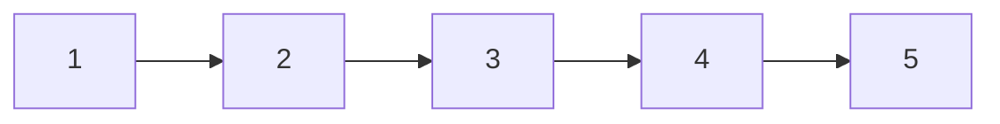
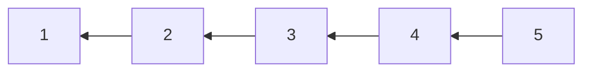
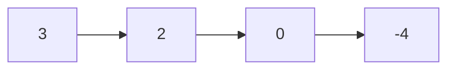
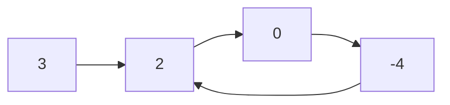

# Linked List

## 206. Reverse Linked List

-  [LeetCode](https://leetcode.com/problems/reverse-linked-list/) | [LeetCode CH](https://leetcode.cn/problems/reverse-linked-list/) (Easy)

-   Reverse a singly linked list.





=== "Python"

    ```python
    --8<-- "0206_reverse_linked_list.py"
    ```

=== "C++"

    ```cpp
    --8<-- "cpp/0206_reverse_linked_list.cc"
    ```

=== "TypeScript"

    ```typescript
    --8<-- "ts/0206_reverse_linked_list.ts"
    ```

## 21. Merge Two Sorted Lists

-  [LeetCode](https://leetcode.com/problems/merge-two-sorted-lists/) | [LeetCode CH](https://leetcode.cn/problems/merge-two-sorted-lists/) (Easy)

=== "Python"

    ```python
    --8<-- "0021_merge_two_sorted_lists.py"
    ```

=== "C++"

    ```cpp
    --8<-- "cpp/0021_merge_two_sorted_lists.cc"
    ```

=== "TypeScript"

    ```typescript
    --8<-- "ts/0021_merge_two_sorted_lists.ts"
    ```

## 143. Reorder List

-  [LeetCode](https://leetcode.com/problems/reorder-list/) | [LeetCode CH](https://leetcode.cn/problems/reorder-list/) (Medium)

=== "Python"

    ```python
    --8<-- "0143_reorder_list.py"
    ```

=== "C++"

    ```cpp
    --8<-- "cpp/0143_reorder_list.cc"
    ```

=== "TypeScript"

    ```typescript
    --8<-- "ts/0143_reorder_list.ts"
    ```

## 19. Remove Nth Node From End of List

-  [LeetCode](https://leetcode.com/problems/remove-nth-node-from-end-of-list/) | [LeetCode CH](https://leetcode.cn/problems/remove-nth-node-from-end-of-list/) (Medium)

-   Given the `head` of a linked list, remove the `n-th` node from the end of the list and return its head.

=== "Python"

    ```python
    --8<-- "0019_remove_nth_node_from_end_of_list.py"
    ```

=== "C++"

    ```cpp
    --8<-- "cpp/0019_remove_nth_node_from_end_of_list.cc"
    ```

=== "TypeScript"

    ```typescript
    --8<-- "ts/0019_remove_nth_node_from_end_of_list.ts"
    ```

## 141. Linked List Cycle

-  [LeetCode](https://leetcode.com/problems/linked-list-cycle/) | [LeetCode CH](https://leetcode.cn/problems/linked-list-cycle/) (Easy)

-   Determine if a linked list has a cycle in it.





=== "Python"

    ```python
    --8<-- "0141_linked_list_cycle.py"
    ```

=== "C++"

    ```cpp
    --8<-- "cpp/0141_linked_list_cycle.cc"
    ```

=== "TypeScript"

    ```typescript
    --8<-- "ts/0141_linked_list_cycle.ts"
    ```

## 23. Merge k Sorted Lists

-  [LeetCode](https://leetcode.com/problems/merge-k-sorted-lists/) | [LeetCode CH](https://leetcode.cn/problems/merge-k-sorted-lists/) (Hard)

=== "Python"

    ```python
    --8<-- "0023_merge_k_sorted_lists.py"
    ```

=== "C++"

    ```cpp
    --8<-- "cpp/0023_merge_k_sorted_lists.cc"
    ```

=== "TypeScript"

    ```typescript
    --8<-- "ts/0023_merge_k_sorted_lists.ts"
    ```
