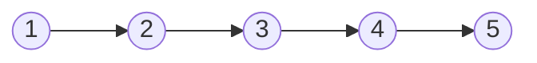
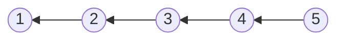
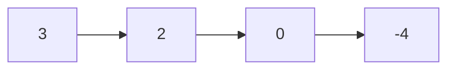
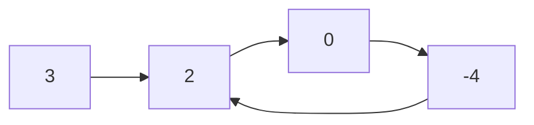

# Linked List

- [x] [206. Reverse Linked List](https://leetcode.cn/problems/reverse-linked-list/) (Easy)
- [x] [21. Merge Two Sorted Lists](https://leetcode.cn/problems/merge-two-sorted-lists/) (Easy)
- [x] [143. Reorder List](https://leetcode.cn/problems/reorder-list/) (Medium)
- [x] [19. Remove Nth Node From End of List](https://leetcode.cn/problems/remove-nth-node-from-end-of-list/) (Medium)
- [x] [141. Linked List Cycle](https://leetcode.cn/problems/linked-list-cycle/) (Easy)
- [x] [23. Merge k Sorted Lists](https://leetcode.cn/problems/merge-k-sorted-lists/) (Hard)

## 206. Reverse Linked List

-   [LeetCode](https://leetcode.com/problems/reverse-linked-list/) | [LeetCode CH](https://leetcode.cn/problems/reverse-linked-list/) (Easy)

-   Tags: linked list, recursion
- Reverse a singly linked list.





```python title="206. Reverse Linked List - Python Solution"
--8<-- "0206_reverse_linked_list.py"
```

## 21. Merge Two Sorted Lists

-   [LeetCode](https://leetcode.com/problems/merge-two-sorted-lists/) | [LeetCode CH](https://leetcode.cn/problems/merge-two-sorted-lists/) (Easy)

-   Tags: linked list, recursion
-   Merge the two lists into one sorted list.

<iframe width="560" height="315" src="https://www.youtube.com/embed/XIdigk956u0?si=2cVoU6DujA3Mgtlr" title="YouTube video player" frameborder="0" allow="accelerometer; autoplay; clipboard-write; encrypted-media; gyroscope; picture-in-picture; web-share" referrerpolicy="strict-origin-when-cross-origin" allowfullscreen></iframe>

```python title="21. Merge Two Sorted Lists - Python Solution"
--8<-- "0021_merge_two_sorted_lists.py"
```

```cpp title="21. Merge Two Sorted Lists - C++ Solution"
--8<-- "cpp/0021_merge_two_sorted_lists.cc"
```

## 143. Reorder List

-   [LeetCode](https://leetcode.com/problems/reorder-list/) | [LeetCode CH](https://leetcode.cn/problems/reorder-list/) (Medium)

-   Tags: linked list, two pointers, stack, recursion

```python title="143. Reorder List - Python Solution"
--8<-- "0143_reorder_list.py"
```

## 19. Remove Nth Node From End of List

-   [LeetCode](https://leetcode.com/problems/remove-nth-node-from-end-of-list/) | [LeetCode CH](https://leetcode.cn/problems/remove-nth-node-from-end-of-list/) (Medium)

-   Tags: linked list, two pointers
-   Given the `head` of a linked list, remove the `n-th` node from the end of the list and return its head.

```python title="19. Remove Nth Node From End of List - Python Solution"
--8<-- "0019_remove_nth_node_from_end_of_list.py"
```

## 141. Linked List Cycle

-   [LeetCode](https://leetcode.com/problems/linked-list-cycle/) | [LeetCode CH](https://leetcode.cn/problems/linked-list-cycle/) (Easy)

-   Tags: hash table, linked list, two pointers
-   Determine if a linked list has a cycle in it.





```python title="141. Linked List Cycle - Python Solution"
--8<-- "0141_linked_list_cycle.py"
```

```cpp title="141. Linked List Cycle - C++ Solution"
--8<-- "cpp/0141_linked_list_cycle.cc"
```

## 23. Merge k Sorted Lists

-   [LeetCode](https://leetcode.com/problems/merge-k-sorted-lists/) | [LeetCode CH](https://leetcode.cn/problems/merge-k-sorted-lists/) (Hard)

-   Tags: linked list, divide and conquer, heap priority queue, merge sort
-   Prerequisite: 21. Merge Two Sorted Lists

<iframe width="560" height="315" src="https://www.youtube.com/embed/q5a5OiGbT6Q?si=SlQg9SKZh1YL62vH" title="YouTube video player" frameborder="0" allow="accelerometer; autoplay; clipboard-write; encrypted-media; gyroscope; picture-in-picture; web-share" referrerpolicy="strict-origin-when-cross-origin" allowfullscreen></iframe>

```python title="23. Merge k Sorted Lists - Python Solution"
--8<-- "0023_merge_k_sorted_lists.py"
```
