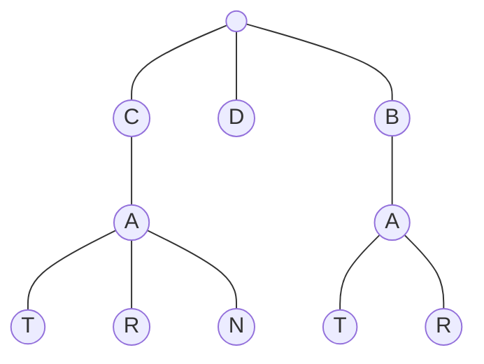

# Tries

- [x] [208. Implement Trie (Prefix Tree)](https://leetcode.cn/problems/implement-trie-prefix-tree/) (Medium)
- [x] [212. Word Search II](https://leetcode.cn/problems/word-search-ii/) (Hard)
- [x] [211. Design Add and Search Words Data Structure](https://leetcode.cn/problems/design-add-and-search-words-data-structure/) (Medium)

## 208. Implement Trie (Prefix Tree)

-   [LeetCode](https://leetcode.com/problems/implement-trie-prefix-tree/) | [LeetCode CH](https://leetcode.cn/problems/implement-trie-prefix-tree/) (Medium)
-   Tags: hash table, string, design, trie
## Trie

-   A trie is a tree-like data structure whose nodes store the letters of an alphabet.



```python title="208. Implement Trie (Prefix Tree)"
--8<-- "0208_implement_trie_prefix_tree.py"
```

## 212. Word Search II

-   [LeetCode](https://leetcode.com/problems/word-search-ii/) | [LeetCode CH](https://leetcode.cn/problems/word-search-ii/) (Hard)
-   Tags: array, string, backtracking, trie, matrix

```python title="212. Word Search II"
--8<-- "0212_word_search_ii.py"
```

## 211. Design Add and Search Words Data Structure

-   [LeetCode](https://leetcode.com/problems/design-add-and-search-words-data-structure/) | [LeetCode CH](https://leetcode.cn/problems/design-add-and-search-words-data-structure/) (Medium)
-   Tags: string, depth first search, design, trie

```python title="211. Design Add and Search Words Data Structure"
--8<-- "0211_design_add_and_search_words_data_structure.py"
```
