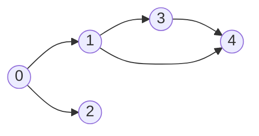
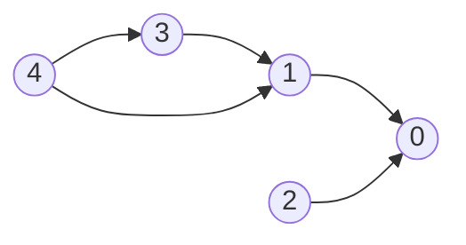
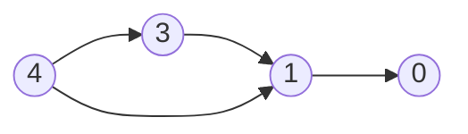
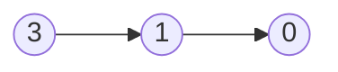
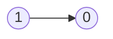

# Amazon

## 1. Two Sum

-   [LeetCode](https://leetcode.com/problems/two-sum/) | [LeetCode CH](https://leetcode.cn/problems/two-sum/) (Easy)
-   Return the indices of the two numbers such that they add up to a specific target.

| Approach | Time Complexity | Space Complexity |
| :------: | :-------------: | :--------------: |
| Hashmap  |      O(n)       |       O(n)       |

```python
--8<-- "0001_two_sum.py"
```

## 146. LRU Cache

-   [LeetCode](https://leetcode.com/problems/lru-cache/) | [LeetCode CH](https://leetcode.cn/problems/lru-cache/) (Medium)
-   Design and implement a data structure for **Least Recently Used (LRU) cache**. It should support the following operations: get and put.


| Data structure     | Description                   |
| ------------------ | ----------------------------- |
| Doubly Linked List | To store the key-value pairs. |
| Hash Map           | To store the key-node pairs.  |

<iframe width="560" height="315" src="https://www.youtube.com/embed/7ABFKPK2hD4?si=Ys47opcHraHHWtOI" title="YouTube video player" frameborder="0" allow="accelerometer; autoplay; clipboard-write; encrypted-media; gyroscope; picture-in-picture; web-share" referrerpolicy="strict-origin-when-cross-origin" allowfullscreen></iframe>

| Approach | Time Complexity | Space Complexity |
| -------- | --------------- | ---------------- |
| LRU      | O(1)            | O(n)             |

```python
--8<-- "0146_lru_cache.py"
```

## 200. Number of Islands

-   [LeetCode](https://leetcode.com/problems/number-of-islands/) | [LeetCode CH](https://leetcode.cn/problems/number-of-islands/) (Medium)
-   Count the number of islands in a 2D grid.
-   Method 1: DFS
-   Method 2: BFS (use a queue to traverse the grid)

-   How to keep track of visited cells?

    1. Mark the visited cell as `0` (or any other value) to avoid revisiting it.
    2. Use a set to store the visited cells.

-   Steps:
    1. Init: variables
    2. DFS/BFS: starting from the cell with `1`, turn all the connected `1`s to `0`.
    3. Traverse the grid, and if the cell is `1`, increment the count and call DFS/BFS.


```python
--8<-- "0200_number_of_islands.py"
```

## 42. Trapping Rain Water

-   [LeetCode](https://leetcode.com/problems/trapping-rain-water/) | [LeetCode CH](https://leetcode.cn/problems/trapping-rain-water/) (Hard)
-   
-   Method 1: Dynamic Programing

| index                           | 0   | 1   | 2   | 3   | 4   | 5   | 6   | 7   | 8   | 9   | 10  | 11  |
| :------------------------------ | --- | --- | --- | --- | --- | --- | --- | --- | --- | --- | --- | --- |
| value                           | 0   | 1   | 0   | 2   | 1   | 0   | 1   | 3   | 2   | 1   | 2   | 1   |
| `maxLeft`                       | 0   | 0   | 1   | 1   | 2   | 2   | 2   | 2   | 3   | 3   | 3   | 3   |
| `maxRight`                      | 3   | 3   | 3   | 3   | 3   | 3   | 3   | 2   | 2   | 2   | 1   | 0   |
| `hold = min(maxLeft, maxRight)` | 0   | 0   | 1   | 1   | 2   | 2   | 2   | 2   | 2   | 2   | 1   | 0   |
| `trap = max(0, hold - value)`   | 0   | 0   | 1   | 0   | 1   | 2   | 1   | 0   | 0   | 1   | 0   | 0   |

So, In total we have trap `1 + 1 + 2 + 1 + 1 = 6` water.

-   Method 2: Left Right Pointers, because we always need to care about the minimum of left right maximum numbers. So, we can use two pointers to keep track of the left and right maximum numbers.

<iframe width="560" height="315" src="https://www.youtube.com/embed/ZI2z5pq0TqA?si=OEYg01dbmzvmtIwZ" title="YouTube video player" frameborder="0" allow="accelerometer; autoplay; clipboard-write; encrypted-media; gyroscope; picture-in-picture; web-share" referrerpolicy="strict-origin-when-cross-origin" allowfullscreen></iframe>

```python
--8<-- "0042_trapping_rain_water.py"
```

## 49. Group Anagrams

-   [LeetCode](https://leetcode.com/problems/group-anagrams/) | [LeetCode CH](https://leetcode.cn/problems/group-anagrams/) (Medium)

```python
--8<-- "0049_group_anagrams.py"
```

## 121. Best Time to Buy and Sell Stock

-   [LeetCode](https://leetcode.com/problems/best-time-to-buy-and-sell-stock/) | [LeetCode CH](https://leetcode.cn/problems/best-time-to-buy-and-sell-stock/) (Easy)
-   Return the maximum profit that can be achieved from buying on one day and selling on another day.

```python
--8<-- "0121_best_time_to_buy_and_sell_stock.py"
```

## 56. Merge Intervals

-   [LeetCode](https://leetcode.com/problems/merge-intervals/) | [LeetCode CH](https://leetcode.cn/problems/merge-intervals/) (Medium)
-   Merge all overlapping intervals.

<iframe width="560" height="315" src="https://www.youtube.com/embed/44H3cEC2fFM?si=J-Jr_Fg2eDse3-de" title="YouTube video player" frameborder="0" allow="accelerometer; autoplay; clipboard-write; encrypted-media; gyroscope; picture-in-picture; web-share" referrerpolicy="strict-origin-when-cross-origin" allowfullscreen></iframe>

```python
--8<-- "0056_merge_intervals.py"
```

## 207. Course Schedule

-   [LeetCode](https://leetcode.com/problems/course-schedule/) | [LeetCode CH](https://leetcode.cn/problems/course-schedule/) (Medium)
-   Return true if it is possible to finish all courses, otherwise return false.
-   Dependency relationships imply the topological sort algorithm.
-   Cycle detection
-   Topological Sort
    -   DAG (Directed Acyclic Graph)
    -   Time complexity: O(V+E)
    -   Space complexity: O(V+E)
    -   Prerequisites: Indegree (Look at the problem 1557. Minimum Number of Vertices to Reach All Nodes)
        -   Indegree: Number of incoming edges to a vertex
    -   Applications: task scheduling, course scheduling, build systems, dependency resolution, compiler optimization, etc.

{width=300px}

{width=300px}

Course to prerequisites mapping



Prerequisites to course mapping



| course       | 0   | 0   | 1   | 1   | 3   |
| ------------ | --- | --- | --- | --- | --- |
| prerequisite | 1   | 2   | 3   | 4   | 4   |

| index     | 0   | 1   | 2   | 3   | 4   |
| --------- | --- | --- | --- | --- | --- |
| in-degree | 0   | 0   | 0   | 0   | 0   |

Initialize

-   graph

| prerequisite | 1     | 2     | 3     | 4        |
| ------------ | ----- | ----- | ----- | -------- |
| course       | `[0]` | `[0]` | `[1]` | `[1, 3]` |

-   in-degree

|           | 0   | 1   | 2   | 3   | 4   |
| --------- | --- | --- | --- | --- | --- |
| in-degree | 2   | 2   | 0   | 1   | 0   |

-   queue: `[2, 4]`
-   pop `2` from the queue



|           | 0   | 1   | 2   | 3   | 4   |
| --------- | --- | --- | --- | --- | --- |
| in-degree | 1   | 2   | 0   | 1   | 0   |

-   queue: `[4]`
-   pop `4` from the queue



|           | 0   | 1   | 2   | 3   | 4   |
| --------- | --- | --- | --- | --- | --- |
| in-degree | 1   | 1   | 0   | 0   | 0   |

-   queue: `[3]`
-   pop `3` from the queue



|           | 0   | 1   | 2   | 3   | 4   |
| --------- | --- | --- | --- | --- | --- |
| in-degree | 1   | 0   | 0   | 0   | 0   |

-   queue: `[1]`
-   pop `1` from the queue


|           | 0   | 1   | 2   | 3   | 4   |
| --------- | --- | --- | --- | --- | --- |
| in-degree | 0   | 0   | 0   | 0   | 0   |

-   queue: `[0]`
-   pop `0` from the queue
-   All courses are taken. Return `True`.

```python
--8<-- "0207_course_schedule.py"
```

## 23. Merge k Sorted Lists

-   [LeetCode](https://leetcode.com/problems/merge-k-sorted-lists/) | [LeetCode CH](https://leetcode.cn/problems/merge-k-sorted-lists/) (Hard)

```python
--8<-- "0023_merge_k_sorted_lists.py"
```

## 347. Top K Frequent Elements

-   [LeetCode](https://leetcode.com/problems/top-k-frequent-elements/) | [LeetCode CH](https://leetcode.cn/problems/top-k-frequent-elements/) (Medium)

```python
--8<-- "0347_top_k_frequent_elements.py"
```

## 88. Merge Sorted Array

-   [LeetCode](https://leetcode.com/problems/merge-sorted-array/) | [LeetCode CH](https://leetcode.cn/problems/merge-sorted-array/) (Easy)

```python
--8<-- "0088_merge_sorted_array.py"
```

## 15. 3Sum

-   [LeetCode](https://leetcode.com/problems/3sum/) | [LeetCode CH](https://leetcode.cn/problems/3sum/) (Medium)

```python
--8<-- "0015_3sum.py"
```

## 127. Word Ladder

-   [LeetCode](https://leetcode.com/problems/word-ladder/) | [LeetCode CH](https://leetcode.cn/problems/word-ladder/) (Hard)

```python
--8<-- "0127_word_ladder.py"
```

## 55. Jump Game

-   [LeetCode](https://leetcode.com/problems/jump-game/) | [LeetCode CH](https://leetcode.cn/problems/jump-game/) (Medium)
-   Return `True` if you can reach the last index, otherwise `False`.

<iframe width="560" height="315" src="https://www.youtube.com/embed/Yan0cv2cLy8?si=musT5NViPicljg7x" title="YouTube video player" frameborder="0" allow="accelerometer; autoplay; clipboard-write; encrypted-media; gyroscope; picture-in-picture; web-share" referrerpolicy="strict-origin-when-cross-origin" allowfullscreen></iframe>

-   Example: `[2, 3, 1, 1, 4, 1, 2, 0, 0]`

| Index | Value | Index + Value | Max Reach | Max Reach >= Last Index |
| :---: | :---: | :-----------: | :-------: | :---------------------: |
|   0   |   2   |       2       |     2     |          False          |
|   1   |   3   |       4       |     4     |          False          |
|   2   |   1   |       3       |     4     |          False          |
|   3   |   1   |       4       |     4     |          False          |
|   4   |   4   |       8       |     8     |          True           |
|   5   |   1   |       6       |     8     |          True           |
|   6   |   2   |       8       |     8     |          True           |
|   7   |   0   |       7       |     8     |          True           |
|   8   |   0   |       8       |     8     |          True           |

```python
--8<-- "0055_jump_game.py"
```

## 3. Longest Substring Without Repeating Characters

-   [LeetCode](https://leetcode.com/problems/longest-substring-without-repeating-characters/) | [LeetCode CH](https://leetcode.cn/problems/longest-substring-without-repeating-characters/) (Medium)

```python
--8<-- "0003_longest_substring_without_repeating_characters.py"
```

## 14. Longest Common Prefix

-   [LeetCode](https://leetcode.com/problems/longest-common-prefix/) | [LeetCode CH](https://leetcode.cn/problems/longest-common-prefix/) (Easy)

```python
--8<-- "0014_longest_common_prefix.py"
```

## 210. Course Schedule II

-   [LeetCode](https://leetcode.com/problems/course-schedule-ii/) | [LeetCode CH](https://leetcode.cn/problems/course-schedule-ii/) (Medium)
-   Return the ordering of courses you should take to finish all courses. If there are multiple valid answers, return any of them.

{width=300px}

```python
--8<-- "0210_course_schedule_ii.py"
```

## 138. Copy List with Random Pointer

-   [LeetCode](https://leetcode.com/problems/copy-list-with-random-pointer/) | [LeetCode CH](https://leetcode.cn/problems/copy-list-with-random-pointer/) (Medium)

```python
--8<-- "0138_copy_list_with_random_pointer.py"
```

## 20. Valid Parentheses

-   [LeetCode](https://leetcode.com/problems/valid-parentheses/) | [LeetCode CH](https://leetcode.cn/problems/valid-parentheses/) (Easy)
-   Determine if the input string is valid.
-   Steps for the string `()[]{}`:

| char | action | stack |
| ---- | ------ | ----- |
| `(`  | push   | "\("  |
| `)`  | pop    | ""    |
| `[`  | push   | "\["  |
| `]`  | pop    | ""    |
| `{`  | push   | "\{"  |
| `}`  | pop    | ""    |

```python
--8<-- "0020_valid_parentheses.py"
```

## 2. Add Two Numbers

-   [LeetCode](https://leetcode.com/problems/add-two-numbers/) | [LeetCode CH](https://leetcode.cn/problems/add-two-numbers/) (Medium)
-   Represent the sum of two numbers as a linked list.

```python
--8<-- "0002_add_two_numbers.py"
```

## 70. Climbing Stairs

-   [LeetCode](https://leetcode.com/problems/climbing-stairs/) | [LeetCode CH](https://leetcode.cn/problems/climbing-stairs/) (Easy)
-   Return the number of distinct ways to reach the top of the stairs.
-   `dp[n]` stores the number of distinct ways to reach the `n-th` stair.
-   Formula: `dp[n] = dp[n - 1] + dp[n - 2]`.
-   Initialize `dp[0] = 0`, `dp[1] = 1`, and `dp[2] = 2`.

|  n  | `dp[n-2]` | `dp[n-1]` | `dp[n]` |
| :-: | :-------: | :-------: | :-----: |
|  0  |     -     |     -     |    0    |
|  1  |     -     |     -     |    1    |
|  2  |     -     |     1     |    2    |
|  3  |     1     |     2     |    3    |
|  4  |     2     |     3     |    5    |
|  5  |     3     |     5     |    8    |
|  6  |     5     |     8     |   13    |
|  7  |     8     |    13     |   21    |
|  8  |    13     |    21     |   34    |
|  9  |    21     |    34     |   55    |
| 10  |    34     |    55     |   89    |

```python
--8<-- "0070_climbing_stairs.py"
```

## 238. Product of Array Except Self

-   [LeetCode](https://leetcode.com/problems/product-of-array-except-self/) | [LeetCode CH](https://leetcode.cn/problems/product-of-array-except-self/) (Medium)

```python
--8<-- "0238_product_of_array_except_self.py"
```

## 560. Subarray Sum Equals K

-   [LeetCode](https://leetcode.com/problems/subarray-sum-equals-k/) | [LeetCode CH](https://leetcode.cn/problems/subarray-sum-equals-k/) (Medium)

```python
--8<-- "0560_subarray_sum_equals_k.py"
```

## 4. Median of Two Sorted Arrays

-   [LeetCode](https://leetcode.com/problems/median-of-two-sorted-arrays/) | [LeetCode CH](https://leetcode.cn/problems/median-of-two-sorted-arrays/) (Hard)

```python
--8<-- "0004_median_of_two_sorted_arrays.py"
```

## 79. Word Search

-   [LeetCode](https://leetcode.com/problems/word-search/) | [LeetCode CH](https://leetcode.cn/problems/word-search/) (Medium)

```python
--8<-- "0079_word_search.py"
```

## 22. Generate Parentheses

-   [LeetCode](https://leetcode.com/problems/generate-parentheses/) | [LeetCode CH](https://leetcode.cn/problems/generate-parentheses/) (Medium)

```python
--8<-- "0022_generate_parentheses.py"
```

## 215. Kth Largest Element in an Array

-   [LeetCode](https://leetcode.com/problems/kth-largest-element-in-an-array/) | [LeetCode CH](https://leetcode.cn/problems/kth-largest-element-in-an-array/) (Medium)

```python
--8<-- "0215_kth_largest_element_in_an_array.py"
```

## 295. Find Median from Data Stream

-   [LeetCode](https://leetcode.com/problems/find-median-from-data-stream/) | [LeetCode CH](https://leetcode.cn/problems/find-median-from-data-stream/) (Hard)

```python
--8<-- "0295_find_median_from_data_stream.py"
```

## 5. Longest Palindromic Substring

-   [LeetCode](https://leetcode.com/problems/longest-palindromic-substring/) | [LeetCode CH](https://leetcode.cn/problems/longest-palindromic-substring/) (Medium)
-   Return the longest palindromic substring in `s`.

```python
--8<-- "0005_longest_palindromic_substring.py"
```
