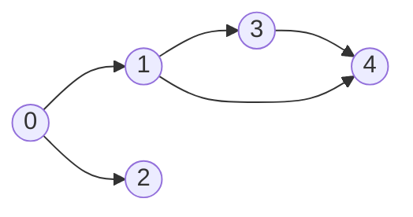
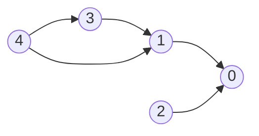
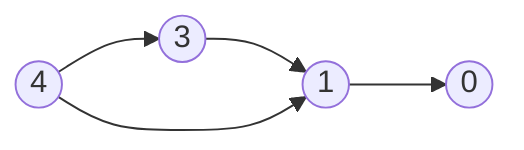
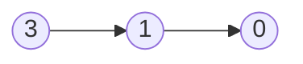
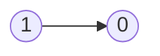

# Graphs

- [x] [200. Number of Islands](https://leetcode.cn/problems/number-of-islands/) (Medium)
- [x] [133. Clone Graph](https://leetcode.cn/problems/clone-graph/) (Medium)
- [x] [417. Pacific Atlantic Water Flow](https://leetcode.cn/problems/pacific-atlantic-water-flow/) (Medium)
- [x] [207. Course Schedule](https://leetcode.cn/problems/course-schedule/) (Medium)
- [x] [261. Graph Valid Tree](https://leetcode.cn/problems/graph-valid-tree/) (Medium) 👑
- [x] [323. Number of Connected Components in an Undirected Graph](https://leetcode.cn/problems/number-of-connected-components-in-an-undirected-graph/) (Medium) 👑

## 200. Number of Islands

-   [LeetCode](https://leetcode.com/problems/number-of-islands/) | [LeetCode CH](https://leetcode.cn/problems/number-of-islands/) (Medium)

-   Tags: array, depth first search, breadth first search, union find, matrix
- Count the number of islands in a 2D grid.
- Method 1: DFS
- Method 2: BFS (use a queue to traverse the grid)

- How to keep track of visited cells?

  1. Mark the visited cell as `0` (or any other value) to avoid revisiting it.
  2. Use a set to store the visited cells.

- Steps:
  1. Init: variables
  2. DFS/BFS: starting from the cell with `1`, turn all the connected `1`s to `0`.
  3. Traverse the grid, and if the cell is `1`, increment the count and call DFS/BFS.


```python title="200. Number of Islands - Python Solution"
from collections import deque
from copy import deepcopy
from typing import List


# DFS
def numIslandsDFS(grid: List[List[str]]) -> int:
    if not grid:
        return 0

    m, n = len(grid), len(grid[0])
    res = 0

    def dfs(r, c):
        if r < 0 or r >= m or c < 0 or c >= n or grid[r][c] != "1":
            return

        grid[r][c] = "2"

        dfs(r + 1, c)
        dfs(r - 1, c)
        dfs(r, c + 1)
        dfs(r, c - 1)

    for r in range(m):
        for c in range(n):
            if grid[r][c] == "1":
                dfs(r, c)
                res += 1

    return res


# BFS + Set
def numIslandsBFS1(grid: List[List[str]]) -> int:
    if not grid:
        return 0

    m, n = len(grid), len(grid[0])
    dirs = [(1, 0), (-1, 0), (0, 1), (0, -1)]
    visited = set()
    res = 0

    def bfs(r, c):
        q = deque([(r, c)])

        while q:
            row, col = q.popleft()

            for dr, dc in dirs:
                nr, nc = row + dr, col + dc
                if (
                    nr < 0
                    or nr >= m
                    or nc < 0
                    or nc >= n
                    or grid[nr][nc] == "0"
                    or (nr, nc) in visited
                ):
                    continue

                visited.add((nr, nc))
                q.append((nr, nc))

    for r in range(m):
        for c in range(n):
            if grid[r][c] == "1" and (r, c) not in visited:
                visited.add((r, c))
                bfs(r, c)
                res += 1

    return res


# BFS + Grid
def numIslandsBFS2(grid: List[List[str]]) -> int:
    if not grid:
        return 0

    m, n = len(grid), len(grid[0])
    dirs = [[0, 1], [0, -1], [1, 0], [-1, 0]]
    res = 0

    def bfs(r, c):
        q = deque([(r, c)])

        while q:
            row, col = q.popleft()

            for dr, dc in dirs:
                nr, nc = dr + row, dc + col
                if (
                    nr < 0
                    or nr >= m
                    or nc < 0
                    or nc >= n
                    or grid[nr][nc] != "1"
                ):
                    continue
                grid[nr][nc] = "2"
                q.append((nr, nc))

    for i in range(m):
        for j in range(n):
            if grid[i][j] == "1":
                grid[i][j] = "2"
                bfs(i, j)
                res += 1

    return res


grid = [
    ["1", "1", "1", "1", "0"],
    ["1", "1", "0", "1", "0"],
    ["1", "1", "0", "0", "0"],
    ["0", "0", "0", "0", "0"],
]

print(numIslandsDFS(deepcopy(grid)))  # 1
print(numIslandsBFS1(deepcopy(grid)))  # 1
print(numIslandsBFS2(deepcopy(grid)))  # 1

```

```cpp title="200. Number of Islands - C++ Solution"
#include <vector>
#include <iostream>
using namespace std;

class Solution
{
private:
    void dfs(vector<vector<char>> &grid, int r, int c)
    {
        int row = grid.size();
        int col = grid[0].size();

        if (r < 0 || r >= row || c < 0 || c >= col || grid[r][c] != '1')
        {
            return;
        }
        grid[r][c] = '0';

        dfs(grid, r - 1, c);
        dfs(grid, r + 1, c);
        dfs(grid, r, c - 1);
        dfs(grid, r, c + 1);
    }

public:
    int numIslands(vector<vector<char>> &grid)
    {
        int m = grid.size(), n = grid[0].size();
        int res = 0;
        for (int i = 0; i < m; i++)
        {
            for (int j = 0; j < n; j++)
            {
                if (grid[i][j] == '1')
                {
                    res++;
                    dfs(grid, i, j);
                }
            }
        }
        return res;
    }
};

int main()
{
    Solution s;
    vector<vector<char>> grid = {
        {'1', '1', '0', '0', '0'},
        {'1', '1', '0', '0', '0'},
        {'0', '0', '1', '0', '0'},
        {'0', '0', '0', '1', '1'}};
    cout << s.numIslands(grid) << endl;
    return 0;
}

```

## 133. Clone Graph

-   [LeetCode](https://leetcode.com/problems/clone-graph/) | [LeetCode CH](https://leetcode.cn/problems/clone-graph/) (Medium)

-   Tags: hash table, depth first search, breadth first search, graph

```python title="133. Clone Graph - Python Solution"
from collections import deque
from typing import Optional


class Node:
    def __init__(self, val=0, neighbors=None):
        self.val = val
        self.neighbors = neighbors if neighbors is not None else []


# 1. DFS
def cloneGraphDFS(node: Optional["Node"]) -> Optional["Node"]:
    if not node:
        return None

    cloned = {}  # {old: new}

    def dfs(node):
        if node in cloned:
            return cloned[node]

        new = Node(node.val)
        cloned[node] = new

        for neighbor in node.neighbors:
            new.neighbors.append(dfs(neighbor))

        return new

    return dfs(node)


# 2. BFS
def cloneGraphBFS(node: Optional["Node"]) -> Optional["Node"]:
    if not node:
        return None

    cloned = {node: Node(node.val)}
    q = deque([node])

    while q:
        cur = q.popleft()

        for neighbor in cur.neighbors:
            if neighbor not in cloned:
                cloned[neighbor] = Node(neighbor.val)
                q.append(neighbor)

            cloned[cur].neighbors.append(cloned[neighbor])

    return cloned[node]

```

## 417. Pacific Atlantic Water Flow

-   [LeetCode](https://leetcode.com/problems/pacific-atlantic-water-flow/) | [LeetCode CH](https://leetcode.cn/problems/pacific-atlantic-water-flow/) (Medium)

-   Tags: array, depth first search, breadth first search, matrix

```python title="417. Pacific Atlantic Water Flow - Python Solution"
from collections import deque
from typing import List


# DFS
def pacificAtlanticDFS(heights: List[List[int]]) -> List[List[int]]:
    m, n = len(heights), len(heights[0])
    pac, atl = set(), set()
    directions = [(1, 0), (0, 1), (-1, 0), (0, -1)]

    def dfs(r, c, visited, prev_height):
        if (
            r not in range(m)
            or c not in range(n)
            or heights[r][c] < prev_height
            or (r, c) in visited
        ):
            return None

        visited.add((r, c))
        height = heights[r][c]
        for dr, dc in directions:
            dfs(dr + r, dc + c, visited, height)

    for c in range(n):
        dfs(0, c, pac, heights[0][c])
        dfs(m - 1, c, atl, heights[m - 1][c])

    for r in range(m):
        dfs(r, 0, pac, heights[r][0])
        dfs(r, n - 1, atl, heights[r][n - 1])

    return list(pac & atl)


# BFS
def pacificAtlanticBFS(heights: List[List[int]]) -> List[List[int]]:
    m, n = len(heights), len(heights[0])
    pac, atl = set(), set()
    directions = [(1, 0), (-1, 0), (0, 1), (0, -1)]

    def bfs(r, c, visited):
        q = deque([(r, c)])
        visited.add((r, c))

        while q:
            row, col = q.popleft()

            for dr, dc in directions:
                nr, nc = row + dr, col + dc

                if (
                    nr in range(m)
                    and nc in range(n)
                    and heights[row][col] <= heights[nr][nc]
                    and (nr, nc) not in visited
                ):
                    q.append((nr, nc))
                    visited.add((nr, nc))

    for c in range(n):
        bfs(0, c, pac)  # top
        bfs(m - 1, c, atl)  # bottom

    for r in range(m):
        bfs(r, 0, pac)  # left
        bfs(r, n - 1, atl)  # right

    return list(pac & atl)


heights = [
    [1, 2, 2, 3, 5],
    [3, 2, 3, 4, 4],
    [2, 4, 5, 3, 1],
    [6, 7, 1, 4, 5],
    [5, 1, 1, 2, 4],
]
print(pacificAtlanticDFS(heights))
# [(4, 0), (0, 4), (3, 1), (1, 4), (3, 0), (2, 2), (1, 3)]
print(pacificAtlanticBFS(heights))
# [(4, 0), (0, 4), (3, 1), (1, 4), (3, 0), (2, 2), (1, 3)]

```

## 207. Course Schedule

-   [LeetCode](https://leetcode.com/problems/course-schedule/) | [LeetCode CH](https://leetcode.cn/problems/course-schedule/) (Medium)

-   Tags: depth first search, breadth first search, graph, topological sort
- Return true if it is possible to finish all courses, otherwise return false.
- Dependency relationships imply the topological sort algorithm.
- Cycle detection
- Topological Sort
  - DAG (Directed Acyclic Graph)
  - Time complexity: O(V+E)
  - Space complexity: O(V+E)
  - Prerequisites: Indegree (Look at the problem 1557. Minimum Number of Vertices to Reach All Nodes)
    - Indegree: Number of incoming edges to a vertex
  - Applications: task scheduling, course scheduling, build systems, dependency resolution, compiler optimization, etc.


Course to prerequisites mapping



Prerequisites to course mapping



| course       | 0   | 0   | 1   | 1   | 3   |
| ------------ | --- | --- | --- | --- | --- |
| prerequisite | 1   | 2   | 3   | 4   | 4   |

| index     | 0   | 1   | 2   | 3   | 4   |
| --------- | --- | --- | --- | --- | --- |
| in-degree | 0   | 0   | 0   | 0   | 0   |

Initialize

- graph

| prerequisite | 1     | 2     | 3     | 4        |
| ------------ | ----- | ----- | ----- | -------- |
| course       | `[0]` | `[0]` | `[1]` | `[1, 3]` |

- in-degree

|           | 0   | 1   | 2   | 3   | 4   |
| --------- | --- | --- | --- | --- | --- |
| in-degree | 2   | 2   | 0   | 1   | 0   |

- queue: `[2, 4]`
- pop `2` from the queue



|           | 0   | 1   | 2   | 3   | 4   |
| --------- | --- | --- | --- | --- | --- |
| in-degree | 1   | 2   | 0   | 1   | 0   |

- queue: `[4]`
- pop `4` from the queue



|           | 0   | 1   | 2   | 3   | 4   |
| --------- | --- | --- | --- | --- | --- |
| in-degree | 1   | 1   | 0   | 0   | 0   |

- queue: `[3]`
- pop `3` from the queue



|           | 0   | 1   | 2   | 3   | 4   |
| --------- | --- | --- | --- | --- | --- |
| in-degree | 1   | 0   | 0   | 0   | 0   |

- queue: `[1]`
- pop `1` from the queue


|           | 0   | 1   | 2   | 3   | 4   |
| --------- | --- | --- | --- | --- | --- |
| in-degree | 0   | 0   | 0   | 0   | 0   |

- queue: `[0]`
- pop `0` from the queue
- All courses are taken. Return `True`.

```python title="207. Course Schedule - Python Solution"
from collections import defaultdict, deque
from typing import List


# BFS (Kahn's Algorithm)
def canFinishBFS(numCourses: int, prerequisites: List[List[int]]) -> bool:
    graph = defaultdict(list)
    indegree = defaultdict(int)

    for crs, pre in prerequisites:
        graph[pre].append(crs)
        indegree[crs] += 1

    q = deque([i for i in range(numCourses) if indegree[i] == 0])
    count = 0

    while q:
        crs = q.popleft()
        count += 1

        for nxt in graph[crs]:
            indegree[nxt] -= 1

            if indegree[nxt] == 0:
                q.append(nxt)

    return count == numCourses


# DFS + Set
def canFinishDFS1(numCourses: int, prerequisites: List[List[int]]) -> bool:
    graph = defaultdict(list)
    for crs, pre in prerequisites:
        graph[crs].append(pre)

    visiting = set()

    def dfs(crs):
        if crs in visiting:  # cycle detected
            return False
        if graph[crs] == []:
            return True

        visiting.add(crs)

        for pre in graph[crs]:
            if not dfs(pre):
                return False

        visiting.remove(crs)
        graph[crs] = []

        return True

    for crs in range(numCourses):
        if not dfs(crs):
            return False
    return True


# DFS + List
def canFinishDFS2(numCourses: int, prerequisites: List[List[int]]) -> bool:
    graph = defaultdict(list)
    for pre, crs in prerequisites:
        graph[crs].append(pre)

    # 0: init, 1: visiting, 2: visited
    status = [0] * numCourses

    def dfs(crs):
        if status[crs] == 1:  # cycle detected
            return False
        if status[crs] == 2:
            return True

        status[crs] = 1

        for pre in graph[crs]:
            if not dfs(pre):
                return False

        status[crs] = 2
        return True

    for crs in range(numCourses):
        if not dfs(crs):
            return False
    return True


prerequisites = [[0, 1], [0, 2], [1, 3], [1, 4], [3, 4]]
print(canFinishBFS(5, prerequisites))  # True
print(canFinishDFS1(5, prerequisites))  # True
print(canFinishDFS2(5, prerequisites))  # True

```

```cpp title="207. Course Schedule - C++ Solution"
#include <functional>
#include <iostream>
#include <queue>
#include <vector>
using namespace std;

class Solution {
   public:
    // BFS
    bool canFinishBFS(int numCourses, vector<vector<int>> &prerequisites) {
        vector<vector<int>> graph(numCourses);
        vector<int> indegree(numCourses, 0);
        for (auto &pre : prerequisites) {
            graph[pre[1]].push_back(pre[0]);
            indegree[pre[0]]++;
        }

        queue<int> q;
        for (int i = 0; i < numCourses; i++) {
            if (indegree[i] == 0) {
                q.push(i);
            }
        }

        int cnt = 0;
        while (!q.empty()) {
            int cur = q.front();
            q.pop();
            cnt++;

            for (int nxt : graph[cur]) {
                indegree[nxt]--;
                if (indegree[nxt] == 0) {
                    q.push(nxt);
                }
            }
        }
        return cnt == numCourses;
    }

    // DFS
    bool canFinishDFS(int numCourses, vector<vector<int>> &prerequisites) {
        vector<vector<int>> graph(numCourses);
        for (auto &pre : prerequisites) {
            graph[pre[1]].push_back(pre[0]);
        }
        // 0: not visited, 1: visiting, 2: visited
        vector<int> state(numCourses, 0);

        function<bool(int)> dfs = [&](int pre) -> bool {
            state[pre] = 1;  // visiting
            for (int crs : graph[pre]) {
                if (state[crs] == 1 || (state[crs] == 0 && dfs(crs))) {
                    return true;
                }
            }
            state[pre] = 2;  // visited
            return false;
        };

        for (int i = 0; i < numCourses; i++) {
            if (state[i] == 0 && dfs(i)) {
                return false;
            }
        }
        return true;
    }
};

int main() {
    Solution sol;
    vector<vector<int>> prerequisites = {{1, 0}, {2, 1}, {3, 2}, {4, 3},
                                         {5, 4}, {6, 5}, {7, 6}, {8, 7},
                                         {9, 8}, {10, 9}};
    int numCourses = 11;
    cout << sol.canFinishBFS(numCourses, prerequisites) << endl;
    cout << sol.canFinishDFS(numCourses, prerequisites) << endl;
    return 0;
}

```

## 261. Graph Valid Tree

-   [LeetCode](https://leetcode.com/problems/graph-valid-tree/) | [LeetCode CH](https://leetcode.cn/problems/graph-valid-tree/) (Medium)

-   Tags: depth first search, breadth first search, union find, graph

```python title="261. Graph Valid Tree - Python Solution"
from collections import defaultdict
from typing import List


# Graph
def validTree(n: int, edges: List[List[int]]) -> bool:
    if n == 0:
        return False
    if len(edges) != n - 1:
        return False

    graph = defaultdict(list)
    for u, v in edges:
        graph[u].append(v)
        graph[v].append(u)

    visited = set()

    def dfs(node, parent):
        if node in visited:
            return False
        visited.add(node)
        for neighbor in graph[node]:
            if neighbor != parent and not dfs(neighbor, node):
                return False
        return True

    return dfs(0, -1) and len(visited) == n


print(validTree(5, [[0, 1], [0, 2], [0, 3], [1, 4]]))  # True
print(validTree(5, [[0, 1], [1, 2], [2, 3], [1, 3], [1, 4]]))  # False

```

## 323. Number of Connected Components in an Undirected Graph

-   [LeetCode](https://leetcode.com/problems/number-of-connected-components-in-an-undirected-graph/) | [LeetCode CH](https://leetcode.cn/problems/number-of-connected-components-in-an-undirected-graph/) (Medium)

-   Tags: depth first search, breadth first search, union find, graph

```python title="323. Number of Connected Components in an Undirected Graph - Python Solution"
from typing import List


# Union Find
def countComponents(n: int, edges: List[List[int]]) -> int:
    uf = UnionFind(n)
    count = n

    for u, v in edges:
        count -= uf.union(u, v)

    return count


class UnionFind:
    def __init__(self, n):
        self.par = {i: i for i in range(n)}
        self.rank = {i: 1 for i in range(n)}

    def find(self, n):
        p = self.par[n]
        while self.par[p] != p:
            self.par[p] = self.par[self.par[p]]
            p = self.par[p]
        return p

    def union(self, n1, n2):
        p1, p2 = self.find(n1), self.find(n2)

        if p1 == p2:
            return 0

        if self.rank[p1] > self.rank[p2]:
            self.par[p2] = p1
        elif self.rank[p1] < self.rank[p2]:
            self.par[p1] = p2
        else:
            self.par[p2] = p1
            self.rank[p1] += 1

        return 1


print(countComponents(5, [[0, 1], [1, 2], [3, 4]]))  # 2

```
