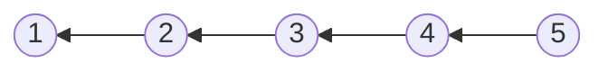
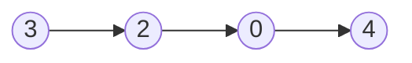
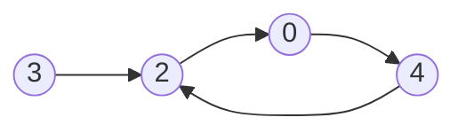

# Linked List

## Table of Contents

- [x] [206. Reverse Linked List](https://leetcode.cn/problems/reverse-linked-list/) (Easy)
- [x] [21. Merge Two Sorted Lists](https://leetcode.cn/problems/merge-two-sorted-lists/) (Easy)
- [x] [143. Reorder List](https://leetcode.cn/problems/reorder-list/) (Medium)
- [x] [19. Remove Nth Node From End of List](https://leetcode.cn/problems/remove-nth-node-from-end-of-list/) (Medium)
- [x] [141. Linked List Cycle](https://leetcode.cn/problems/linked-list-cycle/) (Easy)
- [x] [23. Merge k Sorted Lists](https://leetcode.cn/problems/merge-k-sorted-lists/) (Hard)

## 206. Reverse Linked List

-   [LeetCode](https://leetcode.com/problems/reverse-linked-list/) | [LeetCode CH](https://leetcode.cn/problems/reverse-linked-list/) (Easy)

-   Tags: linked list, recursion
- Reverse a singly linked list.




```python title="206. Reverse Linked List - Python Solution"
from typing import Optional

from leetpattern.utils import ListNode


# Iterative
def reverseListIterative(head: Optional[ListNode]) -> Optional[ListNode]:
    cur = head
    prev = None

    while cur:
        temp = cur.next
        cur.next = prev

        prev = cur
        cur = temp

    return prev


# Recursive
def reverseListRecursive(head: Optional[ListNode]) -> Optional[ListNode]:
    def reverse(cur, prev):
        if not cur:
            return prev

        temp = cur.next
        cur.next = prev

        return reverse(temp, cur)

    return reverse(head, None)


nums = [1, 2, 3, 4, 5]
head1 = list_from_array(nums)
print(head1)
# 1 -> 2 -> 3 -> 4 -> 5
print(reverseListIterative(head1))
# 5 -> 4 -> 3 -> 2 -> 1
head2 = list_from_array(nums)
print(reverseListRecursive(head2))
# 5 -> 4 -> 3 -> 2 -> 1

```

## 21. Merge Two Sorted Lists

-   [LeetCode](https://leetcode.com/problems/merge-two-sorted-lists/) | [LeetCode CH](https://leetcode.cn/problems/merge-two-sorted-lists/) (Easy)

-   Tags: linked list, recursion
-   Task: Merge the two linked lists into one sorted list.

```python title="21. Merge Two Sorted Lists - Python Solution"
from typing import Optional

from leetpattern.utils import ListNode


# Linked List
def merge_two_lists(
    list1: Optional[ListNode], list2: Optional[ListNode]
) -> Optional[ListNode]:
    dummy = ListNode()
    cur = dummy

    while list1 and list2:
        if list1.val < list2.val:
            cur.next = list1
            list1 = list1.next
        else:
            cur.next = list2
            list2 = list2.next
        cur = cur.next

    if list1:
        cur.next = list1
    elif list2:
        cur.next = list2

    return dummy.next

```

```cpp title="21. Merge Two Sorted Lists - C++ Solution"
struct ListNode {
    int val;
    ListNode* next;
    ListNode() : val(0), next(nullptr) {}
    ListNode(int x) : val(x), next(nullptr) {}
    ListNode(int x, ListNode* next) : val(x), next(next) {}
};

class Solution {
   public:
    ListNode* mergeTwoLists(ListNode* list1, ListNode* list2) {
        ListNode dummy;
        ListNode* cur = &dummy;

        while (list1 && list2) {
            if (list1->val < list2->val) {
                cur->next = list1;
                list1 = list1->next;
            } else {
                cur->next = list2;
                list2 = list2->next;
            }
            cur = cur->next;
        }

        cur->next = list1 ? list1 : list2;

        return dummy.next;
    }
};
```

## 143. Reorder List

-   [LeetCode](https://leetcode.com/problems/reorder-list/) | [LeetCode CH](https://leetcode.cn/problems/reorder-list/) (Medium)

-   Tags: linked list, two pointers, stack, recursion
```python title="143. Reorder List - Python Solution"
from typing import Optional

from leetpattern.utils import ListNode


# Linked List
def reorderList(head: Optional[ListNode]) -> None:
    """
    Do not return anything, modify head in-place instead.
    """
    if not head or not head.next:
        return

    # Middle of the linked list
    slow, fast = head, head
    while fast and fast.next:
        slow = slow.next
        fast = fast.next.next

    # Reverse the second half
    pre, cur = None, slow
    while cur:
        temp = cur.next
        cur.next = pre
        pre = cur
        cur = temp

    # Merge two linked lists
    first, second = head, pre
    while second.next:
        temp1, temp2 = first.next, second.next
        first.next = second
        second.next = temp1
        first, second = temp1, temp2


head = list_from_array([1, 2, 3, 4, 5, 6])
print(head)  # 1 -> 2 -> 3 -> 4 -> 5 -> 6
reorderList(head)
print(head)  # 1 -> 6 -> 2 -> 5 -> 3 -> 4

```

## 19. Remove Nth Node From End of List

-   [LeetCode](https://leetcode.com/problems/remove-nth-node-from-end-of-list/) | [LeetCode CH](https://leetcode.cn/problems/remove-nth-node-from-end-of-list/) (Medium)

-   Tags: linked list, two pointers
-   Given the `head` of a linked list, remove the `n-th` node from the end of the list and return its head.

```python title="19. Remove Nth Node From End of List - Python Solution"
from typing import Optional

from leetpattern.utils import ListNode, list_from_array, list_to_array


# Linked List
def removeNthFromEnd(head: Optional[ListNode], n: int) -> Optional[ListNode]:
    dummy = ListNode(0, head)
    fast, slow = dummy, dummy

    for _ in range(n):
        fast = fast.next

    while fast.next:
        fast = fast.next
        slow = slow.next

    slow.next = slow.next.next

    return dummy.next


def test_removeNthFromEnd() -> None:
    head = list_from_array([1, 2, 3, 4, 5])
    assert (list_to_array(removeNthFromEnd(head, 2))) == [1, 2, 3, 5]

```

## 141. Linked List Cycle

-   [LeetCode](https://leetcode.com/problems/linked-list-cycle/) | [LeetCode CH](https://leetcode.cn/problems/linked-list-cycle/) (Easy)

-   Tags: hash table, linked list, two pointers
-   Determine if a linked list has a cycle in it.





```python title="141. Linked List Cycle - Python Solution"
from typing import Optional

from leetpattern.utils import ListNode


def hasCycle(head: Optional[ListNode]) -> bool:
    slow, fast = head, head

    while fast and fast.next:
        slow = slow.next
        fast = fast.next.next

        if slow == fast:
            return True

    return False


print(hasCycle(list_from_array([3, 2, 0, -4])))  # False
print(hasCycle(list_from_array([3, 2, 0, -4], 1)))  # True

```

```cpp title="141. Linked List Cycle - C++ Solution"
#include <iostream>

struct ListNode {
    int val;
    ListNode* next;
    ListNode(int x) : val(x), next(NULL) {}
};

class Solution {
   public:
    bool hasCycle(ListNode* head) {
        ListNode* slow = head;
        ListNode* fast = head;

        while (fast && fast->next) {
            slow = slow->next;
            fast = fast->next->next;

            if (fast == slow) return true;
        }
        return false;
    }
};
```

## 23. Merge k Sorted Lists

-   [LeetCode](https://leetcode.com/problems/merge-k-sorted-lists/) | [LeetCode CH](https://leetcode.cn/problems/merge-k-sorted-lists/) (Hard)

-   Tags: linked list, divide and conquer, heap priority queue, merge sort
-   Prerequisite: 21. Merge Two Sorted Lists
-   Video explanation: [23. Merge K Sorted Lists - NeetCode](https://youtu.be/q5a5OiGbT6Q?si=SQ2dCvsYQ3LQctPh)

```python title="23. Merge k Sorted Lists - Python Solution"
import copy
import heapq
from typing import List, Optional

from leetpattern.utils import ListNode, list_from_array, list_to_array


def merge_k_lists_divide_conquer(
    lists: List[Optional[ListNode]],
) -> Optional[ListNode]:
    if not lists or len(lists) == 0:
        return None

    def mergeTwo(l1, l2):
        dummy = ListNode()
        cur = dummy

        while l1 and l2:
            if l1.val < l2.val:
                cur.next = l1
                l1 = l1.next
            else:
                cur.next = l2
                l2 = l2.next

            cur = cur.next

        cur.next = l1 if l1 else l2

        return dummy.next

    while len(lists) > 1:
        merged = []

        for i in range(0, len(lists), 2):
            l1 = lists[i]
            l2 = lists[i + 1] if i + 1 < len(lists) else None
            merged.append(mergeTwo(l1, l2))

        lists = merged

    return lists[0]


def merge_k_lists_heap(lists: List[Optional[ListNode]]) -> Optional[ListNode]:
    dummy = ListNode()
    cur = dummy

    min_heap = []  # (val, idx, node)

    for idx, head in enumerate(lists):
        if head:
            heapq.heappush(min_heap, (head.val, idx, head))

    while min_heap:
        _, idx, node = heapq.heappop(min_heap)
        cur.next = node
        cur = cur.next

        node = node.next
        if node:
            heapq.heappush(min_heap, (node.val, idx, node))

    return dummy.next


def test_merge_k_lists() -> None:
    n1 = list_from_array([1, 4])
    n2 = list_from_array([1, 3])
    n3 = list_from_array([2, 6])
    lists = [n1, n2, n3]
    lists1 = copy.deepcopy(lists)
    lists2 = copy.deepcopy(lists)
    assert (list_to_array(merge_k_lists_divide_conquer(lists1))) == [
        1,
        1,
        2,
        3,
        4,
        6,
    ]
    assert (list_to_array(merge_k_lists_heap(lists2))) == [1, 1, 2, 3, 4, 6]

```
