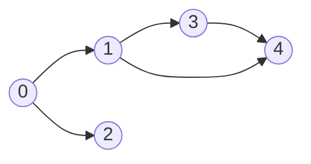
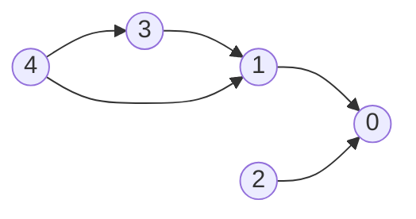
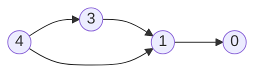
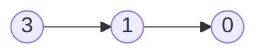
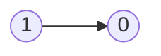

# Amazon

- [x] [1. Two Sum](https://leetcode.cn/problems/two-sum/) (Easy)
- [x] [146. LRU Cache](https://leetcode.cn/problems/lru-cache/) (Medium)
- [x] [200. Number of Islands](https://leetcode.cn/problems/number-of-islands/) (Medium)
- [x] [42. Trapping Rain Water](https://leetcode.cn/problems/trapping-rain-water/) (Hard)
- [x] [49. Group Anagrams](https://leetcode.cn/problems/group-anagrams/) (Medium)
- [x] [121. Best Time to Buy and Sell Stock](https://leetcode.cn/problems/best-time-to-buy-and-sell-stock/) (Easy)
- [x] [56. Merge Intervals](https://leetcode.cn/problems/merge-intervals/) (Medium)
- [x] [207. Course Schedule](https://leetcode.cn/problems/course-schedule/) (Medium)
- [x] [23. Merge k Sorted Lists](https://leetcode.cn/problems/merge-k-sorted-lists/) (Hard)
- [x] [347. Top K Frequent Elements](https://leetcode.cn/problems/top-k-frequent-elements/) (Medium)
- [x] [88. Merge Sorted Array](https://leetcode.cn/problems/merge-sorted-array/) (Easy)
- [x] [15. 3Sum](https://leetcode.cn/problems/3sum/) (Medium)
- [x] [127. Word Ladder](https://leetcode.cn/problems/word-ladder/) (Hard)
- [x] [55. Jump Game](https://leetcode.cn/problems/jump-game/) (Medium)
- [x] [3. Longest Substring Without Repeating Characters](https://leetcode.cn/problems/longest-substring-without-repeating-characters/) (Medium)
- [x] [14. Longest Common Prefix](https://leetcode.cn/problems/longest-common-prefix/) (Easy)
- [x] [210. Course Schedule II](https://leetcode.cn/problems/course-schedule-ii/) (Medium)
- [x] [138. Copy List with Random Pointer](https://leetcode.cn/problems/copy-list-with-random-pointer/) (Medium)
- [x] [20. Valid Parentheses](https://leetcode.cn/problems/valid-parentheses/) (Easy)
- [x] [2. Add Two Numbers](https://leetcode.cn/problems/add-two-numbers/) (Medium)
- [x] [70. Climbing Stairs](https://leetcode.cn/problems/climbing-stairs/) (Easy)
- [x] [238. Product of Array Except Self](https://leetcode.cn/problems/product-of-array-except-self/) (Medium)
- [x] [560. Subarray Sum Equals K](https://leetcode.cn/problems/subarray-sum-equals-k/) (Medium)
- [x] [4. Median of Two Sorted Arrays](https://leetcode.cn/problems/median-of-two-sorted-arrays/) (Hard)
- [x] [79. Word Search](https://leetcode.cn/problems/word-search/) (Medium)
- [x] [22. Generate Parentheses](https://leetcode.cn/problems/generate-parentheses/) (Medium)
- [x] [215. Kth Largest Element in an Array](https://leetcode.cn/problems/kth-largest-element-in-an-array/) (Medium)
- [x] [295. Find Median from Data Stream](https://leetcode.cn/problems/find-median-from-data-stream/) (Hard)
- [x] [5. Longest Palindromic Substring](https://leetcode.cn/problems/longest-palindromic-substring/) (Medium)
- [x] [33. Search in Rotated Sorted Array](https://leetcode.cn/problems/search-in-rotated-sorted-array/) (Medium)

## 1. Two Sum

-   [LeetCode](https://leetcode.com/problems/two-sum/) | [LeetCode CH](https://leetcode.cn/problems/two-sum/) (Easy)

-   Tags: array, hash table
-   Return the indices of the two numbers such that they add up to a specific target.

| Approach | Time Complexity | Space Complexity |
| :------: | :-------------: | :--------------: |
| Hashmap  |      O(n)       |       O(n)       |

```python title="1. Two Sum - Python Solution"
from typing import List


# Hashmap
def twoSum(nums: List[int], target: int) -> List[int]:
    hashmap = {}  # val: idx

    for idx, val in enumerate(nums):
        if (target - val) in hashmap:
            return [hashmap[target - val], idx]

        hashmap[val] = idx


nums = [2, 7, 11, 15]
target = 18
assert twoSum(nums, target) == [1, 2]

```

```cpp title="1. Two Sum - C++ Solution"
#include <iostream>
#include <unordered_map>
#include <vector>

using namespace std;

vector<int> twoSum(vector<int> &nums, int target) {
    unordered_map<int, int> hashmap;

    for (size_t i = 0; i < nums.size(); i++) {
        int complement = target - nums[i];

        if (hashmap.find(complement) != hashmap.end()) {
            return {hashmap[complement], (int)i};
        }
        hashmap[nums[i]] = (int)i;
    }

    return {-1, -1};
}

int main() {
    vector<int> nums = {2, 7, 11, 15};
    int target = 9;
    vector<int> result = twoSum(nums, target);
    cout << result[0] << ", " << result[1] << endl;
    return 0;
}

```

## 146. LRU Cache

-   [LeetCode](https://leetcode.com/problems/lru-cache/) | [LeetCode CH](https://leetcode.cn/problems/lru-cache/) (Medium)

-   Tags: hash table, linked list, design, doubly linked list
- Design and implement a data structure for **Least Recently Used (LRU) cache**. It should support the following operations: get and put.
- [lru](https://media.geeksforgeeks.org/wp-content/uploads/20240909142802/Working-of-LRU-Cache-copy-2.webp)
- 

| Data structure     | Description                   |
| ------------------ | ----------------------------- |
| Doubly Linked List | To store the key-value pairs. |
| Hash Map           | To store the key-node pairs.  |

```python title="146. LRU Cache - Python Solution"
from collections import OrderedDict


# Doubly Linked List
class Node:
    def __init__(self, key=0, val=0):
        self.key = key
        self.val = val
        self.prev = None
        self.next = None


class LRUCache:

    def __init__(self, capacity: int):
        self.cap = capacity
        self.cache = {}
        self.head = Node()
        self.tail = Node()
        self.head.next = self.tail
        self.tail.prev = self.head

    def remove(self, node):
        node.prev.next = node.next
        node.next.prev = node.prev

    def add_to_last(self, node):
        self.tail.prev.next = node
        node.prev = self.tail.prev
        node.next = self.tail
        self.tail.prev = node

    def move_to_last(self, node):
        self.remove(node)
        self.add_to_last(node)

    def get(self, key: int) -> int:
        if key not in self.cache:
            return -1
        node = self.cache[key]
        self.move_to_last(node)
        return node.val

    def put(self, key: int, value: int) -> None:
        if key in self.cache:
            node = self.cache[key]
            node.val = value
            self.move_to_last(node)
            return None

        if len(self.cache) == self.cap:
            del self.cache[self.head.next.key]
            self.remove(self.head.next)

        node = Node(key=key, val=value)
        self.cache[key] = node
        self.add_to_last(node)


# OrderedDict
class LRUCacheOrderedDict:
    def __init__(self, capacity: int):
        self.cache = OrderedDict()
        self.cap = capacity

    def get(self, key: int):
        if key not in self.cache:
            return -1
        self.cache.move_to_end(key, last=True)
        return self.cache[key]

    def put(self, key: int, value: int):
        if key in self.cache:
            self.cache.move_to_end(key, last=True)
        elif len(self.cache) >= self.cap:
            self.cache.popitem(last=False)

        self.cache[key] = value


cache = LRUCache(2)
cache.put(1, 1)
cache.put(2, 2)
assert cache.get(1) == 1
cache.put(3, 3)
assert cache.get(2) == -1
cache.put(4, 4)
assert cache.get(1) == -1
assert cache.get(3) == 3
assert cache.get(4) == 4


cache = LRUCacheOrderedDict(2)
cache.put(1, 1)
cache.put(2, 2)
assert cache.get(1) == 1
cache.put(3, 3)
assert cache.get(2) == -1
cache.put(4, 4)
assert cache.get(1) == -1
assert cache.get(3) == 3
assert cache.get(4) == 4

print("LRU Cache passed")
print("LRU Cache Ordered Dict passed")

```

```cpp title="146. LRU Cache - C++ Solution"
#include <iostream>
#include <unordered_map>
using namespace std;

class Node {
   public:
    int key;
    int val;
    Node *prev;
    Node *next;

    Node(int k = 0, int v = 0) : key(k), val(v), prev(nullptr), next(nullptr) {}
};

class LRUCache {
   private:
    int cap;
    unordered_map<int, Node *> cache;
    Node *head;
    Node *tail;

    void remove(Node *node) {
        node->prev->next = node->next;
        node->next->prev = node->prev;
    }

    void insert_to_last(Node *node) {
        tail->prev->next = node;
        node->prev = tail->prev;
        tail->prev = node;
        node->next = tail;
    }

    void move_to_last(Node *node) {
        remove(node);
        insert_to_last(node);
    }

   public:
    LRUCache(int capacity) {
        this->cap = capacity;
        head = new Node();
        tail = new Node();
        head->next = tail;
        tail->prev = head;
    }

    int get(int key) {
        if (cache.find(key) != cache.end()) {
            Node *node = cache[key];
            move_to_last(node);
            return node->val;
        }
        return -1;
    }

    void put(int key, int value) {
        if (cache.find(key) != cache.end()) {
            Node *node = cache[key];
            node->val = value;
            move_to_last(node);
        } else {
            Node *newNode = new Node(key, value);
            cache[key] = newNode;
            insert_to_last(newNode);

            if ((int)cache.size() > cap) {
                Node *removed = head->next;
                remove(removed);
                cache.erase(removed->key);
                delete removed;
            }
        }
    }
};

int main() {
    LRUCache lru(2);
    lru.put(1, 1);
    lru.put(2, 2);
    cout << lru.get(1) << endl;  // 1
    lru.put(3, 3);
    cout << lru.get(2) << endl;  // -1
    lru.put(4, 4);
    cout << lru.get(1) << endl;  // -1
    cout << lru.get(3) << endl;  // 3
    cout << lru.get(4) << endl;  // 4
    return 0;
}

```

## 200. Number of Islands

-   [LeetCode](https://leetcode.com/problems/number-of-islands/) | [LeetCode CH](https://leetcode.cn/problems/number-of-islands/) (Medium)

-   Tags: array, depth first search, breadth first search, union find, matrix
-   Count the number of islands in a 2D grid.
-   Method 1: DFS
-   Method 2: BFS (use a queue to traverse the grid)

-   How to keep track of visited cells?

    1. Mark the visited cell as `0` (or any other value) to avoid revisiting it.
    2. Use a set to store the visited cells.

-   Steps:
    1. Init: variables
    2. DFS/BFS: starting from the cell with `1`, turn all the connected `1`s to `0`.
    3. Traverse the grid, and if the cell is `1`, increment the count and call DFS/BFS.


```python title="200. Number of Islands - Python Solution"
from collections import deque
from copy import deepcopy
from typing import List


# DFS
def numIslandsDFS(grid: List[List[str]]) -> int:
    if not grid:
        return 0

    m, n = len(grid), len(grid[0])
    res = 0

    def dfs(r, c):
        if r < 0 or r >= m or c < 0 or c >= n or grid[r][c] != "1":
            return

        grid[r][c] = "2"

        dfs(r + 1, c)
        dfs(r - 1, c)
        dfs(r, c + 1)
        dfs(r, c - 1)

    for r in range(m):
        for c in range(n):
            if grid[r][c] == "1":
                dfs(r, c)
                res += 1

    return res


# BFS + Set
def numIslandsBFS1(grid: List[List[str]]) -> int:
    if not grid:
        return 0

    m, n = len(grid), len(grid[0])
    dirs = [(1, 0), (-1, 0), (0, 1), (0, -1)]
    visited = set()
    res = 0

    def bfs(r, c):
        q = deque([(r, c)])

        while q:
            row, col = q.popleft()

            for dr, dc in dirs:
                nr, nc = row + dr, col + dc
                if (
                    nr < 0
                    or nr >= m
                    or nc < 0
                    or nc >= n
                    or grid[nr][nc] == "0"
                    or (nr, nc) in visited
                ):
                    continue

                visited.add((nr, nc))
                q.append((nr, nc))

    for r in range(m):
        for c in range(n):
            if grid[r][c] == "1" and (r, c) not in visited:
                visited.add((r, c))
                bfs(r, c)
                res += 1

    return res


# BFS + Grid
def numIslandsBFS2(grid: List[List[str]]) -> int:
    if not grid:
        return 0

    m, n = len(grid), len(grid[0])
    dirs = [[0, 1], [0, -1], [1, 0], [-1, 0]]
    res = 0

    def bfs(r, c):
        q = deque([(r, c)])

        while q:
            row, col = q.popleft()

            for dr, dc in dirs:
                nr, nc = dr + row, dc + col
                if (
                    nr < 0
                    or nr >= m
                    or nc < 0
                    or nc >= n
                    or grid[nr][nc] != "1"
                ):
                    continue
                grid[nr][nc] = "2"
                q.append((nr, nc))

    for i in range(m):
        for j in range(n):
            if grid[i][j] == "1":
                grid[i][j] = "2"
                bfs(i, j)
                res += 1

    return res


grid = [
    ["1", "1", "1", "1", "0"],
    ["1", "1", "0", "1", "0"],
    ["1", "1", "0", "0", "0"],
    ["0", "0", "0", "0", "0"],
]

print(numIslandsDFS(deepcopy(grid)))  # 1
print(numIslandsBFS1(deepcopy(grid)))  # 1
print(numIslandsBFS2(deepcopy(grid)))  # 1

```

```cpp title="200. Number of Islands - C++ Solution"
#include <vector>
#include <iostream>
using namespace std;

class Solution
{
private:
    void dfs(vector<vector<char>> &grid, int r, int c)
    {
        int row = grid.size();
        int col = grid[0].size();

        if (r < 0 || r >= row || c < 0 || c >= col || grid[r][c] != '1')
        {
            return;
        }
        grid[r][c] = '0';

        dfs(grid, r - 1, c);
        dfs(grid, r + 1, c);
        dfs(grid, r, c - 1);
        dfs(grid, r, c + 1);
    }

public:
    int numIslands(vector<vector<char>> &grid)
    {
        int m = grid.size(), n = grid[0].size();
        int res = 0;
        for (int i = 0; i < m; i++)
        {
            for (int j = 0; j < n; j++)
            {
                if (grid[i][j] == '1')
                {
                    res++;
                    dfs(grid, i, j);
                }
            }
        }
        return res;
    }
};

int main()
{
    Solution s;
    vector<vector<char>> grid = {
        {'1', '1', '0', '0', '0'},
        {'1', '1', '0', '0', '0'},
        {'0', '0', '1', '0', '0'},
        {'0', '0', '0', '1', '1'}};
    cout << s.numIslands(grid) << endl;
    return 0;
}

```

## 42. Trapping Rain Water

-   [LeetCode](https://leetcode.com/problems/trapping-rain-water/) | [LeetCode CH](https://leetcode.cn/problems/trapping-rain-water/) (Hard)

-   Tags: array, two pointers, dynamic programming, stack, monotonic stack
-   

<iframe width="560" height="315" src="https://www.youtube.com/embed/ZI2z5pq0TqA?si=OEYg01dbmzvmtIwZ" title="YouTube video player" frameborder="0" allow="accelerometer; autoplay; clipboard-write; encrypted-media; gyroscope; picture-in-picture; web-share" referrerpolicy="strict-origin-when-cross-origin" allowfullscreen></iframe>

| Approach   | Time | Space |
| ---------- | ---- | ----- |
| DP         | O(N) | O(N)  |
| Left Right | O(N) | O(1)  |
| Monotonic  | O(N) | O(N)  |

```python title="42. Trapping Rain Water - Python Solution"
from typing import List


# DP
def trapDP(height: List[int]) -> int:
    if not height:
        return 0

    n = len(height)
    maxLeft, maxRight = [0 for _ in range(n)], [0 for _ in range(n)]

    for i in range(1, n):
        maxLeft[i] = max(maxLeft[i - 1], height[i - 1])

    for i in range(n - 2, -1, -1):
        maxRight[i] = max(maxRight[i + 1], height[i + 1])

    res = 0
    for i in range(n):
        res += max(0, min(maxLeft[i], maxRight[i]) - height[i])

    return res


# Left Right Pointers
def trapLR(height: List[int]) -> int:
    if not height:
        return 0

    left, right = 0, len(height) - 1
    maxL, maxR = height[left], height[right]
    res = 0

    while left < right:
        if maxL < maxR:
            left += 1
            maxL = max(maxL, height[left])
            res += maxL - height[left]
        else:
            right -= 1
            maxR = max(maxR, height[right])
            res += maxR - height[right]

    return res


# Monotonic Stack
def trapStack(height: List[int]) -> int:
    stack = []
    total = 0

    for i in range(len(height)):
        while stack and height[i] > height[stack[-1]]:
            top = stack.pop()
            if not stack:
                break
            distance = i - stack[-1] - 1
            bounded_height = min(height[i], height[stack[-1]]) - height[top]
            total += distance * bounded_height
        stack.append(i)

    return total


height = [0, 1, 0, 2, 1, 0, 1, 3, 2, 1, 2, 1]
print(trapDP(height))  # 6
print(trapLR(height))  # 6
print(trapStack(height))  # 6

```

```cpp title="42. Trapping Rain Water - C++ Solution"
#include <vector>
#include <algorithm>
#include <iostream>
using namespace std;

class Solution
{
public:
    int trap(vector<int> &height)
    {
        if (height.empty())
            return 0;

        int res = 0;
        int left = 0, right = height.size() - 1;
        int maxL = height[left], maxR = height[right];

        while (left < right)
        {
            if (maxL < maxR)
            {
                left++;
                maxL = max(maxL, height[left]);
                res += maxL - height[left];
            }
            else
            {
                right--;
                maxR = max(maxR, height[right]);
                res += maxR - height[right];
            }
        }
        return res;
    }
};

int main()
{
    vector<int> height = {0, 1, 0, 2, 1, 0, 1, 3, 2, 1, 2, 1};
    Solution solution;
    cout << solution.trap(height) << endl;
    return 0;
}

```

## 49. Group Anagrams

-   [LeetCode](https://leetcode.com/problems/group-anagrams/) | [LeetCode CH](https://leetcode.cn/problems/group-anagrams/) (Medium)

-   Tags: array, hash table, string, sorting

```python title="49. Group Anagrams - Python Solution"
from collections import defaultdict
from typing import List


# Hash - List
def groupAnagrams(strs: List[str]) -> List[List[str]]:
    result = defaultdict(list)

    for s in strs:
        count = [0] * 26
        for i in s:
            count[ord(i) - ord("a")] += 1

        result[tuple(count)].append(s)

    return list(result.values())


# |-------------|-----------------|--------------|
# |  Approach   |      Time       |    Space     |
# |-------------|-----------------|--------------|
# |    Hash     |     O(n * k)    |     O(n)     |
# |-------------|-----------------|--------------|


strs = ["eat", "tea", "tan", "ate", "nat", "bat"]
print(groupAnagrams(strs))
# [['eat', 'tea', 'ate'], ['tan', 'nat'], ['bat']]

```

## 121. Best Time to Buy and Sell Stock

-   [LeetCode](https://leetcode.com/problems/best-time-to-buy-and-sell-stock/) | [LeetCode CH](https://leetcode.cn/problems/best-time-to-buy-and-sell-stock/) (Easy)

-   Tags: array, dynamic programming
-   Return the maximum profit that can be achieved from buying on one day and selling on another day.

```python title="121. Best Time to Buy and Sell Stock - Python Solution"
from typing import List


# Brute Force
def maxProfitBF(prices: List[int]) -> int:
    max_profit = 0
    n = len(prices)
    for i in range(n):
        for j in range(i + 1, n):
            max_profit = max(max_profit, prices[j] - prices[i])

    return max_profit


# DP
def maxProfitDP(prices: List[int]) -> int:
    dp = [[0] * 2 for _ in range(len(prices))]
    dp[0][0] = -prices[0]  # buy
    dp[0][1] = 0  # sell

    for i in range(1, len(prices)):
        dp[i][0] = max(dp[i - 1][0], -prices[i])  # the lowest price to buy
        dp[i][1] = max(dp[i - 1][1], dp[i - 1][0] + prices[i])

    return dp[-1][1]


# Greedy
def maxProfitGreedy(prices: List[int]) -> int:
    max_profit = 0
    seen_min = prices[0]

    for i in range(1, len(prices)):
        max_profit = max(max_profit, prices[i] - seen_min)
        seen_min = min(seen_min, prices[i])

    return max_profit


# Fast Slow Pointers
def maxProfitFS(prices: List[int]) -> int:
    max_profit = 0
    slow, fast = 0, 1

    while fast < len(prices):
        if prices[fast] > prices[slow]:
            max_profit = max(max_profit, prices[fast] - prices[slow])
        else:
            slow = fast
        fast += 1

    return max_profit


# |------------|------- |---------|
# |  Approach  |  Time  |  Space  |
# |------------|--------|---------|
# | Brute Force|  O(n^2)|  O(1)   |
# | DP         |  O(n)  |  O(n)   |
# | Greedy     |  O(n)  |  O(1)   |
# | Fast Slow  |  O(n)  |  O(1)   |
# |------------|--------|---------|


prices = [7, 1, 5, 3, 6, 4]
print(maxProfitBF(prices))  # 5
print(maxProfitDP(prices))  # 5
print(maxProfitGreedy(prices))  # 5
print(maxProfitFS(prices))  # 5

```

```cpp title="121. Best Time to Buy and Sell Stock - C++ Solution"
#include <vector>
#include <algorithm>
#include <iostream>
using namespace std;

class Solution
{
public:
    int maxProfit(vector<int> &prices)
    {
        if (prices.size() <= 1)
            return 0;

        int seen_min = prices[0];
        int res = 0;

        for (int &price : prices)
        {
            res = max(res, price - seen_min);
            seen_min = min(seen_min, price);
        }
        return res;
    }
};

int main()
{
    vector<int> prices = {7, 1, 5, 3, 6, 4};
    Solution obj;
    cout << obj.maxProfit(prices) << endl;
    return 0;
}

```

## 56. Merge Intervals

-   [LeetCode](https://leetcode.com/problems/merge-intervals/) | [LeetCode CH](https://leetcode.cn/problems/merge-intervals/) (Medium)

-   Tags: array, sorting
-   Merge all overlapping intervals.

<iframe width="560" height="315" src="https://www.youtube.com/embed/44H3cEC2fFM?si=J-Jr_Fg2eDse3-de" title="YouTube video player" frameborder="0" allow="accelerometer; autoplay; clipboard-write; encrypted-media; gyroscope; picture-in-picture; web-share" referrerpolicy="strict-origin-when-cross-origin" allowfullscreen></iframe>

```python title="56. Merge Intervals - Python Solution"
from typing import List


# Intervals
def merge(intervals: List[List[int]]) -> List[List[int]]:
    n = len(intervals)
    if n <= 1:
        return intervals

    intervals.sort(key=lambda x: x[0])
    res = [intervals[0]]

    for i in range(1, n):
        if intervals[i][0] <= res[-1][1]:
            res[-1][1] = max(res[-1][1], intervals[i][1])
        else:
            res.append(intervals[i])

    return res


print(merge([[1, 3], [2, 6], [8, 10], [15, 18]]))
# [[1, 6], [8, 10], [15, 18]]

```

```cpp title="56. Merge Intervals - C++ Solution"
#include <algorithm>
#include <iostream>
#include <vector>
using namespace std;

// Interval
vector<vector<int>> merge(vector<vector<int>>& intervals) {
    sort(intervals.begin(), intervals.end());
    vector<vector<int>> res;

    for (auto& range : intervals) {
        if (!res.empty() && range[0] <= res.back()[1]) {
            res.back()[1] = max(res.back()[1], range[1]);
        } else {
            res.emplace_back(range);
        }
    }
    return res;
}

int main() {
    vector<vector<int>> intervals = {{1, 3}, {2, 6}, {8, 10}, {15, 18}};
    vector<vector<int>> res = merge(intervals);
    for (auto& range : res) {
        cout << range[0] << ", " << range[1] << endl;
    }
    return 0;
}

```

## 207. Course Schedule

-   [LeetCode](https://leetcode.com/problems/course-schedule/) | [LeetCode CH](https://leetcode.cn/problems/course-schedule/) (Medium)

-   Tags: depth first search, breadth first search, graph, topological sort
-   Return true if it is possible to finish all courses, otherwise return false.
-   Dependency relationships imply the topological sort algorithm.
-   Cycle detection
-   Topological Sort
    -   DAG (Directed Acyclic Graph)
    -   Time complexity: O(V+E)
    -   Space complexity: O(V+E)
    -   Prerequisites: Indegree (Look at the problem 1557. Minimum Number of Vertices to Reach All Nodes)
        -   Indegree: Number of incoming edges to a vertex
    -   Applications: task scheduling, course scheduling, build systems, dependency resolution, compiler optimization, etc.

{width=300px}

{width=300px}

Course to prerequisites mapping



Prerequisites to course mapping



| course       | 0   | 0   | 1   | 1   | 3   |
| ------------ | --- | --- | --- | --- | --- |
| prerequisite | 1   | 2   | 3   | 4   | 4   |

| index     | 0   | 1   | 2   | 3   | 4   |
| --------- | --- | --- | --- | --- | --- |
| in-degree | 0   | 0   | 0   | 0   | 0   |

Initialize

-   graph

| prerequisite | 1     | 2     | 3     | 4        |
| ------------ | ----- | ----- | ----- | -------- |
| course       | `[0]` | `[0]` | `[1]` | `[1, 3]` |

-   in-degree

|           | 0   | 1   | 2   | 3   | 4   |
| --------- | --- | --- | --- | --- | --- |
| in-degree | 2   | 2   | 0   | 1   | 0   |

-   queue: `[2, 4]`
-   pop `2` from the queue



|           | 0   | 1   | 2   | 3   | 4   |
| --------- | --- | --- | --- | --- | --- |
| in-degree | 1   | 2   | 0   | 1   | 0   |

-   queue: `[4]`
-   pop `4` from the queue



|           | 0   | 1   | 2   | 3   | 4   |
| --------- | --- | --- | --- | --- | --- |
| in-degree | 1   | 1   | 0   | 0   | 0   |

-   queue: `[3]`
-   pop `3` from the queue



|           | 0   | 1   | 2   | 3   | 4   |
| --------- | --- | --- | --- | --- | --- |
| in-degree | 1   | 0   | 0   | 0   | 0   |

-   queue: `[1]`
-   pop `1` from the queue


|           | 0   | 1   | 2   | 3   | 4   |
| --------- | --- | --- | --- | --- | --- |
| in-degree | 0   | 0   | 0   | 0   | 0   |

-   queue: `[0]`
-   pop `0` from the queue
-   All courses are taken. Return `True`.

```python title="207. Course Schedule - Python Solution"
from collections import defaultdict, deque
from typing import List


# BFS (Kahn's Algorithm)
def canFinishBFS(numCourses: int, prerequisites: List[List[int]]) -> bool:
    graph = defaultdict(list)
    indegree = defaultdict(int)

    for crs, pre in prerequisites:
        graph[pre].append(crs)
        indegree[crs] += 1

    q = deque([i for i in range(numCourses) if indegree[i] == 0])
    count = 0

    while q:
        crs = q.popleft()
        count += 1

        for nxt in graph[crs]:
            indegree[nxt] -= 1

            if indegree[nxt] == 0:
                q.append(nxt)

    return count == numCourses


# DFS + Set
def canFinishDFS1(numCourses: int, prerequisites: List[List[int]]) -> bool:
    graph = defaultdict(list)
    for crs, pre in prerequisites:
        graph[crs].append(pre)

    visiting = set()

    def dfs(crs):
        if crs in visiting:  # cycle detected
            return False
        if graph[crs] == []:
            return True

        visiting.add(crs)

        for pre in graph[crs]:
            if not dfs(pre):
                return False

        visiting.remove(crs)
        graph[crs] = []

        return True

    for crs in range(numCourses):
        if not dfs(crs):
            return False
    return True


# DFS + List
def canFinishDFS2(numCourses: int, prerequisites: List[List[int]]) -> bool:
    graph = defaultdict(list)
    for pre, crs in prerequisites:
        graph[crs].append(pre)

    # 0: init, 1: visiting, 2: visited
    status = [0] * numCourses

    def dfs(crs):
        if status[crs] == 1:  # cycle detected
            return False
        if status[crs] == 2:
            return True

        status[crs] = 1

        for pre in graph[crs]:
            if not dfs(pre):
                return False

        status[crs] = 2
        return True

    for crs in range(numCourses):
        if not dfs(crs):
            return False
    return True


prerequisites = [[0, 1], [0, 2], [1, 3], [1, 4], [3, 4]]
print(canFinishBFS(5, prerequisites))  # True
print(canFinishDFS1(5, prerequisites))  # True
print(canFinishDFS2(5, prerequisites))  # True

```

```cpp title="207. Course Schedule - C++ Solution"
#include <functional>
#include <iostream>
#include <queue>
#include <vector>
using namespace std;

class Solution {
   public:
    // BFS
    bool canFinishBFS(int numCourses, vector<vector<int>> &prerequisites) {
        vector<vector<int>> graph(numCourses);
        vector<int> indegree(numCourses, 0);
        for (auto &pre : prerequisites) {
            graph[pre[1]].push_back(pre[0]);
            indegree[pre[0]]++;
        }

        queue<int> q;
        for (int i = 0; i < numCourses; i++) {
            if (indegree[i] == 0) {
                q.push(i);
            }
        }

        int cnt = 0;
        while (!q.empty()) {
            int cur = q.front();
            q.pop();
            cnt++;

            for (int nxt : graph[cur]) {
                indegree[nxt]--;
                if (indegree[nxt] == 0) {
                    q.push(nxt);
                }
            }
        }
        return cnt == numCourses;
    }

    // DFS
    bool canFinishDFS(int numCourses, vector<vector<int>> &prerequisites) {
        vector<vector<int>> graph(numCourses);
        for (auto &pre : prerequisites) {
            graph[pre[1]].push_back(pre[0]);
        }
        // 0: not visited, 1: visiting, 2: visited
        vector<int> state(numCourses, 0);

        function<bool(int)> dfs = [&](int pre) -> bool {
            state[pre] = 1;  // visiting
            for (int crs : graph[pre]) {
                if (state[crs] == 1 || (state[crs] == 0 && dfs(crs))) {
                    return true;
                }
            }
            state[pre] = 2;  // visited
            return false;
        };

        for (int i = 0; i < numCourses; i++) {
            if (state[i] == 0 && dfs(i)) {
                return false;
            }
        }
        return true;
    }
};

int main() {
    Solution sol;
    vector<vector<int>> prerequisites = {{1, 0}, {2, 1}, {3, 2}, {4, 3},
                                         {5, 4}, {6, 5}, {7, 6}, {8, 7},
                                         {9, 8}, {10, 9}};
    int numCourses = 11;
    cout << sol.canFinishBFS(numCourses, prerequisites) << endl;
    cout << sol.canFinishDFS(numCourses, prerequisites) << endl;
    return 0;
}

```

## 23. Merge k Sorted Lists

-   [LeetCode](https://leetcode.com/problems/merge-k-sorted-lists/) | [LeetCode CH](https://leetcode.cn/problems/merge-k-sorted-lists/) (Hard)

-   Tags: linked list, divide and conquer, heap priority queue, merge sort
-   Prerequisite: 21. Merge Two Sorted Lists

<iframe width="560" height="315" src="https://www.youtube.com/embed/q5a5OiGbT6Q?si=SlQg9SKZh1YL62vH" title="YouTube video player" frameborder="0" allow="accelerometer; autoplay; clipboard-write; encrypted-media; gyroscope; picture-in-picture; web-share" referrerpolicy="strict-origin-when-cross-origin" allowfullscreen></iframe>

```python title="23. Merge k Sorted Lists - Python Solution"
import copy
import heapq
from typing import List, Optional

from template import ListNode


# Divide and Conquer
def mergeKListsDC(lists: List[Optional[ListNode]]) -> Optional[ListNode]:
    if not lists or len(lists) == 0:
        return None

    def mergeTwo(l1, l2):
        dummy = ListNode()
        cur = dummy

        while l1 and l2:
            if l1.val < l2.val:
                cur.next = l1
                l1 = l1.next
            else:
                cur.next = l2
                l2 = l2.next

            cur = cur.next

        cur.next = l1 if l1 else l2

        return dummy.next

    while len(lists) > 1:
        merged = []

        for i in range(0, len(lists), 2):
            l1 = lists[i]
            l2 = lists[i + 1] if i + 1 < len(lists) else None
            merged.append(mergeTwo(l1, l2))

        lists = merged

    return lists[0]


# Heap - Merge k Sorted
def mergeKLists(lists: List[Optional[ListNode]]) -> Optional[ListNode]:
    dummy = ListNode()
    cur = dummy

    minHeap = []  # (val, idx, node)

    for idx, head in enumerate(lists):
        if head:
            heapq.heappush(minHeap, (head.val, idx, head))

    while minHeap:
        _, idx, node = heapq.heappop(minHeap)
        cur.next = node
        cur = cur.next

        node = node.next
        if node:
            heapq.heappush(minHeap, (node.val, idx, node))

    return dummy.next


n1 = ListNode.create([1, 4, 5])
n2 = ListNode.create([1, 3, 4])
n3 = ListNode.create([2, 6])
lists = [n1, n2, n3]
lists1 = copy.deepcopy(lists)
lists2 = copy.deepcopy(lists)
print(mergeKListsDC(lists1))
# 1 -> 1 -> 2 -> 3 -> 4 -> 4 -> 5 -> 6
print(mergeKLists(lists2))
# 1 -> 1 -> 2 -> 3 -> 4 -> 4 -> 5 -> 6

```

## 347. Top K Frequent Elements

-   [LeetCode](https://leetcode.com/problems/top-k-frequent-elements/) | [LeetCode CH](https://leetcode.cn/problems/top-k-frequent-elements/) (Medium)

-   Tags: array, hash table, divide and conquer, sorting, heap priority queue, bucket sort, counting, quickselect

```python title="347. Top K Frequent Elements - Python Solution"
import heapq
from collections import Counter
from typing import List


# Heap + Counter
def topKFrequent(nums: List[int], k: int) -> List[int]:
    minHeap = []

    for val, freq in Counter(nums).items():
        if len(minHeap) < k:
            heapq.heappush(minHeap, (freq, val))
        else:
            heapq.heappushpop(minHeap, (freq, val))

    return [i for _, i in minHeap]


# Counter (Most Common)
def topKFrequentCounter(nums: List[int], k: int) -> List[int]:
    commons = Counter(nums).most_common(k)
    return [i for i, _ in commons]


nums = [1, 1, 1, 2, 2, 3]
k = 2
print(topKFrequent(nums, k))  # [1, 2]
print(topKFrequentCounter(nums, k))  # [1, 2]

```

## 88. Merge Sorted Array

-   [LeetCode](https://leetcode.com/problems/merge-sorted-array/) | [LeetCode CH](https://leetcode.cn/problems/merge-sorted-array/) (Easy)

-   Tags: array, two pointers, sorting

```python title="88. Merge Sorted Array - Python Solution"
from typing import List


# Left Right Pointers
def merge(nums1: List[int], m: int, nums2: List[int], n: int) -> None:
    """Merges two sorted arrays in-place."""
    p1, p2, t = m - 1, n - 1, m + n - 1

    while p1 >= 0 or p2 >= 0:
        if p1 == -1:
            nums1[t] = nums2[p2]
            p2 -= 1
        elif p2 == -1:
            nums1[t] = nums1[p1]
            p1 -= 1
        elif nums1[p1] > nums2[p2]:
            nums1[t] = nums1[p1]
            p1 -= 1
        else:
            nums1[t] = nums2[p2]
            p2 -= 1

        t -= 1


nums1 = [1, 2, 3, 0, 0, 0]
m = 3
nums2 = [2, 5, 6]
n = 3
merge(nums1, m, nums2, n)
print(nums1)  # [1, 2, 2, 3, 5, 6]

```

## 15. 3Sum

-   [LeetCode](https://leetcode.com/problems/3sum/) | [LeetCode CH](https://leetcode.cn/problems/3sum/) (Medium)

-   Tags: array, two pointers, sorting

```python title="15. 3Sum - Python Solution"
from typing import List


# Left Right Pointers
def threeSum(nums: List[int]) -> List[List[int]]:
    nums.sort()
    res = []
    n = len(nums)

    for i in range(n - 2):
        if i > 0 and nums[i] == nums[i - 1]:
            continue

        left, right = i + 1, n - 1

        while left < right:
            total = nums[i] + nums[left] + nums[right]

            if total > 0:
                right -= 1
            elif total < 0:
                left += 1
            else:
                res.append([nums[i], nums[left], nums[right]])

                while left < right and nums[left] == nums[left + 1]:
                    left += 1

                while left < right and nums[right] == nums[right - 1]:
                    right -= 1

                left += 1
                right -= 1

    return res


nums = [-1, 0, 1, 2, -1, -4]
assert threeSum(nums) == [[-1, -1, 2], [-1, 0, 1]]

```

```cpp title="15. 3Sum - C++ Solution"
#include <algorithm>
#include <iostream>
#include <vector>
using namespace std;

vector<vector<int>> threeSum(vector<int>& nums) {
    sort(nums.begin(), nums.end());
    vector<vector<int>> res;
    int n = nums.size();

    for (int i = 0; i < n - 2; i++) {
        if (i > 0 && nums[i] == nums[i - 1]) {
            continue;
        }

        int left = i + 1, right = n - 1;

        while (left < right) {
            int total = nums[i] + nums[left] + nums[right];

            if (total > 0)
                right--;
            else if (total < 0)
                left++;
            else {
                res.push_back({nums[i], nums[left], nums[right]});
                while (left < right && nums[left] == nums[left + 1]) left++;
                while (left < right && nums[right] == nums[right - 1]) right--;
                left++;
                right--;
            }
        }
    }
    return res;
}

int main() {
    vector<int> nums = {-1, 0, 1, 2, -1, -4};
    vector<vector<int>> res = threeSum(nums);
    for (auto& v : res) {
        for (int i : v) {
            cout << i << " ";
        }
        cout << endl;
    }
    return 0;
}

```

## 127. Word Ladder

-   [LeetCode](https://leetcode.com/problems/word-ladder/) | [LeetCode CH](https://leetcode.cn/problems/word-ladder/) (Hard)

-   Tags: hash table, string, breadth first search
-   The most classic BFS problem.
-   Return the number of words in the shortest transformation sequence from beginWord to endWord, or 0 if no such sequence exists.

<iframe width="560" height="315" src="https://www.youtube.com/embed/h9iTnkgv05E?si=51-3ZwweoJrPqRW9" title="YouTube video player" frameborder="0" allow="accelerometer; autoplay; clipboard-write; encrypted-media; gyroscope; picture-in-picture; web-share" referrerpolicy="strict-origin-when-cross-origin" allowfullscreen></iframe>

| Approach | Time        | Space     |
| -------- | ----------- | --------- |
| BFS      | O(n \* m^2) | O(n \* m) |

```python title="127. Word Ladder - Python Solution"
from collections import defaultdict, deque
from typing import List


# BFS
def ladderLength(beginWord: str, endWord: str, wordList: List[str]) -> int:
    if endWord not in wordList:
        return 0

    n = len(beginWord)
    graph = defaultdict(list)  # pattern: words
    wordList.append(beginWord)

    for word in wordList:
        for i in range(n):
            pattern = word[:i] + "*" + word[i + 1 :]
            graph[pattern].append(word)

    visited = set([beginWord])
    q = deque([beginWord])
    res = 1

    while q:
        size = len(q)
        for _ in range(size):
            word = q.popleft()
            if word == endWord:
                return res

            for i in range(n):
                pattern = word[:i] + "*" + word[i + 1 :]
                for neighbor in graph[pattern]:
                    if neighbor not in visited:
                        visited.add(neighbor)
                        q.append(neighbor)
        res += 1

    return 0


beginWord = "hit"
endWord = "cog"
wordList = ["hot", "dot", "dog", "lot", "log", "cog"]
print(ladderLength(beginWord, endWord, wordList))  # 5

```

## 55. Jump Game

-   [LeetCode](https://leetcode.com/problems/jump-game/) | [LeetCode CH](https://leetcode.cn/problems/jump-game/) (Medium)

-   Tags: array, dynamic programming, greedy
-   Return `True` if you can reach the last index, otherwise `False`.

<iframe width="560" height="315" src="https://www.youtube.com/embed/Yan0cv2cLy8?si=musT5NViPicljg7x" title="YouTube video player" frameborder="0" allow="accelerometer; autoplay; clipboard-write; encrypted-media; gyroscope; picture-in-picture; web-share" referrerpolicy="strict-origin-when-cross-origin" allowfullscreen></iframe>

-   Example: `[2, 3, 1, 1, 4, 1, 2, 0, 0]`

| Index | Value | Index + Value | Max Reach | Max Reach >= Last Index |
| :---: | :---: | :-----------: | :-------: | :---------------------: |
|   0   |   2   |       2       |     2     |          False          |
|   1   |   3   |       4       |     4     |          False          |
|   2   |   1   |       3       |     4     |          False          |
|   3   |   1   |       4       |     4     |          False          |
|   4   |   4   |       8       |     8     |          True           |
|   5   |   1   |       6       |     8     |          True           |
|   6   |   2   |       8       |     8     |          True           |
|   7   |   0   |       7       |     8     |          True           |
|   8   |   0   |       8       |     8     |          True           |

```python title="55. Jump Game - Python Solution"
from typing import List


# Greedy - Interval
def canJump(nums: List[int]) -> bool:
    maxReach = 0
    i = 0
    n = len(nums)

    while i <= maxReach:
        maxReach = max(maxReach, i + nums[i])
        if maxReach >= n - 1:
            return True
        i += 1

    return False


print(canJump([2, 3, 1, 1, 4, 1, 2, 0, 0]))  # True

```

```cpp title="55. Jump Game - C++ Solution"
#include <algorithm>
#include <iostream>
#include <vector>
using namespace std;

class Solution {
   public:
    bool canJump(vector<int>& nums) {
        int canReach = 0;
        int n = nums.size();

        for (int i = 0; i < n; i++) {
            if (i > canReach) return false;
            canReach = max(canReach, i + nums[i]);
        }
        return true;
    }
};

int main() {
    Solution obj;
    vector<int> nums = {2, 3, 1, 1, 4};
    cout << obj.canJump(nums) << endl;
    return 0;
}

```

## 3. Longest Substring Without Repeating Characters

-   [LeetCode](https://leetcode.com/problems/longest-substring-without-repeating-characters/) | [LeetCode CH](https://leetcode.cn/problems/longest-substring-without-repeating-characters/) (Medium)

-   Tags: hash table, string, sliding window
-   Classic sliding window problem. Use a set to keep track of the characters in the current window.
-   Return the length of the longest substring without repeating characters.

<iframe width="560" height="315" src="https://www.youtube.com/embed/wiGpQwVHdE0?si=GlOc9C5w5Vy71iTN" title="YouTube video player" frameborder="0" allow="accelerometer; autoplay; clipboard-write; encrypted-media; gyroscope; picture-in-picture; web-share" referrerpolicy="strict-origin-when-cross-origin" allowfullscreen></iframe>

```python title="3. Longest Substring Without Repeating Characters - Python Solution"
# Sliding Window Variable Size
def lengthOfLongestSubstring(s: str) -> int:
    n = len(s)
    if n <= 1:
        return n

    window = set()
    left = 0
    res = 0

    for right in range(n):
        while s[right] in window:
            window.remove(s[left])
            left += 1
        window.add(s[right])
        res = max(res, right - left + 1)

    return res


s = "abcabcbb"
assert lengthOfLongestSubstring(s) == 3

```

```cpp title="3. Longest Substring Without Repeating Characters - C++ Solution"
#include <iostream>
#include <string>
#include <unordered_set>
using namespace std;

int lengthOfLongestSubstring(string s) {
    int n = s.length();
    int res = 0;
    int left = 0;
    unordered_set<char> window;

    for (int right = 0; right < n; right++) {
        char ch = s[right];

        while (window.find(ch) != window.end()) {
            window.erase(s[left]);
            left++;
        }

        window.insert(ch);
        res = max(res, right - left + 1);
    }
    return (int)res;
}

int main() {
    string s = "abcabcbb";
    cout << lengthOfLongestSubstring(s) << endl;  // 3
    s = "bbbbb";
    cout << lengthOfLongestSubstring(s) << endl;  // 1
    s = "pwwkew";
    cout << lengthOfLongestSubstring(s) << endl;  // 3
    return 0;
}

```

## 14. Longest Common Prefix

-   [LeetCode](https://leetcode.com/problems/longest-common-prefix/) | [LeetCode CH](https://leetcode.cn/problems/longest-common-prefix/) (Easy)

-   Tags: string, trie

```python title="14. Longest Common Prefix - Python Solution"
from typing import List


# Horizontal Scanning
def longestCommonPrefixHorizontal(strs: List[str]) -> str:
    if not strs:
        return ""

    prefix = strs[0]
    for i in range(1, len(strs)):
        while not strs[i].startswith(prefix):
            prefix = prefix[:-1]
            if not prefix:
                return ""

    return prefix


# Vertical Scanning
def longestCommonPrefixVertical(strs: List[str]) -> str:
    if not strs:
        return ""

    for i in range(len(strs[0])):
        char = strs[0][i]
        for j in range(1, len(strs)):
            if i >= len(strs[j]) or strs[j][i] != char:
                return strs[0][:i]

    return strs[0]


# Divide and Conquer
def longestCommonPrefixDivideConquer(strs: List[str]) -> str:
    if not strs:
        return ""

    def merge(left, right):
        n = min(len(left), len(right))
        for i in range(n):
            if left[i] != right[i]:
                return left[:i]
        return left[:n]

    def helper(strs, start, end):
        if start == end:
            return strs[start]
        mid = start + (end - start) // 2
        left = helper(strs, start, mid)
        right = helper(strs, mid + 1, end)
        return merge(left, right)

    return helper(strs, 0, len(strs) - 1)


# Binary Search
def longestCommonPrefixBinarySearch(strs: List[str]) -> str:
    if not strs:
        return ""

    def isCommonPrefix(strs, length):
        prefix = strs[0][:length]
        return all(s.startswith(prefix) for s in strs)

    minLen = min(len(s) for s in strs)
    low, high = 0, minLen
    while low < high:
        mid = low + (high - low) // 2
        if isCommonPrefix(strs, mid + 1):
            low = mid + 1
        else:
            high = mid

    return strs[0][:low]


strs = ["flower", "flow", "flight"]
print(longestCommonPrefixHorizontal(strs))  # "fl"
print(longestCommonPrefixVertical(strs))  # "fl"
print(longestCommonPrefixDivideConquer(strs))  # "fl"
print(longestCommonPrefixBinarySearch(strs))  # "fl"

```

## 210. Course Schedule II

-   [LeetCode](https://leetcode.com/problems/course-schedule-ii/) | [LeetCode CH](https://leetcode.cn/problems/course-schedule-ii/) (Medium)

-   Tags: depth first search, breadth first search, graph, topological sort
-   Return the ordering of courses you should take to finish all courses. If there are multiple valid answers, return any of them.

{width=300px}

```python title="210. Course Schedule II - Python Solution"
from collections import defaultdict, deque
from typing import List


# 1. BFS - Kahn's Algorithm
def findOrderBFS(numCourses: int, prerequisites: List[List[int]]) -> List[int]:
    graph = defaultdict(list)
    indegree = defaultdict(int)

    for crs, pre in prerequisites:
        graph[pre].append(crs)
        indegree[crs] += 1

    q = deque([i for i in range(numCourses) if indegree[i] == 0])
    order = []

    while q:
        pre = q.popleft()
        order.append(pre)

        for crs in graph[pre]:
            indegree[crs] -= 1
            if indegree[crs] == 0:
                q.append(crs)

    return order if len(order) == numCourses else []


# 2. DFS + Set
def findOrderDFS1(
    numCourses: int, prerequisites: List[List[int]]
) -> List[int]:
    adj = defaultdict(list)
    for crs, pre in prerequisites:
        adj[crs].append(pre)

    visit, cycle = set(), set()
    order = []

    def dfs(crs):
        if crs in cycle:
            return False
        if crs in visit:
            return True

        cycle.add(crs)
        for pre in adj[crs]:
            if not dfs(pre):
                return False

        cycle.remove(crs)
        visit.add(crs)
        order.append(crs)
        return True

    for crs in range(numCourses):
        if not dfs(crs):
            return []

    return order


# 3. DFS + List
def findOrderDFS2(
    numCourses: int, prerequisites: List[List[int]]
) -> List[int]:
    adj = defaultdict(list)
    for pre, crs in prerequisites:
        adj[crs].append(pre)

    # 0: not visited, 1: visiting, 2: visited
    state = [0] * numCourses
    order = []

    def dfs(crs):
        if state[crs] == 1:
            return False
        if state[crs] == 2:
            return True

        state[crs] = 1

        for pre in adj[crs]:
            if not dfs(pre):
                return False

        state[crs] = 2
        order.append(crs)
        return True

    for crs in range(numCourses):
        if not dfs(crs):
            return []

    return order[::-1]


numCourses = 5
prerequisites = [[0, 1], [0, 2], [1, 3], [1, 4], [3, 4]]
print(findOrderBFS(numCourses, prerequisites))  # [2, 4, 3, 1, 0]
print(findOrderDFS1(numCourses, prerequisites))  # [4, 3, 1, 2, 0]
print(findOrderDFS2(numCourses, prerequisites))  # [4, 3, 2, 1, 0]

```

```cpp title="210. Course Schedule II - C++ Solution"
#include <iostream>
#include <queue>
#include <vector>
using namespace std;

class Solution {
   public:
    // BFS
    vector<int> findOrderBFS(int numCourses,
                             vector<vector<int>> &prerequisites) {
        vector<vector<int>> graph(numCourses);
        vector<int> indegree(numCourses, 0);

        for (auto &pre : prerequisites) {
            graph[pre[1]].push_back(pre[0]);
            indegree[pre[0]]++;
        }

        queue<int> q;
        for (int i = 0; i < numCourses; i++)
            if (indegree[i] == 0) q.push(i);

        vector<int> order;

        while (!q.empty()) {
            int cur = q.front();
            q.pop();
            order.push_back(cur);

            for (int nxt : graph[cur]) {
                indegree[nxt]--;
                if (indegree[nxt] == 0) q.push(nxt);
            }
        }

        return (int)order.size() == numCourses ? order : vector<int>{};
    }
};

int main() {
    Solution obj;
    vector<vector<int>> prerequisites{{1, 0}, {2, 0}, {3, 1}, {3, 2}};
    vector<int> res = obj.findOrderBFS(4, prerequisites);
    for (size_t i = 0; i < res.size(); i++) cout << res[i] << "\n";
    return 0;
}

```

## 138. Copy List with Random Pointer

-   [LeetCode](https://leetcode.com/problems/copy-list-with-random-pointer/) | [LeetCode CH](https://leetcode.cn/problems/copy-list-with-random-pointer/) (Medium)

-   Tags: hash table, linked list

```python title="138. Copy List with Random Pointer - Python Solution"
from typing import Optional


class Node:
    def __init__(self, x: int, next: "Node" = None, random: "Node" = None):
        self.val = int(x)
        self.next = next
        self.random = random


def copyRandomList(head: "Optional[Node]") -> "Optional[Node]":
    if not head:
        return None

    # Copy nodes and link them together
    cur = head
    while cur:
        new_node = Node(cur.val)
        new_node.next = cur.next
        cur.next = new_node
        cur = new_node.next

    # Copy random pointers
    cur = head
    while cur:
        cur.next.random = cur.random.next if cur.random else None
        cur = cur.next.next

    # Separate the original and copied lists
    cur = head
    new_head = head.next
    while cur:
        new_node = cur.next
        cur.next = new_node.next
        new_node.next = new_node.next.next if new_node.next else None
        cur = cur.next

    return new_head

```

## 20. Valid Parentheses

-   [LeetCode](https://leetcode.com/problems/valid-parentheses/) | [LeetCode CH](https://leetcode.cn/problems/valid-parentheses/) (Easy)

-   Tags: string, stack
-   Determine if the input string is valid.
-   Steps for the string `()[]{}`:

| char | action | stack |
| ---- | ------ | ----- |
| `(`  | push   | "\("  |
| `)`  | pop    | ""    |
| `[`  | push   | "\["  |
| `]`  | pop    | ""    |
| `{`  | push   | "\{"  |
| `}`  | pop    | ""    |

```python title="20. Valid Parentheses - Python Solution"
# Stack
def isValid(s: str) -> bool:
    hashmap = {
        ")": "(",
        "]": "[",
        "}": "{",
    }
    stack = []

    for c in s:
        if c in hashmap:
            if stack and stack[-1] == hashmap[c]:
                stack.pop()
            else:
                return False
        else:
            stack.append(c)

    return True if not stack else False


print(isValid("()"))  # True
print(isValid("()[]{}"))  # True
print(isValid("(]"))  # False

```

```cpp title="20. Valid Parentheses - C++ Solution"
#include <cassert>
#include <stack>
#include <string>
#include <unordered_map>
using namespace std;

class Solution {
   public:
    bool isValid(string s) {
        unordered_map<char, char> map{{')', '('}, {'}', '{'}, {']', '['}};
        stack<char> stack;
        if (s.length() % 2 == 1) return false;

        for (char& ch : s) {
            if (stack.empty() || map.find(ch) == map.end()) {
                stack.push(ch);
            } else {
                if (map[ch] != stack.top()) {
                    return false;
                }
                stack.pop();
            }
        }
        return stack.empty();
    }
};

int main() {
    Solution s;
    assert(s.isValid("()") == true);
    assert(s.isValid("()[]{}") == true);
    assert(s.isValid("(]") == false);
    assert(s.isValid("([)]") == false);
    assert(s.isValid("{[]}") == true);
    return 0;
}

```

## 2. Add Two Numbers

-   [LeetCode](https://leetcode.com/problems/add-two-numbers/) | [LeetCode CH](https://leetcode.cn/problems/add-two-numbers/) (Medium)

-   Tags: linked list, math, recursion
-   Represent the sum of two numbers as a linked list.

```python title="2. Add Two Numbers - Python Solution"
from typing import Optional

from template import ListNode


# Linked List
def addTwoNumbers(
    l1: Optional[ListNode], l2: Optional[ListNode]
) -> Optional[ListNode]:
    dummy = ListNode(0)
    cur = dummy
    carry = 0

    while l1 or l2:
        v1 = l1.val if l1 else 0
        v2 = l2.val if l2 else 0

        carry, val = divmod(v1 + v2 + carry, 10)
        cur.next = ListNode(val)
        cur = cur.next

        if l1:
            l1 = l1.next
        if l2:
            l2 = l2.next

    if carry:
        cur.next = ListNode(val=carry)

    return dummy.next


l1 = ListNode.create([2, 4, 3])
l2 = ListNode.create([5, 6, 4])
print(addTwoNumbers(l1, l2))  # 7 -> 0 -> 8

```

```cpp title="2. Add Two Numbers - C++ Solution"
struct ListNode {
    int val;
    ListNode* next;
    ListNode() : val(0), next(nullptr) {}
    ListNode(int x) : val(x), next(nullptr) {}
    ListNode(int x, ListNode* next) : val(x), next(next) {}
};

class Solution {
   public:
    ListNode* addTwoNumbers(ListNode* l1, ListNode* l2) {
        ListNode dummy;
        ListNode* cur = &dummy;
        int carry = 0;

        while (l1 || l2 || carry) {
            if (l1) {
                carry += l1->val;
                l1 = l1->next;
            }
            if (l2) {
                carry += l2->val;
                l2 = l2->next;
            }
            cur->next = new ListNode(carry % 10);
            cur = cur->next;
            carry /= 10;
        }
        return dummy.next;
    }
};

```

## 70. Climbing Stairs

-   [LeetCode](https://leetcode.com/problems/climbing-stairs/) | [LeetCode CH](https://leetcode.cn/problems/climbing-stairs/) (Easy)

-   Tags: math, dynamic programming, memoization
-   Return the number of distinct ways to reach the top of the stairs.
-   `dp[n]` stores the number of distinct ways to reach the `n-th` stair.
-   Formula: `dp[n] = dp[n - 1] + dp[n - 2]`.
-   Initialize `dp[0] = 0`, `dp[1] = 1`, and `dp[2] = 2`.

|  n  | `dp[n-2]` | `dp[n-1]` | `dp[n]` |
| :-: | :-------: | :-------: | :-----: |
|  0  |     -     |     -     |    0    |
|  1  |     -     |     -     |    1    |
|  2  |     -     |     1     |    2    |
|  3  |     1     |     2     |    3    |
|  4  |     2     |     3     |    5    |
|  5  |     3     |     5     |    8    |
|  6  |     5     |     8     |   13    |
|  7  |     8     |    13     |   21    |
|  8  |    13     |    21     |   34    |
|  9  |    21     |    34     |   55    |
| 10  |    34     |    55     |   89    |

```python title="70. Climbing Stairs - Python Solution"
from functools import cache


# DP
def climbStairsDP(n: int) -> int:
    if n <= 2:
        return n

    dp = [i for i in range(n + 1)]

    for i in range(3, n + 1):
        dp[i] = dp[i - 1] + dp[i - 2]

    return dp[n]


# DP (Optimized)
def climbStairsDPOptimized(n: int) -> int:
    if n <= 2:
        return n

    first, second = 1, 2

    for _ in range(3, n + 1):
        first, second = second, first + second

    return second


# Recursion
def climbStairsRecursion(n: int) -> int:
    @cache
    def dfs(i: int) -> int:
        if i <= 1:
            return 1
        return dfs(i - 1) + dfs(i - 2)

    return dfs(n)


print(climbStairsDP(10))  # 89
print(climbStairsDPOptimized(10))  # 89
print(climbStairsRecursion(10))  # 89

```

```cpp title="70. Climbing Stairs - C++ Solution"
#include <iostream>
using namespace std;

int climbStairs(int n) {
    if (n <= 2) return n;
    int f1 = 1, f2 = 2;
    int res;

    int i = 3;
    while (i <= n) {
        res = f1 + f2;
        f1 = f2;
        f2 = res;
        ++i;
    }
    return res;
}

int main() {
    cout << climbStairs(2) << endl;  // 2
    cout << climbStairs(3) << endl;  // 3
    cout << climbStairs(6) << endl;  // 13
    return 0;
}

```

## 238. Product of Array Except Self

-   [LeetCode](https://leetcode.com/problems/product-of-array-except-self/) | [LeetCode CH](https://leetcode.cn/problems/product-of-array-except-self/) (Medium)

-   Tags: array, prefix sum
-   Classic **Prefix Sum** problem
-   Return an array `output` such that `output[i]` is equal to the product of all the elements of `nums` except `nums[i]`.

| Approach           | Time | Space |
| ------------------ | ---- | ----- |
| Prefix             | O(n) | O(n)  |
| Prefix (Optimized) | O(n) | O(1)  |

```python title="238. Product of Array Except Self - Python Solution"
from typing import List


# Prefix
def productExceptSelf(nums: List[int]) -> List[int]:
    n = len(nums)
    prefix = [1 for _ in range(n)]
    suffix = [1 for _ in range(n)]

    for i in range(1, n):
        prefix[i] = nums[i - 1] * prefix[i - 1]

    for i in range(n - 2, -1, -1):
        suffix[i] = nums[i + 1] * suffix[i + 1]

    result = [i * j for i, j in zip(prefix, suffix)]

    return result


# Prefix (Optimized)
def productExceptSelfOptimized(nums: List[int]) -> List[int]:
    n = len(nums)
    result = [1 for _ in range(n)]

    prefix = 1
    for i in range(n):
        result[i] = prefix
        prefix *= nums[i]

    suffix = 1
    for i in range(n - 1, -1, -1):
        result[i] *= suffix
        suffix *= nums[i]

    return result


print(productExceptSelf([1, 2, 3, 4]))
# [24, 12, 8, 6]
print(productExceptSelfOptimized([1, 2, 3, 4]))
# [24, 12, 8, 6]

```

```cpp title="238. Product of Array Except Self - C++ Solution"
#include <vector>
#include <iostream>
using namespace std;

// Prefix Sum
class Solution
{
public:
    vector<int> productExceptSelf(vector<int> &nums)
    {
        int n = nums.size();
        vector<int> prefix(n, 1);
        vector<int> suffix(n, 1);
        vector<int> res(n, 1);

        for (int i = 1; i < n; i++)
        {
            prefix[i] = prefix[i - 1] * nums[i - 1];
        }

        for (int i = n - 2; i >= 0; i--)
        {
            suffix[i] = suffix[i + 1] * nums[i + 1];
        }

        for (int i = 0; i < n; i++)
        {
            res[i] = prefix[i] * suffix[i];
        }
        return res;
    }
};

int main()
{
    vector<int> nums = {1, 2, 3, 4};
    Solution obj;
    vector<int> result = obj.productExceptSelf(nums);

    for (int i = 0; i < result.size(); i++)
    {
        cout << result[i] << "\n";
    }
    cout << endl;
    // 24, 12, 8, 6
    return 0;
}

```

## 560. Subarray Sum Equals K

-   [LeetCode](https://leetcode.com/problems/subarray-sum-equals-k/) | [LeetCode CH](https://leetcode.cn/problems/subarray-sum-equals-k/) (Medium)

-   Tags: array, hash table, prefix sum

```python title="560. Subarray Sum Equals K - Python Solution"
from collections import defaultdict
from typing import List


# Prefix Sum
def subarraySum(nums: List[int], k: int) -> int:
    preSums = defaultdict(int)
    preSums[0] = 1
    curSum = 0
    res = 0

    for num in nums:
        curSum += num
        res += preSums[curSum - k]
        preSums[curSum] += 1

    return res


nums = [1, 1, 1]
k = 2
print(subarraySum(nums, k))  # 2

```

```cpp title="560. Subarray Sum Equals K - C++ Solution"
#include <iostream>
#include <unordered_map>
#include <vector>
using namespace std;

int subarraySum(vector<int>& nums, int k) {
    int n = nums.size();
    vector<int> prefixSum(n + 1);
    for (int i = 0; i < n; i++) {
        prefixSum[i + 1] = prefixSum[i] + nums[i];
    }

    int res = 0;
    unordered_map<int, int> cnt;

    for (int ps : prefixSum) {
        if (cnt.find(ps - k) != cnt.end()) res += cnt[ps - k];
        cnt[ps]++;
    }
    return res;
}

int main() {
    vector<int> nums = {1, 1, 1};
    int k = 2;
    cout << subarraySum(nums, k) << endl;  // 2
    return 0;
}

```

## 4. Median of Two Sorted Arrays

-   [LeetCode](https://leetcode.com/problems/median-of-two-sorted-arrays/) | [LeetCode CH](https://leetcode.cn/problems/median-of-two-sorted-arrays/) (Hard)

-   Tags: array, binary search, divide and conquer

```python title="4. Median of Two Sorted Arrays - Python Solution"
from typing import List


# Brute Force
def findMedianSortedArraysBF(nums1: List[int], nums2: List[int]) -> float:
    nums = sorted(nums1 + nums2)
    n = len(nums)
    if n % 2 == 0:
        return (nums[n // 2 - 1] + nums[n // 2]) / 2
    else:
        return nums[n // 2]


# Binary Search
def findMedianSortedArraysBS(nums1: List[int], nums2: List[int]) -> float:
    if len(nums1) > len(nums2):
        nums1, nums2 = nums2, nums1

    m, n = len(nums1), len(nums2)
    imin, imax, half_len = 0, m, (m + n + 1) // 2

    while imin <= imax:
        i = (imin + imax) // 2
        j = half_len - i

        if i < m and nums2[j - 1] > nums1[i]:
            imin = i + 1
        elif i > 0 and nums1[i - 1] > nums2[j]:
            imax = i - 1
        else:
            if i == 0:
                max_of_left = nums2[j - 1]
            elif j == 0:
                max_of_left = nums1[i - 1]
            else:
                max_of_left = max(nums1[i - 1], nums2[j - 1])

            if (m + n) % 2 == 1:
                return max_of_left

            if i == m:
                min_of_right = nums2[j]
            elif j == n:
                min_of_right = nums1[i]
            else:
                min_of_right = min(nums1[i], nums2[j])

            return (max_of_left + min_of_right) / 2


# |--------------|-----------------|--------------|
# | Approach     | Time            | Space        |
# |--------------|-----------------|--------------|
# | Brute Force  | O((n+m)log(n+m))| O(n+m)       |
# | Binary Search| O(log(min(n,m)))| O(1)         |
# |--------------|-----------------|--------------|


nums1 = [1, 3]
nums2 = [2]
print(findMedianSortedArraysBF(nums1, nums2))  # 2.0
print(findMedianSortedArraysBS(nums1, nums2))  # 2.0

```

## 79. Word Search

-   [LeetCode](https://leetcode.com/problems/word-search/) | [LeetCode CH](https://leetcode.cn/problems/word-search/) (Medium)

-   Tags: array, string, backtracking, depth first search, matrix

```python title="79. Word Search - Python Solution"
from typing import List


def exist(board: List[List[str]], word: str) -> bool:
    m, n = len(board), len(board[0])
    path = set()
    dirs = ((0, 1), (1, 0), (0, -1), (-1, 0))

    def dfs(r, c, i):
        if i == len(word):
            return True

        if (
            r < 0
            or r >= m
            or c < 0
            or c >= n
            or board[r][c] != word[i]
            or (r, c) in path
        ):
            return False

        path.add((r, c))

        for dr, dc in dirs:
            if dfs(r + dr, c + dc, i + 1):
                return True

        path.remove((r, c))
        return False

    for i in range(m):
        for j in range(n):
            if dfs(i, j, 0):
                return True

    return False


board = [
    ["A", "B", "C", "E"],
    ["S", "F", "C", "S"],
    ["A", "D", "E", "E"],
]
word = "ABCCED"
print(exist(board, word))  # True

```

## 22. Generate Parentheses

-   [LeetCode](https://leetcode.com/problems/generate-parentheses/) | [LeetCode CH](https://leetcode.cn/problems/generate-parentheses/) (Medium)

-   Tags: string, dynamic programming, backtracking

```python title="22. Generate Parentheses - Python Solution"
from typing import List


# Stack
def generateParenthesis(n: int) -> List[str]:
    stack = []
    result = []

    def backtrack(openN, closeN):
        if openN == closeN == n:
            result.append("".join(stack))
            return None

        if openN < n:
            stack.append("(")
            backtrack(openN + 1, closeN)
            stack.pop()

        if closeN < openN:
            stack.append(")")
            backtrack(openN, closeN + 1)
            stack.pop()

    backtrack(0, 0)

    return result


print(generateParenthesis(3))
# ['((()))', '(()())', '(())()', '()(())', '()()()']

```

## 215. Kth Largest Element in an Array

-   [LeetCode](https://leetcode.com/problems/kth-largest-element-in-an-array/) | [LeetCode CH](https://leetcode.cn/problems/kth-largest-element-in-an-array/) (Medium)

-   Tags: array, divide and conquer, sorting, heap priority queue, quickselect

```python title="215. Kth Largest Element in an Array - Python Solution"
import heapq
from typing import List


def findKthLargest(nums: List[int], k: int) -> int:
    minHeap = []
    for i, num in enumerate(nums):
        heapq.heappush(minHeap, num)
        if i >= k:
            heapq.heappop(minHeap)
    return minHeap[0]


nums = [3, 2, 1, 5, 6, 4]
k = 2
print(findKthLargest(nums, k))  # 5

```

## 295. Find Median from Data Stream

-   [LeetCode](https://leetcode.com/problems/find-median-from-data-stream/) | [LeetCode CH](https://leetcode.cn/problems/find-median-from-data-stream/) (Hard)

-   Tags: two pointers, design, sorting, heap priority queue, data stream

```python title="295. Find Median from Data Stream - Python Solution"
from heapq import heappop, heappush


# Dual Heaps
class MedianFinder:

    def __init__(self):
        self.minHeap = []
        self.maxHeap = []
        self.min_size = 0
        self.max_size = 0

    def addNum(self, num: int) -> None:
        heappush(self.maxHeap, -num)
        heappush(self.minHeap, -heappop(self.maxHeap))
        self.min_size += 1

        if self.min_size > self.max_size:
            heappush(self.maxHeap, -heappop(self.minHeap))
            self.min_size -= 1
            self.max_size += 1

    def findMedian(self) -> float:
        if self.min_size == self.max_size:
            return (-self.maxHeap[0] + self.minHeap[0]) / 2.0
        return -self.maxHeap[0]


obj = MedianFinder()
obj.addNum(1)
obj.addNum(2)
assert obj.findMedian() == 1.5
obj.addNum(3)
assert obj.findMedian() == 2
obj.addNum(4)
assert obj.findMedian() == 2.5
obj.addNum(5)
assert obj.findMedian() == 3
print("All Passed.")

```

```cpp title="295. Find Median from Data Stream - C++ Solution"
#include <iostream>
#include <queue>
#include <vector>
using namespace std;

class MedianFinder {
   private:
    priority_queue<int> maxHeap;
    priority_queue<int, vector<int>, greater<int>> minHeap;
    int max_size = 0;
    int min_size = 0;

   public:
    MedianFinder() {}

    void addNum(int num) {
        if (min_size == max_size) {
            minHeap.push(num);
            maxHeap.push(minHeap.top());
            minHeap.pop();
            max_size++;
        } else {
            maxHeap.push(num);
            minHeap.push(maxHeap.top());
            maxHeap.pop();
            min_size++;
        }
    }

    double findMedian() {
        if (min_size == max_size) {
            return (maxHeap.top() + minHeap.top()) / 2.0;
        } else {
            return (double)maxHeap.top();
        }
    }
};

int main() {
    MedianFinder* obj = new MedianFinder();
    obj->addNum(1);
    obj->addNum(2);
    cout << obj->findMedian() << endl;  // 1.5
    obj->addNum(3);
    cout << obj->findMedian() << endl;  // 2
    return 0;
}

```

## 5. Longest Palindromic Substring

-   [LeetCode](https://leetcode.com/problems/longest-palindromic-substring/) | [LeetCode CH](https://leetcode.cn/problems/longest-palindromic-substring/) (Medium)

-   Tags: two pointers, string, dynamic programming
-   Return the longest palindromic substring in `s`.

```python title="5. Longest Palindromic Substring - Python Solution"
# DP - Interval
def longestPalindromeDP(s: str) -> str:
    n = len(s)
    if n <= 1:
        return s

    start, maxLen = 0, 1

    # Init
    dp = [[0] * n for _ in range(n)]
    for i in range(n):
        dp[i][i] = 1

    for j in range(1, n):
        for i in range(j):
            if s[i] == s[j]:
                if j - i <= 2:
                    dp[i][j] = 1
                else:
                    dp[i][j] = dp[i + 1][j - 1]

                if dp[i][j] and j - i + 1 > maxLen:
                    maxLen = j - i + 1
                    start = i

    return s[start : start + maxLen]


# Expand Around Center
def longestPalindromeCenter(s: str) -> str:
    def expand_around_center(left, right):
        while left >= 0 and right < len(s) and s[left] == s[right]:
            left -= 1
            right += 1
        return right - left - 1

    if len(s) <= 1:
        return s

    start, end = 0, 0
    for i in range(len(s)):
        len1 = expand_around_center(i, i)  # odd
        len2 = expand_around_center(i, i + 1)  # even

        maxLen = max(len1, len2)
        if maxLen > end - start:
            start = i - (maxLen - 1) // 2
            end = i + maxLen // 2

    return s[start : end + 1]


s = "babad"
print(longestPalindromeDP(s))  # "bab"
print(longestPalindromeCenter(s))  # "aba"

```

## 33. Search in Rotated Sorted Array

-   [LeetCode](https://leetcode.com/problems/search-in-rotated-sorted-array/) | [LeetCode CH](https://leetcode.cn/problems/search-in-rotated-sorted-array/) (Medium)

-   Tags: array, binary search

```python title="33. Search in Rotated Sorted Array - Python Solution"
from typing import List


# Binary Search
def search(nums: List[int], target: int) -> int:
    left, right = 0, len(nums) - 1

    while left <= right:
        mid = left + (right - left) // 2

        if nums[mid] == target:
            return mid

        if nums[left] <= nums[mid]:
            if nums[left] <= target < nums[mid]:
                right = mid - 1
            else:
                left = mid + 1
        else:
            if nums[mid] < target <= nums[right]:
                left = mid + 1
            else:
                right = mid - 1

    return -1


nums = [4, 5, 6, 7, 0, 1, 2]
target = 0
print(search(nums, target))  # 4

```
