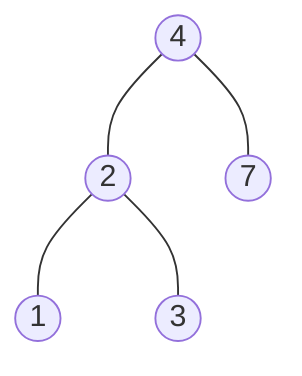

# Binary Search Tree

## Table of Contents

- [x] [98. Validate Binary Search Tree](https://leetcode.cn/problems/validate-binary-search-tree/) (Medium)
- [x] [230. Kth Smallest Element in a BST](https://leetcode.cn/problems/kth-smallest-element-in-a-bst/) (Medium)
- [x] [501. Find Mode in Binary Search Tree](https://leetcode.cn/problems/find-mode-in-binary-search-tree/) (Easy)
- [ ] [99. Recover Binary Search Tree](https://leetcode.cn/problems/recover-binary-search-tree/) (Medium)
- [x] [700. Search in a Binary Search Tree](https://leetcode.cn/problems/search-in-a-binary-search-tree/) (Easy)
- [x] [530. Minimum Absolute Difference in BST](https://leetcode.cn/problems/minimum-absolute-difference-in-bst/) (Easy)
- [ ] [783. Minimum Distance Between BST Nodes](https://leetcode.cn/problems/minimum-distance-between-bst-nodes/) (Easy)
- [ ] [1305. All Elements in Two Binary Search Trees](https://leetcode.cn/problems/all-elements-in-two-binary-search-trees/) (Medium)
- [ ] [938. Range Sum of BST](https://leetcode.cn/problems/range-sum-of-bst/) (Easy)
- [ ] [897. Increasing Order Search Tree](https://leetcode.cn/problems/increasing-order-search-tree/) (Easy)
- [ ] [2476. Closest Nodes Queries in a Binary Search Tree](https://leetcode.cn/problems/closest-nodes-queries-in-a-binary-search-tree/) (Medium)
- [ ] [653. Two Sum IV - Input is a BST](https://leetcode.cn/problems/two-sum-iv-input-is-a-bst/) (Easy)
- [ ] [1373. Maximum Sum BST in Binary Tree](https://leetcode.cn/problems/maximum-sum-bst-in-binary-tree/) (Hard)
- [ ] [1932. Merge BSTs to Create Single BST](https://leetcode.cn/problems/merge-bsts-to-create-single-bst/) (Hard)
- [ ] [285. Inorder Successor in BST](https://leetcode.cn/problems/inorder-successor-in-bst/) (Medium) 👑
- [ ] [510. Inorder Successor in BST II](https://leetcode.cn/problems/inorder-successor-in-bst-ii/) (Medium) 👑
- [ ] [270. Closest Binary Search Tree Value](https://leetcode.cn/problems/closest-binary-search-tree-value/) (Easy) 👑
- [ ] [272. Closest Binary Search Tree Value II](https://leetcode.cn/problems/closest-binary-search-tree-value-ii/) (Hard) 👑
- [x] [255. Verify Preorder Sequence in Binary Search Tree](https://leetcode.cn/problems/verify-preorder-sequence-in-binary-search-tree/) (Medium) 👑
- [ ] [1902. Depth of BST Given Insertion Order](https://leetcode.cn/problems/depth-of-bst-given-insertion-order/) (Medium) 👑

## 98. Validate Binary Search Tree

-   [LeetCode](https://leetcode.com/problems/validate-binary-search-tree/) | [LeetCode CH](https://leetcode.cn/problems/validate-binary-search-tree/) (Medium)

-   Tags: tree, depth first search, binary search tree, binary tree
```python title="98. Validate Binary Search Tree - Python Solution"
from itertools import pairwise
from math import inf
from typing import Optional

from binarytree import Node as TreeNode
from binarytree import build


def isValidBST1(root: Optional[TreeNode]) -> bool:
    inorder = []  # inorder traversal

    def dfs(node):
        if not node:
            return None
        dfs(node.left)
        inorder.append(node.val)
        dfs(node.right)

    dfs(root)

    for a, b in pairwise(inorder):
        if a >= b:
            return False

    return True


def isValidBST2(root: Optional[TreeNode]) -> bool:
    if not root:
        return True
    pre = -inf

    def dfs(node):
        if not node:
            return True
        if not dfs(node.left):
            return False

        nonlocal pre
        if node.val <= pre:
            return False
        pre = node.val

        return dfs(node.right)

    return dfs(root)


if __name__ == "__main__":
    root = [5, 1, 4, None, None, 3, 6]
    root = build(root)
    print(root)
    #   5__
    #  /   \
    # 1     4
    #      / \
    #     3   6
    assert not isValidBST1(root)  # [1, 5, 3, 4, 6]
    assert not isValidBST2(root)  # [1, 5, 3, 4, 6]

```

```cpp title="98. Validate Binary Search Tree - C++ Solution"
#include <cassert>
#include <vector>
using namespace std;

struct TreeNode {
    int val;
    TreeNode *left;
    TreeNode *right;
    TreeNode() : val(0), left(nullptr), right(nullptr) {}
    TreeNode(int x) : val(x), left(nullptr), right(nullptr) {}
    TreeNode(int x, TreeNode *left, TreeNode *right)
        : val(x), left(left), right(right) {}
};

class Solution {
   private:
    vector<int> inorder;
    bool check(vector<int> inorder) {
        int n = inorder.size();
        if (n <= 1) return true;
        for (int i = 1; i < n; i++) {
            if (inorder[i] <= inorder[i - 1]) return false;
        }
        return true;
    }

   public:
    bool isValidBST(TreeNode *root) {
        auto dfs = [&](auto &&self, TreeNode *node) -> void {
            if (!node) return;

            self(self, node->left);
            inorder.push_back(node->val);
            self(self, node->right);
        };

        dfs(dfs, root);

        return check(inorder);
    }
};

int main() {
    Solution s;
    TreeNode *root = new TreeNode(2);
    root->left = new TreeNode(1);
    root->right = new TreeNode(3);
    assert(s.isValidBST(root) == true);

    root = new TreeNode(5);
    root->left = new TreeNode(1);
    root->right = new TreeNode(4);
    root->right->left = new TreeNode(3);
    root->right->right = new TreeNode(6);
    assert(s.isValidBST(root) == false);

    root = new TreeNode(5);
    root->left = new TreeNode(4);
    root->right = new TreeNode(6);
    root->right->left = new TreeNode(3);
    root->right->right = new TreeNode(7);
    assert(s.isValidBST(root) == false);

    return 0;
}
```

## 230. Kth Smallest Element in a BST

-   [LeetCode](https://leetcode.com/problems/kth-smallest-element-in-a-bst/) | [LeetCode CH](https://leetcode.cn/problems/kth-smallest-element-in-a-bst/) (Medium)

-   Tags: tree, depth first search, binary search tree, binary tree
```python title="230. Kth Smallest Element in a BST - Python Solution"
from typing import Optional

from binarytree import Node as TreeNode
from binarytree import build


# Recursive
def kthSmallestRecursive(root: Optional[TreeNode], k: int) -> int:
    inorder = []

    def dfs(node):
        if not node:
            return None
        dfs(node.left)
        inorder.append(node.val)
        dfs(node.right)

    dfs(root)
    return inorder[k - 1]


# Iteratve
def kthSmallestIteratve(root: Optional[TreeNode], k: int) -> int:
    stack = []
    while True:
        while root:
            stack.append(root)
            root = root.left
        root = stack.pop()
        k -= 1
        if not k:
            return root.val
        root = root.right


if __name__ == "__main__":
    root = build([3, 1, 4, None, 2])
    k = 1
    assert kthSmallestRecursive(root, k) == 1
    assert kthSmallestIteratve(root, k) == 1

```

## 501. Find Mode in Binary Search Tree

-   [LeetCode](https://leetcode.com/problems/find-mode-in-binary-search-tree/) | [LeetCode CH](https://leetcode.cn/problems/find-mode-in-binary-search-tree/) (Easy)

-   Tags: tree, depth first search, binary search tree, binary tree
```python title="501. Find Mode in Binary Search Tree - Python Solution"
from typing import List, Optional

from binarytree import build


class TreeNode:
    def __init__(self, val=0, left=None, right=None):
        self.val = val
        self.left = left
        self.right = right


def findMode(root: Optional[TreeNode]) -> List[int]:
    hashmap = dict()

    def dfs(node):
        if not node:
            return None
        dfs(node.left)
        if node.val not in hashmap:
            hashmap[node.val] = 1
        else:
            hashmap[node.val] += 1
        dfs(node.right)

    dfs(root)
    max_counts = max(hashmap.values())
    result = []

    for key, value in hashmap.items():
        if value == max_counts:
            result.append(key)

    return result


root = [1, None, 2, None, None, 2]
root = build(root)
print(root)
# 1__
#    \
#     2
#    /
#   2
print(findMode(root))  # [2]

```

## 99. Recover Binary Search Tree

-   [LeetCode](https://leetcode.com/problems/recover-binary-search-tree/) | [LeetCode CH](https://leetcode.cn/problems/recover-binary-search-tree/) (Medium)

-   Tags: tree, depth first search, binary search tree, binary tree
## 700. Search in a Binary Search Tree

-   [LeetCode](https://leetcode.com/problems/search-in-a-binary-search-tree/) | [LeetCode CH](https://leetcode.cn/problems/search-in-a-binary-search-tree/) (Easy)

-   Tags: tree, binary search tree, binary tree
### Binary Search Tree

1. Binary Tree
2. Left subtree of a node contains only nodes with keys less than the node's key
3. Right subtree of a node contains only nodes with keys greater than the node's key
4. The left and right subtree each must also be a binary search tree
5. There must be no duplicate nodes
6. Inorder traversal of a BST gives a sorted list of keys



```python title="700. Search in a Binary Search Tree - Python Solution"
from typing import Optional

from binarytree import build


class TreeNode:
    def __init__(self, val=0, left=None, right=None):
        self.val = val
        self.left = left
        self.right = right


# 1. Recursive
def searchBSTRecursive(
    root: Optional[TreeNode], val: int
) -> Optional[TreeNode]:
    if not root:
        return None

    if root.val > val:
        return searchBSTRecursive(root.left, val)

    elif root.val < val:
        return searchBSTRecursive(root.right, val)

    else:
        return root


# 2. Iterative
def searchBSTIterative(
    root: Optional[TreeNode], val: int
) -> Optional[TreeNode]:
    while root:
        if root.val > val:
            root = root.left
        elif root.val < val:
            root = root.right
        else:
            return root
    return None


root = [4, 2, 7, 1, 3]
val = 2
root = build(root)
print(root)
#     __4
#    /   \
#   2     7
#  / \
# 1   3
print(searchBSTRecursive(root, val))
#   2
#  / \
# 1   3
print(searchBSTIterative(root, val))
#   2
#  / \
# 1   3

```

## 530. Minimum Absolute Difference in BST

-   [LeetCode](https://leetcode.com/problems/minimum-absolute-difference-in-bst/) | [LeetCode CH](https://leetcode.cn/problems/minimum-absolute-difference-in-bst/) (Easy)

-   Tags: tree, depth first search, breadth first search, binary search tree, binary tree
```python title="530. Minimum Absolute Difference in BST - Python Solution"
from typing import Optional

from binarytree import build


class TreeNode:
    def __init__(self, val=0, left=None, right=None):
        self.val = val
        self.left = left
        self.right = right


def getMinimumDifference(root: Optional[TreeNode]) -> int:
    res = float("inf")
    pre = float("-inf")

    def dfs(node):  # inorder traversal
        if not node:
            return

        dfs(node.left)

        nonlocal res, pre
        res = min(res, node.val - pre)
        pre = node.val

        if res == 1:  # the minimum possible difference
            return

        dfs(node.right)

    dfs(root)

    return res


if __name__ == "__main__":
    root = [4, 2, 6, 1, 3]
    root = build(root)
    print(root)
    #     __4
    #    /   \
    #   2     6
    #  / \
    # 1   3
    assert getMinimumDifference(root) == 1

```

## 783. Minimum Distance Between BST Nodes

-   [LeetCode](https://leetcode.com/problems/minimum-distance-between-bst-nodes/) | [LeetCode CH](https://leetcode.cn/problems/minimum-distance-between-bst-nodes/) (Easy)

-   Tags: tree, depth first search, breadth first search, binary search tree, binary tree
## 1305. All Elements in Two Binary Search Trees

-   [LeetCode](https://leetcode.com/problems/all-elements-in-two-binary-search-trees/) | [LeetCode CH](https://leetcode.cn/problems/all-elements-in-two-binary-search-trees/) (Medium)

-   Tags: tree, depth first search, binary search tree, sorting, binary tree
## 938. Range Sum of BST

-   [LeetCode](https://leetcode.com/problems/range-sum-of-bst/) | [LeetCode CH](https://leetcode.cn/problems/range-sum-of-bst/) (Easy)

-   Tags: tree, depth first search, binary search tree, binary tree
## 897. Increasing Order Search Tree

-   [LeetCode](https://leetcode.com/problems/increasing-order-search-tree/) | [LeetCode CH](https://leetcode.cn/problems/increasing-order-search-tree/) (Easy)

-   Tags: stack, tree, depth first search, binary search tree, binary tree
## 2476. Closest Nodes Queries in a Binary Search Tree

-   [LeetCode](https://leetcode.com/problems/closest-nodes-queries-in-a-binary-search-tree/) | [LeetCode CH](https://leetcode.cn/problems/closest-nodes-queries-in-a-binary-search-tree/) (Medium)

-   Tags: array, binary search, tree, depth first search, binary search tree, binary tree
## 653. Two Sum IV - Input is a BST

-   [LeetCode](https://leetcode.com/problems/two-sum-iv-input-is-a-bst/) | [LeetCode CH](https://leetcode.cn/problems/two-sum-iv-input-is-a-bst/) (Easy)

-   Tags: hash table, two pointers, tree, depth first search, breadth first search, binary search tree, binary tree
## 1373. Maximum Sum BST in Binary Tree

-   [LeetCode](https://leetcode.com/problems/maximum-sum-bst-in-binary-tree/) | [LeetCode CH](https://leetcode.cn/problems/maximum-sum-bst-in-binary-tree/) (Hard)

-   Tags: dynamic programming, tree, depth first search, binary search tree, binary tree
## 1932. Merge BSTs to Create Single BST

-   [LeetCode](https://leetcode.com/problems/merge-bsts-to-create-single-bst/) | [LeetCode CH](https://leetcode.cn/problems/merge-bsts-to-create-single-bst/) (Hard)

-   Tags: hash table, binary search, tree, depth first search, binary tree
## 285. Inorder Successor in BST

-   [LeetCode](https://leetcode.com/problems/inorder-successor-in-bst/) | [LeetCode CH](https://leetcode.cn/problems/inorder-successor-in-bst/) (Medium)

-   Tags: tree, depth first search, binary search tree, binary tree
## 510. Inorder Successor in BST II

-   [LeetCode](https://leetcode.com/problems/inorder-successor-in-bst-ii/) | [LeetCode CH](https://leetcode.cn/problems/inorder-successor-in-bst-ii/) (Medium)

-   Tags: tree, binary search tree, binary tree
## 270. Closest Binary Search Tree Value

-   [LeetCode](https://leetcode.com/problems/closest-binary-search-tree-value/) | [LeetCode CH](https://leetcode.cn/problems/closest-binary-search-tree-value/) (Easy)

-   Tags: binary search, tree, depth first search, binary search tree, binary tree
## 272. Closest Binary Search Tree Value II

-   [LeetCode](https://leetcode.com/problems/closest-binary-search-tree-value-ii/) | [LeetCode CH](https://leetcode.cn/problems/closest-binary-search-tree-value-ii/) (Hard)

-   Tags: two pointers, stack, tree, depth first search, binary search tree, heap priority queue, binary tree
## 255. Verify Preorder Sequence in Binary Search Tree

-   [LeetCode](https://leetcode.com/problems/verify-preorder-sequence-in-binary-search-tree/) | [LeetCode CH](https://leetcode.cn/problems/verify-preorder-sequence-in-binary-search-tree/) (Medium)

-   Tags: array, stack, tree, binary search tree, recursion, monotonic stack, binary tree
```python title="255. Verify Preorder Sequence in Binary Search Tree - Python Solution"
from typing import List


# BST
def verifyPreorder(preorder: List[int]) -> bool:
    stack = []
    low = float("-inf")

    for value in preorder:
        if value < low:
            return False
        while stack and value > stack[-1]:
            low = stack.pop()
        stack.append(value)

    return True


if __name__ == "__main__":
    assert verifyPreorder([8, 5, 1, 7, 10, 12]) is True
    assert verifyPreorder([8, 5, 4, 3, 2, 1]) is True

```

## 1902. Depth of BST Given Insertion Order

-   [LeetCode](https://leetcode.com/problems/depth-of-bst-given-insertion-order/) | [LeetCode CH](https://leetcode.cn/problems/depth-of-bst-given-insertion-order/) (Medium)

-   Tags: array, tree, binary search tree, binary tree, ordered set
