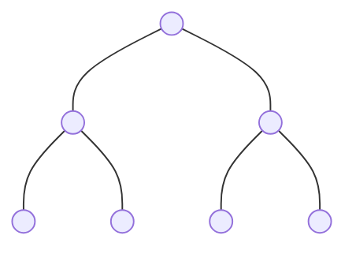
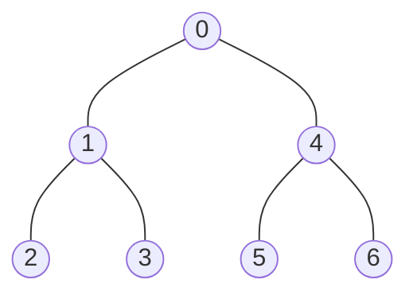
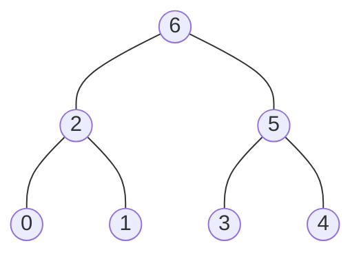
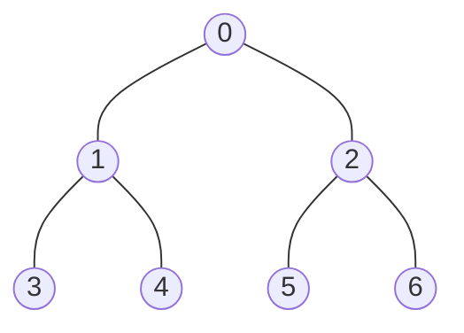

# Binary Tree Traversal

## Table of Contents

- [x] [144. Binary Tree Preorder Traversal](https://leetcode.cn/problems/binary-tree-preorder-traversal/) (Easy)
- [x] [94. Binary Tree Inorder Traversal](https://leetcode.cn/problems/binary-tree-inorder-traversal/) (Easy)
- [x] [145. Binary Tree Postorder Traversal](https://leetcode.cn/problems/binary-tree-postorder-traversal/) (Easy)
- [x] [872. Leaf-Similar Trees](https://leetcode.cn/problems/leaf-similar-trees/) (Easy)
- [x] [404. Sum of Left Leaves](https://leetcode.cn/problems/sum-of-left-leaves/) (Easy)
- [ ] [671. Second Minimum Node In a Binary Tree](https://leetcode.cn/problems/second-minimum-node-in-a-binary-tree/) (Easy)
- [ ] [1469. Find All The Lonely Nodes](https://leetcode.cn/problems/find-all-the-lonely-nodes/) (Easy) 👑
- [ ] [1214. Two Sum BSTs](https://leetcode.cn/problems/two-sum-bsts/) (Medium) 👑
- [ ] [2764. Is Array a Preorder of Some ‌Binary Tree](https://leetcode.cn/problems/is-array-a-preorder-of-some-binary-tree/) (Medium) 👑

## 144. Binary Tree Preorder Traversal

-   [LeetCode](https://leetcode.com/problems/binary-tree-preorder-traversal/) | [LeetCode CH](https://leetcode.cn/problems/binary-tree-preorder-traversal/) (Easy)

-   Tags: stack, tree, depth first search, binary tree


### Example 1



Pre-order Traversal



In-order Traversal


Post-order Traversal



Level Order Traversal


### Example 2



| Traversal   | Order             | Method         | Result                        |
| ----------- | ----------------- | -------------- | ----------------------------- |
| Preorder    | Root, Left, Right | DFS or Stack   | `[0, 1, 3, 4, 2, 5, 6]`       |
| Inorder     | Left, Root, Right | DFS or Stack   | `[3, 1, 4, 0, 5, 2, 6]`       |
| Postorder   | Left, Right, Root | DFS or Stack   | `[3, 4, 1, 5, 6, 2, 0]`       |
| Level Order | Level by Level    | BFS with Queue | `[[0], [1, 2], [3, 4, 5, 6]]` |


```python title="144. Binary Tree Preorder Traversal - Python Solution"
from typing import List, Optional

from binarytree import Node as TreeNode
from binarytree import build


# Recursive
def preorderTraversalRecursive(root: Optional[TreeNode]) -> List[int]:
    res = []

    def dfs(node):
        if not node:
            return None

        res.append(node.val)  # <--
        dfs(node.left)
        dfs(node.right)

    dfs(root)

    return res


# Iterative
def preorderTraversalIterative(root: Optional[TreeNode]) -> List[int]:
    if not root:
        return []

    stack = [root]
    res = []

    while stack:
        node = stack.pop()
        res.append(node.val)

        if node.right:
            stack.append(node.right)
        if node.left:
            stack.append(node.left)

    return res


tree = build([0, 1, 2, 3, 4, 5, 6])
print(tree)
#     __0__
#    /     \
#   1       2
#  / \     / \
# 3   4   5   6
print(preorderTraversalRecursive(tree))  # [0, 1, 3, 4, 2, 5, 6]
print(preorderTraversalIterative(tree))  # [0, 1, 3, 4, 2, 5, 6]

```

## 94. Binary Tree Inorder Traversal

-   [LeetCode](https://leetcode.com/problems/binary-tree-inorder-traversal/) | [LeetCode CH](https://leetcode.cn/problems/binary-tree-inorder-traversal/) (Easy)

-   Tags: stack, tree, depth first search, binary tree

```python title="94. Binary Tree Inorder Traversal - Python Solution"
from typing import List, Optional

from binarytree import Node as TreeNode
from binarytree import build


# Recursive
def inorderTraversalRecursive(root: TreeNode) -> List[int]:
    res = []

    def dfs(node):
        if not node:
            return

        dfs(node.left)
        res.append(node.val)  # <--
        dfs(node.right)

    dfs(root)

    return res


# Iterative
def inorderTraversalIterative(root: Optional[TreeNode]) -> List[int]:
    if not root:
        return []

    stack = []
    res = []
    cur = root

    while cur or stack:
        if cur:
            stack.append(cur)
            cur = cur.left
        else:
            cur = stack.pop()
            res.append(cur.val)
            cur = cur.right

    return res


tree = build([0, 1, 2, 3, 4, 5, 6])
print(tree)
#     __0__
#    /     \
#   1       2
#  / \     / \
# 3   4   5   6
print(inorderTraversalRecursive(tree))  # [3, 1, 4, 0, 5, 2, 6]
print(inorderTraversalIterative(tree))  # [3, 1, 4, 0, 5, 2, 6]

```

## 145. Binary Tree Postorder Traversal

-   [LeetCode](https://leetcode.com/problems/binary-tree-postorder-traversal/) | [LeetCode CH](https://leetcode.cn/problems/binary-tree-postorder-traversal/) (Easy)

-   Tags: stack, tree, depth first search, binary tree

```python title="145. Binary Tree Postorder Traversal - Python Solution"
from typing import List, Optional

from binarytree import Node as TreeNode
from binarytree import build


# Recursive
def postorderTraversalRecursive(root: Optional[TreeNode]) -> List[int]:
    res = []

    def dfs(node):
        if not node:
            return

        dfs(node.left)
        dfs(node.right)
        res.append(node.val)  # <--

    dfs(root)

    return res


# Iterative
def postorderTraversalIterative(root: Optional[TreeNode]) -> List[int]:
    if not root:
        return []

    res = []
    stack = [root]

    while stack:
        node = stack.pop()
        res.append(node.val)

        if node.left:
            stack.append(node.left)
        if node.right:
            stack.append(node.right)

    return res[::-1]


tree = build([0, 1, 2, 3, 4, 5, 6])
print(tree)
#     __0__
#    /     \
#   1       2
#  / \     / \
# 3   4   5   6
print(postorderTraversalRecursive(tree))  # [3, 4, 1, 5, 6, 2, 0]
print(postorderTraversalIterative(tree))  # [3, 4, 1, 5, 6, 2, 0]

```

## 872. Leaf-Similar Trees

-   [LeetCode](https://leetcode.com/problems/leaf-similar-trees/) | [LeetCode CH](https://leetcode.cn/problems/leaf-similar-trees/) (Easy)

-   Tags: tree, depth first search, binary tree

```python title="872. Leaf-Similar Trees - Python Solution"
from typing import Optional

from binarytree import Node as TreeNode
from binarytree import build


# Tree
def leafSimilar(root1: Optional[TreeNode], root2: Optional[TreeNode]) -> bool:

    def dfs(node, leaf):
        if not node:
            return
        if not node.left and not node.right:
            leaf.append(node.val)
        dfs(node.left, leaf)
        dfs(node.right, leaf)

    leaf1, leaf2 = [], []
    dfs(root1, leaf1)
    dfs(root2, leaf2)

    return leaf1 == leaf2


root1 = [3, 5, 1, 6, 2, 9, 8, None, None, 7, 4]
root2 = [3, 5, 1, 6, 7, 4, 2, None, None, None, None, None, None, 9, 8]
root1 = build(root1)

root2 = build(root2)
print(root1)
#     ______3__
#    /         \
#   5__         1
#  /   \       / \
# 6     2     9   8
#      / \
#     7   4
print(root2)
#     __3__
#    /     \
#   5       1__
#  / \     /   \
# 6   7   4     2
#              / \
#             9   8
print(leafSimilar(root1, root2))  # True

```

## 404. Sum of Left Leaves

-   [LeetCode](https://leetcode.com/problems/sum-of-left-leaves/) | [LeetCode CH](https://leetcode.cn/problems/sum-of-left-leaves/) (Easy)

-   Tags: tree, depth first search, breadth first search, binary tree

```python title="404. Sum of Left Leaves - Python Solution"
from typing import Optional

from binarytree import build


class TreeNode:
    def __init__(self, val=0, left=None, right=None):
        self.val = val
        self.left = left
        self.right = right


# Iterative
def sumOfLeftLeaves(root: Optional[TreeNode]) -> int:
    if not root:
        return 0

    stack = [root]
    sumLL = 0

    while stack:
        node = stack.pop()

        if node.left and not node.left.left and not node.left.right:
            sumLL += node.left.val

        if node.right:
            stack.append(node.right)
        if node.left:
            stack.append(node.left)

    return sumLL


# Left Leave None:
#   - node.left is not None
#   - node.left.left is None
#   - node.left.right is None

root = build([3, 9, 20, None, None, 15, 7])
print(root)
#   3___
#  /    \
# 9     _20
#      /   \
#     15    7
print(sumOfLeftLeaves(root))  # 24

```

## 671. Second Minimum Node In a Binary Tree

-   [LeetCode](https://leetcode.com/problems/second-minimum-node-in-a-binary-tree/) | [LeetCode CH](https://leetcode.cn/problems/second-minimum-node-in-a-binary-tree/) (Easy)

-   Tags: tree, depth first search, binary tree
## 1469. Find All The Lonely Nodes

-   [LeetCode](https://leetcode.com/problems/find-all-the-lonely-nodes/) | [LeetCode CH](https://leetcode.cn/problems/find-all-the-lonely-nodes/) (Easy)

-   Tags: tree, depth first search, breadth first search, binary tree
## 1214. Two Sum BSTs

-   [LeetCode](https://leetcode.com/problems/two-sum-bsts/) | [LeetCode CH](https://leetcode.cn/problems/two-sum-bsts/) (Medium)

-   Tags: two pointers, binary search, stack, tree, depth first search, binary search tree, binary tree
## 2764. Is Array a Preorder of Some ‌Binary Tree

-   [LeetCode](https://leetcode.com/problems/is-array-a-preorder-of-some-binary-tree/) | [LeetCode CH](https://leetcode.cn/problems/is-array-a-preorder-of-some-binary-tree/) (Medium)

-   Tags: stack, tree, depth first search, binary tree
