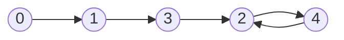

# Bit Others

## Table of Contents

- [x] [136. Single Number](https://leetcode.cn/problems/single-number/) (Easy)
- [x] [287. Find the Duplicate Number](https://leetcode.cn/problems/find-the-duplicate-number/) (Medium)
- [ ] [260. Single Number III](https://leetcode.cn/problems/single-number-iii/) (Medium)
- [ ] [2965. Find Missing and Repeated Values](https://leetcode.cn/problems/find-missing-and-repeated-values/) (Easy)
- [ ] [137. Single Number II](https://leetcode.cn/problems/single-number-ii/) (Medium)
- [ ] [645. Set Mismatch](https://leetcode.cn/problems/set-mismatch/) (Easy)
- [x] [190. Reverse Bits](https://leetcode.cn/problems/reverse-bits/) (Easy)
- [x] [371. Sum of Two Integers](https://leetcode.cn/problems/sum-of-two-integers/) (Medium)
- [ ] [201. Bitwise AND of Numbers Range](https://leetcode.cn/problems/bitwise-and-of-numbers-range/) (Medium)
- [ ] [2154. Keep Multiplying Found Values by Two](https://leetcode.cn/problems/keep-multiplying-found-values-by-two/) (Easy)
- [ ] [2044. Count Number of Maximum Bitwise-OR Subsets](https://leetcode.cn/problems/count-number-of-maximum-bitwise-or-subsets/) (Medium)
- [ ] [2438. Range Product Queries of Powers](https://leetcode.cn/problems/range-product-queries-of-powers/) (Medium)
- [ ] [1680. Concatenation of Consecutive Binary Numbers](https://leetcode.cn/problems/concatenation-of-consecutive-binary-numbers/) (Medium)
- [ ] [1261. Find Elements in a Contaminated Binary Tree](https://leetcode.cn/problems/find-elements-in-a-contaminated-binary-tree/) (Medium)
- [ ] [89. Gray Code](https://leetcode.cn/problems/gray-code/) (Medium)
- [ ] [1238. Circular Permutation in Binary Representation](https://leetcode.cn/problems/circular-permutation-in-binary-representation/) (Medium)
- [ ] [982. Triples with Bitwise AND Equal To Zero](https://leetcode.cn/problems/triples-with-bitwise-and-equal-to-zero/) (Hard)
- [ ] [3307. Find the K-th Character in String Game II](https://leetcode.cn/problems/find-the-k-th-character-in-string-game-ii/) (Hard)
- [ ] [1611. Minimum One Bit Operations to Make Integers Zero](https://leetcode.cn/problems/minimum-one-bit-operations-to-make-integers-zero/) (Hard)
- [ ] [751. IP to CIDR](https://leetcode.cn/problems/ip-to-cidr/) (Medium) 👑
- [ ] [3141. Maximum Hamming Distances](https://leetcode.cn/problems/maximum-hamming-distances/) (Hard) 👑

## 136. Single Number

-   [LeetCode](https://leetcode.com/problems/single-number/) | [LeetCode CH](https://leetcode.cn/problems/single-number/) (Easy)

-   Tags: array, bit manipulation

```python title="136. Single Number - Python Solution"
from functools import reduce
from operator import xor
from typing import List


# XOR
def singleNumber(nums: List[int]) -> int:
    res = 0
    for num in nums:
        res ^= num
    return res


# XOR
def singleNumberXOR(nums: List[int]) -> int:
    return reduce(xor, nums)


# XOR
def singleNumberXORLambda(nums: List[int]) -> int:
    return reduce(lambda x, y: x ^ y, nums)


nums = [4, 1, 2, 1, 2]
print(singleNumber(nums))  # 4
print(singleNumberXOR(nums))  # 4
print(singleNumberXORLambda(nums))  # 4

```

## 287. Find the Duplicate Number

-   [LeetCode](https://leetcode.com/problems/find-the-duplicate-number/) | [LeetCode CH](https://leetcode.cn/problems/find-the-duplicate-number/) (Medium)

-   Tags: array, two pointers, binary search, bit manipulation
-   Find the duplicate number in an array containing `n + 1` integers where each integer is between `1` and `n` inclusive.
-   Floyd's Tortoise and Hare (Cycle Detection)
    -   141. Linked List Cycle
    -   142. Linked List Cycle II
-   Time Complexity: O(n)
-   Space Complexity: O(1)

Example: `nums = [1, 3, 4, 2, 2]`

|  0   |  1   |  2   |  3   |  4   |
| :--: | :--: | :--: | :--: | :--: |
|  1   |  3   |  4   |  2   |  2   |





```python title="287. Find the Duplicate Number - Python Solution"
from typing import List


# Floyd Cycle Detection Algorithm
def findDuplicate(nums: List[int]) -> int:
    fast, slow = nums[0], nums[0]

    while True:
        slow = nums[slow]
        fast = nums[nums[fast]]
        if slow == fast:
            break

    slow = nums[0]
    while slow != fast:
        slow = nums[slow]
        fast = nums[fast]

    return slow


nums = [1, 3, 4, 2, 2]
print(findDuplicate(nums))  # 2

```

## 260. Single Number III

-   [LeetCode](https://leetcode.com/problems/single-number-iii/) | [LeetCode CH](https://leetcode.cn/problems/single-number-iii/) (Medium)

-   Tags: array, bit manipulation
## 2965. Find Missing and Repeated Values

-   [LeetCode](https://leetcode.com/problems/find-missing-and-repeated-values/) | [LeetCode CH](https://leetcode.cn/problems/find-missing-and-repeated-values/) (Easy)

-   Tags: array, hash table, math, matrix
## 137. Single Number II

-   [LeetCode](https://leetcode.com/problems/single-number-ii/) | [LeetCode CH](https://leetcode.cn/problems/single-number-ii/) (Medium)

-   Tags: array, bit manipulation
## 645. Set Mismatch

-   [LeetCode](https://leetcode.com/problems/set-mismatch/) | [LeetCode CH](https://leetcode.cn/problems/set-mismatch/) (Easy)

-   Tags: array, hash table, bit manipulation, sorting
## 190. Reverse Bits

-   [LeetCode](https://leetcode.com/problems/reverse-bits/) | [LeetCode CH](https://leetcode.cn/problems/reverse-bits/) (Easy)

-   Tags: divide and conquer, bit manipulation

```python title="190. Reverse Bits - Python Solution"
# Bit Manipulation
def reverseBits(n: int) -> int:
    res = 0

    for i in range(32):
        res = (res << 1) | (n & 1)
        n >>= 1

    return res


n = 0b00000010100101000001111010011100
print(reverseBits(n))  # 964176192

```

## 371. Sum of Two Integers

-   [LeetCode](https://leetcode.com/problems/sum-of-two-integers/) | [LeetCode CH](https://leetcode.cn/problems/sum-of-two-integers/) (Medium)

-   Tags: math, bit manipulation

```python title="371. Sum of Two Integers - Python Solution"
# Bit Manipulation
def getSum(a: int, b: int) -> int:
    MASK = 0xFFFFFFFF
    MAX_INT = 0x7FFFFFFF

    while b != 0:
        temp = (a ^ b) & MASK
        b = ((a & b) << 1) & MASK
        a = temp

    return a if a <= MAX_INT else ~(a ^ MASK)


print(getSum(1, 2))  # 3

```

## 201. Bitwise AND of Numbers Range

-   [LeetCode](https://leetcode.com/problems/bitwise-and-of-numbers-range/) | [LeetCode CH](https://leetcode.cn/problems/bitwise-and-of-numbers-range/) (Medium)

-   Tags: bit manipulation
## 2154. Keep Multiplying Found Values by Two

-   [LeetCode](https://leetcode.com/problems/keep-multiplying-found-values-by-two/) | [LeetCode CH](https://leetcode.cn/problems/keep-multiplying-found-values-by-two/) (Easy)

-   Tags: array, hash table, sorting, simulation
## 2044. Count Number of Maximum Bitwise-OR Subsets

-   [LeetCode](https://leetcode.com/problems/count-number-of-maximum-bitwise-or-subsets/) | [LeetCode CH](https://leetcode.cn/problems/count-number-of-maximum-bitwise-or-subsets/) (Medium)

-   Tags: array, backtracking, bit manipulation, enumeration
## 2438. Range Product Queries of Powers

-   [LeetCode](https://leetcode.com/problems/range-product-queries-of-powers/) | [LeetCode CH](https://leetcode.cn/problems/range-product-queries-of-powers/) (Medium)

-   Tags: array, bit manipulation, prefix sum
## 1680. Concatenation of Consecutive Binary Numbers

-   [LeetCode](https://leetcode.com/problems/concatenation-of-consecutive-binary-numbers/) | [LeetCode CH](https://leetcode.cn/problems/concatenation-of-consecutive-binary-numbers/) (Medium)

-   Tags: math, bit manipulation, simulation
## 1261. Find Elements in a Contaminated Binary Tree

-   [LeetCode](https://leetcode.com/problems/find-elements-in-a-contaminated-binary-tree/) | [LeetCode CH](https://leetcode.cn/problems/find-elements-in-a-contaminated-binary-tree/) (Medium)

-   Tags: hash table, tree, depth first search, breadth first search, design, binary tree
## 89. Gray Code

-   [LeetCode](https://leetcode.com/problems/gray-code/) | [LeetCode CH](https://leetcode.cn/problems/gray-code/) (Medium)

-   Tags: math, backtracking, bit manipulation
## 1238. Circular Permutation in Binary Representation

-   [LeetCode](https://leetcode.com/problems/circular-permutation-in-binary-representation/) | [LeetCode CH](https://leetcode.cn/problems/circular-permutation-in-binary-representation/) (Medium)

-   Tags: math, backtracking, bit manipulation
## 982. Triples with Bitwise AND Equal To Zero

-   [LeetCode](https://leetcode.com/problems/triples-with-bitwise-and-equal-to-zero/) | [LeetCode CH](https://leetcode.cn/problems/triples-with-bitwise-and-equal-to-zero/) (Hard)

-   Tags: array, hash table, bit manipulation
## 3307. Find the K-th Character in String Game II

-   [LeetCode](https://leetcode.com/problems/find-the-k-th-character-in-string-game-ii/) | [LeetCode CH](https://leetcode.cn/problems/find-the-k-th-character-in-string-game-ii/) (Hard)

-   Tags: math, bit manipulation, recursion
## 1611. Minimum One Bit Operations to Make Integers Zero

-   [LeetCode](https://leetcode.com/problems/minimum-one-bit-operations-to-make-integers-zero/) | [LeetCode CH](https://leetcode.cn/problems/minimum-one-bit-operations-to-make-integers-zero/) (Hard)

-   Tags: dynamic programming, bit manipulation, memoization
## 751. IP to CIDR

-   [LeetCode](https://leetcode.com/problems/ip-to-cidr/) | [LeetCode CH](https://leetcode.cn/problems/ip-to-cidr/) (Medium)

-   Tags: string, bit manipulation
## 3141. Maximum Hamming Distances

-   [LeetCode](https://leetcode.com/problems/maximum-hamming-distances/) | [LeetCode CH](https://leetcode.cn/problems/maximum-hamming-distances/) (Hard)

-   Tags: array, bit manipulation, breadth first search
