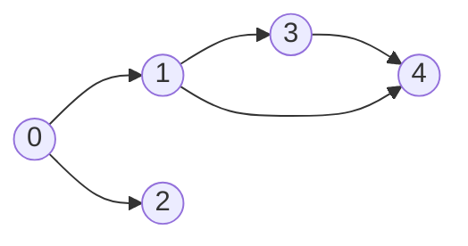
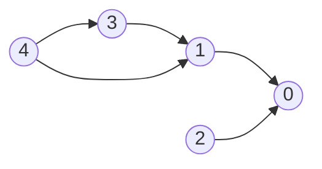
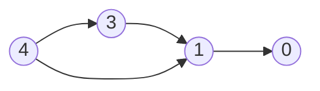
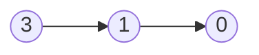
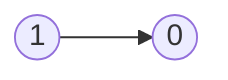

# DFS Basics

- [x] [547. Number of Provinces](https://leetcode.cn/problems/number-of-provinces/) (Medium)
- [x] [1971. Find if Path Exists in Graph](https://leetcode.cn/problems/find-if-path-exists-in-graph/) (Easy)
- [x] [797. All Paths From Source to Target](https://leetcode.cn/problems/all-paths-from-source-to-target/) (Medium)
- [x] [841. Keys and Rooms](https://leetcode.cn/problems/keys-and-rooms/) (Medium)
- [x] [2316. Count Unreachable Pairs of Nodes in an Undirected Graph](https://leetcode.cn/problems/count-unreachable-pairs-of-nodes-in-an-undirected-graph/) (Medium)
- [x] [1319. Number of Operations to Make Network Connected](https://leetcode.cn/problems/number-of-operations-to-make-network-connected/) (Medium)
- [x] [2492. Minimum Score of a Path Between Two Cities](https://leetcode.cn/problems/minimum-score-of-a-path-between-two-cities/) (Medium)
- [ ] [3387. Maximize Amount After Two Days of Conversions](https://leetcode.cn/problems/maximize-amount-after-two-days-of-conversions/) (Medium)
- [ ] [3310. Remove Methods From Project](https://leetcode.cn/problems/remove-methods-from-project/) (Medium)
- [ ] [2685. Count the Number of Complete Components](https://leetcode.cn/problems/count-the-number-of-complete-components/) (Medium)
- [ ] [2192. All Ancestors of a Node in a Directed Acyclic Graph](https://leetcode.cn/problems/all-ancestors-of-a-node-in-a-directed-acyclic-graph/) (Medium)
- [x] [924. Minimize Malware Spread](https://leetcode.cn/problems/minimize-malware-spread/) (Hard)
- [ ] [2101. Detonate the Maximum Bombs](https://leetcode.cn/problems/detonate-the-maximum-bombs/) (Medium)
- [x] [721. Accounts Merge](https://leetcode.cn/problems/accounts-merge/) (Medium)
- [x] [207. Course Schedule](https://leetcode.cn/problems/course-schedule/) (Medium)
- [x] [802. Find Eventual Safe States](https://leetcode.cn/problems/find-eventual-safe-states/) (Medium)
- [ ] [928. Minimize Malware Spread II](https://leetcode.cn/problems/minimize-malware-spread-ii/) (Hard)
- [ ] [2092. Find All People With Secret](https://leetcode.cn/problems/find-all-people-with-secret/) (Hard)
- [ ] [3108. Minimum Cost Walk in Weighted Graph](https://leetcode.cn/problems/minimum-cost-walk-in-weighted-graph/) (Hard)
- [x] [261. Graph Valid Tree](https://leetcode.cn/problems/graph-valid-tree/) (Medium) 👑
- [x] [323. Number of Connected Components in an Undirected Graph](https://leetcode.cn/problems/number-of-connected-components-in-an-undirected-graph/) (Medium) 👑

## 547. Number of Provinces

-   [LeetCode](https://leetcode.com/problems/number-of-provinces/) | [LeetCode CH](https://leetcode.cn/problems/number-of-provinces/) (Medium)

-   Tags: depth first search, breadth first search, union find, graph
-   Return the number of provinces.

### Union Find

-   Find by Path Compression
-   Union by Rank
-   Time Complexity: O(log(n))
-   Space Complexity: O(n)

```python title="template/union_find.py"
--8<-- "template/union_find.py"
```

```python title="547. Number of Provinces - Python Solution"
from collections import defaultdict, deque
from typing import List

from template import UnionFind


# DFS (Adjacency Matrix)
def findCircleNumDFSMatrix(isConnected: List[List[int]]) -> int:
    n = len(isConnected)
    visited = set()

    def dfs(node):
        if node in visited:
            return
        visited.add(node)
        for neighbor in range(n):
            if node != neighbor and isConnected[node][neighbor] == 1:
                dfs(neighbor)

    res = 0
    for i in range(n):
        if i not in visited:
            dfs(i)
            res += 1

    return res


# DFS (Adjacency List)
def findCircleNumDFSList(isConnected: List[List[int]]) -> int:
    graph = defaultdict(list)
    n = len(isConnected)

    for i in range(n):
        for j in range(i + 1, n):
            if isConnected[i][j] == 1:
                graph[i].append(j)
                graph[j].append(i)

    visited = set()

    def dfs(node):
        if node in visited:
            return
        visited.add(node)
        for neighbor in graph[node]:
            dfs(neighbor)

    res = 0
    for i in range(n):
        if i not in visited:
            dfs(i)
            res += 1

    return res


# BFS (Adjacency Matrix)
def findCircleNumBFS(isConnected: List[List[int]]) -> int:
    n = len(isConnected)
    visited = set()
    q = deque()
    res = 0

    for i in range(n):
        if i not in visited:
            res += 1

            q.append(i)
            while q:
                node = q.popleft()
                visited.add(node)
                for node, val in enumerate(isConnected[node]):
                    if val == 1 and node not in visited:
                        q.append(node)
                        visited.add(node)

    return res


# Union Find
def findCircleNumUF(isConnected: List[List[int]]) -> int:
    n = len(isConnected)
    uf = UnionFind(n)

    for i in range(n):
        for j in range(i + 1, n):
            if isConnected[i][j] == 1:
                uf.union(i, j)

    res = len(set(uf.find(i) for i in range(n)))

    return res


# Union Find
def findCircleNum(isConnected: List[List[int]]) -> int:
    n = len(isConnected)
    par = {i: i for i in range(n)}
    rank = {i: 0 for i in range(n)}

    def find(n):
        p = par[n]
        while par[p] != p:
            par[p] = par[par[p]]
            p = par[p]
        return p

    def union(n1, n2):
        p1, p2 = find(n1), find(n2)

        if p1 == p2:
            return None

        if rank[p1] > rank[p2]:
            par[p2] = p1
        elif rank[p1] < rank[p2]:
            par[p1] = p2
        else:
            par[p2] = p1
            rank[p1] += 1

    for i in range(n):
        for j in range(i + 1, n):
            if isConnected[i][j] == 1:
                union(i, j)

    res = len(set(find(i) for i in range(n)))

    return res


isConnected = [[1, 1, 0], [1, 1, 0], [0, 0, 1]]
print(findCircleNumDFSList(isConnected))  # 2
print(findCircleNumDFSMatrix(isConnected))  # 2
print(findCircleNumBFS(isConnected))  # 2
print(findCircleNum(isConnected))  # 2
print(findCircleNumUF(isConnected))  # 2

```

## 1971. Find if Path Exists in Graph

-   [LeetCode](https://leetcode.com/problems/find-if-path-exists-in-graph/) | [LeetCode CH](https://leetcode.cn/problems/find-if-path-exists-in-graph/) (Easy)

-   Tags: depth first search, breadth first search, union find, graph

```python title="1971. Find if Path Exists in Graph - Python Solution"
from collections import defaultdict
from typing import List


# DFS (Adjacency List)
def validPathDFS(
    n: int, edges: List[List[int]], source: int, destination: int
) -> bool:
    if not edges and source != destination:
        return False

    graph = defaultdict(list)
    for u, v in edges:
        graph[u].append(v)
        graph[v].append(u)

    visited = set()

    def dfs(node):
        if node == destination:
            return True

        visited.add(node)

        for neighbor in graph[node]:
            if neighbor not in visited:
                if dfs(neighbor):
                    return True

        return False

    return dfs(source)


n = 3
edges = [[0, 1], [1, 2], [2, 0]]
source = 0
destination = 2
print(validPathDFS(n, edges, source, destination))  # True

```

## 797. All Paths From Source to Target

-   [LeetCode](https://leetcode.com/problems/all-paths-from-source-to-target/) | [LeetCode CH](https://leetcode.cn/problems/all-paths-from-source-to-target/) (Medium)

-   Tags: backtracking, depth first search, breadth first search, graph

```python title="797. All Paths From Source to Target - Python Solution"
from collections import deque
from typing import List


# DFS (Backtracking)
def allPathsSourceTargetDFS(graph: List[List[int]]) -> List[List[int]]:
    res = []
    n = len(graph)

    def dfs(node, path):
        if node == n - 1:
            res.append(path.copy())
            return None

        for nei in graph[node]:
            path.append(nei)
            dfs(nei, path)
            path.pop()

    dfs(0, [0])

    return res


# BFS
def allPathsSourceTargetBFS(graph: List[List[int]]) -> List[List[int]]:
    n = len(graph)
    res = []
    q = deque([(0, [0])])

    while q:
        node, path = q.popleft()

        if node == n - 1:
            res.append(path)

        for nei in graph[node]:
            q.append((nei, path + [nei]))

    return res


graph = [[1, 2], [3], [3], []]
print(allPathsSourceTargetDFS(graph))  # [[0, 1, 3], [0, 2, 3]]
print(allPathsSourceTargetBFS(graph))  # [[0, 1, 3], [0, 2, 3]]

```

## 841. Keys and Rooms

-   [LeetCode](https://leetcode.com/problems/keys-and-rooms/) | [LeetCode CH](https://leetcode.cn/problems/keys-and-rooms/) (Medium)

-   Tags: depth first search, breadth first search, graph

```python title="841. Keys and Rooms - Python Solution"
from collections import deque
from typing import List


# DFS
def canVisitAllRoomsDFS(rooms: List[List[int]]) -> bool:
    n = len(rooms)
    visited = [False for _ in range(n)]

    def dfs(room):
        visited[room] = True
        for key in rooms[room]:
            if not visited[key]:
                dfs(key)

    dfs(0)

    return all(visited)


# BFS
def canVisitAllRoomsBFS(rooms):
    n = len(rooms)
    visited = [False for _ in range(n)]
    q = deque([0])
    visited[0] = True

    while q:
        room = q.popleft()
        for key in rooms[room]:
            if not visited[key]:
                visited[key] = True
                q.append(key)

    return all(visited)


rooms = [[1, 3], [3, 0, 1], [2], [0]]
print(canVisitAllRoomsDFS(rooms))  # False
print(canVisitAllRoomsBFS(rooms))  # False

```

## 2316. Count Unreachable Pairs of Nodes in an Undirected Graph

-   [LeetCode](https://leetcode.com/problems/count-unreachable-pairs-of-nodes-in-an-undirected-graph/) | [LeetCode CH](https://leetcode.cn/problems/count-unreachable-pairs-of-nodes-in-an-undirected-graph/) (Medium)

-   Tags: depth first search, breadth first search, union find, graph

```python title="2316. Count Unreachable Pairs of Nodes in an Undirected Graph - Python Solution"
from collections import defaultdict
from typing import List


# DFS (Adjacency List)
def countPairsList1(n: int, edges: List[List[int]]) -> int:
    graph = defaultdict(list)
    for u, v in edges:
        graph[u].append(v)
        graph[v].append(u)

    visited = set()

    def dfs(node):
        visited.add(node)
        size = 1

        for nei in graph[node]:
            if nei not in visited:
                size += dfs(nei)

        return size

    res = 0
    for i in range(n):
        if i not in visited:
            size = dfs(i)
            res += size * (n - size)

    return res // 2


# DFS(Adjacency List)
def countPairsList2(n: int, edges: List[List[int]]) -> int:
    graph = [[] for _ in range(n)]
    for u, v in edges:
        graph[u].append(v)
        graph[v].append(u)

    visited = [False for _ in range(n)]

    def dfs(node):
        visited[node] = True
        size = 1
        for nei in graph[node]:
            if not visited[nei]:
                size += dfs(nei)
        return size

    res, total = 0, 0
    for i in range(n):
        if not visited[i]:
            size = dfs(i)
            res += size * total
            total += size

    return res


n = 7
edges = [[0, 2], [0, 5], [2, 4], [1, 6], [5, 4]]
print(countPairsList1(n, edges))  # 14
print(countPairsList2(n, edges))  # 14

```

```cpp title="2316. Count Unreachable Pairs of Nodes in an Undirected Graph - C++ Solution"
#include <vector>
#include <iostream>
#include <unordered_map>
#include <unordered_set>
#include <functional>
using namespace std;

class Solution
{
public:
    long long countPairs(int n, vector<vector<int>> &edges)
    {
        unordered_map<int, unordered_set<int>> graph;
        for (const auto &edge : edges)
        {
            graph[edge[0]].insert(edge[1]);
            graph[edge[1]].insert(edge[0]);
        }

        unordered_set<int> visited;

        function<int(int)> dfs = [&](int node) -> int
        {
            if (visited.count(node))
            {
                return 0;
            }
            visited.insert(node);
            int count = 1;
            for (const auto &neighbor : graph[node])
            {
                if (!visited.count(neighbor))
                {
                    count += dfs(neighbor);
                }
            }
            return count;
        };

        long long res = 0;
        long long total = n;

        for (int i = 0; i < n; ++i)
        {
            if (!visited.count(i))
            {
                int count = dfs(i);
                res += count * (total - count);
            }
        }
        return res / 2;
    }
};

int main()
{
    Solution s;
    vector<vector<int>> edges = {{0, 2}, {0, 5}, {2, 4}, {1, 6}, {5, 4}};
    cout << s.countPairs(7, edges) << endl;
    return 0;
}

```

## 1319. Number of Operations to Make Network Connected

-   [LeetCode](https://leetcode.com/problems/number-of-operations-to-make-network-connected/) | [LeetCode CH](https://leetcode.cn/problems/number-of-operations-to-make-network-connected/) (Medium)

-   Tags: depth first search, breadth first search, union find, graph
- Return the minimum number of operations needed to make all computers connected.


```python title="1319. Number of Operations to Make Network Connected - Python Solution"
"""
Edge case: If the number of connections is less than n - 1, it is impossible to connect all the computers.
"""

from collections import defaultdict, deque
from typing import List


# DFS
def makeConnectedDFS(n: int, connections: List[List[int]]) -> int:
    if len(connections) < n - 1:
        return -1

    graph = defaultdict(list)
    for u, v in connections:
        graph[u].append(v)
        graph[v].append(u)

    visited = set()
    component_count = 0

    def dfs(node):
        for i in graph[node]:
            if i not in visited:
                visited.add(i)
                dfs(i)

    for i in range(n):
        if i not in visited:
            visited.add(i)
            dfs(i)
            component_count += 1

    return component_count - 1


# BFS
def makeConnectedBFS(n: int, connections: List[List[int]]) -> int:
    if len(connections) < n - 1:
        return -1

    visited = set()
    graph = defaultdict(list)
    for u, v in connections:
        graph[u].append(v)
        graph[v].append(u)

    def bfs(node):
        q = deque([node])
        while q:
            cur = q.popleft()
            for nxt in graph[cur]:
                if nxt not in visited:
                    q.append(nxt)
                    visited.add(nxt)

    component_count = 0
    for i in range(n):
        if i not in visited:
            visited.add(i)
            bfs(i)
            component_count += 1

    return component_count - 1


n = 4
connections = [[0, 1], [0, 2], [1, 2]]
print(makeConnectedDFS(n, connections))  # 1
print(makeConnectedBFS(n, connections))  # 1

```

## 2492. Minimum Score of a Path Between Two Cities

-   [LeetCode](https://leetcode.com/problems/minimum-score-of-a-path-between-two-cities/) | [LeetCode CH](https://leetcode.cn/problems/minimum-score-of-a-path-between-two-cities/) (Medium)

-   Tags: depth first search, breadth first search, union find, graph

```python title="2492. Minimum Score of a Path Between Two Cities - Python Solution"
from collections import defaultdict
from typing import List


# DFS
def minScoreDFS(n: int, roads: List[List[int]]) -> int:
    graph = defaultdict(list)
    for u, v, w in roads:
        graph[u].append((v, w))
        graph[v].append((u, w))

    res = float("inf")
    visited = set([1])

    def dfs(node):
        nonlocal res
        for nxt, dist in graph[node]:
            res = min(res, dist)
            if nxt not in visited:
                visited.add(nxt)
                dfs(nxt)

    dfs(1)

    return res


n = 4
roads = [[1, 2, 9], [2, 3, 6], [2, 4, 5], [1, 4, 7]]
print(minScoreDFS(n, roads))  # 5

```

## 3387. Maximize Amount After Two Days of Conversions

-   [LeetCode](https://leetcode.com/problems/maximize-amount-after-two-days-of-conversions/) | [LeetCode CH](https://leetcode.cn/problems/maximize-amount-after-two-days-of-conversions/) (Medium)

-   Tags: array, string, depth first search, breadth first search, graph

## 3310. Remove Methods From Project

-   [LeetCode](https://leetcode.com/problems/remove-methods-from-project/) | [LeetCode CH](https://leetcode.cn/problems/remove-methods-from-project/) (Medium)

-   Tags: depth first search, breadth first search, graph

## 2685. Count the Number of Complete Components

-   [LeetCode](https://leetcode.com/problems/count-the-number-of-complete-components/) | [LeetCode CH](https://leetcode.cn/problems/count-the-number-of-complete-components/) (Medium)

-   Tags: depth first search, breadth first search, union find, graph

## 2192. All Ancestors of a Node in a Directed Acyclic Graph

-   [LeetCode](https://leetcode.com/problems/all-ancestors-of-a-node-in-a-directed-acyclic-graph/) | [LeetCode CH](https://leetcode.cn/problems/all-ancestors-of-a-node-in-a-directed-acyclic-graph/) (Medium)

-   Tags: depth first search, breadth first search, graph, topological sort

## 924. Minimize Malware Spread

-   [LeetCode](https://leetcode.com/problems/minimize-malware-spread/) | [LeetCode CH](https://leetcode.cn/problems/minimize-malware-spread/) (Hard)

-   Tags: array, hash table, depth first search, breadth first search, union find, graph

```python title="924. Minimize Malware Spread - Python Solution"
from typing import List


# Coloring
def minMalwareSpread(graph: List[List[int]], initial: List[int]) -> int:
    n = len(graph)
    initial = set(initial)

    def dfs(x):
        visited.add(x)
        mark[x] = 1
        if x in initial:
            v.append(x)
        for nxt in range(n):
            if graph[x][nxt] and nxt != x and not mark[nxt]:
                dfs(nxt)

    ans = min(initial)
    mx = 0
    mark = [0] * n
    for i in range(n):
        if not mark[i]:
            visited = set()
            v = []
            dfs(i)
            if len(v) == 1 and (
                len(visited) > mx or len(visited) == mx and v[0] < ans
            ):
                ans, mx = v[0], len(visited)
    return ans


graph = [[1, 1, 0], [1, 1, 0], [0, 0, 1]]
initial = [0, 1]
print(minMalwareSpread(graph, initial))  # 0

```

## 2101. Detonate the Maximum Bombs

-   [LeetCode](https://leetcode.com/problems/detonate-the-maximum-bombs/) | [LeetCode CH](https://leetcode.cn/problems/detonate-the-maximum-bombs/) (Medium)

-   Tags: array, math, depth first search, breadth first search, graph, geometry

## 721. Accounts Merge

-   [LeetCode](https://leetcode.com/problems/accounts-merge/) | [LeetCode CH](https://leetcode.cn/problems/accounts-merge/) (Medium)

-   Tags: array, hash table, string, depth first search, breadth first search, union find, sorting

```python title="721. Accounts Merge - Python Solution"
from collections import defaultdict
from typing import List


# Union Find
def accountsMerge(accounts: List[List[str]]) -> List[List[str]]:
    parent = defaultdict(str)
    rank = defaultdict(int)
    email_to_name = defaultdict(str)
    merged_accounts = defaultdict(list)

    def find(n):
        p = parent[n]
        while p != parent[p]:
            parent[p] = parent[parent[p]]
            p = parent[p]
        return p

    def union(n1, n2):
        p1, p2 = find(n1), find(n2)
        if p1 == p2:
            return

        if rank[p1] > rank[p2]:
            parent[p2] = p1
        elif rank[p1] < rank[p2]:
            parent[p1] = p2
        else:
            parent[p2] = p1
            rank[p1] += 1

    for account in accounts:
        name = account[0]
        first_email = account[1]

        for email in account[1:]:
            if email not in parent:
                parent[email] = email
                rank[email] = 1
            email_to_name[email] = name
            union(first_email, email)

    for email in parent:
        root_email = find(email)
        merged_accounts[root_email].append(email)

    result = []
    for root_email, emails in merged_accounts.items():
        result.append([email_to_name[root_email]] + sorted(emails))

    return result


accounts = [
    ["John", "johnsmith@mail.com", "john_newyork@mail.com"],
    ["John", "johnsmith@mail.com", "john00@mail.com"],
    ["Mary", "mary@mail.com"],
    ["John", "johnnybravo@mail.com"],
]
print(accountsMerge(accounts))
# [['John', 'john00@mail.com', 'john_newyork@mail.com', 'johnsmith@mail.com'],
# ['Mary', 'mary@mail.com'],
# ['John', 'johnnybravo@mail.com']]

```

## 207. Course Schedule

-   [LeetCode](https://leetcode.com/problems/course-schedule/) | [LeetCode CH](https://leetcode.cn/problems/course-schedule/) (Medium)

-   Tags: depth first search, breadth first search, graph, topological sort
- Return true if it is possible to finish all courses, otherwise return false.
- Dependency relationships imply the topological sort algorithm.
- Cycle detection
- Topological Sort
  - DAG (Directed Acyclic Graph)
  - Time complexity: O(V+E)
  - Space complexity: O(V+E)
  - Prerequisites: Indegree (Look at the problem 1557. Minimum Number of Vertices to Reach All Nodes)
    - Indegree: Number of incoming edges to a vertex
  - Applications: task scheduling, course scheduling, build systems, dependency resolution, compiler optimization, etc.


Course to prerequisites mapping



Prerequisites to course mapping



| course       | 0   | 0   | 1   | 1   | 3   |
| ------------ | --- | --- | --- | --- | --- |
| prerequisite | 1   | 2   | 3   | 4   | 4   |

| index     | 0   | 1   | 2   | 3   | 4   |
| --------- | --- | --- | --- | --- | --- |
| in-degree | 0   | 0   | 0   | 0   | 0   |

Initialize

- graph

| prerequisite | 1     | 2     | 3     | 4        |
| ------------ | ----- | ----- | ----- | -------- |
| course       | `[0]` | `[0]` | `[1]` | `[1, 3]` |

- in-degree

|           | 0   | 1   | 2   | 3   | 4   |
| --------- | --- | --- | --- | --- | --- |
| in-degree | 2   | 2   | 0   | 1   | 0   |

- queue: `[2, 4]`
- pop `2` from the queue



|           | 0   | 1   | 2   | 3   | 4   |
| --------- | --- | --- | --- | --- | --- |
| in-degree | 1   | 2   | 0   | 1   | 0   |

- queue: `[4]`
- pop `4` from the queue



|           | 0   | 1   | 2   | 3   | 4   |
| --------- | --- | --- | --- | --- | --- |
| in-degree | 1   | 1   | 0   | 0   | 0   |

- queue: `[3]`
- pop `3` from the queue



|           | 0   | 1   | 2   | 3   | 4   |
| --------- | --- | --- | --- | --- | --- |
| in-degree | 1   | 0   | 0   | 0   | 0   |

- queue: `[1]`
- pop `1` from the queue


|           | 0   | 1   | 2   | 3   | 4   |
| --------- | --- | --- | --- | --- | --- |
| in-degree | 0   | 0   | 0   | 0   | 0   |

- queue: `[0]`
- pop `0` from the queue
- All courses are taken. Return `True`.

```python title="207. Course Schedule - Python Solution"
from collections import defaultdict, deque
from typing import List


# BFS (Kahn's Algorithm)
def canFinishBFS(numCourses: int, prerequisites: List[List[int]]) -> bool:
    graph = defaultdict(list)
    indegree = defaultdict(int)

    for crs, pre in prerequisites:
        graph[pre].append(crs)
        indegree[crs] += 1

    q = deque([i for i in range(numCourses) if indegree[i] == 0])
    count = 0

    while q:
        crs = q.popleft()
        count += 1

        for nxt in graph[crs]:
            indegree[nxt] -= 1

            if indegree[nxt] == 0:
                q.append(nxt)

    return count == numCourses


# DFS + Set
def canFinishDFS1(numCourses: int, prerequisites: List[List[int]]) -> bool:
    graph = defaultdict(list)
    for crs, pre in prerequisites:
        graph[crs].append(pre)

    visiting = set()

    def dfs(crs):
        if crs in visiting:  # cycle detected
            return False
        if graph[crs] == []:
            return True

        visiting.add(crs)

        for pre in graph[crs]:
            if not dfs(pre):
                return False

        visiting.remove(crs)
        graph[crs] = []

        return True

    for crs in range(numCourses):
        if not dfs(crs):
            return False
    return True


# DFS + List
def canFinishDFS2(numCourses: int, prerequisites: List[List[int]]) -> bool:
    graph = defaultdict(list)
    for pre, crs in prerequisites:
        graph[crs].append(pre)

    # 0: init, 1: visiting, 2: visited
    status = [0] * numCourses

    def dfs(crs):
        if status[crs] == 1:  # cycle detected
            return False
        if status[crs] == 2:
            return True

        status[crs] = 1

        for pre in graph[crs]:
            if not dfs(pre):
                return False

        status[crs] = 2
        return True

    for crs in range(numCourses):
        if not dfs(crs):
            return False
    return True


prerequisites = [[0, 1], [0, 2], [1, 3], [1, 4], [3, 4]]
print(canFinishBFS(5, prerequisites))  # True
print(canFinishDFS1(5, prerequisites))  # True
print(canFinishDFS2(5, prerequisites))  # True

```

```cpp title="207. Course Schedule - C++ Solution"
#include <functional>
#include <iostream>
#include <queue>
#include <vector>
using namespace std;

class Solution {
   public:
    // BFS
    bool canFinishBFS(int numCourses, vector<vector<int>> &prerequisites) {
        vector<vector<int>> graph(numCourses);
        vector<int> indegree(numCourses, 0);
        for (auto &pre : prerequisites) {
            graph[pre[1]].push_back(pre[0]);
            indegree[pre[0]]++;
        }

        queue<int> q;
        for (int i = 0; i < numCourses; i++) {
            if (indegree[i] == 0) {
                q.push(i);
            }
        }

        int cnt = 0;
        while (!q.empty()) {
            int cur = q.front();
            q.pop();
            cnt++;

            for (int nxt : graph[cur]) {
                indegree[nxt]--;
                if (indegree[nxt] == 0) {
                    q.push(nxt);
                }
            }
        }
        return cnt == numCourses;
    }

    // DFS
    bool canFinishDFS(int numCourses, vector<vector<int>> &prerequisites) {
        vector<vector<int>> graph(numCourses);
        for (auto &pre : prerequisites) {
            graph[pre[1]].push_back(pre[0]);
        }
        // 0: not visited, 1: visiting, 2: visited
        vector<int> state(numCourses, 0);

        function<bool(int)> dfs = [&](int pre) -> bool {
            state[pre] = 1;  // visiting
            for (int crs : graph[pre]) {
                if (state[crs] == 1 || (state[crs] == 0 && dfs(crs))) {
                    return true;
                }
            }
            state[pre] = 2;  // visited
            return false;
        };

        for (int i = 0; i < numCourses; i++) {
            if (state[i] == 0 && dfs(i)) {
                return false;
            }
        }
        return true;
    }
};

int main() {
    Solution sol;
    vector<vector<int>> prerequisites = {{1, 0}, {2, 1}, {3, 2}, {4, 3},
                                         {5, 4}, {6, 5}, {7, 6}, {8, 7},
                                         {9, 8}, {10, 9}};
    int numCourses = 11;
    cout << sol.canFinishBFS(numCourses, prerequisites) << endl;
    cout << sol.canFinishDFS(numCourses, prerequisites) << endl;
    return 0;
}

```

## 802. Find Eventual Safe States

-   [LeetCode](https://leetcode.com/problems/find-eventual-safe-states/) | [LeetCode CH](https://leetcode.cn/problems/find-eventual-safe-states/) (Medium)

-   Tags: depth first search, breadth first search, graph, topological sort

```python title="802. Find Eventual Safe States - Python Solution"
from collections import defaultdict, deque
from typing import List


# Topological Sort
def eventualSafeNodesTS(graph: List[List[int]]) -> List[int]:
    n = len(graph)
    reverse_graph = defaultdict(list)
    indegree = [0 for _ in range(n)]
    safe = [False for _ in range(n)]

    for u in range(n):
        for v in graph[u]:
            reverse_graph[v].append(u)
        indegree[u] = len(graph[u])

    q = deque([i for i in range(n) if indegree[i] == 0])

    while q:
        node = q.popleft()
        safe[node] = True

        for neighbor in reverse_graph[node]:
            indegree[neighbor] -= 1
            if indegree[neighbor] == 0:
                q.append(neighbor)

    return [i for i in range(n) if safe[i]]


# DFS
def eventualSafeNodesDFS(graph: List[List[int]]) -> List[int]:
    n = len(graph)
    state = [0 for _ in range(n)]  # 0: unvisited, 1: visiting, 2: visited

    def dfs(node):
        if state[node] > 0:
            return state[node] == 2
        state[node] = 1
        for neighbor in graph[node]:
            if state[neighbor] == 1 or not dfs(neighbor):
                return False
        state[node] = 2
        return True

    return [i for i in range(n) if dfs(i)]


graph = [[1, 2], [2, 3], [5], [0], [5], [], []]
print(eventualSafeNodesTS(graph))  # [2, 4, 5, 6]
print(eventualSafeNodesDFS(graph))  # [2, 4, 5, 6]

```

## 928. Minimize Malware Spread II

-   [LeetCode](https://leetcode.com/problems/minimize-malware-spread-ii/) | [LeetCode CH](https://leetcode.cn/problems/minimize-malware-spread-ii/) (Hard)

-   Tags: array, hash table, depth first search, breadth first search, union find, graph

## 2092. Find All People With Secret

-   [LeetCode](https://leetcode.com/problems/find-all-people-with-secret/) | [LeetCode CH](https://leetcode.cn/problems/find-all-people-with-secret/) (Hard)

-   Tags: depth first search, breadth first search, union find, graph, sorting

## 3108. Minimum Cost Walk in Weighted Graph

-   [LeetCode](https://leetcode.com/problems/minimum-cost-walk-in-weighted-graph/) | [LeetCode CH](https://leetcode.cn/problems/minimum-cost-walk-in-weighted-graph/) (Hard)

-   Tags: array, bit manipulation, union find, graph

## 261. Graph Valid Tree

-   [LeetCode](https://leetcode.com/problems/graph-valid-tree/) | [LeetCode CH](https://leetcode.cn/problems/graph-valid-tree/) (Medium)

-   Tags: depth first search, breadth first search, union find, graph

```python title="261. Graph Valid Tree - Python Solution"
from collections import defaultdict
from typing import List


# Graph
def validTree(n: int, edges: List[List[int]]) -> bool:
    if n == 0:
        return False
    if len(edges) != n - 1:
        return False

    graph = defaultdict(list)
    for u, v in edges:
        graph[u].append(v)
        graph[v].append(u)

    visited = set()

    def dfs(node, parent):
        if node in visited:
            return False
        visited.add(node)
        for neighbor in graph[node]:
            if neighbor != parent and not dfs(neighbor, node):
                return False
        return True

    return dfs(0, -1) and len(visited) == n


print(validTree(5, [[0, 1], [0, 2], [0, 3], [1, 4]]))  # True
print(validTree(5, [[0, 1], [1, 2], [2, 3], [1, 3], [1, 4]]))  # False

```

## 323. Number of Connected Components in an Undirected Graph

-   [LeetCode](https://leetcode.com/problems/number-of-connected-components-in-an-undirected-graph/) | [LeetCode CH](https://leetcode.cn/problems/number-of-connected-components-in-an-undirected-graph/) (Medium)

-   Tags: depth first search, breadth first search, union find, graph

```python title="323. Number of Connected Components in an Undirected Graph - Python Solution"
from typing import List


# Union Find
def countComponents(n: int, edges: List[List[int]]) -> int:
    uf = UnionFind(n)
    count = n

    for u, v in edges:
        count -= uf.union(u, v)

    return count


class UnionFind:
    def __init__(self, n):
        self.par = {i: i for i in range(n)}
        self.rank = {i: 1 for i in range(n)}

    def find(self, n):
        p = self.par[n]
        while self.par[p] != p:
            self.par[p] = self.par[self.par[p]]
            p = self.par[p]
        return p

    def union(self, n1, n2):
        p1, p2 = self.find(n1), self.find(n2)

        if p1 == p2:
            return 0

        if self.rank[p1] > self.rank[p2]:
            self.par[p2] = p1
        elif self.rank[p1] < self.rank[p2]:
            self.par[p1] = p2
        else:
            self.par[p2] = p1
            self.rank[p1] += 1

        return 1


print(countComponents(5, [[0, 1], [1, 2], [3, 4]]))  # 2

```
