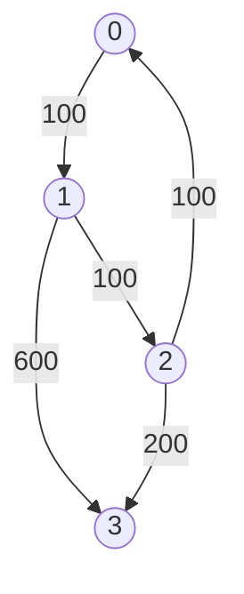

# DP Graph

## Table of Contents

- [x] [3243. Shortest Distance After Road Addition Queries I](https://leetcode.cn/problems/shortest-distance-after-road-addition-queries-i/) (Medium)
- [x] [787. Cheapest Flights Within K Stops](https://leetcode.cn/problems/cheapest-flights-within-k-stops/) (Medium)
- [ ] [1786. Number of Restricted Paths From First to Last Node](https://leetcode.cn/problems/number-of-restricted-paths-from-first-to-last-node/) (Medium)
- [ ] [2050. Parallel Courses III](https://leetcode.cn/problems/parallel-courses-iii/) (Hard)
- [x] [1976. Number of Ways to Arrive at Destination](https://leetcode.cn/problems/number-of-ways-to-arrive-at-destination/) (Medium)
- [x] [1857. Largest Color Value in a Directed Graph](https://leetcode.cn/problems/largest-color-value-in-a-directed-graph/) (Hard)
- [ ] [1928. Minimum Cost to Reach Destination in Time](https://leetcode.cn/problems/minimum-cost-to-reach-destination-in-time/) (Hard)
- [ ] [913. Cat and Mouse](https://leetcode.cn/problems/cat-and-mouse/) (Hard)
- [ ] [1728. Cat and Mouse II](https://leetcode.cn/problems/cat-and-mouse-ii/) (Hard)
- [ ] [1548. The Most Similar Path in a Graph](https://leetcode.cn/problems/the-most-similar-path-in-a-graph/) (Hard) 👑

## 3243. Shortest Distance After Road Addition Queries I

-   [LeetCode](https://leetcode.com/problems/shortest-distance-after-road-addition-queries-i/) | [LeetCode CH](https://leetcode.cn/problems/shortest-distance-after-road-addition-queries-i/) (Medium)

-   Tags: array, breadth first search, graph
- `n=5`, `queries = [[2,4],[0,2],[0,4]]`
- 
- 
- 
- Output: `[3,2,1]`

```python title="3243. Shortest Distance After Road Addition Queries I - Python Solution"
from collections import deque
from itertools import count
from typing import List


# BFS
def shortestDistanceAfterQueries(
    n: int, queries: List[List[int]]
) -> List[int]:
    g = [[] for _ in range(n)]
    for i in range(n - 1):
        g[i].append(i + 1)

    vis = [-1 for _ in range(n)]

    def bfs(i: int) -> int:
        q = deque([0])
        for step in count(1):
            tmp = q
            q = deque()
            for x in tmp:
                for y in g[x]:
                    if y == n - 1:
                        return step
                    if vis[y] != i:
                        vis[y] = i
                        q.append(y)
        return -1

    res = [0] * len(queries)
    for i, (l, r) in enumerate(queries):
        g[l].append(r)
        res[i] = bfs(i)

    return res


n = 5
queries = [[2, 4], [0, 2], [0, 4]]
print(shortestDistanceAfterQueries(n, queries))  # [3, 2, 1]

```

## 787. Cheapest Flights Within K Stops

-   [LeetCode](https://leetcode.com/problems/cheapest-flights-within-k-stops/) | [LeetCode CH](https://leetcode.cn/problems/cheapest-flights-within-k-stops/) (Medium)

-   Tags: dynamic programming, depth first search, breadth first search, graph, heap priority queue, shortest path
-   Return the cheapest price from `src` to `dst` with at most `K` stops.



<iframe width="560" height="315" src="https://www.youtube.com/embed/5eIK3zUdYmE?si=aBR0VbHXTgNuVlGz" title="YouTube video player" frameborder="0" allow="accelerometer; autoplay; clipboard-write; encrypted-media; gyroscope; picture-in-picture; web-share" referrerpolicy="strict-origin-when-cross-origin" allowfullscreen></iframe>

```python title="787. Cheapest Flights Within K Stops - Python Solution"
import heapq
from collections import defaultdict
from typing import List


# Bellman-Ford
def findCheapestPriceBF(
    n: int, flights: List[List[int]], src: int, dst: int, k: int
) -> int:
    prices = [float("inf") for _ in range(n)]
    prices[src] = 0

    for _ in range(k + 1):
        temp = prices[:]
        for u, v, w in flights:
            temp[v] = min(temp[v], prices[u] + w)
        prices = temp

    return prices[dst] if prices[dst] != float("inf") else -1


# Dijkstra
def findCheapestPriceDijkstra(
    n: int, flights: List[List[int]], src: int, dst: int, k: int
) -> int:
    graph = defaultdict(list)
    for u, v, w in flights:
        graph[u].append((v, w))

    heap = [(0, src, 0)]  # (price, city, stops)
    visited = defaultdict(int)  # {city: stops}

    while heap:
        price, city, stops = heapq.heappop(heap)

        if city == dst:
            return price

        if stops > k:
            continue

        if city in visited and visited[city] <= stops:
            continue

        visited[city] = stops

        for neighbor, cost in graph[city]:
            heapq.heappush(heap, (price + cost, neighbor, stops + 1))

    return -1


# |------------|------------------|---------|
# |  Approach  |       Time       |  Space  |
# |------------|------------------|---------|
# |Bellman-Ford|    O(k * E)      |  O(n)   |
# | Dijkstra   | O(E * log(V))    |  O(n)   |
# |------------|------------------|---------|


n = 4
flights = [[0, 1, 100], [1, 2, 100], [2, 0, 100], [1, 3, 600], [2, 3, 200]]
src = 0
dst = 3
k = 1
print(findCheapestPriceBF(n, flights, src, dst, k))  # 700
print(findCheapestPriceDijkstra(n, flights, src, dst, k))  # 700

```

## 1786. Number of Restricted Paths From First to Last Node

-   [LeetCode](https://leetcode.com/problems/number-of-restricted-paths-from-first-to-last-node/) | [LeetCode CH](https://leetcode.cn/problems/number-of-restricted-paths-from-first-to-last-node/) (Medium)

-   Tags: dynamic programming, graph, topological sort, heap priority queue, shortest path
## 2050. Parallel Courses III

-   [LeetCode](https://leetcode.com/problems/parallel-courses-iii/) | [LeetCode CH](https://leetcode.cn/problems/parallel-courses-iii/) (Hard)

-   Tags: array, dynamic programming, graph, topological sort
## 1976. Number of Ways to Arrive at Destination

-   [LeetCode](https://leetcode.com/problems/number-of-ways-to-arrive-at-destination/) | [LeetCode CH](https://leetcode.cn/problems/number-of-ways-to-arrive-at-destination/) (Medium)

-   Tags: dynamic programming, graph, topological sort, shortest path
```python title="1976. Number of Ways to Arrive at Destination - Python Solution"
import heapq
from typing import List


# Dijkstra
def countPaths(n: int, roads: List[List[int]]) -> int:
    mod = 10**9 + 7
    graph = [[] for _ in range(n)]
    for u, v, w in roads:
        graph[u].append((v, w))
        graph[v].append((u, w))

    dist = [float("inf") for _ in range(n)]
    dist[0] = 0
    count = [0 for _ in range(n)]
    count[0] = 1

    heap = [(0, 0)]

    while heap:
        d, u = heapq.heappop(heap)
        if d > dist[u]:
            continue

        for v, w in graph[u]:
            if dist[u] + w < dist[v]:
                dist[v] = dist[u] + w
                count[v] = count[u]
                heapq.heappush(heap, (dist[v], v))
            elif dist[u] + w == dist[v]:
                count[v] += count[u]
                count[v] %= mod

    return count[-1]


n = 7
roads = [
    [0, 6, 7],
    [0, 1, 2],
    [1, 2, 3],
    [1, 3, 3],
    [6, 3, 3],
    [3, 5, 1],
    [6, 5, 1],
    [2, 5, 1],
    [0, 4, 5],
    [4, 6, 2],
]
print(countPaths(n, roads))  # 4

```

## 1857. Largest Color Value in a Directed Graph

-   [LeetCode](https://leetcode.com/problems/largest-color-value-in-a-directed-graph/) | [LeetCode CH](https://leetcode.cn/problems/largest-color-value-in-a-directed-graph/) (Hard)

-   Tags: hash table, dynamic programming, graph, topological sort, memoization, counting
```python title="1857. Largest Color Value in a Directed Graph - Python Solution"
from collections import defaultdict, deque
from typing import List


# Topological Sort
def largestPathValue(colors: str, edges: List[List[int]]) -> int:
    n = len(colors)
    graph = defaultdict(list)
    indegree = [0 for _ in range(n)]

    for u, v in edges:
        graph[u].append(v)
        indegree[v] += 1

    q = deque([i for i in range(n) if indegree[i] == 0])

    dp = [[0] * 26 for _ in range(n)]

    for i in range(n):
        dp[i][ord(colors[i]) - ord("a")] = 1

    processed, max_color = 0, 0

    while q:
        n1 = q.popleft()
        processed += 1
        max_color = max(max_color, max(dp[n1]))

        for n2 in graph[n1]:
            indegree[n2] -= 1
            for i in range(26):
                dp[n2][i] = max(
                    dp[n2][i],
                    dp[n1][i] + (1 if i == ord(colors[n2]) - ord("a") else 0),
                )
            if indegree[n2] == 0:
                q.append(n2)

    return max_color if processed == n else -1


colors = "abaca"
edges = [[0, 1], [0, 2], [2, 3], [3, 4]]
print(largestPathValue(colors, edges))  # 3

```

## 1928. Minimum Cost to Reach Destination in Time

-   [LeetCode](https://leetcode.com/problems/minimum-cost-to-reach-destination-in-time/) | [LeetCode CH](https://leetcode.cn/problems/minimum-cost-to-reach-destination-in-time/) (Hard)

-   Tags: array, dynamic programming, graph
## 913. Cat and Mouse

-   [LeetCode](https://leetcode.com/problems/cat-and-mouse/) | [LeetCode CH](https://leetcode.cn/problems/cat-and-mouse/) (Hard)

-   Tags: math, dynamic programming, graph, topological sort, memoization, game theory
## 1728. Cat and Mouse II

-   [LeetCode](https://leetcode.com/problems/cat-and-mouse-ii/) | [LeetCode CH](https://leetcode.cn/problems/cat-and-mouse-ii/) (Hard)

-   Tags: array, math, dynamic programming, graph, topological sort, memoization, matrix, game theory
## 1548. The Most Similar Path in a Graph

-   [LeetCode](https://leetcode.com/problems/the-most-similar-path-in-a-graph/) | [LeetCode CH](https://leetcode.cn/problems/the-most-similar-path-in-a-graph/) (Hard)

-   Tags: dynamic programming, graph
