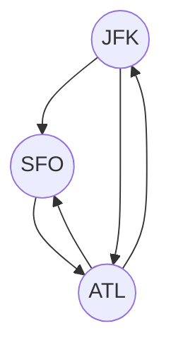

# Eulerian Path and Circuit

## Table of Contents

- [x] [332. Reconstruct Itinerary](https://leetcode.cn/problems/reconstruct-itinerary/) (Hard)
- [ ] [753. Cracking the Safe](https://leetcode.cn/problems/cracking-the-safe/) (Hard)
- [ ] [2097. Valid Arrangement of Pairs](https://leetcode.cn/problems/valid-arrangement-of-pairs/) (Hard)

## 332. Reconstruct Itinerary

-   [LeetCode](https://leetcode.com/problems/reconstruct-itinerary/) | [LeetCode CH](https://leetcode.cn/problems/reconstruct-itinerary/) (Hard)

-   Tags: depth first search, graph, eulerian circuit
-   Return the itinerary in order that visits every airport exactly once.
-   The starting airport is `JFK`.
-   If there are multiple valid itineraries, return the lexicographically smallest one.
-   Eulerian path: A path that visits every edge exactly once.



```python title="332. Reconstruct Itinerary - Python Solution"
from collections import defaultdict
from typing import List


# Hierholzer
def findItinerary1(tickets: List[List[str]]) -> List[str]:
    graph = defaultdict(list)
    for u, v in sorted(tickets, reverse=True):
        graph[u].append(v)

    route = []

    def dfs(node):
        while graph[node]:
            dest = graph[node].pop()
            dfs(dest)
        route.append(node)

    dfs("JFK")

    return route[::-1]


# Backtracking
def findItinerary2(tickets: List[List[str]]) -> List[str]:
    graph = defaultdict(list)
    tickets.sort()
    for u, v in tickets:
        graph[u].append(v)

    route = ["JFK"]

    def backtraking(node):
        if len(route) == len(tickets) + 1:
            return True
        if node not in graph:
            return False

        temp = list(graph[node])
        for i, v in enumerate(temp):
            graph[node].pop(i)
            route.append(v)

            if backtraking(v):
                return True

            graph[node].insert(i, v)
            route.pop()

        return False

    backtraking("JFK")

    return route


tickets = tickets = [
    ["JFK", "SFO"],
    ["JFK", "ATL"],
    ["SFO", "ATL"],
    ["ATL", "JFK"],
    ["ATL", "SFO"],
]
print(findItinerary1(tickets))
# ['JFK', 'ATL', 'JFK', 'SFO', 'ATL', 'SFO']
print(findItinerary2(tickets))
# ['JFK', 'ATL', 'JFK', 'SFO', 'ATL', 'SFO']

```

## 753. Cracking the Safe

-   [LeetCode](https://leetcode.com/problems/cracking-the-safe/) | [LeetCode CH](https://leetcode.cn/problems/cracking-the-safe/) (Hard)

-   Tags: depth first search, graph, eulerian circuit

## 2097. Valid Arrangement of Pairs

-   [LeetCode](https://leetcode.com/problems/valid-arrangement-of-pairs/) | [LeetCode CH](https://leetcode.cn/problems/valid-arrangement-of-pairs/) (Hard)

-   Tags: depth first search, graph, eulerian circuit
