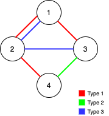

# Graph Others

- [ ] [1042. Flower Planting With No Adjacent](https://leetcode.cn/problems/flower-planting-with-no-adjacent/) (Medium)
- [ ] [1761. Minimum Degree of a Connected Trio in a Graph](https://leetcode.cn/problems/minimum-degree-of-a-connected-trio-in-a-graph/) (Hard)
- [ ] [2508. Add Edges to Make Degrees of All Nodes Even](https://leetcode.cn/problems/add-edges-to-make-degrees-of-all-nodes-even/) (Hard)
- [x] [1579. Remove Max Number of Edges to Keep Graph Fully Traversable](https://leetcode.cn/problems/remove-max-number-of-edges-to-keep-graph-fully-traversable/) (Hard)
- [ ] [2065. Maximum Path Quality of a Graph](https://leetcode.cn/problems/maximum-path-quality-of-a-graph/) (Hard)
- [ ] [1697. Checking Existence of Edge Length Limited Paths](https://leetcode.cn/problems/checking-existence-of-edge-length-limited-paths/) (Hard)
- [ ] [2242. Maximum Score of a Node Sequence](https://leetcode.cn/problems/maximum-score-of-a-node-sequence/) (Hard)
- [ ] [2493. Divide Nodes Into the Maximum Number of Groups](https://leetcode.cn/problems/divide-nodes-into-the-maximum-number-of-groups/) (Hard)
- [ ] [1782. Count Pairs Of Nodes](https://leetcode.cn/problems/count-pairs-of-nodes/) (Hard)
- [ ] [3435. Frequencies of Shortest Supersequences](https://leetcode.cn/problems/frequencies-of-shortest-supersequences/) (Hard)
- [ ] [277. Find the Celebrity](https://leetcode.cn/problems/find-the-celebrity/) (Medium) 👑
- [ ] [1724. Checking Existence of Edge Length Limited Paths II](https://leetcode.cn/problems/checking-existence-of-edge-length-limited-paths-ii/) (Hard) 👑
- [ ] [2077. Paths in Maze That Lead to Same Room](https://leetcode.cn/problems/paths-in-maze-that-lead-to-same-room/) (Medium) 👑

## 1042. Flower Planting With No Adjacent

-   [LeetCode](https://leetcode.com/problems/flower-planting-with-no-adjacent/) | [LeetCode CH](https://leetcode.cn/problems/flower-planting-with-no-adjacent/) (Medium)

-   Tags: depth first search, breadth first search, graph

## 1761. Minimum Degree of a Connected Trio in a Graph

-   [LeetCode](https://leetcode.com/problems/minimum-degree-of-a-connected-trio-in-a-graph/) | [LeetCode CH](https://leetcode.cn/problems/minimum-degree-of-a-connected-trio-in-a-graph/) (Hard)

-   Tags: graph

## 2508. Add Edges to Make Degrees of All Nodes Even

-   [LeetCode](https://leetcode.com/problems/add-edges-to-make-degrees-of-all-nodes-even/) | [LeetCode CH](https://leetcode.cn/problems/add-edges-to-make-degrees-of-all-nodes-even/) (Hard)

-   Tags: hash table, graph

## 1579. Remove Max Number of Edges to Keep Graph Fully Traversable

-   [LeetCode](https://leetcode.com/problems/remove-max-number-of-edges-to-keep-graph-fully-traversable/) | [LeetCode CH](https://leetcode.cn/problems/remove-max-number-of-edges-to-keep-graph-fully-traversable/) (Hard)

-   Tags: union find, graph
- Return the maximum number of edges you can remove so that the graph remains fully traversable.

{width=200px}

```python title="1579. Remove Max Number of Edges to Keep Graph Fully Traversable - Python Solution"
from typing import List


# Kruskal
def maxNumEdgesToRemove(n: int, edges: List[List[int]]) -> int:
    alice, bob = UnionFind(n), UnionFind(n)
    visited = 0

    for t, u, v in edges:
        if t == 3:
            if alice.union(u, v) | bob.union(u, v):
                visited += 1

    for t, u, v in edges:
        if t == 1:
            if alice.union(u, v):
                visited += 1
        elif t == 2:
            if bob.union(u, v):
                visited += 1

    if alice.components > 1 or bob.components > 1:
        return -1

    return len(edges) - visited


class UnionFind:
    def __init__(self, n):
        self.parent = {i: i for i in range(1, n + 1)}
        self.rank = {i: 0 for i in range(1, n + 1)}
        self.components = n

    def find(self, n):
        p = self.parent[n]
        while self.parent[p] != p:
            self.parent[p] = self.parent[self.parent[p]]
            p = self.parent[p]
        return p

    def union(self, n1, n2):
        p1, p2 = self.find(n1), self.find(n2)

        if p1 == p2:
            return False

        if self.rank[p1] > self.rank[p2]:
            self.parent[p2] = p1
        elif self.rank[p1] < self.rank[p2]:
            self.parent[p1] = p2
        else:
            self.parent[p2] = p1
            self.rank[p1] += 1

        self.components -= 1

        return True


n = 4
edges = [[3, 1, 2], [3, 2, 3], [1, 1, 3], [1, 2, 4], [1, 1, 2], [2, 3, 4]]
print(maxNumEdgesToRemove(n, edges))  # 2

```

## 2065. Maximum Path Quality of a Graph

-   [LeetCode](https://leetcode.com/problems/maximum-path-quality-of-a-graph/) | [LeetCode CH](https://leetcode.cn/problems/maximum-path-quality-of-a-graph/) (Hard)

-   Tags: array, backtracking, graph

## 1697. Checking Existence of Edge Length Limited Paths

-   [LeetCode](https://leetcode.com/problems/checking-existence-of-edge-length-limited-paths/) | [LeetCode CH](https://leetcode.cn/problems/checking-existence-of-edge-length-limited-paths/) (Hard)

-   Tags: array, two pointers, union find, graph, sorting

## 2242. Maximum Score of a Node Sequence

-   [LeetCode](https://leetcode.com/problems/maximum-score-of-a-node-sequence/) | [LeetCode CH](https://leetcode.cn/problems/maximum-score-of-a-node-sequence/) (Hard)

-   Tags: array, graph, sorting, enumeration

## 2493. Divide Nodes Into the Maximum Number of Groups

-   [LeetCode](https://leetcode.com/problems/divide-nodes-into-the-maximum-number-of-groups/) | [LeetCode CH](https://leetcode.cn/problems/divide-nodes-into-the-maximum-number-of-groups/) (Hard)

-   Tags: depth first search, breadth first search, union find, graph

## 1782. Count Pairs Of Nodes

-   [LeetCode](https://leetcode.com/problems/count-pairs-of-nodes/) | [LeetCode CH](https://leetcode.cn/problems/count-pairs-of-nodes/) (Hard)

-   Tags: array, two pointers, binary search, graph, sorting

## 3435. Frequencies of Shortest Supersequences

-   [LeetCode](https://leetcode.com/problems/frequencies-of-shortest-supersequences/) | [LeetCode CH](https://leetcode.cn/problems/frequencies-of-shortest-supersequences/) (Hard)

-   Tags: array, string, bit manipulation, graph, topological sort, enumeration

## 277. Find the Celebrity

-   [LeetCode](https://leetcode.com/problems/find-the-celebrity/) | [LeetCode CH](https://leetcode.cn/problems/find-the-celebrity/) (Medium)

-   Tags: two pointers, graph, interactive

## 1724. Checking Existence of Edge Length Limited Paths II

-   [LeetCode](https://leetcode.com/problems/checking-existence-of-edge-length-limited-paths-ii/) | [LeetCode CH](https://leetcode.cn/problems/checking-existence-of-edge-length-limited-paths-ii/) (Hard)

-   Tags: union find, graph, minimum spanning tree

## 2077. Paths in Maze That Lead to Same Room

-   [LeetCode](https://leetcode.com/problems/paths-in-maze-that-lead-to-same-room/) | [LeetCode CH](https://leetcode.cn/problems/paths-in-maze-that-lead-to-same-room/) (Medium)

-   Tags: graph
