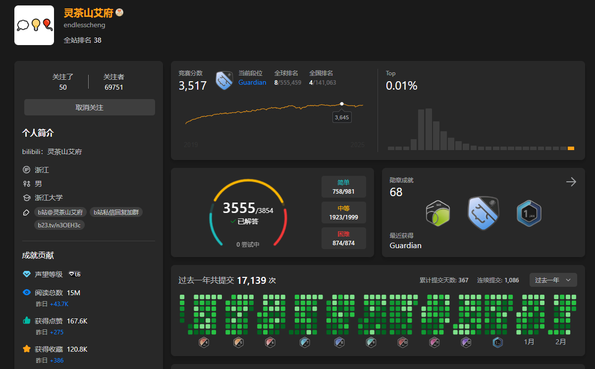

# EndlessCheng 灵茶山艾府

(_As of 2025 February_)

-   [EndlessCheng 灵茶山艾府 - LeetCode](https://leetcode.cn/u/endlesscheng/)
-   题单

    -   [滑动窗口与双指针（定长/不定长/单序列/双序列/三指针）](https://leetcode.cn/circle/discuss/0viNMK/)
    -   [二分算法（二分答案/最小化最大值/最大化最小值/第 K 小）](https://leetcode.cn/circle/discuss/SqopEo/)
    -   [单调栈（基础/矩形面积/贡献法/最小字典序）](https://leetcode.cn/circle/discuss/9oZFK9/)
    -   [网格图（DFS/BFS/综合应用）](https://leetcode.cn/circle/discuss/YiXPXW/)
    -   [位运算（基础/性质/拆位/试填/恒等式/思维）](https://leetcode.cn/circle/discuss/dHn9Vk/)
    -   [图论算法（DFS/BFS/拓扑排序/最短路/最小生成树/二分图/基环树/欧拉路径）](https://leetcode.cn/circle/discuss/01LUak/)
    -   [动态规划（入门/背包/状态机/划分/区间/状压/数位/数据结构优化/树形/博弈/概率期望）](https://leetcode.cn/circle/discuss/tXLS3i/)
    -   [常用数据结构（前缀和/差分/栈/队列/堆/字典树/并查集/树状数组/线段树）](https://leetcode.cn/circle/discuss/mOr1u6/)
    -   [数学算法（数论/组合/概率期望/博弈/计算几何/随机算法）](https://leetcode.cn/circle/discuss/IYT3ss/)
    -   [贪心与思维（基本贪心策略/反悔/区间/字典序/数学/思维/脑筋急转弯/构造）](https://leetcode.cn/circle/discuss/g6KTKL/)
    -   [链表、二叉树与一般树（前后指针/快慢指针/DFS/BFS/直径/LCA）](https://leetcode.cn/circle/discuss/K0n2gO/)
    -   [字符串（KMP/Z 函数/Manacher/字符串哈希/AC 自动机/后缀数组/子序列自动机）](https://leetcode.cn/circle/discuss/SJFwQI/)

## Progress

### Sliding Window

| Category       | Name                                            | Progress |
| -------------- | ----------------------------------------------- | -------- |
| Sliding Window | Sliding Window Fixed Size Basics                |          |
| Sliding Window | Sliding Window Fixed Size Advanced              |          |
| Sliding Window | Sliding Window Fixed Size Others                |          |
| Sliding Window | Sliding Window Variable Max Basics              |          |
| Sliding Window | Sliding Window Variable Max Advanced            |          |
| Sliding Window | Sliding Window Variable Min                     |          |
| Sliding Window | Sliding Window Variable Subarrays Longer        |          |
| Sliding Window | Sliding Window Variable Subarrays Shorter       |          |
| Sliding Window | Sliding Window Variable Subarrays Exact         |          |
| Sliding Window | Sliding Window Variable Others                  |          |
| Sliding Window | One Sequence Two Pointers Opposite Direction    |          |
| Sliding Window | One Sequence Two Pointers Same Direction        |          |
| Sliding Window | One Sequence Two Pointers Backward              |          |
| Sliding Window | One Sequence Two Pointers In-Place Modification |          |
| Sliding Window | Two Sequences Two Pointers                      |          |
| Sliding Window | Two Sequences Subsequence Checking              |          |
| Sliding Window | Three Pointers                                  |          |
| Sliding Window | Grouped Loop                                    |          |

### Binary Search

| Category      | Name                         | Progress |
| ------------- | ---------------------------- | -------- |
| Binary Search | Binary Search Basics         |          |
| Binary Search | Binary Search Advanced       |          |
| Binary Search | Binary Search Min Answer     |          |
| Binary Search | Binary Search Max Answer     |          |
| Binary Search | Binary Search Indirect Value |          |
| Binary Search | Binary Search Minimize Max   |          |
| Binary Search | Binary Search Maximize Min   |          |
| Binary Search | Binary Search Kth Min Max    |          |
| Binary Search | Binary Search Others         |          |

### Monotonic Stack

| Category        | Name                       | Progress |
| --------------- | -------------------------- | -------- |
| Monotonic Stack | Monotonic Stack            |          |
| Monotonic Stack | Rectangle                  |          |
| Monotonic Stack | Contribution Method        |          |
| Monotonic Stack | Lexicographically Smallest |          |

### Grid

| Category | Name              | Progress |
| -------- | ----------------- | -------- |
| Grid     | Grid DFS          |          |
| Grid     | Grid BFS          |          |
| Grid     | Grid 01 BFS       |          |
| Grid     | Grid Applications |          |

### Bit

| Category | Name                       | Progress |
| -------- | -------------------------- | -------- |
| Bit      | Bit Basics                 |          |
| Bit      | Bit XOR                    |          |
| Bit      | Bit AND OR                 |          |
| Bit      | Bit LogTrick               |          |
| Bit      | Bit Contribution Method    |          |
| Bit      | Bit Trial and Error Method |          |
| Bit      | Bit Identity Law           |          |
| Bit      | Bit Thinking Problems      |          |
| Bit      | Bit Others                 |          |

### Graph

| Category | Name                                 | Progress |
| -------- | ------------------------------------ | -------- |
| Graph    | DFS Basics                           |          |
| Graph    | BFS Basics                           |          |
| Graph    | Topological Sorting                  |          |
| Graph    | Topological Order DP                 |          |
| Graph    | Fundamental Cycle                    |          |
| Graph    | Shortest Path Single Source Dijkstra |          |
| Graph    | Shortest Path All Pairs Floyd        |          |
| Graph    | Minimum Spanning Tree                |          |
| Graph    | Eulerian Path and Circuit            |          |
| Graph    | Strongly and Biconnected Components  |          |
| Graph    | Bipartite Graph Coloring             |          |
| Graph    | Network Flow                         |          |
| Graph    | Graph Others                         |          |

### Dynamic Programming

| Category            | Name                                   | Progress |
| ------------------- | -------------------------------------- | -------- |
| Dynamic Programming | DP Climbing Stairs                     |          |
| Dynamic Programming | DP House Robber                        |          |
| Dynamic Programming | DP Max Subarray Sum                    |          |
| Dynamic Programming | DP Grid Basics                         |          |
| Dynamic Programming | DP Grid Advanced                       |          |
| Dynamic Programming | DP 0-1 Knapsack                        |          |
| Dynamic Programming | DP Complete Knapsack                   |          |
| Dynamic Programming | DP Multiple Knapsack                   |          |
| Dynamic Programming | DP Grouped Knapsack                    |          |
| Dynamic Programming | DP LCS Basics                          |          |
| Dynamic Programming | DP LCS Advanced                        |          |
| Dynamic Programming | DP LIS Basics                          |          |
| Dynamic Programming | DP LIS Advanced                        |          |
| Dynamic Programming | DP Partitioning Feasibility            |          |
| Dynamic Programming | DP Optimal Partitioning                |          |
| Dynamic Programming | DP Constrained Number of Partitions    |          |
| Dynamic Programming | DP Non-Overlapping Intervals           |          |
| Dynamic Programming | DP Stock Trading                       |          |
| Dynamic Programming | DP State Machine Basics                |          |
| Dynamic Programming | DP State Machine Advanced              |          |
| Dynamic Programming | DP 1D                                  |          |
| Dynamic Programming | DP Valid Subsequence                   |          |
| Dynamic Programming | DP Matrix Exponentiation Optimized     |          |
| Dynamic Programming | DP Subrectangle                        |          |
| Dynamic Programming | DP Multi-Dimensional                   |          |
| Dynamic Programming | DP Longest Palindromic Subsequence     |          |
| Dynamic Programming | DP Other Interval DP                   |          |
| Dynamic Programming | DP Permutation Type Adjacent Unrelated |          |
| Dynamic Programming | DP Permutation Type Adjacent Related   |          |
| Dynamic Programming | DP Traveling Salesman Problem          |          |
| Dynamic Programming | DP Subset State Compression            |          |
| Dynamic Programming | DP Other State Compression             |          |
| Dynamic Programming | DP Digit                               |          |
| Dynamic Programming | DP Prefix Sum                          |          |
| Dynamic Programming | DP Monotonic Stack                     |          |
| Dynamic Programming | DP Monotonic Queue                     |          |
| Dynamic Programming | DP Fenwick Tree Segment Tree           |          |
| Dynamic Programming | DP Trie                                |          |
| Dynamic Programming | DP Other Optimized                     |          |
| Dynamic Programming | DP WQS Binary Search                   |          |
| Dynamic Programming | Tree DP Tree Diameter                  |          |
| Dynamic Programming | Tree DP Maximum Independent Set        |          |
| Dynamic Programming | Tree DP Minimum Dominating Set         |          |
| Dynamic Programming | Tree DP Rerooting DP                   |          |
| Dynamic Programming | Tree DP Other                          |          |
| Dynamic Programming | DP Graph                               |          |
| Dynamic Programming | DP Game Theory                         |          |
| Dynamic Programming | DP Probability Expectation             |          |
| Dynamic Programming | DP Print Solutions                     |          |
| Dynamic Programming | DP Prefix and Suffix Decomposition     |          |
| Dynamic Programming | DP Transform X to Y                    |          |
| Dynamic Programming | DP Jump Game                           |          |
| Dynamic Programming | DP Other DP                            |          |

### Data Structure

| Category       | Name                          | Progress |
| -------------- | ----------------------------- | -------- |
| Data Structure | Enumerate Right Maintain Left |          |
| Data Structure | Enumerate Middle              |          |
| Data Structure | Prefix Sum Basics             |          |
| Data Structure | Prefix Sum with Hash Table    |          |
| Data Structure | Distance Sum                  |          |
| Data Structure | Prefix XOR Sum                |          |
| Data Structure | 1D Prefix Sum                 |          |
| Data Structure | 2D Prefix Sum                 |          |
| Data Structure | 1D Difference Array           |          |
| Data Structure | 2D Difference Array           |          |
| Data Structure | Stack Basics                  |          |
| Data Structure | Stack Advanced                |          |
| Data Structure | Adjacent Elimination          |          |
| Data Structure | Valid Parentheses Strings     |          |
| Data Structure | Expression Parsing            |          |
| Data Structure | Dual Stack                    |          |
| Data Structure | Queue Basics                  |          |
| Data Structure | Queue Design                  |          |
| Data Structure | Deque                         |          |
| Data Structure | Monotonic Queue               |          |
| Data Structure | Monotonic Queue Optimized DP  |          |
| Data Structure | Heap Basics                   |          |
| Data Structure | Heap Advanced                 |          |
| Data Structure | Heap Rearrange Elements       |          |
| Data Structure | Heap Kth Smallest Largest     |          |
| Data Structure | Regret Heap                   |          |
| Data Structure | Lazy Deletion Heap            |          |
| Data Structure | Dual Heap                     |          |
| Data Structure | Trie Basics                   |          |
| Data Structure | Trie Advanced                 |          |
| Data Structure | Trie Optimized DP             |          |
| Data Structure | XOR Trie                      |          |
| Data Structure | Union Find Basics             |          |
| Data Structure | Union Find Advanced           |          |
| Data Structure | GCD Union Find                |          |
| Data Structure | Union Find on Arrays          |          |
| Data Structure | Union Find Interval           |          |
| Data Structure | Edge Weighted Union Find      |          |
| Data Structure | Fenwick Tree                  |          |
| Data Structure | Inversion Count               |          |
| Data Structure | Segment Tree                  |          |
| Data Structure | Lazy Segment Tree             |          |
| Data Structure | Dynamic Segment Tree          |          |
| Data Structure | Offline Algorithm             |          |

### Math

| Category | Name                              | Progress |
| -------- | --------------------------------- | -------- |
| Math     | Prime Check                       |          |
| Math     | Prime Preprocessing               |          |
| Math     | Prime Factorization               |          |
| Math     | Factorial Decomposition           |          |
| Math     | Factors                           |          |
| Math     | Greatest Common Divisor           |          |
| Math     | Least Common Multiple             |          |
| Math     | Coprime                           |          |
| Math     | Modular Arithmetic                |          |
| Math     | Number Theory Others              |          |
| Math     | Multiplication Principle          |          |
| Math     | Combinatorial Counting            |          |
| Math     | Ball Placement Problems           |          |
| Math     | Inclusion Exclusion Principle     |          |
| Math     | Combinatorics Contribution Method |          |
| Math     | Probability and Expectation       |          |
| Math     | Game Theory                       |          |
| Math     | Points and Lines                  |          |
| Math     | Circles                           |          |
| Math     | Rectangles and Polygons           |          |
| Math     | Convex Hull                       |          |
| Math     | Randomized Algorithms             |          |
| Math     | Palindromic Numbers               |          |
| Math     | Integer Partition                 |          |
| Math     | Manhattan Distance                |          |
| Math     | Polynomial Convolution            |          |
| Math     | Math Others                       |          |

### Greedy

| Category | Name                               | Progress |
| -------- | ---------------------------------- | -------- |
| Greedy   | Greedy from Smallest Largest       |          |
| Greedy   | Single Sequence Pairing            |          |
| Greedy   | Double Sequence Pairing            |          |
| Greedy   | Greedy from Left Right             |          |
| Greedy   | Partitioning Greedy                |          |
| Greedy   | Enumerate then Greedy              |          |
| Greedy   | Exchange Argument                  |          |
| Greedy   | Adjacent Different                 |          |
| Greedy   | Regret Greedy                      |          |
| Greedy   | Non-Overlapping Intervals          |          |
| Greedy   | Interval Grouping                  |          |
| Greedy   | Interval Selection                 |          |
| Greedy   | Interval Coverage                  |          |
| Greedy   | Merge Intervals                    |          |
| Greedy   | Other Interval Greedy              |          |
| Greedy   | Lexicographically Smallest Largest |          |
| Greedy   | Palindrome Greedy                  |          |
| Greedy   | Math Greedy Basics                 |          |
| Greedy   | Product Greedy                     |          |
| Greedy   | Sorting Inequality                 |          |
| Greedy   | Basic Inequality                   |          |
| Greedy   | Median Greedy                      |          |
| Greedy   | Inductive Method                   |          |
| Greedy   | Other Math Greedy                  |          |
| Greedy   | From Special to General            |          |
| Greedy   | Brain Teasers                      |          |
| Greedy   | Reverse Thinking                   |          |
| Greedy   | Equivalent Transformation          |          |
| Greedy   | Construction Problems              |          |
| Greedy   | Greedy Others                      |          |

### Linked List

| Category    | Name                            | Progress |
| ----------- | ------------------------------- | -------- |
| Linked List | Linked List Traversal           |          |
| Linked List | Linked List Delete Nodes        |          |
| Linked List | Linked List Insert Nodes        |          |
| Linked List | Linked List Reverse             |          |
| Linked List | Linked List Front Back Pointers |          |
| Linked List | Linked List Fast Slow Pointers  |          |
| Linked List | Linked List Double Pointers     |          |
| Linked List | Linked Lists Merge              |          |
| Linked List | Linked List Divide and Conquer  |          |
| Linked List | Linked List Applications        |          |
| Linked List | Linked List Others              |          |

### Binary Tree

| Category    | Name                                    | Progress |
| ----------- | --------------------------------------- | -------- |
| Binary Tree | Binary Tree Traversal                   |          |
| Binary Tree | Binary Tree Top-Down DFS                |          |
| Binary Tree | Binary Tree Bottom-Up DFS               |          |
| Binary Tree | Binary Tree Bottom-Up DFS Node Deletion |          |
| Binary Tree | Binary Tree Recursion                   |          |
| Binary Tree | Binary Tree Diameter                    |          |
| Binary Tree | Binary Tree Backtracking                |          |
| Binary Tree | Binary Tree Lowest Common Ancestor      |          |
| Binary Tree | Binary Search Tree                      |          |
| Binary Tree | Binary Tree Construction                |          |
| Binary Tree | Binary Tree Insert Delete Nodes         |          |
| Binary Tree | Tree DP                                 |          |
| Binary Tree | Binary Tree BFS                         |          |
| Binary Tree | Binary Tree Linked List                 |          |
| Binary Tree | N-ary Tree                              |          |
| Binary Tree | Binary Tree Others                      |          |

### General Tree

| Category     | Name                                | Progress |
| ------------ | ----------------------------------- | -------- |
| General Tree | General Tree Traversal              |          |
| General Tree | General Tree Top-Down DFS           |          |
| General Tree | General Tree Bottom-Up DFS          |          |
| General Tree | General Tree Recursion              |          |
| General Tree | General Tree Diameter               |          |
| General Tree | General Tree DFS Timestamp          |          |
| General Tree | General Tree Topological Sort       |          |
| General Tree | General Tree Lowest Common Ancestor |          |
| General Tree | General Tree Others                 |          |

### Backtracking

| Category     | Name                                       | Progress |
| ------------ | ------------------------------------------ | -------- |
| Backtracking | Backtracking Basic                         |          |
| Backtracking | Backtracking Subset                        |          |
| Backtracking | Backtracking Partition                     |          |
| Backtracking | Backtracking Combination                   |          |
| Backtracking | Backtracking Permutation                   |          |
| Backtracking | Backtracking Exhaustive Search and Pruning |          |
| Backtracking | Backtracking with Duplicates               |          |

### String

| Category | Name                          | Progress |
| -------- | ----------------------------- | -------- |
| String   | String KMP                    |          |
| String   | String Z Function             |          |
| String   | String Manacher Algorithm     |          |
| String   | String Hashing                |          |
| String   | String Minimal Representation |          |
| String   | String AC Automaton           |          |
| String   | String Suffix Array           |          |
| String   | String Subsequence Automaton  |          |
