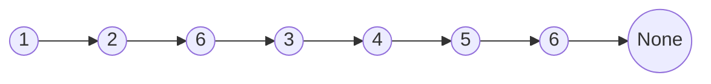
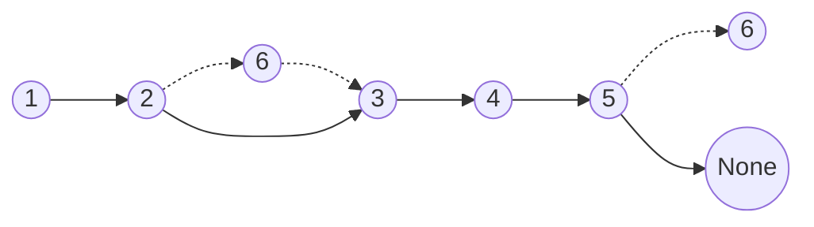

# Linked List Delete Nodes

## Table of Contents

- [x] [203. Remove Linked List Elements](https://leetcode.cn/problems/remove-linked-list-elements/) (Easy)
- [x] [3217. Delete Nodes From Linked List Present in Array](https://leetcode.cn/problems/delete-nodes-from-linked-list-present-in-array/) (Medium)
- [x] [83. Remove Duplicates from Sorted List](https://leetcode.cn/problems/remove-duplicates-from-sorted-list/) (Easy)
- [x] [82. Remove Duplicates from Sorted List II](https://leetcode.cn/problems/remove-duplicates-from-sorted-list-ii/) (Medium)
- [x] [237. Delete Node in a Linked List](https://leetcode.cn/problems/delete-node-in-a-linked-list/) (Medium)
- [ ] [1669. Merge In Between Linked Lists](https://leetcode.cn/problems/merge-in-between-linked-lists/) (Medium)
- [x] [2487. Remove Nodes From Linked List](https://leetcode.cn/problems/remove-nodes-from-linked-list/) (Medium)
- [ ] [1836. Remove Duplicates From an Unsorted Linked List](https://leetcode.cn/problems/remove-duplicates-from-an-unsorted-linked-list/) (Medium) 👑

## 203. Remove Linked List Elements

-   [LeetCode](https://leetcode.com/problems/remove-linked-list-elements/) | [LeetCode CH](https://leetcode.cn/problems/remove-linked-list-elements/) (Easy)

-   Tags: linked list, recursion
-   Remove all elements from a linked list of integers that have value `val`.

-   Before



-   After



```python title="203. Remove Linked List Elements - Python Solution"
from typing import Optional

from template import ListNode


# Iterative
def removeElements(head: Optional[ListNode], val: int) -> Optional[ListNode]:
    dummy = ListNode(0)
    dummy.next = head
    cur = dummy

    while cur.next:
        if cur.next.val == val:
            cur.next = cur.next.next
        else:
            cur = cur.next

    return dummy.next


# |-------------|-----------------|--------------|
# |  Approach   |      Time       |    Space     |
# |-------------|-----------------|--------------|
# |  Iterative  |      O(N)       |    O(1)      |
# |-------------|-----------------|--------------|


nums = [1, 2, 6, 3, 4, 5, 6]
val = 6
head = ListNode.create(nums)
print(head)
# 1 -> 2 -> 6 -> 3 -> 4 -> 5 -> 6
print(removeElements(head, val))
# 1 -> 2 -> 3 -> 4 -> 5

```

## 3217. Delete Nodes From Linked List Present in Array

-   [LeetCode](https://leetcode.com/problems/delete-nodes-from-linked-list-present-in-array/) | [LeetCode CH](https://leetcode.cn/problems/delete-nodes-from-linked-list-present-in-array/) (Medium)

-   Tags: array, hash table, linked list
```python title="3217. Delete Nodes From Linked List Present in Array - Python Solution"
from typing import List, Optional

from template import ListNode


# Linked List
def modifiedList(
    nums: List[int], head: Optional[ListNode]
) -> Optional[ListNode]:
    numSet = set(nums)
    dummy = ListNode(0, head)
    cur = dummy

    while cur.next:
        if cur.next.val in numSet:
            cur.next = cur.next.next
        else:
            cur = cur.next

    return dummy.next


nums = [1, 2, 3]
head = ListNode().create([1, 2, 3, 4, 5])
print(modifiedList(nums, head))  # 4 -> 5

```

## 83. Remove Duplicates from Sorted List

-   [LeetCode](https://leetcode.com/problems/remove-duplicates-from-sorted-list/) | [LeetCode CH](https://leetcode.cn/problems/remove-duplicates-from-sorted-list/) (Easy)

-   Tags: linked list
```python title="83. Remove Duplicates from Sorted List - Python Solution"
from typing import Optional

from template import ListNode


# Linked List
def deleteDuplicates(head: Optional[ListNode]) -> Optional[ListNode]:
    if not head:
        return None

    cur = head
    while cur.next:
        if cur.next.val == cur.val:
            cur.next = cur.next.next
        else:
            cur = cur.next

    return head


head = ListNode().create([1, 1, 2, 3, 3])
print(deleteDuplicates(head))  # 1 -> 2 -> 3

```

## 82. Remove Duplicates from Sorted List II

-   [LeetCode](https://leetcode.com/problems/remove-duplicates-from-sorted-list-ii/) | [LeetCode CH](https://leetcode.cn/problems/remove-duplicates-from-sorted-list-ii/) (Medium)

-   Tags: linked list, two pointers
```python title="82. Remove Duplicates from Sorted List II - Python Solution"
from typing import Optional

from template import ListNode


# Linked List
def deleteDuplicates(head: Optional[ListNode]) -> Optional[ListNode]:
    dummy = ListNode(0, head)
    cur = dummy

    while cur.next and cur.next.next:
        val = cur.next.val
        if cur.next.next.val == val:
            while cur.next and cur.next.val == val:
                cur.next = cur.next.next
        else:
            cur = cur.next

    return dummy.next


head = ListNode().create([1, 1, 2, 3, 3, 4, 5])
print(deleteDuplicates(head))  # 2 -> 4 -> 5

```

## 237. Delete Node in a Linked List

-   [LeetCode](https://leetcode.com/problems/delete-node-in-a-linked-list/) | [LeetCode CH](https://leetcode.cn/problems/delete-node-in-a-linked-list/) (Medium)

-   Tags: linked list
-   Delete a node in a singly linked list. You are given only the node to be deleted.

```python title="237. Delete Node in a Linked List - Python Solution"
from template import ListNode


def deleteNode(node: ListNode) -> None:
    node.val = node.next.val
    node.next = node.next.next


head = ListNode.create([4, 5, 1, 9])
node = head.next
deleteNode(node)
print(head)  # 4 -> 1 -> 9

```

## 1669. Merge In Between Linked Lists

-   [LeetCode](https://leetcode.com/problems/merge-in-between-linked-lists/) | [LeetCode CH](https://leetcode.cn/problems/merge-in-between-linked-lists/) (Medium)

-   Tags: linked list
## 2487. Remove Nodes From Linked List

-   [LeetCode](https://leetcode.com/problems/remove-nodes-from-linked-list/) | [LeetCode CH](https://leetcode.cn/problems/remove-nodes-from-linked-list/) (Medium)

-   Tags: linked list, stack, recursion, monotonic stack
-   Remove all nodes from a linked list that have a value greater than `maxValue`.

```python title="2487. Remove Nodes From Linked List - Python Solution"
from typing import Optional

from template import ListNode


# Recursive
def removeNodesRecursive(head: Optional[ListNode]) -> Optional[ListNode]:
    if not head:
        return None

    head.next = removeNodesRecursive(head.next)

    if head.next and head.val < head.next.val:
        return head.next

    return head


# Iterative
def removeNodesIterative(head: Optional[ListNode]) -> Optional[ListNode]:
    stack = []
    cur = head

    while cur:
        # pop all nodes in stack that are smaller than cur
        while stack and cur.val > stack[-1].val:
            stack.pop()

        stack.append(cur)
        cur = cur.next

    # link all nodes in stack
    dummy = ListNode()
    cur = dummy

    for node in stack:
        cur.next = node
        cur = cur.next

    return dummy.next


head = [5, 2, 13, 3, 8]
head1 = ListNode.create(head)
print(head1)  # 5 -> 2 -> 13 -> 3 -> 8
print(removeNodesRecursive(head1))  # 13 -> 8
head2 = ListNode.create(head)
print(removeNodesIterative(head2))  # 13 -> 8

```

## 1836. Remove Duplicates From an Unsorted Linked List

-   [LeetCode](https://leetcode.com/problems/remove-duplicates-from-an-unsorted-linked-list/) | [LeetCode CH](https://leetcode.cn/problems/remove-duplicates-from-an-unsorted-linked-list/) (Medium)

-   Tags: hash table, linked list
