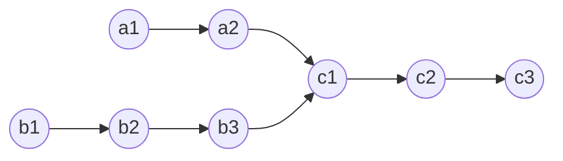

# Linked List Double Pointers

- [ ] [328. Odd Even Linked List](https://leetcode.cn/problems/odd-even-linked-list/) (Medium)
- [ ] [86. Partition List](https://leetcode.cn/problems/partition-list/) (Medium)
- [x] [160. Intersection of Two Linked Lists](https://leetcode.cn/problems/intersection-of-two-linked-lists/) (Easy)

## 328. Odd Even Linked List

-   [LeetCode](https://leetcode.com/problems/odd-even-linked-list/) | [LeetCode CH](https://leetcode.cn/problems/odd-even-linked-list/) (Medium)

-   Tags: linked list

## 86. Partition List

-   [LeetCode](https://leetcode.com/problems/partition-list/) | [LeetCode CH](https://leetcode.cn/problems/partition-list/) (Medium)

-   Tags: linked list, two pointers

## 160. Intersection of Two Linked Lists

-   [LeetCode](https://leetcode.com/problems/intersection-of-two-linked-lists/) | [LeetCode CH](https://leetcode.cn/problems/intersection-of-two-linked-lists/) (Easy)

-   Tags: hash table, linked list, two pointers
-   Find the node at which the intersection of two singly linked lists begins.



```python title="160. Intersection of Two Linked Lists - Python Solution"
from typing import Optional

from template import ListNode


# Hash Set
def getIntersectionNodeHash(
    headA: ListNode, headB: ListNode
) -> Optional[ListNode]:
    if not headA or not headB:
        return None

    visited = set()
    cur = headA
    while cur:
        visited.add(cur)
        cur = cur.next

    cur = headB
    while cur:
        if cur in visited:
            return cur
        cur = cur.next

    return None


# Two Pointers
def getIntersectionNodeTP(
    headA: ListNode, headB: ListNode
) -> Optional[ListNode]:
    if not headA or not headB:
        return None

    a, b = headA, headB

    while a != b:
        a = a.next if a else headB
        b = b.next if b else headA

    return a


listA = [4, 1, 8, 4, 5]
listB = [5, 6, 1, 8, 4, 5]
headA = ListNode.create(listA)
print(headA)
# 4 -> 1 -> 8 -> 4 -> 5
headB = ListNode.create(listB)
print(headB)
# 5 -> 6 -> 1 -> 8 -> 4 -> 5

headA.intersect(headB, 8)

print(getIntersectionNodeHash(headA, headB))
# 8 -> 4 -> 5
print(getIntersectionNodeTP(headA, headB))
# 8 -> 4 -> 5

```
