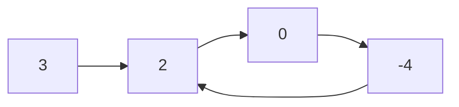

# Linked List Fast Slow Pointers

- [x] [876. Middle of the Linked List](https://leetcode.cn/problems/middle-of-the-linked-list/) (Easy)
- [x] [2095. Delete the Middle Node of a Linked List](https://leetcode.cn/problems/delete-the-middle-node-of-a-linked-list/) (Medium)
- [x] [234. Palindrome Linked List](https://leetcode.cn/problems/palindrome-linked-list/) (Easy)
- [x] [2130. Maximum Twin Sum of a Linked List](https://leetcode.cn/problems/maximum-twin-sum-of-a-linked-list/) (Medium)
- [x] [143. Reorder List](https://leetcode.cn/problems/reorder-list/) (Medium)
- [x] [141. Linked List Cycle](https://leetcode.cn/problems/linked-list-cycle/) (Easy)
- [x] [142. Linked List Cycle II](https://leetcode.cn/problems/linked-list-cycle-ii/) (Medium)
- [ ] [457. Circular Array Loop](https://leetcode.cn/problems/circular-array-loop/) (Medium)
- [ ] [2674. Split a Circular Linked List](https://leetcode.cn/problems/split-a-circular-linked-list/) (Medium) 👑

## 876. Middle of the Linked List

-   [LeetCode](https://leetcode.com/problems/middle-of-the-linked-list/) | [LeetCode CH](https://leetcode.cn/problems/middle-of-the-linked-list/) (Easy)

-   Tags: linked list, two pointers

```python title="876. Middle of the Linked List - Python Solution"
from typing import Optional

from template import ListNode


# Linked List
def middleNode(head: Optional[ListNode]) -> Optional[ListNode]:
    fast, slow = head, head

    while fast and fast.next:
        fast = fast.next.next
        slow = slow.next

    return slow


print(middleNode(ListNode.create([1, 2, 3, 4, 5])))
# 3 -> 4 -> 5
print(middleNode(ListNode.create([1, 2, 3, 4, 5, 6])))
# 4 -> 5 -> 6

```

## 2095. Delete the Middle Node of a Linked List

-   [LeetCode](https://leetcode.com/problems/delete-the-middle-node-of-a-linked-list/) | [LeetCode CH](https://leetcode.cn/problems/delete-the-middle-node-of-a-linked-list/) (Medium)

-   Tags: linked list, two pointers

```python title="2095. Delete the Middle Node of a Linked List - Python Solution"
from typing import Optional

from template import ListNode


# Linked List
def deleteMiddle(head: Optional[ListNode]) -> Optional[ListNode]:
    fast, slow = head, head
    dummy = ListNode(0, head)
    cur = dummy

    while fast and fast.next:
        fast = fast.next.next
        cur = cur.next
        slow = slow.next

    cur.next = slow.next

    return dummy.next


node = ListNode.create([1, 2, 3, 4, 5])
print(deleteMiddle(node))
# 1 -> 2 -> 4 -> 5

```

## 234. Palindrome Linked List

-   [LeetCode](https://leetcode.com/problems/palindrome-linked-list/) | [LeetCode CH](https://leetcode.cn/problems/palindrome-linked-list/) (Easy)

-   Tags: linked list, two pointers, stack, recursion

```python title="234. Palindrome Linked List - Python Solution"
from typing import Optional

from template import ListNode


# Linked List
def isPalindrome(head: Optional[ListNode]) -> bool:
    if not head or not head.next:
        return True

    def middle(node):
        fast, slow = node, node
        while fast and fast.next:
            fast = fast.next.next
            slow = slow.next
        return slow

    def reverse(node):
        cur, pre = node, None
        while cur:
            nxt = cur.next
            cur.next = pre
            pre = cur
            cur = nxt
        return pre

    mid1 = head
    mid2 = reverse(middle(head))

    while mid2:
        if mid1.val != mid2.val:
            return False
        mid1 = mid1.next
        mid2 = mid2.next

    return True


head = ListNode().create([1, 2, 2, 1])
print(isPalindrome(head))  # True

```

## 2130. Maximum Twin Sum of a Linked List

-   [LeetCode](https://leetcode.com/problems/maximum-twin-sum-of-a-linked-list/) | [LeetCode CH](https://leetcode.cn/problems/maximum-twin-sum-of-a-linked-list/) (Medium)

-   Tags: linked list, two pointers, stack

```python title="2130. Maximum Twin Sum of a Linked List - Python Solution"
from typing import Optional

from template import ListNode


# Linked List
def pairSum(head: Optional[ListNode]) -> int:
    def middle(node):
        fast, slow = node, node
        while fast and fast.next:
            fast = fast.next.next
            slow = slow.next
        return slow

    def reverse(node):
        cur, pre = node, None
        while cur:
            nxt = cur.next
            cur.next = pre
            pre = cur
            cur = nxt
        return pre

    list1 = head
    list2 = reverse(middle(head))
    res = float("-inf")

    while list2:
        res = max(res, list1.val + list2.val)
        list1 = list1.next
        list2 = list2.next

    return res


node = ListNode().create([4, 2, 2, 3])
print(pairSum(node))  # 7

```

## 143. Reorder List

-   [LeetCode](https://leetcode.com/problems/reorder-list/) | [LeetCode CH](https://leetcode.cn/problems/reorder-list/) (Medium)

-   Tags: linked list, two pointers, stack, recursion

```python title="143. Reorder List - Python Solution"
from typing import Optional

from template import ListNode


# Linked List
def reorderList(head: Optional[ListNode]) -> None:
    """
    Do not return anything, modify head in-place instead.
    """
    if not head or not head.next:
        return

    # Middle of the linked list
    slow, fast = head, head
    while fast and fast.next:
        slow = slow.next
        fast = fast.next.next

    # Reverse the second half
    pre, cur = None, slow
    while cur:
        temp = cur.next
        cur.next = pre
        pre = cur
        cur = temp

    # Merge two linked lists
    first, second = head, pre
    while second.next:
        temp1, temp2 = first.next, second.next
        first.next = second
        second.next = temp1
        first, second = temp1, temp2


head = ListNode.create([1, 2, 3, 4, 5, 6])
print(head)  # 1 -> 2 -> 3 -> 4 -> 5 -> 6
reorderList(head)
print(head)  # 1 -> 6 -> 2 -> 5 -> 3 -> 4

```

## 141. Linked List Cycle

-   [LeetCode](https://leetcode.com/problems/linked-list-cycle/) | [LeetCode CH](https://leetcode.cn/problems/linked-list-cycle/) (Easy)

-   Tags: hash table, linked list, two pointers
-   Determine if a linked list has a cycle in it.

```mermaid
graph LR
A((3)) --> B((2))
B --> C((0))
C --> D((-4))
```

```mermaid
graph LR
A((3)) --> B((2))
B --> C((0))
C --> D((-4))
D --> B
```

```python title="141. Linked List Cycle - Python Solution"
from typing import Optional

from template import ListNode


def hasCycle(head: Optional[ListNode]) -> bool:
    slow, fast = head, head

    while fast and fast.next:
        slow = slow.next
        fast = fast.next.next

        if slow == fast:
            return True

    return False


print(hasCycle(ListNode.create([3, 2, 0, -4])))  # False
print(hasCycle(ListNode.create([3, 2, 0, -4], 1)))  # True

```

```cpp title="141. Linked List Cycle - C++ Solution"
#include <iostream>

struct ListNode {
    int val;
    ListNode* next;
    ListNode(int x) : val(x), next(NULL) {}
};

class Solution {
   public:
    bool hasCycle(ListNode* head) {
        ListNode* slow = head;
        ListNode* fast = head;

        while (fast && fast->next) {
            slow = slow->next;
            fast = fast->next->next;

            if (fast == slow) return true;
        }
        return false;
    }
};

```

## 142. Linked List Cycle II

-   [LeetCode](https://leetcode.com/problems/linked-list-cycle-ii/) | [LeetCode CH](https://leetcode.cn/problems/linked-list-cycle-ii/) (Medium)

-   Tags: hash table, linked list, two pointers
-   Given a linked list, return the node where the cycle begins. If there is no cycle, return `None`.



```python title="142. Linked List Cycle II - Python Solution"
from typing import Optional

from template import ListNode


def detectCycle(head: Optional[ListNode]) -> Optional[ListNode]:
    slow, fast = head, head

    while fast and fast.next:
        fast = fast.next.next
        slow = slow.next

        if slow == fast:
            slow = head
            while slow != fast:
                slow = slow.next
                fast = fast.next
            return slow

    return None


head1 = ListNode.create([3, 2, 0, -4], 1)
print(detectCycle(head1).val)  # 2
head2 = ListNode.create([3, 2, 0, -4])
print(detectCycle(head2))  # None

```

```cpp title="142. Linked List Cycle II - C++ Solution"
#include <iostream>

struct ListNode {
    int val;
    ListNode* next;
    ListNode(int x) : val(x), next(NULL) {}
};

class Solution {
   public:
    ListNode* detectCycle(ListNode* head) {
        ListNode* slow = head;
        ListNode* fast = head;

        while (fast && fast->next) {
            slow = slow->next;
            fast = fast->next->next;

            if (fast == slow) {
                slow = head;
                while (slow != fast) {
                    slow = slow->next;
                    fast = fast->next;
                }
                return slow;
            }
        }
        return nullptr;
    }
};

```

## 457. Circular Array Loop

-   [LeetCode](https://leetcode.com/problems/circular-array-loop/) | [LeetCode CH](https://leetcode.cn/problems/circular-array-loop/) (Medium)

-   Tags: array, hash table, two pointers

## 2674. Split a Circular Linked List

-   [LeetCode](https://leetcode.com/problems/split-a-circular-linked-list/) | [LeetCode CH](https://leetcode.cn/problems/split-a-circular-linked-list/) (Medium)

-   Tags: linked list, two pointers
