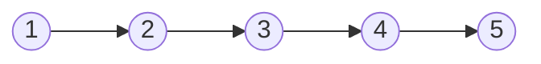
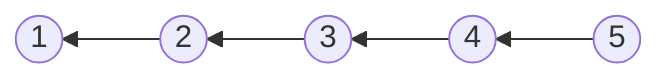
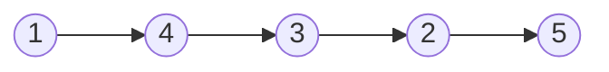

# Linked List Reverse

## Table of Contents

- [x] [206. Reverse Linked List](https://leetcode.cn/problems/reverse-linked-list/) (Easy)
- [x] [92. Reverse Linked List II](https://leetcode.cn/problems/reverse-linked-list-ii/) (Medium)
- [x] [24. Swap Nodes in Pairs](https://leetcode.cn/problems/swap-nodes-in-pairs/) (Medium)
- [x] [25. Reverse Nodes in k-Group](https://leetcode.cn/problems/reverse-nodes-in-k-group/) (Hard)
- [ ] [2074. Reverse Nodes in Even Length Groups](https://leetcode.cn/problems/reverse-nodes-in-even-length-groups/) (Medium)

## 206. Reverse Linked List

-   [LeetCode](https://leetcode.com/problems/reverse-linked-list/) | [LeetCode CH](https://leetcode.cn/problems/reverse-linked-list/) (Easy)

-   Tags: linked list, recursion
- Reverse a singly linked list.





```python title="206. Reverse Linked List - Python Solution"
from typing import Optional

from template import ListNode


# Iterative
def reverseListIterative(head: Optional[ListNode]) -> Optional[ListNode]:
    cur = head
    prev = None

    while cur:
        temp = cur.next
        cur.next = prev

        prev = cur
        cur = temp

    return prev


# Recursive
def reverseListRecursive(head: Optional[ListNode]) -> Optional[ListNode]:
    def reverse(cur, prev):
        if not cur:
            return prev

        temp = cur.next
        cur.next = prev

        return reverse(temp, cur)

    return reverse(head, None)


nums = [1, 2, 3, 4, 5]
head1 = ListNode.create(nums)
print(head1)
# 1 -> 2 -> 3 -> 4 -> 5
print(reverseListIterative(head1))
# 5 -> 4 -> 3 -> 2 -> 1
head2 = ListNode.create(nums)
print(reverseListRecursive(head2))
# 5 -> 4 -> 3 -> 2 -> 1

```

## 92. Reverse Linked List II

-   [LeetCode](https://leetcode.com/problems/reverse-linked-list-ii/) | [LeetCode CH](https://leetcode.cn/problems/reverse-linked-list-ii/) (Medium)

-   Tags: linked list
- Reverse a linked list from position left to position right. Return the linked list after reversing.




```python title="92. Reverse Linked List II - Python Solution"
from typing import Optional

from template import ListNode


# Linked List
def reverseBetween(
    head: Optional[ListNode], left: int, right: int
) -> Optional[ListNode]:
    dummy = ListNode(next=head)
    p0 = dummy
    for _ in range(left - 1):
        p0 = p0.next

    pre = None
    cur = p0.next
    for _ in range(right - left + 1):
        nxt = cur.next
        cur.next = pre
        pre = cur
        cur = nxt

    p0.next.next = cur
    p0.next = pre

    return dummy.next


head = ListNode().create([1, 2, 3, 4, 5])
left = 2
right = 4
print(reverseBetween(head, left, right))
# 1 -> 4 -> 3 -> 2 -> 5

```

## 24. Swap Nodes in Pairs

-   [LeetCode](https://leetcode.com/problems/swap-nodes-in-pairs/) | [LeetCode CH](https://leetcode.cn/problems/swap-nodes-in-pairs/) (Medium)

-   Tags: linked list, recursion
-   Given a linked list, swap every two adjacent nodes and return its head.

```python title="24. Swap Nodes in Pairs - Python Solution"
from typing import Optional

from template import ListNode


# Linked List
def swapPairs(head: Optional[ListNode]) -> Optional[ListNode]:
    dummy = ListNode(0, head)
    n0 = dummy
    n1 = dummy.next

    while n1 and n1.next:
        n2 = n1.next
        n3 = n2.next

        n0.next = n2
        n2.next = n1
        n1.next = n3

        n0 = n1
        n1 = n3

    return dummy.next


nums = [1, 2, 3, 4, 5]
head = ListNode.create(nums)
print(head)
# 1 -> 2 -> 3 -> 4 -> 5
print(swapPairs(head))
# 2 -> 1 -> 4 -> 3 -> 5

```

## 25. Reverse Nodes in k-Group

-   [LeetCode](https://leetcode.com/problems/reverse-nodes-in-k-group/) | [LeetCode CH](https://leetcode.cn/problems/reverse-nodes-in-k-group/) (Hard)

-   Tags: linked list, recursion
```python title="25. Reverse Nodes in k-Group - Python Solution"
from typing import Optional

from template import ListNode


# Linked List
def reverseKGroup(head: Optional[ListNode], k: int) -> Optional[ListNode]:
    n = 0
    cur = head
    while cur:
        n += 1
        cur = cur.next

    p0 = dummy = ListNode(next=head)
    pre = None
    cur = head

    while n >= k:
        n -= k
        for _ in range(k):
            nxt = cur.next
            cur.next = pre
            pre = cur
            cur = nxt

        nxt = p0.next
        nxt.next = cur
        p0.next = pre
        p0 = nxt

    return dummy.next


if __name__ == "__main__":
    head = [1, 2, 3, 4, 5]
    k = 2
    head = ListNode.create(head)
    print(head)  # 1 -> 2 -> 3 -> 4 -> 5
    print(reverseKGroup(head, k))  # 2 -> 1 -> 4 -> 3 -> 5

```

## 2074. Reverse Nodes in Even Length Groups

-   [LeetCode](https://leetcode.com/problems/reverse-nodes-in-even-length-groups/) | [LeetCode CH](https://leetcode.cn/problems/reverse-nodes-in-even-length-groups/) (Medium)

-   Tags: linked list
