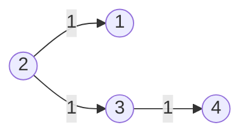
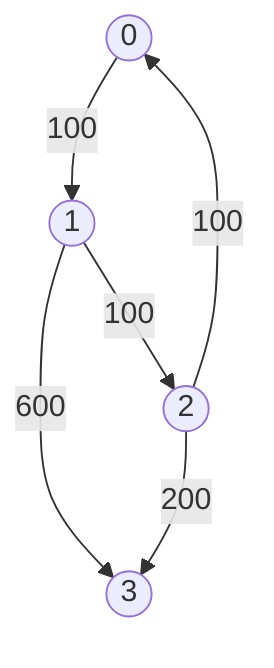

# Shortest Path Single Source Dijkstra

## Table of Contents

- [x] [743. Network Delay Time](https://leetcode.cn/problems/network-delay-time/) (Medium)
- [ ] [3341. Find Minimum Time to Reach Last Room I](https://leetcode.cn/problems/find-minimum-time-to-reach-last-room-i/) (Medium)
- [ ] [3112. Minimum Time to Visit Disappearing Nodes](https://leetcode.cn/problems/minimum-time-to-visit-disappearing-nodes/) (Medium)
- [ ] [2642. Design Graph With Shortest Path Calculator](https://leetcode.cn/problems/design-graph-with-shortest-path-calculator/) (Hard)
- [x] [1514. Path with Maximum Probability](https://leetcode.cn/problems/path-with-maximum-probability/) (Medium)
- [ ] [3342. Find Minimum Time to Reach Last Room II](https://leetcode.cn/problems/find-minimum-time-to-reach-last-room-ii/) (Medium)
- [x] [1631. Path With Minimum Effort](https://leetcode.cn/problems/path-with-minimum-effort/) (Medium)
- [ ] [1786. Number of Restricted Paths From First to Last Node](https://leetcode.cn/problems/number-of-restricted-paths-from-first-to-last-node/) (Medium)
- [ ] [3123. Find Edges in Shortest Paths](https://leetcode.cn/problems/find-edges-in-shortest-paths/) (Hard)
- [x] [1976. Number of Ways to Arrive at Destination](https://leetcode.cn/problems/number-of-ways-to-arrive-at-destination/) (Medium)
- [x] [778. Swim in Rising Water](https://leetcode.cn/problems/swim-in-rising-water/) (Hard)
- [ ] [2662. Minimum Cost of a Path With Special Roads](https://leetcode.cn/problems/minimum-cost-of-a-path-with-special-roads/) (Medium)
- [ ] [3377. Digit Operations to Make Two Integers Equal](https://leetcode.cn/problems/digit-operations-to-make-two-integers-equal/) (Medium)
- [ ] [2045. Second Minimum Time to Reach Destination](https://leetcode.cn/problems/second-minimum-time-to-reach-destination/) (Hard)
- [ ] [3419. Minimize the Maximum Edge Weight of Graph](https://leetcode.cn/problems/minimize-the-maximum-edge-weight-of-graph/) (Medium)
- [x] [882. Reachable Nodes In Subdivided Graph](https://leetcode.cn/problems/reachable-nodes-in-subdivided-graph/) (Hard)
- [ ] [2203. Minimum Weighted Subgraph With the Required Paths](https://leetcode.cn/problems/minimum-weighted-subgraph-with-the-required-paths/) (Hard)
- [ ] [2577. Minimum Time to Visit a Cell In a Grid](https://leetcode.cn/problems/minimum-time-to-visit-a-cell-in-a-grid/) (Hard)
- [ ] [1928. Minimum Cost to Reach Destination in Time](https://leetcode.cn/problems/minimum-cost-to-reach-destination-in-time/) (Hard)
- [x] [787. Cheapest Flights Within K Stops](https://leetcode.cn/problems/cheapest-flights-within-k-stops/) (Medium)
- [ ] [2699. Modify Graph Edge Weights](https://leetcode.cn/problems/modify-graph-edge-weights/) (Hard)
- [ ] [1810. Minimum Path Cost in a Hidden Grid](https://leetcode.cn/problems/minimum-path-cost-in-a-hidden-grid/) (Medium) 👑
- [ ] [2093. Minimum Cost to Reach City With Discounts](https://leetcode.cn/problems/minimum-cost-to-reach-city-with-discounts/) (Medium) 👑
- [ ] [2473. Minimum Cost to Buy Apples](https://leetcode.cn/problems/minimum-cost-to-buy-apples/) (Medium) 👑
- [ ] [2714. Find Shortest Path with K Hops](https://leetcode.cn/problems/find-shortest-path-with-k-hops/) (Hard) 👑
- [ ] [2737. Find the Closest Marked Node](https://leetcode.cn/problems/find-the-closest-marked-node/) (Medium) 👑

## 743. Network Delay Time

-   [LeetCode](https://leetcode.com/problems/network-delay-time/) | [LeetCode CH](https://leetcode.cn/problems/network-delay-time/) (Medium)

-   Tags: depth first search, breadth first search, graph, heap priority queue, shortest path
-   Return the minimum time taken to reach all nodes in a network.



-   Shortest Path Problem: Find the shortest path between two vertices in a graph.
-   Dijkstra's Algorithm
    -   Shortest path algorithm
    -   Weighted graph (non-negative weights)
    -   Data Structure: Heap; Hash Set
    -   Time Complexity: O(E \* logV)
    -   Space Complexity: O(V)

```python title="743. Network Delay Time - Python Solution"
import heapq
from collections import defaultdict
from typing import List

from helper import complexity


# 1. Dijkstra - Set
def networkDelayTime1(times: List[List[int]], n: int, k: int) -> int:
    graph = defaultdict(list)
    for u, v, w in times:
        graph[u].append((v, w))

    heap = [(0, k)]
    visit = set()
    t = 0

    while heap:
        w1, n1 = heapq.heappop(heap)
        if n1 in visit:
            continue

        visit.add(n1)
        t = w1

        for n2, w2 in graph[n1]:
            heapq.heappush(heap, (w1 + w2, n2))

    return t if len(visit) == n else -1


# 2. Dijkstra - Dict
def networkDelayTime2(times: List[List[int]], n: int, k: int) -> int:
    graph = defaultdict(list)
    for u, v, w in times:
        graph[u].append((v, w))

    heap = [(0, k)]
    dist = defaultdict(int)

    while heap:
        w1, n1 = heapq.heappop(heap)
        if n1 in dist:
            continue

        dist[n1] = w1

        for n2, w2 in graph[n1]:
            heapq.heappush(heap, (w1 + w2, n2))

    return max(dist.values()) if len(dist) == n else -1


# Bellman-Ford
def networkDelayTimeBF(times: List[List[int]], n: int, k: int) -> int:
    delay = {i: float("inf") for i in range(1, n + 1)}
    delay[k] = 0

    for _ in range(n - 1):
        for u, v, t in times:
            delay[v] = min(delay[v], delay[u] + t)

    max_delay = max(delay.values())
    return max_delay if max_delay < float("inf") else -1


table = [
    ["Dijkstra", "O(E*logV)", "O(V+E)"],
    ["Bellman-Ford", "O(E*V)", "O(V)"],
]
complexity(table)
# |--------------|-----------|--------|
# | Approach     | Time      | Space  |
# |--------------|-----------|--------|
# | Dijkstra     | O(E*logV) | O(V+E) |
# | Bellman-Ford | O(E*V)    | O(V)   |
# |--------------|-----------|--------|


times = [[2, 1, 1], [2, 3, 1], [3, 4, 1]]
n = 4
k = 2
print(networkDelayTime1(times, n, k))  # 2
print(networkDelayTime2(times, n, k))  # 2
print(networkDelayTimeBF(times, n, k))  # 2

```

## 3341. Find Minimum Time to Reach Last Room I

-   [LeetCode](https://leetcode.com/problems/find-minimum-time-to-reach-last-room-i/) | [LeetCode CH](https://leetcode.cn/problems/find-minimum-time-to-reach-last-room-i/) (Medium)

-   Tags: array, graph, heap priority queue, matrix, shortest path

## 3112. Minimum Time to Visit Disappearing Nodes

-   [LeetCode](https://leetcode.com/problems/minimum-time-to-visit-disappearing-nodes/) | [LeetCode CH](https://leetcode.cn/problems/minimum-time-to-visit-disappearing-nodes/) (Medium)

-   Tags: array, graph, heap priority queue, shortest path

## 2642. Design Graph With Shortest Path Calculator

-   [LeetCode](https://leetcode.com/problems/design-graph-with-shortest-path-calculator/) | [LeetCode CH](https://leetcode.cn/problems/design-graph-with-shortest-path-calculator/) (Hard)

-   Tags: graph, design, heap priority queue, shortest path

## 1514. Path with Maximum Probability

-   [LeetCode](https://leetcode.com/problems/path-with-maximum-probability/) | [LeetCode CH](https://leetcode.cn/problems/path-with-maximum-probability/) (Medium)

-   Tags: array, graph, heap priority queue, shortest path

```python title="1514. Path with Maximum Probability - Python Solution"
import heapq
from collections import defaultdict
from typing import List


# Dijkstra - Dict
def maxProbability1(
    n: int,
    edges: List[List[int]],
    succProb: List[float],
    start_node: int,
    end_node: int,
) -> float:
    graph = defaultdict(list)
    for i, (u, v) in enumerate(edges):
        graph[u].append((v, succProb[i]))
        graph[v].append((u, succProb[i]))

    heap = [(-1, start_node)]
    max_prob = {i: 0.0 for i in range(n)}
    max_prob[start_node] = 1.0

    while heap:
        p1, n1 = heapq.heappop(heap)

        if n1 == end_node:
            return -p1

        for n2, p2 in graph[n1]:
            p2 *= -p1
            if p2 > max_prob[n2]:
                max_prob[n2] = p2
                heapq.heappush(heap, (-p2, n2))

    return 0.0


# Dijkstra - Set
def maxProbability2(
    n: int,
    edges: List[List[int]],
    succProb: List[float],
    start_node: int,
    end_node: int,
) -> float:
    graph = defaultdict(list)
    for i, (u, v) in enumerate(edges):
        graph[u].append((v, succProb[i]))
        graph[v].append((u, succProb[i]))

    heap = [(-1, start_node)]
    visited = set()

    while heap:
        p1, n1 = heapq.heappop(heap)
        visited.add(n1)

        if n1 == end_node:
            return -p1

        for n2, p2 in graph[n1]:
            if n2 not in visited:
                heapq.heappush(heap, (p1 * p2, n2))

    return 0.0


# |------------|-----------|-----------|
# |  Approach  |    Time   |   Space   |
# |------------|-----------|-----------|
# |  Dijkstra  | O(E log V)|   O(E)    |
# |------------|-----------|-----------|


n = 3
edges = [[0, 1], [1, 2], [0, 2]]
succProb = [0.5, 0.5, 0.2]
start = 0
end = 2

print(maxProbability1(n, edges, succProb, start, end))  # 0.25
print(maxProbability2(n, edges, succProb, start, end))  # 0.25

```

## 3342. Find Minimum Time to Reach Last Room II

-   [LeetCode](https://leetcode.com/problems/find-minimum-time-to-reach-last-room-ii/) | [LeetCode CH](https://leetcode.cn/problems/find-minimum-time-to-reach-last-room-ii/) (Medium)

-   Tags: array, graph, heap priority queue, matrix, shortest path

## 1631. Path With Minimum Effort

-   [LeetCode](https://leetcode.com/problems/path-with-minimum-effort/) | [LeetCode CH](https://leetcode.cn/problems/path-with-minimum-effort/) (Medium)

-   Tags: array, binary search, depth first search, breadth first search, union find, heap priority queue, matrix
-   Return the minimum effort required to travel from the top-left to the bottom-right corner.

```python title="1631. Path With Minimum Effort - Python Solution"
import heapq
from typing import List


# Prim
def minimumEffortPath(heights: List[List[int]]) -> int:
    m, n = len(heights), len(heights[0])
    directions = [(0, 1), (1, 0), (0, -1), (-1, 0)]
    visited = [[False] * n for _ in range(m)]
    heap = [(0, 0, 0)]  # (effort, row, col)

    while heap:
        effort, r, c = heapq.heappop(heap)

        if visited[r][c]:
            continue

        if r == m - 1 and c == n - 1:
            return effort

        visited[r][c] = True

        for dr, dc in directions:
            nr, nc = r + dr, c + dc

            if 0 <= nr < m and 0 <= nc < n and not visited[nr][nc]:
                updated = max(effort, abs(heights[r][c] - heights[nr][nc]))
                heapq.heappush(heap, (updated, nr, nc))

    return -1


heights = [[1, 2, 2], [3, 8, 2], [5, 3, 5]]
print(minimumEffortPath(heights))  # 2

```

## 1786. Number of Restricted Paths From First to Last Node

-   [LeetCode](https://leetcode.com/problems/number-of-restricted-paths-from-first-to-last-node/) | [LeetCode CH](https://leetcode.cn/problems/number-of-restricted-paths-from-first-to-last-node/) (Medium)

-   Tags: dynamic programming, graph, topological sort, heap priority queue, shortest path

## 3123. Find Edges in Shortest Paths

-   [LeetCode](https://leetcode.com/problems/find-edges-in-shortest-paths/) | [LeetCode CH](https://leetcode.cn/problems/find-edges-in-shortest-paths/) (Hard)

-   Tags: depth first search, breadth first search, graph, heap priority queue, shortest path

## 1976. Number of Ways to Arrive at Destination

-   [LeetCode](https://leetcode.com/problems/number-of-ways-to-arrive-at-destination/) | [LeetCode CH](https://leetcode.cn/problems/number-of-ways-to-arrive-at-destination/) (Medium)

-   Tags: dynamic programming, graph, topological sort, shortest path

```python title="1976. Number of Ways to Arrive at Destination - Python Solution"
import heapq
from typing import List


# Dijkstra
def countPaths(n: int, roads: List[List[int]]) -> int:
    mod = 10**9 + 7
    graph = [[] for _ in range(n)]
    for u, v, w in roads:
        graph[u].append((v, w))
        graph[v].append((u, w))

    dist = [float("inf") for _ in range(n)]
    dist[0] = 0
    count = [0 for _ in range(n)]
    count[0] = 1

    heap = [(0, 0)]

    while heap:
        d, u = heapq.heappop(heap)
        if d > dist[u]:
            continue

        for v, w in graph[u]:
            if dist[u] + w < dist[v]:
                dist[v] = dist[u] + w
                count[v] = count[u]
                heapq.heappush(heap, (dist[v], v))
            elif dist[u] + w == dist[v]:
                count[v] += count[u]
                count[v] %= mod

    return count[-1]


n = 7
roads = [
    [0, 6, 7],
    [0, 1, 2],
    [1, 2, 3],
    [1, 3, 3],
    [6, 3, 3],
    [3, 5, 1],
    [6, 5, 1],
    [2, 5, 1],
    [0, 4, 5],
    [4, 6, 2],
]
print(countPaths(n, roads))  # 4

```

## 778. Swim in Rising Water

-   [LeetCode](https://leetcode.com/problems/swim-in-rising-water/) | [LeetCode CH](https://leetcode.cn/problems/swim-in-rising-water/) (Hard)

-   Tags: array, binary search, depth first search, breadth first search, union find, heap priority queue, matrix
-   Return the minimum time when you can reach the target.


```python title="778. Swim in Rising Water - Python Solution"
import heapq
from typing import List


# Dijkstra's
def swimInWater(grid: List[List[int]]) -> int:
    n = len(grid)
    visited = set()
    minHeap = [(grid[0][0], 0, 0)]
    directions = [(0, 1), (0, -1), (1, 0), (-1, 0)]

    visited.add((0, 0))

    while minHeap:
        time, r, c = heapq.heappop(minHeap)

        if r == n - 1 and c == n - 1:
            return time

        for dr, dc in directions:
            nr, nc = r + dr, c + dc

            if nr in range(n) and nc in range(n) and (nr, nc) not in visited:
                visited.add((nr, nc))
                heapq.heappush(minHeap, (max(time, grid[nr][nc]), nr, nc))


grid = [
    [0, 1, 2, 3, 4],
    [24, 23, 22, 21, 5],
    [12, 13, 14, 15, 16],
    [11, 17, 18, 19, 20],
    [10, 9, 8, 7, 6],
]
print(swimInWater(grid))  # 16

```

## 2662. Minimum Cost of a Path With Special Roads

-   [LeetCode](https://leetcode.com/problems/minimum-cost-of-a-path-with-special-roads/) | [LeetCode CH](https://leetcode.cn/problems/minimum-cost-of-a-path-with-special-roads/) (Medium)

-   Tags: array, graph, heap priority queue, shortest path

## 3377. Digit Operations to Make Two Integers Equal

-   [LeetCode](https://leetcode.com/problems/digit-operations-to-make-two-integers-equal/) | [LeetCode CH](https://leetcode.cn/problems/digit-operations-to-make-two-integers-equal/) (Medium)

-   Tags: math, graph, heap priority queue, number theory, shortest path

## 2045. Second Minimum Time to Reach Destination

-   [LeetCode](https://leetcode.com/problems/second-minimum-time-to-reach-destination/) | [LeetCode CH](https://leetcode.cn/problems/second-minimum-time-to-reach-destination/) (Hard)

-   Tags: breadth first search, graph, shortest path

## 3419. Minimize the Maximum Edge Weight of Graph

-   [LeetCode](https://leetcode.com/problems/minimize-the-maximum-edge-weight-of-graph/) | [LeetCode CH](https://leetcode.cn/problems/minimize-the-maximum-edge-weight-of-graph/) (Medium)

-   Tags: binary search, depth first search, breadth first search, graph, shortest path

## 882. Reachable Nodes In Subdivided Graph

-   [LeetCode](https://leetcode.com/problems/reachable-nodes-in-subdivided-graph/) | [LeetCode CH](https://leetcode.cn/problems/reachable-nodes-in-subdivided-graph/) (Hard)

-   Tags: graph, heap priority queue, shortest path

```python title="882. Reachable Nodes In Subdivided Graph - Python Solution"
import heapq
from typing import List


# Dijkstra's
def reachableNodes(self, edges: List[List[int]], maxMoves: int, n: int) -> int:
    graph = {i: {} for i in range(n)}
    for u, v, cnt in edges:
        graph[u][v] = cnt
        graph[v][u] = cnt

    heap = [(-maxMoves, 0)]
    seen = {}

    while heap:
        moves, node = heapq.heappop(heap)
        if node in seen:
            continue
        seen[node] = -moves
        for nxt, cnt in graph[node].items():
            movesLeft = -moves - cnt - 1
            if nxt not in seen and movesLeft >= 0:
                heapq.heappush(heap, (-movesLeft, nxt))

    res = len(seen)
    for u, v, cnt in edges:
        res += min(seen.get(u, 0) + seen.get(v, 0), cnt)

    return res


edges = [[0, 1, 10], [0, 2, 1], [1, 2, 2]]
maxMoves = 6
n = 3
print(reachableNodes(None, edges, maxMoves, n))  # 13

```

## 2203. Minimum Weighted Subgraph With the Required Paths

-   [LeetCode](https://leetcode.com/problems/minimum-weighted-subgraph-with-the-required-paths/) | [LeetCode CH](https://leetcode.cn/problems/minimum-weighted-subgraph-with-the-required-paths/) (Hard)

-   Tags: graph, shortest path

## 2577. Minimum Time to Visit a Cell In a Grid

-   [LeetCode](https://leetcode.com/problems/minimum-time-to-visit-a-cell-in-a-grid/) | [LeetCode CH](https://leetcode.cn/problems/minimum-time-to-visit-a-cell-in-a-grid/) (Hard)

-   Tags: array, breadth first search, graph, heap priority queue, matrix, shortest path

## 1928. Minimum Cost to Reach Destination in Time

-   [LeetCode](https://leetcode.com/problems/minimum-cost-to-reach-destination-in-time/) | [LeetCode CH](https://leetcode.cn/problems/minimum-cost-to-reach-destination-in-time/) (Hard)

-   Tags: array, dynamic programming, graph

## 787. Cheapest Flights Within K Stops

-   [LeetCode](https://leetcode.com/problems/cheapest-flights-within-k-stops/) | [LeetCode CH](https://leetcode.cn/problems/cheapest-flights-within-k-stops/) (Medium)

-   Tags: dynamic programming, depth first search, breadth first search, graph, heap priority queue, shortest path
-   Return the cheapest price from `src` to `dst` with at most `K` stops.



<iframe width="560" height="315" src="https://www.youtube.com/embed/5eIK3zUdYmE?si=aBR0VbHXTgNuVlGz" title="YouTube video player" frameborder="0" allow="accelerometer; autoplay; clipboard-write; encrypted-media; gyroscope; picture-in-picture; web-share" referrerpolicy="strict-origin-when-cross-origin" allowfullscreen></iframe>

```python title="787. Cheapest Flights Within K Stops - Python Solution"
import heapq
from collections import defaultdict
from typing import List


# Bellman-Ford
def findCheapestPriceBF(
    n: int, flights: List[List[int]], src: int, dst: int, k: int
) -> int:
    prices = [float("inf") for _ in range(n)]
    prices[src] = 0

    for _ in range(k + 1):
        temp = prices[:]
        for u, v, w in flights:
            temp[v] = min(temp[v], prices[u] + w)
        prices = temp

    return prices[dst] if prices[dst] != float("inf") else -1


# Dijkstra
def findCheapestPriceDijkstra(
    n: int, flights: List[List[int]], src: int, dst: int, k: int
) -> int:
    graph = defaultdict(list)
    for u, v, w in flights:
        graph[u].append((v, w))

    heap = [(0, src, 0)]  # (price, city, stops)
    visited = defaultdict(int)  # {city: stops}

    while heap:
        price, city, stops = heapq.heappop(heap)

        if city == dst:
            return price

        if stops > k:
            continue

        if city in visited and visited[city] <= stops:
            continue

        visited[city] = stops

        for neighbor, cost in graph[city]:
            heapq.heappush(heap, (price + cost, neighbor, stops + 1))

    return -1


# |------------|------------------|---------|
# |  Approach  |       Time       |  Space  |
# |------------|------------------|---------|
# |Bellman-Ford|    O(k * E)      |  O(n)   |
# | Dijkstra   | O(E * log(V))    |  O(n)   |
# |------------|------------------|---------|


n = 4
flights = [[0, 1, 100], [1, 2, 100], [2, 0, 100], [1, 3, 600], [2, 3, 200]]
src = 0
dst = 3
k = 1
print(findCheapestPriceBF(n, flights, src, dst, k))  # 700
print(findCheapestPriceDijkstra(n, flights, src, dst, k))  # 700

```

## 2699. Modify Graph Edge Weights

-   [LeetCode](https://leetcode.com/problems/modify-graph-edge-weights/) | [LeetCode CH](https://leetcode.cn/problems/modify-graph-edge-weights/) (Hard)

-   Tags: graph, heap priority queue, shortest path

## 1810. Minimum Path Cost in a Hidden Grid

-   [LeetCode](https://leetcode.com/problems/minimum-path-cost-in-a-hidden-grid/) | [LeetCode CH](https://leetcode.cn/problems/minimum-path-cost-in-a-hidden-grid/) (Medium)

-   Tags: depth first search, breadth first search, graph, heap priority queue, interactive

## 2093. Minimum Cost to Reach City With Discounts

-   [LeetCode](https://leetcode.com/problems/minimum-cost-to-reach-city-with-discounts/) | [LeetCode CH](https://leetcode.cn/problems/minimum-cost-to-reach-city-with-discounts/) (Medium)

-   Tags: graph, heap priority queue, shortest path

## 2473. Minimum Cost to Buy Apples

-   [LeetCode](https://leetcode.com/problems/minimum-cost-to-buy-apples/) | [LeetCode CH](https://leetcode.cn/problems/minimum-cost-to-buy-apples/) (Medium)

-   Tags: array, graph, heap priority queue, shortest path

## 2714. Find Shortest Path with K Hops

-   [LeetCode](https://leetcode.com/problems/find-shortest-path-with-k-hops/) | [LeetCode CH](https://leetcode.cn/problems/find-shortest-path-with-k-hops/) (Hard)

-   Tags: graph, heap priority queue, shortest path

## 2737. Find the Closest Marked Node

-   [LeetCode](https://leetcode.com/problems/find-the-closest-marked-node/) | [LeetCode CH](https://leetcode.cn/problems/find-the-closest-marked-node/) (Medium)

-   Tags: array, graph, heap priority queue, shortest path
