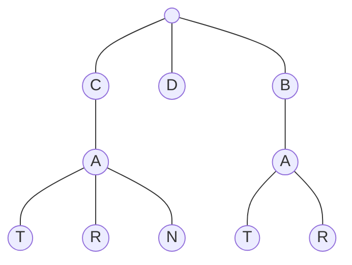

# Trie Basics

- [x] [208. Implement Trie (Prefix Tree)](https://leetcode.cn/problems/implement-trie-prefix-tree/) (Medium)
- [x] [211. Design Add and Search Words Data Structure](https://leetcode.cn/problems/design-add-and-search-words-data-structure/) (Medium)
- [x] [14. Longest Common Prefix](https://leetcode.cn/problems/longest-common-prefix/) (Easy)
- [ ] [648. Replace Words](https://leetcode.cn/problems/replace-words/) (Medium)
- [ ] [677. Map Sum Pairs](https://leetcode.cn/problems/map-sum-pairs/) (Medium)
- [ ] [720. Longest Word in Dictionary](https://leetcode.cn/problems/longest-word-in-dictionary/) (Medium)
- [ ] [1268. Search Suggestions System](https://leetcode.cn/problems/search-suggestions-system/) (Medium)
- [ ] [1233. Remove Sub-Folders from the Filesystem](https://leetcode.cn/problems/remove-sub-folders-from-the-filesystem/) (Medium)
- [ ] [820. Short Encoding of Words](https://leetcode.cn/problems/short-encoding-of-words/) (Medium)
- [ ] [2416. Sum of Prefix Scores of Strings](https://leetcode.cn/problems/sum-of-prefix-scores-of-strings/) (Hard)
- [ ] [2261. K Divisible Elements Subarrays](https://leetcode.cn/problems/k-divisible-elements-subarrays/) (Medium)
- [ ] [1804. Implement Trie II (Prefix Tree)](https://leetcode.cn/problems/implement-trie-ii-prefix-tree/) (Medium) 👑
- [ ] [2168. Unique Substrings With Equal Digit Frequency](https://leetcode.cn/problems/unique-substrings-with-equal-digit-frequency/) (Medium) 👑

## 208. Implement Trie (Prefix Tree)

-   [LeetCode](https://leetcode.com/problems/implement-trie-prefix-tree/) | [LeetCode CH](https://leetcode.cn/problems/implement-trie-prefix-tree/) (Medium)

-   Tags: hash table, string, design, trie
### Trie

- A trie is a tree-like data structure whose nodes store the letters of an alphabet.



```python title="208. Implement Trie (Prefix Tree) - Python Solution"
class TrieNode:
    def __init__(self):
        self.children = {}
        self.endOfWord = None


class Trie:
    def __init__(self):
        self.root = TrieNode()

    def insert(self, word: str) -> None:
        node = self.root

        for c in word:
            if c not in node.children:
                node.children[c] = TrieNode()
            node = node.children[c]
        node.endOfWord = True

    def search(self, word: str) -> bool:
        node = self.root

        for c in word:
            if c not in node.children:
                return False
            node = node.children[c]
        return node.endOfWord

    def startsWith(self, prefix: str) -> bool:
        node = self.root

        for c in prefix:
            if c not in node.children:
                return False
            node = node.children[c]
        return True


# Your Trie object will be instantiated and called as such:
obj = Trie()
obj.insert("apple")
print(obj.search("word"))  # False
print(obj.startsWith("app"))  # True

```

## 211. Design Add and Search Words Data Structure

-   [LeetCode](https://leetcode.com/problems/design-add-and-search-words-data-structure/) | [LeetCode CH](https://leetcode.cn/problems/design-add-and-search-words-data-structure/) (Medium)

-   Tags: string, depth first search, design, trie

```python title="211. Design Add and Search Words Data Structure - Python Solution"
class TrieNode:
    def __init__(self):
        self.children = {}
        self.word = False


class WordDictionary:
    def __init__(self):
        self.root = TrieNode()

    def addWord(self, word: str) -> None:
        node = self.root

        for c in word:
            if c not in node.children:
                node.children[c] = TrieNode()
            node = node.children[c]
        node.word = True

    def search(self, word: str) -> bool:

        def dfs(j, root):
            node = root

            for i in range(j, len(word)):
                c = word[i]

                if c == ".":
                    for child in node.children.values():
                        if dfs(i + 1, child):
                            return True
                    return False
                else:
                    if c not in node.children:
                        return False
                    node = node.children[c]
            return node.word

        return dfs(0, self.root)


# Your WordDictionary object will be instantiated and called as such:
obj = WordDictionary()
obj.addWord("word")
print(obj.search("word"))
print(obj.search("w.rd"))

```

## 14. Longest Common Prefix

-   [LeetCode](https://leetcode.com/problems/longest-common-prefix/) | [LeetCode CH](https://leetcode.cn/problems/longest-common-prefix/) (Easy)

-   Tags: string, trie

```python title="14. Longest Common Prefix - Python Solution"
from typing import List


# Horizontal Scanning
def longestCommonPrefixHorizontal(strs: List[str]) -> str:
    if not strs:
        return ""

    prefix = strs[0]
    for i in range(1, len(strs)):
        while not strs[i].startswith(prefix):
            prefix = prefix[:-1]
            if not prefix:
                return ""

    return prefix


# Vertical Scanning
def longestCommonPrefixVertical(strs: List[str]) -> str:
    if not strs:
        return ""

    for i in range(len(strs[0])):
        char = strs[0][i]
        for j in range(1, len(strs)):
            if i >= len(strs[j]) or strs[j][i] != char:
                return strs[0][:i]

    return strs[0]


# Divide and Conquer
def longestCommonPrefixDivideConquer(strs: List[str]) -> str:
    if not strs:
        return ""

    def merge(left, right):
        n = min(len(left), len(right))
        for i in range(n):
            if left[i] != right[i]:
                return left[:i]
        return left[:n]

    def helper(strs, start, end):
        if start == end:
            return strs[start]
        mid = start + (end - start) // 2
        left = helper(strs, start, mid)
        right = helper(strs, mid + 1, end)
        return merge(left, right)

    return helper(strs, 0, len(strs) - 1)


# Binary Search
def longestCommonPrefixBinarySearch(strs: List[str]) -> str:
    if not strs:
        return ""

    def isCommonPrefix(strs, length):
        prefix = strs[0][:length]
        return all(s.startswith(prefix) for s in strs)

    minLen = min(len(s) for s in strs)
    low, high = 0, minLen
    while low < high:
        mid = low + (high - low) // 2
        if isCommonPrefix(strs, mid + 1):
            low = mid + 1
        else:
            high = mid

    return strs[0][:low]


strs = ["flower", "flow", "flight"]
print(longestCommonPrefixHorizontal(strs))  # "fl"
print(longestCommonPrefixVertical(strs))  # "fl"
print(longestCommonPrefixDivideConquer(strs))  # "fl"
print(longestCommonPrefixBinarySearch(strs))  # "fl"

```

## 648. Replace Words

-   [LeetCode](https://leetcode.com/problems/replace-words/) | [LeetCode CH](https://leetcode.cn/problems/replace-words/) (Medium)

-   Tags: array, hash table, string, trie

## 677. Map Sum Pairs

-   [LeetCode](https://leetcode.com/problems/map-sum-pairs/) | [LeetCode CH](https://leetcode.cn/problems/map-sum-pairs/) (Medium)

-   Tags: hash table, string, design, trie

## 720. Longest Word in Dictionary

-   [LeetCode](https://leetcode.com/problems/longest-word-in-dictionary/) | [LeetCode CH](https://leetcode.cn/problems/longest-word-in-dictionary/) (Medium)

-   Tags: array, hash table, string, trie, sorting

## 1268. Search Suggestions System

-   [LeetCode](https://leetcode.com/problems/search-suggestions-system/) | [LeetCode CH](https://leetcode.cn/problems/search-suggestions-system/) (Medium)

-   Tags: array, string, binary search, trie, sorting, heap priority queue

## 1233. Remove Sub-Folders from the Filesystem

-   [LeetCode](https://leetcode.com/problems/remove-sub-folders-from-the-filesystem/) | [LeetCode CH](https://leetcode.cn/problems/remove-sub-folders-from-the-filesystem/) (Medium)

-   Tags: array, string, depth first search, trie

## 820. Short Encoding of Words

-   [LeetCode](https://leetcode.com/problems/short-encoding-of-words/) | [LeetCode CH](https://leetcode.cn/problems/short-encoding-of-words/) (Medium)

-   Tags: array, hash table, string, trie

## 2416. Sum of Prefix Scores of Strings

-   [LeetCode](https://leetcode.com/problems/sum-of-prefix-scores-of-strings/) | [LeetCode CH](https://leetcode.cn/problems/sum-of-prefix-scores-of-strings/) (Hard)

-   Tags: array, string, trie, counting

## 2261. K Divisible Elements Subarrays

-   [LeetCode](https://leetcode.com/problems/k-divisible-elements-subarrays/) | [LeetCode CH](https://leetcode.cn/problems/k-divisible-elements-subarrays/) (Medium)

-   Tags: array, hash table, trie, rolling hash, hash function, enumeration

## 1804. Implement Trie II (Prefix Tree)

-   [LeetCode](https://leetcode.com/problems/implement-trie-ii-prefix-tree/) | [LeetCode CH](https://leetcode.cn/problems/implement-trie-ii-prefix-tree/) (Medium)

-   Tags: hash table, string, design, trie

## 2168. Unique Substrings With Equal Digit Frequency

-   [LeetCode](https://leetcode.com/problems/unique-substrings-with-equal-digit-frequency/) | [LeetCode CH](https://leetcode.cn/problems/unique-substrings-with-equal-digit-frequency/) (Medium)

-   Tags: hash table, string, rolling hash, counting, hash function
