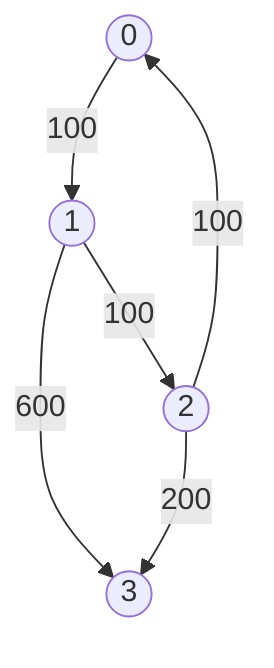

# Dijkstra's

## Table of Contents

- [x] [787. Cheapest Flights Within K Stops](https://leetcode.cn/problems/cheapest-flights-within-k-stops/) (Medium)
- [x] [1514. Path with Maximum Probability](https://leetcode.cn/problems/path-with-maximum-probability/) (Medium)
- [x] [505. The Maze II](https://leetcode.cn/problems/the-maze-ii/) (Medium) 👑
- [x] [499. The Maze III](https://leetcode.cn/problems/the-maze-iii/) (Hard) 👑

## 787. Cheapest Flights Within K Stops

-   [LeetCode](https://leetcode.com/problems/cheapest-flights-within-k-stops/) | [LeetCode CH](https://leetcode.cn/problems/cheapest-flights-within-k-stops/) (Medium)

-   Tags: dynamic programming, depth first search, breadth first search, graph, heap priority queue, shortest path
-   Return the cheapest price from `src` to `dst` with at most `K` stops.



<iframe width="560" height="315" src="https://www.youtube.com/embed/5eIK3zUdYmE?si=aBR0VbHXTgNuVlGz" title="YouTube video player" frameborder="0" allow="accelerometer; autoplay; clipboard-write; encrypted-media; gyroscope; picture-in-picture; web-share" referrerpolicy="strict-origin-when-cross-origin" allowfullscreen></iframe>

```python title="787. Cheapest Flights Within K Stops - Python Solution"
import heapq
from collections import defaultdict
from typing import List


# Bellman-Ford
def findCheapestPriceBF(
    n: int, flights: List[List[int]], src: int, dst: int, k: int
) -> int:
    prices = [float("inf") for _ in range(n)]
    prices[src] = 0

    for _ in range(k + 1):
        temp = prices[:]
        for u, v, w in flights:
            temp[v] = min(temp[v], prices[u] + w)
        prices = temp

    return prices[dst] if prices[dst] != float("inf") else -1


# Dijkstra
def findCheapestPriceDijkstra(
    n: int, flights: List[List[int]], src: int, dst: int, k: int
) -> int:
    graph = defaultdict(list)
    for u, v, w in flights:
        graph[u].append((v, w))

    heap = [(0, src, 0)]  # (price, city, stops)
    visited = defaultdict(int)  # {city: stops}

    while heap:
        price, city, stops = heapq.heappop(heap)

        if city == dst:
            return price

        if stops > k:
            continue

        if city in visited and visited[city] <= stops:
            continue

        visited[city] = stops

        for neighbor, cost in graph[city]:
            heapq.heappush(heap, (price + cost, neighbor, stops + 1))

    return -1


# |------------|------------------|---------|
# |  Approach  |       Time       |  Space  |
# |------------|------------------|---------|
# |Bellman-Ford|    O(k * E)      |  O(n)   |
# | Dijkstra   | O(E * log(V))    |  O(n)   |
# |------------|------------------|---------|


n = 4
flights = [[0, 1, 100], [1, 2, 100], [2, 0, 100], [1, 3, 600], [2, 3, 200]]
src = 0
dst = 3
k = 1
print(findCheapestPriceBF(n, flights, src, dst, k))  # 700
print(findCheapestPriceDijkstra(n, flights, src, dst, k))  # 700

```

## 1514. Path with Maximum Probability

-   [LeetCode](https://leetcode.com/problems/path-with-maximum-probability/) | [LeetCode CH](https://leetcode.cn/problems/path-with-maximum-probability/) (Medium)

-   Tags: array, graph, heap priority queue, shortest path
```python title="1514. Path with Maximum Probability - Python Solution"
import heapq
from collections import defaultdict
from typing import List


# Dijkstra - Dict
def maxProbability1(
    n: int,
    edges: List[List[int]],
    succProb: List[float],
    start_node: int,
    end_node: int,
) -> float:
    graph = defaultdict(list)
    for i, (u, v) in enumerate(edges):
        graph[u].append((v, succProb[i]))
        graph[v].append((u, succProb[i]))

    heap = [(-1, start_node)]
    max_prob = {i: 0.0 for i in range(n)}
    max_prob[start_node] = 1.0

    while heap:
        p1, n1 = heapq.heappop(heap)

        if n1 == end_node:
            return -p1

        for n2, p2 in graph[n1]:
            p2 *= -p1
            if p2 > max_prob[n2]:
                max_prob[n2] = p2
                heapq.heappush(heap, (-p2, n2))

    return 0.0


# Dijkstra - Set
def maxProbability2(
    n: int,
    edges: List[List[int]],
    succProb: List[float],
    start_node: int,
    end_node: int,
) -> float:
    graph = defaultdict(list)
    for i, (u, v) in enumerate(edges):
        graph[u].append((v, succProb[i]))
        graph[v].append((u, succProb[i]))

    heap = [(-1, start_node)]
    visited = set()

    while heap:
        p1, n1 = heapq.heappop(heap)
        visited.add(n1)

        if n1 == end_node:
            return -p1

        for n2, p2 in graph[n1]:
            if n2 not in visited:
                heapq.heappush(heap, (p1 * p2, n2))

    return 0.0


# |------------|-----------|-----------|
# |  Approach  |    Time   |   Space   |
# |------------|-----------|-----------|
# |  Dijkstra  | O(E log V)|   O(E)    |
# |------------|-----------|-----------|


n = 3
edges = [[0, 1], [1, 2], [0, 2]]
succProb = [0.5, 0.5, 0.2]
start = 0
end = 2

print(maxProbability1(n, edges, succProb, start, end))  # 0.25
print(maxProbability2(n, edges, succProb, start, end))  # 0.25

```

## 505. The Maze II

-   [LeetCode](https://leetcode.com/problems/the-maze-ii/) | [LeetCode CH](https://leetcode.cn/problems/the-maze-ii/) (Medium)

-   Tags: array, depth first search, breadth first search, graph, heap priority queue, matrix, shortest path
```python title="505. The Maze II - Python Solution"
import heapq
from typing import List


# Dijkstra
def shortestDistance(
    maze: List[List[int]], start: List[int], destination: List[int]
) -> int:
    directions = [(0, 1), (0, -1), (1, 0), (-1, 0)]
    m, n = len(maze), len(maze[0])

    dist = [[float("inf")] * n for _ in range(m)]
    dist[start[0]][start[1]] = 0

    heap = [(0, start[0], start[1])]

    while heap:
        d, r, c = heapq.heappop(heap)

        if [r, c] == destination:
            return d

        for dr, dc in directions:
            nr, nc, nd = r, c, d

            while (
                0 <= nr + dr < m
                and 0 <= nc + dc < n
                and maze[nr + dr][nc + dc] == 0
            ):
                nr += dr
                nc += dc
                nd += 1

            if nd < dist[nr][nc]:
                dist[nr][nc] = nd
                heapq.heappush(heap, (nd, nr, nc))

    return -1


maze = [
    [0, 0, 1, 0, 0],
    [0, 0, 0, 0, 0],
    [0, 0, 0, 1, 0],
    [1, 1, 0, 1, 1],
    [0, 0, 0, 0, 0],
]
start = [0, 4]
destination = [4, 4]
print(shortestDistance(maze, start, destination))  # 12

```

## 499. The Maze III

-   [LeetCode](https://leetcode.com/problems/the-maze-iii/) | [LeetCode CH](https://leetcode.cn/problems/the-maze-iii/) (Hard)

-   Tags: array, string, depth first search, breadth first search, graph, heap priority queue, matrix, shortest path
```python title="499. The Maze III - Python Solution"
import heapq
from typing import List


# Dijkstra
def findShortestWay(
    maze: List[List[int]], ball: List[int], hole: List[int]
) -> str:
    directions = [(-1, 0, "u"), (1, 0, "d"), (0, -1, "l"), (0, 1, "r")]
    m, n = len(maze), len(maze[0])

    dist = [[float("inf")] * n for _ in range(m)]
    dist[ball[0]][ball[1]] = 0

    paths = [[""] * n for _ in range(m)]
    paths[ball[0]][ball[1]] = ""

    heap = [(0, "", ball[0], ball[1])]

    while heap:
        d, path, x, y = heapq.heappop(heap)

        if [x, y] == hole:
            return path

        for dx, dy, direction in directions:
            nx, ny, nd = x, y, d

            while (
                0 <= nx + dx < m
                and 0 <= ny + dy < n
                and maze[nx + dx][ny + dy] == 0
            ):
                nx += dx
                ny += dy
                nd += 1

                if [nx, ny] == hole:
                    break

            new_path = path + direction
            if nd < dist[nx][ny] or (
                nd == dist[nx][ny] and new_path < paths[nx][ny]
            ):
                dist[nx][ny] = nd
                paths[nx][ny] = new_path
                heapq.heappush(heap, (nd, new_path, nx, ny))

    return "impossible"


maze = [
    [0, 0, 0, 0, 0],
    [1, 1, 0, 0, 1],
    [0, 0, 0, 0, 0],
    [0, 1, 0, 0, 1],
    [0, 1, 0, 0, 0],
]
ball = [4, 3]
hole = [0, 1]
print(findShortestWay(maze, ball, hole))  # "lul"

```
