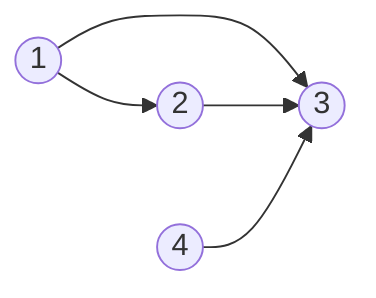

# Graph Theory

- [x] [997. Find the Town Judge](https://leetcode.cn/problems/find-the-town-judge/) (Easy)
- [x] [1557. Minimum Number of Vertices to Reach All Nodes](https://leetcode.cn/problems/minimum-number-of-vertices-to-reach-all-nodes/) (Medium)
- [x] [1615. Maximal Network Rank](https://leetcode.cn/problems/maximal-network-rank/) (Medium)
- [x] [785. Is Graph Bipartite?](https://leetcode.cn/problems/is-graph-bipartite/) (Medium)
- [x] [261. Graph Valid Tree](https://leetcode.cn/problems/graph-valid-tree/) (Medium) 👑

## 997. Find the Town Judge

-   [LeetCode](https://leetcode.com/problems/find-the-town-judge/) | [LeetCode CH](https://leetcode.cn/problems/find-the-town-judge/) (Easy)

-   Tags: array, hash table, graph
-   `trust = [[1, 3], [2, 3], [1, 2], [4, 3]]`



```python title="997. Find the Town Judge - Python Solution"
from typing import List


# Graph
def findJudge(n: int, trust: List[List[int]]) -> int:
    indegree = {i: 0 for i in range(1, n + 1)}
    outdegree = {i: 0 for i in range(1, n + 1)}

    for a, b in trust:
        outdegree[a] += 1
        indegree[b] += 1

    for i in range(1, n + 1):
        if indegree[i] == n - 1 and outdegree[i] == 0:
            return i

    return -1


n = 4
trust = [[1, 3], [2, 3], [1, 2], [4, 3]]
print(findJudge(n, trust))  # 4

```

## 1557. Minimum Number of Vertices to Reach All Nodes

-   [LeetCode](https://leetcode.com/problems/minimum-number-of-vertices-to-reach-all-nodes/) | [LeetCode CH](https://leetcode.cn/problems/minimum-number-of-vertices-to-reach-all-nodes/) (Medium)

-   Tags: graph
- Return a list of integers representing the minimum number of vertices needed to traverse all the nodes.
- ✅ Return the vertices with indegree 0.


- `edges = [[0, 1], [0, 2], [2, 5], [3, 4], [4, 2]]`
- Initialization

|   `src`   |  0  |  0  |  2  |  3  |  4  |     |
| :-------: | :-: | :-: | :-: | :-: | :-: | :-: |
|   `dst`   |  1  |  2  |  5  |  4  |  2  |     |
|   node    |  0  |  1  |  2  |  3  |  4  |  5  |
| in-degree |  0  |  0  |  0  |  0  |  0  |  0  |

|   `src`   |   0   |   0   |  2  |  3  |  4  |     |
| :-------: | :---: | :---: | :-: | :-: | :-: | :-: |
|   `dst`   | **1** |   2   |  5  |  4  |  2  |     |
|   node    |   0   | **1** |  2  |  3  |  4  |  5  |
| in-degree |   0   | **1** |  0  |  0  |  0  |  0  |

|   `src`   |  0  |   0   |   2   |  3  |  4  |     |
| :-------: | :-: | :---: | :---: | :-: | :-: | :-: |
|   `dst`   |  1  | **2** |   5   |  4  |  2  |     |
|   node    |  0  |   1   | **2** |  3  |  4  |  5  |
| in-degree |  0  |   1   | **1** |  0  |  0  |  0  |

|   `src`   |  0  |  0  |   2   |  3  |  4  |       |
| :-------: | :-: | :-: | :---: | :-: | :-: | :---: |
|   `dst`   |  1  |  2  | **5** |  4  |  2  |       |
|   node    |  0  |  1  |   2   |  3  |  4  | **5** |
| in-degree |  0  |  1  |   1   |  0  |  0  | **1** |

|   `src`   |  0  |  0  |  2  |   3   |   4   |     |
| :-------: | :-: | :-: | :-: | :---: | :---: | :-: |
|   `dst`   |  1  |  2  |  5  | **4** |   2   |     |
|   node    |  0  |  1  |  2  |   3   | **4** |  5  |
| in-degree |  0  |  1  |  1  |   0   | **1** |  1  |

|   `src`   |  0  |  0  |   2   |  3  |   4   |     |
| :-------: | :-: | :-: | :---: | :-: | :---: | :-: |
|   `dst`   |  1  |  2  |   5   |  4  | **2** |     |
|   node    |  0  |  1  | **2** |  3  |   4   |  5  |
| in-degree |  0  |  1  | **2** |  0  |   1   |  1  |

```python title="1557. Minimum Number of Vertices to Reach All Nodes - Python Solution"
from typing import List


# Graph
def findSmallestSetOfVertices(n: int, edges: List[List[int]]) -> List[int]:
    indegree = {i: 0 for i in range(n)}

    for a, b in edges:
        indegree[b] += 1

    return [i for i in range(n) if indegree[i] == 0]


n = 6
edges = [[0, 1], [0, 2], [2, 5], [3, 4], [4, 2]]
print(findSmallestSetOfVertices(n, edges))  # [0, 3]

```

## 1615. Maximal Network Rank

-   [LeetCode](https://leetcode.com/problems/maximal-network-rank/) | [LeetCode CH](https://leetcode.cn/problems/maximal-network-rank/) (Medium)

-   Tags: graph

```python title="1615. Maximal Network Rank - Python Solution"
from collections import defaultdict
from typing import List


# Graph
def maximalNetworkRank(n: int, roads: List[List[int]]) -> int:
    degree = defaultdict(int)
    roads_set = set(map(tuple, roads))

    for a, b in roads_set:
        degree[a] += 1
        degree[b] += 1

    rank = 0

    for i in range(n - 1):
        for j in range(i + 1, n):
            if (i, j) in roads_set or (j, i) in roads_set:
                rank = max(rank, degree[i] + degree[j] - 1)
            else:
                rank = max(rank, degree[i] + degree[j])

    return rank


n = 4
roads = [[0, 1], [0, 3], [1, 2], [1, 3]]
print(maximalNetworkRank(n, roads))  # 4

```

## 785. Is Graph Bipartite?

-   [LeetCode](https://leetcode.com/problems/is-graph-bipartite/) | [LeetCode CH](https://leetcode.cn/problems/is-graph-bipartite/) (Medium)

-   Tags: depth first search, breadth first search, union find, graph
-   Determine if a graph is bipartite.

How to group

|          | Uncolored | Color 1 | Color 2 | Operation   |
| -------- | --------- | ------- | ------- | ----------- |
| Method 1 | -1        | 0       | 1       | `1 - color` |
| Method 2 | 0         | 1       | -1      | `-color`    |

```python title="785. Is Graph Bipartite? - Python Solution"
from collections import deque
from typing import List


# BFS
def isBipartiteBFS(graph: List[List[int]]) -> bool:
    n = len(graph)
    # -1: not colored; 0: blue; 1: red
    color = [-1 for _ in range(n)]

    def bfs(node):
        q = deque([node])
        color[node] = 0

        while q:
            cur = q.popleft()

            for neighbor in graph[cur]:
                if color[neighbor] == -1:
                    color[neighbor] = 1 - color[cur]
                    q.append(neighbor)
                elif color[neighbor] == color[cur]:
                    return False
        return True

    for i in range(n):
        if color[i] == -1:
            if not bfs(i):
                return False

    return True


# DFS
def isBipartiteDFS(graph: List[List[int]]) -> bool:
    n = len(graph)
    # -1: not colored; 0: blue; 1: red
    color = [-1] * n

    def dfs(node, c):
        color[node] = c
        for neighbor in graph[node]:
            if color[neighbor] == -1:
                if not dfs(neighbor, 1 - c):
                    return False
            elif color[neighbor] == c:
                return False
        return True

    for i in range(n):
        if color[i] == -1:
            if not dfs(i, 0):
                return False

    return True


# |------------|------- |---------|
# |  Approach  |  Time  |  Space  |
# |------------|--------|---------|
# |    BFS     | O(V+E) |  O(V)   |
# |    DFS     | O(V+E) |  O(V)   |
# |------------|--------|---------|


graph = [[1, 2, 3], [0, 2], [0, 1, 3], [0, 2]]
print(isBipartiteBFS(graph))  # False
print(isBipartiteDFS(graph))  # False

```

## 261. Graph Valid Tree

-   [LeetCode](https://leetcode.com/problems/graph-valid-tree/) | [LeetCode CH](https://leetcode.cn/problems/graph-valid-tree/) (Medium)

-   Tags: depth first search, breadth first search, union find, graph

```python title="261. Graph Valid Tree - Python Solution"
from collections import defaultdict
from typing import List


# Graph
def validTree(n: int, edges: List[List[int]]) -> bool:
    if n == 0:
        return False
    if len(edges) != n - 1:
        return False

    graph = defaultdict(list)
    for u, v in edges:
        graph[u].append(v)
        graph[v].append(u)

    visited = set()

    def dfs(node, parent):
        if node in visited:
            return False
        visited.add(node)
        for neighbor in graph[node]:
            if neighbor != parent and not dfs(neighbor, node):
                return False
        return True

    return dfs(0, -1) and len(visited) == n


print(validTree(5, [[0, 1], [0, 2], [0, 3], [1, 4]]))  # True
print(validTree(5, [[0, 1], [1, 2], [2, 3], [1, 3], [1, 4]]))  # False

```
