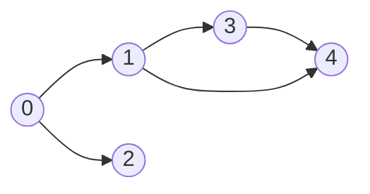
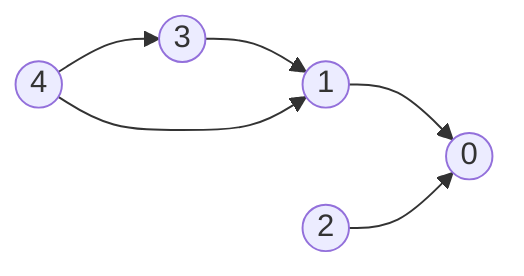
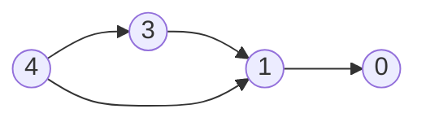
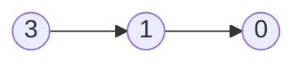
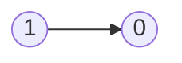
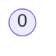

# Graph

- [x] [733. Flood Fill](https://leetcode.cn/problems/flood-fill/) (Easy)
- [x] [542. 01 Matrix](https://leetcode.cn/problems/01-matrix/) (Medium)
- [x] [133. Clone Graph](https://leetcode.cn/problems/clone-graph/) (Medium)
- [x] [207. Course Schedule](https://leetcode.cn/problems/course-schedule/) (Medium)
- [x] [200. Number of Islands](https://leetcode.cn/problems/number-of-islands/) (Medium)
- [x] [994. Rotting Oranges](https://leetcode.cn/problems/rotting-oranges/) (Medium)
- [x] [721. Accounts Merge](https://leetcode.cn/problems/accounts-merge/) (Medium)
- [x] [79. Word Search](https://leetcode.cn/problems/word-search/) (Medium)
- [x] [310. Minimum Height Trees](https://leetcode.cn/problems/minimum-height-trees/) (Medium)
- [x] [127. Word Ladder](https://leetcode.cn/problems/word-ladder/) (Hard)

## 733. Flood Fill

-   [LeetCode](https://leetcode.com/problems/flood-fill/) | [LeetCode CH](https://leetcode.cn/problems/flood-fill/) (Easy)

-   Tags: array, depth first search, breadth first search, matrix
-   Replace all the pixels of the same color starting from the given pixel.
-   In other words, find the connected component of the starting pixel and change the color of all the pixels in that component.
-   Edge cases: If the starting pixel is already the target color, return the image as it is.
-   **Flood Fill** is essentially a graph traversal algorithm (like BFS or DFS) applied to matrices (2D grids).
    It checks adjacent cells (up, down, left, right) of a starting point to determine whether they belong to the same region.
    Typically, it involves modifying or marking the cells that belong to the same connected component.

{width=300px}


|  1  |   1   |  1  |
| :-: | :---: | :-: |
|  1  | ==1== |  0  |
|  1  |   0   |  1  |

|  1  |   1   |  1  |
| :-: | :---: | :-: |
|  1  | ==2== |  0  |
|  1  |   0   |  1  |

|   1   | ==2== |  1  |
| :---: | :---: | :-: |
| ==2== | ==2== |  0  |
|   1   |   0   |  1  |

| ==2== | ==2== | ==2== |
| :---: | :---: | :---: |
| ==2== | ==2== |   0   |
| ==2== |   0   |   1   |

```python title="733. Flood Fill - Python Solution"
from collections import deque
from typing import List


# DFS
def floodFillDFS(
    image: List[List[int]], sr: int, sc: int, color: int
) -> List[List[int]]:

    org = image[sr][sc]
    m, n = len(image), len(image[0])

    if org == color:
        return image

    def dfs(r, c):
        if r < 0 or r >= m or c < 0 or c >= n or image[r][c] != org:
            return None

        image[r][c] = color

        dfs(r - 1, c)
        dfs(r + 1, c)
        dfs(r, c - 1)
        dfs(r, c + 1)

    dfs(sr, sc)

    return image


# BFS
def floodFillBFS(
    image: List[List[int]], sr: int, sc: int, color: int
) -> List[List[int]]:

    org = image[sr][sc]
    m, n = len(image), len(image[0])
    dirs = [(1, 0), (-1, 0), (0, 1), (0, -1)]

    if org == color:
        return image

    q = deque([(sr, sc)])

    while q:
        r, c = q.popleft()
        image[r][c] = color

        for dr, dc in dirs:
            nr, nc = r + dr, c + dc

            if 0 <= nr < m and 0 <= nc < n and image[nr][nc] == org:
                q.append((nr, nc))

    return image


image = [[1, 1, 1], [1, 1, 0], [1, 0, 1]]
sr = 1
sc = 1

print(floodFillDFS(image, sr, sc, 2))
# [[2, 2, 2], [2, 2, 0], [2, 0, 1]]
print(floodFillBFS(image, sr, sc, 2))
# [[2, 2, 2], [2, 2, 0], [2, 0, 1]]

```

## 542. 01 Matrix

-   [LeetCode](https://leetcode.com/problems/01-matrix/) | [LeetCode CH](https://leetcode.cn/problems/01-matrix/) (Medium)

-   Tags: array, dynamic programming, breadth first search, matrix

```python title="542. 01 Matrix - Python Solution"
from collections import deque
from typing import List


# BFS
def updateMatrix(mat: List[List[int]]) -> List[List[int]]:
    m, n = len(mat), len(mat[0])
    directions = [(0, 1), (0, -1), (1, 0), (-1, 0)]
    dist = [[float("inf")] * n for _ in range(m)]
    q = deque()

    for i in range(m):
        for j in range(n):
            if mat[i][j] == 0:
                dist[i][j] = 0
                q.append((i, j))

    while q:
        r, c = q.popleft()

        for dr, dc in directions:
            nr, nc = r + dr, c + dc
            if 0 <= nr < m and 0 <= nc < n and dist[nr][nc] > dist[r][c] + 1:
                dist[nr][nc] = dist[r][c] + 1
                q.append((nr, nc))

    return dist


mat = [[0, 0, 0], [0, 1, 0], [1, 1, 1]]
print(updateMatrix(mat))
# [[0, 0, 0], [0, 1, 0], [1, 2, 1]]

```

## 133. Clone Graph

-   [LeetCode](https://leetcode.com/problems/clone-graph/) | [LeetCode CH](https://leetcode.cn/problems/clone-graph/) (Medium)

-   Tags: hash table, depth first search, breadth first search, graph

```python title="133. Clone Graph - Python Solution"
from collections import deque
from typing import Optional


class Node:
    def __init__(self, val=0, neighbors=None):
        self.val = val
        self.neighbors = neighbors if neighbors is not None else []


# 1. DFS
def cloneGraphDFS(node: Optional["Node"]) -> Optional["Node"]:
    if not node:
        return None

    cloned = {}  # {old: new}

    def dfs(node):
        if node in cloned:
            return cloned[node]

        new = Node(node.val)
        cloned[node] = new

        for neighbor in node.neighbors:
            new.neighbors.append(dfs(neighbor))

        return new

    return dfs(node)


# 2. BFS
def cloneGraphBFS(node: Optional["Node"]) -> Optional["Node"]:
    if not node:
        return None

    cloned = {node: Node(node.val)}
    q = deque([node])

    while q:
        cur = q.popleft()

        for neighbor in cur.neighbors:
            if neighbor not in cloned:
                cloned[neighbor] = Node(neighbor.val)
                q.append(neighbor)

            cloned[cur].neighbors.append(cloned[neighbor])

    return cloned[node]

```

## 207. Course Schedule

-   [LeetCode](https://leetcode.com/problems/course-schedule/) | [LeetCode CH](https://leetcode.cn/problems/course-schedule/) (Medium)

-   Tags: depth first search, breadth first search, graph, topological sort
-   Return true if it is possible to finish all courses, otherwise return false.
-   Dependency relationships imply the topological sort algorithm.
-   Cycle detection
-   Topological Sort
    -   DAG (Directed Acyclic Graph)
    -   Time complexity: O(V+E)
    -   Space complexity: O(V+E)
    -   Prerequisites: Indegree (Look at the problem 1557. Minimum Number of Vertices to Reach All Nodes)
        -   Indegree: Number of incoming edges to a vertex
    -   Applications: task scheduling, course scheduling, build systems, dependency resolution, compiler optimization, etc.

{width=300px}

{width=300px}

Course to prerequisites mapping



Prerequisites to course mapping



| course       | 0   | 0   | 1   | 1   | 3   |
| ------------ | --- | --- | --- | --- | --- |
| prerequisite | 1   | 2   | 3   | 4   | 4   |

| index     | 0   | 1   | 2   | 3   | 4   |
| --------- | --- | --- | --- | --- | --- |
| in-degree | 0   | 0   | 0   | 0   | 0   |

Initialize

-   graph

| prerequisite | 1     | 2     | 3     | 4        |
| ------------ | ----- | ----- | ----- | -------- |
| course       | `[0]` | `[0]` | `[1]` | `[1, 3]` |

-   in-degree

|           | 0   | 1   | 2   | 3   | 4   |
| --------- | --- | --- | --- | --- | --- |
| in-degree | 2   | 2   | 0   | 1   | 0   |

-   queue: `[2, 4]`
-   pop `2` from the queue



|           | 0   | 1   | 2   | 3   | 4   |
| --------- | --- | --- | --- | --- | --- |
| in-degree | 1   | 2   | 0   | 1   | 0   |

-   queue: `[4]`
-   pop `4` from the queue



|           | 0   | 1   | 2   | 3   | 4   |
| --------- | --- | --- | --- | --- | --- |
| in-degree | 1   | 1   | 0   | 0   | 0   |

-   queue: `[3]`
-   pop `3` from the queue



|           | 0   | 1   | 2   | 3   | 4   |
| --------- | --- | --- | --- | --- | --- |
| in-degree | 1   | 0   | 0   | 0   | 0   |

-   queue: `[1]`
-   pop `1` from the queue



|           | 0   | 1   | 2   | 3   | 4   |
| --------- | --- | --- | --- | --- | --- |
| in-degree | 0   | 0   | 0   | 0   | 0   |

-   queue: `[0]`
-   pop `0` from the queue
-   All courses are taken. Return `True`.

```python title="207. Course Schedule - Python Solution"
from collections import defaultdict, deque
from typing import List


# BFS (Kahn's Algorithm)
def canFinishBFS(numCourses: int, prerequisites: List[List[int]]) -> bool:
    graph = defaultdict(list)
    indegree = defaultdict(int)

    for crs, pre in prerequisites:
        graph[pre].append(crs)
        indegree[crs] += 1

    q = deque([i for i in range(numCourses) if indegree[i] == 0])
    count = 0

    while q:
        crs = q.popleft()
        count += 1

        for nxt in graph[crs]:
            indegree[nxt] -= 1

            if indegree[nxt] == 0:
                q.append(nxt)

    return count == numCourses


# DFS + Set
def canFinishDFS1(numCourses: int, prerequisites: List[List[int]]) -> bool:
    graph = defaultdict(list)
    for crs, pre in prerequisites:
        graph[crs].append(pre)

    visiting = set()

    def dfs(crs):
        if crs in visiting:  # cycle detected
            return False
        if graph[crs] == []:
            return True

        visiting.add(crs)

        for pre in graph[crs]:
            if not dfs(pre):
                return False

        visiting.remove(crs)
        graph[crs] = []

        return True

    for crs in range(numCourses):
        if not dfs(crs):
            return False
    return True


# DFS + List
def canFinishDFS2(numCourses: int, prerequisites: List[List[int]]) -> bool:
    graph = defaultdict(list)
    for pre, crs in prerequisites:
        graph[crs].append(pre)

    # 0: init, 1: visiting, 2: visited
    status = [0] * numCourses

    def dfs(crs):
        if status[crs] == 1:  # cycle detected
            return False
        if status[crs] == 2:
            return True

        status[crs] = 1

        for pre in graph[crs]:
            if not dfs(pre):
                return False

        status[crs] = 2
        return True

    for crs in range(numCourses):
        if not dfs(crs):
            return False
    return True


prerequisites = [[0, 1], [0, 2], [1, 3], [1, 4], [3, 4]]
print(canFinishBFS(5, prerequisites))  # True
print(canFinishDFS1(5, prerequisites))  # True
print(canFinishDFS2(5, prerequisites))  # True

```

```cpp title="207. Course Schedule - C++ Solution"
#include <functional>
#include <iostream>
#include <queue>
#include <vector>
using namespace std;

class Solution {
   public:
    // BFS
    bool canFinishBFS(int numCourses, vector<vector<int>> &prerequisites) {
        vector<vector<int>> graph(numCourses);
        vector<int> indegree(numCourses, 0);
        for (auto &pre : prerequisites) {
            graph[pre[1]].push_back(pre[0]);
            indegree[pre[0]]++;
        }

        queue<int> q;
        for (int i = 0; i < numCourses; i++) {
            if (indegree[i] == 0) {
                q.push(i);
            }
        }

        int cnt = 0;
        while (!q.empty()) {
            int cur = q.front();
            q.pop();
            cnt++;

            for (int nxt : graph[cur]) {
                indegree[nxt]--;
                if (indegree[nxt] == 0) {
                    q.push(nxt);
                }
            }
        }
        return cnt == numCourses;
    }

    // DFS
    bool canFinishDFS(int numCourses, vector<vector<int>> &prerequisites) {
        vector<vector<int>> graph(numCourses);
        for (auto &pre : prerequisites) {
            graph[pre[1]].push_back(pre[0]);
        }
        // 0: not visited, 1: visiting, 2: visited
        vector<int> state(numCourses, 0);

        function<bool(int)> dfs = [&](int pre) -> bool {
            state[pre] = 1;  // visiting
            for (int crs : graph[pre]) {
                if (state[crs] == 1 || (state[crs] == 0 && dfs(crs))) {
                    return true;
                }
            }
            state[pre] = 2;  // visited
            return false;
        };

        for (int i = 0; i < numCourses; i++) {
            if (state[i] == 0 && dfs(i)) {
                return false;
            }
        }
        return true;
    }
};

int main() {
    Solution sol;
    vector<vector<int>> prerequisites = {{1, 0}, {2, 1}, {3, 2}, {4, 3},
                                         {5, 4}, {6, 5}, {7, 6}, {8, 7},
                                         {9, 8}, {10, 9}};
    int numCourses = 11;
    cout << sol.canFinishBFS(numCourses, prerequisites) << endl;
    cout << sol.canFinishDFS(numCourses, prerequisites) << endl;
    return 0;
}

```

## 200. Number of Islands

-   [LeetCode](https://leetcode.com/problems/number-of-islands/) | [LeetCode CH](https://leetcode.cn/problems/number-of-islands/) (Medium)

-   Tags: array, depth first search, breadth first search, union find, matrix
-   Count the number of islands in a 2D grid.
-   Method 1: DFS
-   Method 2: BFS (use a queue to traverse the grid)

-   How to keep track of visited cells?

    1. Mark the visited cell as `0` (or any other value) to avoid revisiting it.
    2. Use a set to store the visited cells.

-   Steps:
    1. Init: variables
    2. DFS/BFS: starting from the cell with `1`, turn all the connected `1`s to `0`.
    3. Traverse the grid, and if the cell is `1`, increment the count and call DFS/BFS.


```python title="200. Number of Islands - Python Solution"
from collections import deque
from copy import deepcopy
from typing import List


# DFS
def numIslandsDFS(grid: List[List[str]]) -> int:
    if not grid:
        return 0

    m, n = len(grid), len(grid[0])
    res = 0

    def dfs(r, c):
        if r < 0 or r >= m or c < 0 or c >= n or grid[r][c] != "1":
            return

        grid[r][c] = "2"

        dfs(r + 1, c)
        dfs(r - 1, c)
        dfs(r, c + 1)
        dfs(r, c - 1)

    for r in range(m):
        for c in range(n):
            if grid[r][c] == "1":
                dfs(r, c)
                res += 1

    return res


# BFS + Set
def numIslandsBFS1(grid: List[List[str]]) -> int:
    if not grid:
        return 0

    m, n = len(grid), len(grid[0])
    dirs = [(1, 0), (-1, 0), (0, 1), (0, -1)]
    visited = set()
    res = 0

    def bfs(r, c):
        q = deque([(r, c)])

        while q:
            row, col = q.popleft()

            for dr, dc in dirs:
                nr, nc = row + dr, col + dc
                if (
                    nr < 0
                    or nr >= m
                    or nc < 0
                    or nc >= n
                    or grid[nr][nc] == "0"
                    or (nr, nc) in visited
                ):
                    continue

                visited.add((nr, nc))
                q.append((nr, nc))

    for r in range(m):
        for c in range(n):
            if grid[r][c] == "1" and (r, c) not in visited:
                visited.add((r, c))
                bfs(r, c)
                res += 1

    return res


# BFS + Grid
def numIslandsBFS2(grid: List[List[str]]) -> int:
    if not grid:
        return 0

    m, n = len(grid), len(grid[0])
    dirs = [[0, 1], [0, -1], [1, 0], [-1, 0]]
    res = 0

    def bfs(r, c):
        q = deque([(r, c)])

        while q:
            row, col = q.popleft()

            for dr, dc in dirs:
                nr, nc = dr + row, dc + col
                if (
                    nr < 0
                    or nr >= m
                    or nc < 0
                    or nc >= n
                    or grid[nr][nc] != "1"
                ):
                    continue
                grid[nr][nc] = "2"
                q.append((nr, nc))

    for i in range(m):
        for j in range(n):
            if grid[i][j] == "1":
                grid[i][j] = "2"
                bfs(i, j)
                res += 1

    return res


grid = [
    ["1", "1", "1", "1", "0"],
    ["1", "1", "0", "1", "0"],
    ["1", "1", "0", "0", "0"],
    ["0", "0", "0", "0", "0"],
]

print(numIslandsDFS(deepcopy(grid)))  # 1
print(numIslandsBFS1(deepcopy(grid)))  # 1
print(numIslandsBFS2(deepcopy(grid)))  # 1

```

```cpp title="200. Number of Islands - C++ Solution"
#include <vector>
#include <iostream>
using namespace std;

class Solution
{
private:
    void dfs(vector<vector<char>> &grid, int r, int c)
    {
        int row = grid.size();
        int col = grid[0].size();

        if (r < 0 || r >= row || c < 0 || c >= col || grid[r][c] != '1')
        {
            return;
        }
        grid[r][c] = '0';

        dfs(grid, r - 1, c);
        dfs(grid, r + 1, c);
        dfs(grid, r, c - 1);
        dfs(grid, r, c + 1);
    }

public:
    int numIslands(vector<vector<char>> &grid)
    {
        int m = grid.size(), n = grid[0].size();
        int res = 0;
        for (int i = 0; i < m; i++)
        {
            for (int j = 0; j < n; j++)
            {
                if (grid[i][j] == '1')
                {
                    res++;
                    dfs(grid, i, j);
                }
            }
        }
        return res;
    }
};

int main()
{
    Solution s;
    vector<vector<char>> grid = {
        {'1', '1', '0', '0', '0'},
        {'1', '1', '0', '0', '0'},
        {'0', '0', '1', '0', '0'},
        {'0', '0', '0', '1', '1'}};
    cout << s.numIslands(grid) << endl;
    return 0;
}

```

## 994. Rotting Oranges

-   [LeetCode](https://leetcode.com/problems/rotting-oranges/) | [LeetCode CH](https://leetcode.cn/problems/rotting-oranges/) (Medium)

-   Tags: array, breadth first search, matrix
-   Return the minimum number of minutes that must elapse until no cell has a fresh orange.
-   Hint: Multi-source BFS to count the level.


```python title="994. Rotting Oranges - Python Solution"
from collections import deque
from typing import List


# BFS
def orangesRotting(grid: List[List[int]]) -> int:
    # 1. Init
    q = deque()
    time, fresh = 0, 0
    m, n = len(grid), len(grid[0])
    dirs = [[1, 0], [-1, 0], [0, 1], [0, -1]]

    # 2. Make a queue of rotten oranges and count fresh oranges
    for r in range(m):
        for c in range(n):
            if grid[r][c] == 1:
                fresh += 1
            if grid[r][c] == 2:
                q.append([r, c])

    # 3. BFS
    while q and fresh > 0:
        size = len(q)

        for _ in range(size):
            r, c = q.popleft()

            for dr, dc in dirs:
                nr, nc = r + dr, c + dc
                if nr < 0 or nc < 0 or nr >= m or nc >= n or grid[nr][nc] != 1:
                    continue
                grid[nr][nc] = 2
                q.append([nr, nc])
                fresh -= 1
        time += 1

    return time if fresh == 0 else -1


grid = [[2, 1, 1], [1, 1, 0], [0, 1, 1]]
print(orangesRotting(grid))

```

## 721. Accounts Merge

-   [LeetCode](https://leetcode.com/problems/accounts-merge/) | [LeetCode CH](https://leetcode.cn/problems/accounts-merge/) (Medium)

-   Tags: array, hash table, string, depth first search, breadth first search, union find, sorting

```python title="721. Accounts Merge - Python Solution"
from collections import defaultdict
from typing import List


# Union Find
def accountsMerge(accounts: List[List[str]]) -> List[List[str]]:
    parent = defaultdict(str)
    rank = defaultdict(int)
    email_to_name = defaultdict(str)
    merged_accounts = defaultdict(list)

    def find(n):
        p = parent[n]
        while p != parent[p]:
            parent[p] = parent[parent[p]]
            p = parent[p]
        return p

    def union(n1, n2):
        p1, p2 = find(n1), find(n2)
        if p1 == p2:
            return

        if rank[p1] > rank[p2]:
            parent[p2] = p1
        elif rank[p1] < rank[p2]:
            parent[p1] = p2
        else:
            parent[p2] = p1
            rank[p1] += 1

    for account in accounts:
        name = account[0]
        first_email = account[1]

        for email in account[1:]:
            if email not in parent:
                parent[email] = email
                rank[email] = 1
            email_to_name[email] = name
            union(first_email, email)

    for email in parent:
        root_email = find(email)
        merged_accounts[root_email].append(email)

    result = []
    for root_email, emails in merged_accounts.items():
        result.append([email_to_name[root_email]] + sorted(emails))

    return result


accounts = [
    ["John", "johnsmith@mail.com", "john_newyork@mail.com"],
    ["John", "johnsmith@mail.com", "john00@mail.com"],
    ["Mary", "mary@mail.com"],
    ["John", "johnnybravo@mail.com"],
]
print(accountsMerge(accounts))
# [['John', 'john00@mail.com', 'john_newyork@mail.com', 'johnsmith@mail.com'],
# ['Mary', 'mary@mail.com'],
# ['John', 'johnnybravo@mail.com']]

```

## 79. Word Search

-   [LeetCode](https://leetcode.com/problems/word-search/) | [LeetCode CH](https://leetcode.cn/problems/word-search/) (Medium)

-   Tags: array, string, backtracking, depth first search, matrix

```python title="79. Word Search - Python Solution"
from typing import List


def exist(board: List[List[str]], word: str) -> bool:
    m, n = len(board), len(board[0])
    path = set()
    dirs = ((0, 1), (1, 0), (0, -1), (-1, 0))

    def dfs(r, c, i):
        if i == len(word):
            return True

        if (
            r < 0
            or r >= m
            or c < 0
            or c >= n
            or board[r][c] != word[i]
            or (r, c) in path
        ):
            return False

        path.add((r, c))

        for dr, dc in dirs:
            if dfs(r + dr, c + dc, i + 1):
                return True

        path.remove((r, c))
        return False

    for i in range(m):
        for j in range(n):
            if dfs(i, j, 0):
                return True

    return False


board = [
    ["A", "B", "C", "E"],
    ["S", "F", "C", "S"],
    ["A", "D", "E", "E"],
]
word = "ABCCED"
print(exist(board, word))  # True

```

## 310. Minimum Height Trees

-   [LeetCode](https://leetcode.com/problems/minimum-height-trees/) | [LeetCode CH](https://leetcode.cn/problems/minimum-height-trees/) (Medium)

-   Tags: depth first search, breadth first search, graph, topological sort

```python title="310. Minimum Height Trees - Python Solution"
from collections import deque
from typing import List


def findMinHeightTrees(n: int, edges: List[List[int]]) -> List[int]:
    if n == 1:
        return [0]

    graph = {i: set() for i in range(n)}
    for u, v in edges:
        graph[u].add(v)
        graph[v].add(u)

    q = deque([i for i in range(n) if len(graph[i]) == 1])
    remaining = n

    while remaining > 2:
        size = len(q)
        remaining -= size

        for _ in range(size):
            cur = q.popleft()
            nei = graph[cur].pop()
            graph[nei].remove(cur)

            if len(graph[nei]) == 1:
                q.append(nei)

    return list(q)


n = 6
edges = [[3, 0], [3, 1], [3, 2], [3, 4], [5, 4]]
print(findMinHeightTrees(n, edges))  # [3, 4]

```

## 127. Word Ladder

-   [LeetCode](https://leetcode.com/problems/word-ladder/) | [LeetCode CH](https://leetcode.cn/problems/word-ladder/) (Hard)

-   Tags: hash table, string, breadth first search
-   The most classic BFS problem.
-   Return the number of words in the shortest transformation sequence from beginWord to endWord, or 0 if no such sequence exists.

<iframe width="560" height="315" src="https://www.youtube.com/embed/h9iTnkgv05E?si=51-3ZwweoJrPqRW9" title="YouTube video player" frameborder="0" allow="accelerometer; autoplay; clipboard-write; encrypted-media; gyroscope; picture-in-picture; web-share" referrerpolicy="strict-origin-when-cross-origin" allowfullscreen></iframe>

| Approach | Time        | Space     |
| -------- | ----------- | --------- |
| BFS      | O(n \* m^2) | O(n \* m) |

```python title="127. Word Ladder - Python Solution"
from collections import defaultdict, deque
from typing import List


# BFS
def ladderLength(beginWord: str, endWord: str, wordList: List[str]) -> int:
    if endWord not in wordList:
        return 0

    n = len(beginWord)
    graph = defaultdict(list)  # pattern: words
    wordList.append(beginWord)

    for word in wordList:
        for i in range(n):
            pattern = word[:i] + "*" + word[i + 1 :]
            graph[pattern].append(word)

    visited = set([beginWord])
    q = deque([beginWord])
    res = 1

    while q:
        size = len(q)
        for _ in range(size):
            word = q.popleft()
            if word == endWord:
                return res

            for i in range(n):
                pattern = word[:i] + "*" + word[i + 1 :]
                for neighbor in graph[pattern]:
                    if neighbor not in visited:
                        visited.add(neighbor)
                        q.append(neighbor)
        res += 1

    return 0


beginWord = "hit"
endWord = "cog"
wordList = ["hot", "dot", "dog", "lot", "log", "cog"]
print(ladderLength(beginWord, endWord, wordList))  # 5

```
