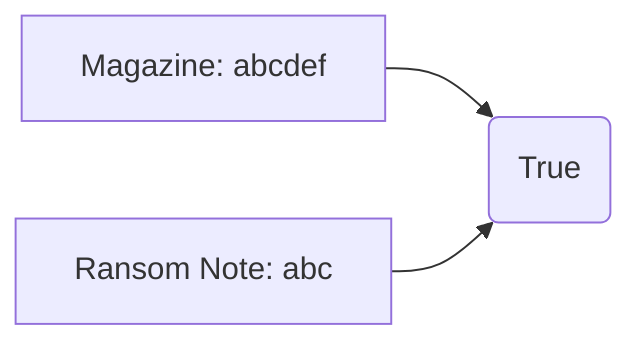

# Hash Table

## Table of Contents

- [x] [383. Ransom Note](https://leetcode.cn/problems/ransom-note/) (Easy)

## 383. Ransom Note

-   [LeetCode](https://leetcode.com/problems/ransom-note/) | [LeetCode CH](https://leetcode.cn/problems/ransom-note/) (Easy)

-   Tags: hash table, string, counting
-   Return `True` if the ransom note can be constructed from the magazines, otherwise, return `False`.




```python title="383. Ransom Note - Python Solution"
from collections import Counter, defaultdict


# Array
def canConstructArray(ransomNote: str, magazine: str) -> bool:
    if len(ransomNote) > len(magazine):
        return False

    record = [0 for _ in range(26)]

    for i in magazine:
        record[ord(i) - ord("a")] += 1

    for j in ransomNote:
        record[ord(j) - ord("a")] -= 1

    for i in record:
        if i < 0:
            return False

    return True


# Dict
def canConstructDict(ransomNote: str, magazine: str) -> bool:
    if len(ransomNote) > len(magazine):
        return False

    record = defaultdict(int)

    for i in magazine:
        record[i] += 1

    for j in ransomNote:
        if j not in record or record[j] == 0:
            return False
        record[j] -= 1

    return True


# Counter
def canConstructCounter(ransomNote: str, magazine: str) -> bool:
    return not Counter(ransomNote) - Counter(magazine)


ransomNote = "aa"
magazine = "aab"
print(canConstructArray(ransomNote, magazine))  # True
print(canConstructDict(ransomNote, magazine))  # True
print(canConstructCounter(ransomNote, magazine))  # True

```
