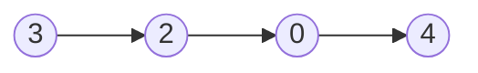
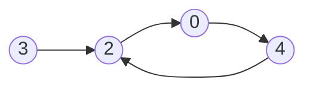
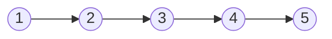
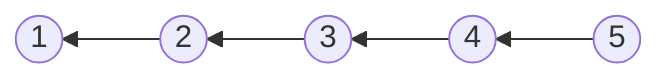

# Linked List

## Table of Contents

- [x] [21. Merge Two Sorted Lists](https://leetcode.cn/problems/merge-two-sorted-lists/) (Easy)
- [x] [141. Linked List Cycle](https://leetcode.cn/problems/linked-list-cycle/) (Easy)
- [x] [206. Reverse Linked List](https://leetcode.cn/problems/reverse-linked-list/) (Easy)
- [x] [876. Middle of the Linked List](https://leetcode.cn/problems/middle-of-the-linked-list/) (Easy)
- [x] [146. LRU Cache](https://leetcode.cn/problems/lru-cache/) (Medium)

## 21. Merge Two Sorted Lists

-   [LeetCode](https://leetcode.com/problems/merge-two-sorted-lists/) | [LeetCode CH](https://leetcode.cn/problems/merge-two-sorted-lists/) (Easy)

-   Tags: linked list, recursion
-   Task: Merge the two linked lists into one sorted list.

```python title="21. Merge Two Sorted Lists - Python Solution"
from typing import Optional

from leetpattern.utils import ListNode


# Linked List
def merge_two_lists(
    list1: Optional[ListNode], list2: Optional[ListNode]
) -> Optional[ListNode]:
    dummy = ListNode()
    cur = dummy

    while list1 and list2:
        if list1.val < list2.val:
            cur.next = list1
            list1 = list1.next
        else:
            cur.next = list2
            list2 = list2.next
        cur = cur.next

    if list1:
        cur.next = list1
    elif list2:
        cur.next = list2

    return dummy.next

```

```cpp title="21. Merge Two Sorted Lists - C++ Solution"
struct ListNode {
    int val;
    ListNode* next;
    ListNode() : val(0), next(nullptr) {}
    ListNode(int x) : val(x), next(nullptr) {}
    ListNode(int x, ListNode* next) : val(x), next(next) {}
};

class Solution {
   public:
    ListNode* mergeTwoLists(ListNode* list1, ListNode* list2) {
        ListNode dummy;
        ListNode* cur = &dummy;

        while (list1 && list2) {
            if (list1->val < list2->val) {
                cur->next = list1;
                list1 = list1->next;
            } else {
                cur->next = list2;
                list2 = list2->next;
            }
            cur = cur->next;
        }

        cur->next = list1 ? list1 : list2;

        return dummy.next;
    }
};
```

## 141. Linked List Cycle

-   [LeetCode](https://leetcode.com/problems/linked-list-cycle/) | [LeetCode CH](https://leetcode.cn/problems/linked-list-cycle/) (Easy)

-   Tags: hash table, linked list, two pointers
-   Determine if a linked list has a cycle in it.





```python title="141. Linked List Cycle - Python Solution"
from typing import Optional

from template import ListNode


def hasCycle(head: Optional[ListNode]) -> bool:
    slow, fast = head, head

    while fast and fast.next:
        slow = slow.next
        fast = fast.next.next

        if slow == fast:
            return True

    return False


print(hasCycle(ListNode.create([3, 2, 0, -4])))  # False
print(hasCycle(ListNode.create([3, 2, 0, -4], 1)))  # True

```

```cpp title="141. Linked List Cycle - C++ Solution"
#include <iostream>

struct ListNode {
    int val;
    ListNode* next;
    ListNode(int x) : val(x), next(NULL) {}
};

class Solution {
   public:
    bool hasCycle(ListNode* head) {
        ListNode* slow = head;
        ListNode* fast = head;

        while (fast && fast->next) {
            slow = slow->next;
            fast = fast->next->next;

            if (fast == slow) return true;
        }
        return false;
    }
};
```

## 206. Reverse Linked List

-   [LeetCode](https://leetcode.com/problems/reverse-linked-list/) | [LeetCode CH](https://leetcode.cn/problems/reverse-linked-list/) (Easy)

-   Tags: linked list, recursion
- Reverse a singly linked list.





```python title="206. Reverse Linked List - Python Solution"
from typing import Optional

from template import ListNode


# Iterative
def reverseListIterative(head: Optional[ListNode]) -> Optional[ListNode]:
    cur = head
    prev = None

    while cur:
        temp = cur.next
        cur.next = prev

        prev = cur
        cur = temp

    return prev


# Recursive
def reverseListRecursive(head: Optional[ListNode]) -> Optional[ListNode]:
    def reverse(cur, prev):
        if not cur:
            return prev

        temp = cur.next
        cur.next = prev

        return reverse(temp, cur)

    return reverse(head, None)


nums = [1, 2, 3, 4, 5]
head1 = ListNode.create(nums)
print(head1)
# 1 -> 2 -> 3 -> 4 -> 5
print(reverseListIterative(head1))
# 5 -> 4 -> 3 -> 2 -> 1
head2 = ListNode.create(nums)
print(reverseListRecursive(head2))
# 5 -> 4 -> 3 -> 2 -> 1

```

## 876. Middle of the Linked List

-   [LeetCode](https://leetcode.com/problems/middle-of-the-linked-list/) | [LeetCode CH](https://leetcode.cn/problems/middle-of-the-linked-list/) (Easy)

-   Tags: linked list, two pointers
```python title="876. Middle of the Linked List - Python Solution"
from typing import Optional

from template import ListNode


# Linked List
def middleNode(head: Optional[ListNode]) -> Optional[ListNode]:
    fast, slow = head, head

    while fast and fast.next:
        fast = fast.next.next
        slow = slow.next

    return slow


print(middleNode(ListNode.create([1, 2, 3, 4, 5])))
# 3 -> 4 -> 5
print(middleNode(ListNode.create([1, 2, 3, 4, 5, 6])))
# 4 -> 5 -> 6

```

## 146. LRU Cache

-   [LeetCode](https://leetcode.com/problems/lru-cache/) | [LeetCode CH](https://leetcode.cn/problems/lru-cache/) (Medium)

-   Tags: hash table, linked list, design, doubly linked list
- Design and implement a data structure for **Least Recently Used (LRU) cache**. It should support the following operations: get and put.
- [lru](https://media.geeksforgeeks.org/wp-content/uploads/20240909142802/Working-of-LRU-Cache-copy-2.webp)
- 

| Data structure     | Description                   |
| ------------------ | ----------------------------- |
| Doubly Linked List | To store the key-value pairs. |
| Hash Map           | To store the key-node pairs.  |

```python title="146. LRU Cache - Python Solution"
from collections import OrderedDict


# Doubly Linked List
class Node:
    def __init__(self, key=0, val=0):
        self.key = key
        self.val = val
        self.prev = None
        self.next = None


class LRUCache:

    def __init__(self, capacity: int):
        self.cap = capacity
        self.cache = {}
        self.head = Node()
        self.tail = Node()
        self.head.next = self.tail
        self.tail.prev = self.head

    def remove(self, node):
        node.prev.next = node.next
        node.next.prev = node.prev

    def add_to_last(self, node):
        self.tail.prev.next = node
        node.prev = self.tail.prev
        node.next = self.tail
        self.tail.prev = node

    def move_to_last(self, node):
        self.remove(node)
        self.add_to_last(node)

    def get(self, key: int) -> int:
        if key not in self.cache:
            return -1
        node = self.cache[key]
        self.move_to_last(node)
        return node.val

    def put(self, key: int, value: int) -> None:
        if key in self.cache:
            node = self.cache[key]
            node.val = value
            self.move_to_last(node)
            return None

        if len(self.cache) == self.cap:
            del self.cache[self.head.next.key]
            self.remove(self.head.next)

        node = Node(key=key, val=value)
        self.cache[key] = node
        self.add_to_last(node)


# OrderedDict
class LRUCacheOrderedDict:
    def __init__(self, capacity: int):
        self.cache = OrderedDict()
        self.cap = capacity

    def get(self, key: int):
        if key not in self.cache:
            return -1
        self.cache.move_to_end(key, last=True)
        return self.cache[key]

    def put(self, key: int, value: int):
        if key in self.cache:
            self.cache.move_to_end(key, last=True)
        elif len(self.cache) >= self.cap:
            self.cache.popitem(last=False)

        self.cache[key] = value


cache = LRUCache(2)
cache.put(1, 1)
cache.put(2, 2)
assert cache.get(1) == 1
cache.put(3, 3)
assert cache.get(2) == -1
cache.put(4, 4)
assert cache.get(1) == -1
assert cache.get(3) == 3
assert cache.get(4) == 4


cache = LRUCacheOrderedDict(2)
cache.put(1, 1)
cache.put(2, 2)
assert cache.get(1) == 1
cache.put(3, 3)
assert cache.get(2) == -1
cache.put(4, 4)
assert cache.get(1) == -1
assert cache.get(3) == 3
assert cache.get(4) == 4

print("LRU Cache passed")
print("LRU Cache Ordered Dict passed")

```

```cpp title="146. LRU Cache - C++ Solution"
#include <iostream>
#include <unordered_map>
using namespace std;

class Node {
   public:
    int key;
    int val;
    Node *prev;
    Node *next;

    Node(int k = 0, int v = 0) : key(k), val(v), prev(nullptr), next(nullptr) {}
};

class LRUCache {
   private:
    int cap;
    unordered_map<int, Node *> cache;
    Node *head;
    Node *tail;

    void remove(Node *node) {
        node->prev->next = node->next;
        node->next->prev = node->prev;
    }

    void insert_to_last(Node *node) {
        tail->prev->next = node;
        node->prev = tail->prev;
        tail->prev = node;
        node->next = tail;
    }

    void move_to_last(Node *node) {
        remove(node);
        insert_to_last(node);
    }

   public:
    LRUCache(int capacity) {
        this->cap = capacity;
        head = new Node();
        tail = new Node();
        head->next = tail;
        tail->prev = head;
    }

    int get(int key) {
        if (cache.find(key) != cache.end()) {
            Node *node = cache[key];
            move_to_last(node);
            return node->val;
        }
        return -1;
    }

    void put(int key, int value) {
        if (cache.find(key) != cache.end()) {
            Node *node = cache[key];
            node->val = value;
            move_to_last(node);
        } else {
            Node *newNode = new Node(key, value);
            cache[key] = newNode;
            insert_to_last(newNode);

            if ((int)cache.size() > cap) {
                Node *removed = head->next;
                remove(removed);
                cache.erase(removed->key);
                delete removed;
            }
        }
    }
};

int main() {
    LRUCache lru(2);
    lru.put(1, 1);
    lru.put(2, 2);
    cout << lru.get(1) << endl;  // 1
    lru.put(3, 3);
    cout << lru.get(2) << endl;  // -1
    lru.put(4, 4);
    cout << lru.get(1) << endl;  // -1
    cout << lru.get(3) << endl;  // 3
    cout << lru.get(4) << endl;  // 4
    return 0;
}
```
