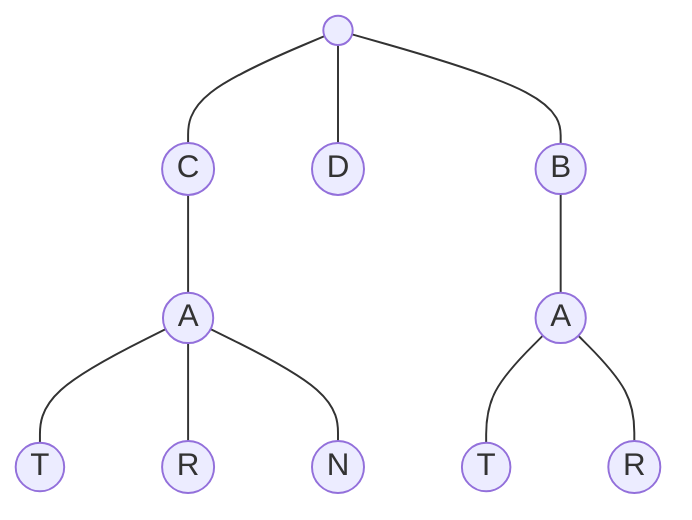

# Trie

## Table of Contents

- [x] [208. Implement Trie (Prefix Tree)](https://leetcode.cn/problems/implement-trie-prefix-tree/) (Medium)
- [x] [139. Word Break](https://leetcode.cn/problems/word-break/) (Medium)

## 208. Implement Trie (Prefix Tree)

-   [LeetCode](https://leetcode.com/problems/implement-trie-prefix-tree/) | [LeetCode CH](https://leetcode.cn/problems/implement-trie-prefix-tree/) (Medium)

-   Tags: hash table, string, design, trie
### Trie

- A trie is a tree-like data structure whose nodes store the letters of an alphabet.



```python title="208. Implement Trie (Prefix Tree) - Python Solution"
class TrieNode:
    def __init__(self):
        self.children = {}
        self.endOfWord = None


class Trie:
    def __init__(self):
        self.root = TrieNode()

    def insert(self, word: str) -> None:
        node = self.root

        for c in word:
            if c not in node.children:
                node.children[c] = TrieNode()
            node = node.children[c]
        node.endOfWord = True

    def search(self, word: str) -> bool:
        node = self.root

        for c in word:
            if c not in node.children:
                return False
            node = node.children[c]
        return node.endOfWord

    def startsWith(self, prefix: str) -> bool:
        node = self.root

        for c in prefix:
            if c not in node.children:
                return False
            node = node.children[c]
        return True


# Your Trie object will be instantiated and called as such:
obj = Trie()
obj.insert("apple")
print(obj.search("word"))  # False
print(obj.startsWith("app"))  # True

```

## 139. Word Break

-   [LeetCode](https://leetcode.com/problems/word-break/) | [LeetCode CH](https://leetcode.cn/problems/word-break/) (Medium)

-   Tags: array, hash table, string, dynamic programming, trie, memoization
```python title="139. Word Break - Python Solution"
from typing import List


# DP (Unbounded Knapsack)
def wordBreak(s: str, wordDict: List[str]) -> bool:
    n = len(s)
    dp = [False for _ in range(n + 1)]
    dp[0] = True

    for i in range(1, n + 1):
        for word in wordDict:
            m = len(word)
            if s[i - m : i] == word and dp[i - m]:
                dp[i] = True
    return dp[-1]


s = "leetcode"
wordDict = ["leet", "code"]
print(wordBreak(s, wordDict))  # True

```

