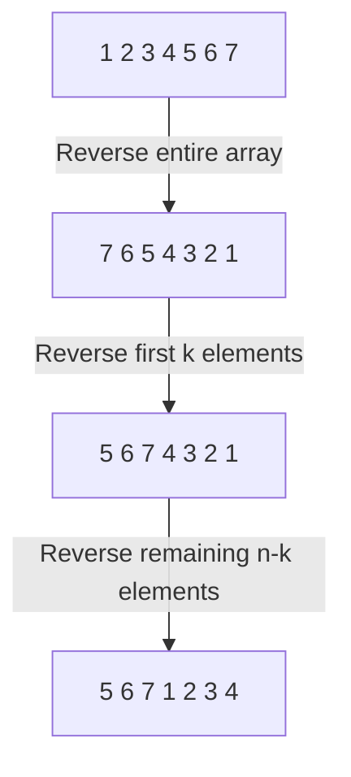

# Arrays String

## Table of Contents

- [x] [88. Merge Sorted Array](https://leetcode.cn/problems/merge-sorted-array/) (Easy)
- [x] [27. Remove Element](https://leetcode.cn/problems/remove-element/) (Easy)
- [x] [26. Remove Duplicates from Sorted Array](https://leetcode.cn/problems/remove-duplicates-from-sorted-array/) (Easy)
- [x] [80. Remove Duplicates from Sorted Array II](https://leetcode.cn/problems/remove-duplicates-from-sorted-array-ii/) (Medium)
- [x] [169. Majority Element](https://leetcode.cn/problems/majority-element/) (Easy)
- [x] [189. Rotate Array](https://leetcode.cn/problems/rotate-array/) (Medium)
- [x] [121. Best Time to Buy and Sell Stock](https://leetcode.cn/problems/best-time-to-buy-and-sell-stock/) (Easy)
- [x] [122. Best Time to Buy and Sell Stock II](https://leetcode.cn/problems/best-time-to-buy-and-sell-stock-ii/) (Medium)
- [x] [55. Jump Game](https://leetcode.cn/problems/jump-game/) (Medium)
- [x] [45. Jump Game II](https://leetcode.cn/problems/jump-game-ii/) (Medium)
- [x] [274. H-Index](https://leetcode.cn/problems/h-index/) (Medium)
- [x] [380. Insert Delete GetRandom O(1)](https://leetcode.cn/problems/insert-delete-getrandom-o1/) (Medium)
- [x] [238. Product of Array Except Self](https://leetcode.cn/problems/product-of-array-except-self/) (Medium)
- [x] [134. Gas Station](https://leetcode.cn/problems/gas-station/) (Medium)
- [x] [135. Candy](https://leetcode.cn/problems/candy/) (Hard)
- [x] [42. Trapping Rain Water](https://leetcode.cn/problems/trapping-rain-water/) (Hard)
- [x] [13. Roman to Integer](https://leetcode.cn/problems/roman-to-integer/) (Easy)
- [ ] [12. Integer to Roman](https://leetcode.cn/problems/integer-to-roman/) (Medium)
- [x] [58. Length of Last Word](https://leetcode.cn/problems/length-of-last-word/) (Easy)
- [x] [14. Longest Common Prefix](https://leetcode.cn/problems/longest-common-prefix/) (Easy)
- [x] [151. Reverse Words in a String](https://leetcode.cn/problems/reverse-words-in-a-string/) (Medium)
- [ ] [6. Zigzag Conversion](https://leetcode.cn/problems/zigzag-conversion/) (Medium)
- [x] [28. Find the Index of the First Occurrence in a String](https://leetcode.cn/problems/find-the-index-of-the-first-occurrence-in-a-string/) (Easy)
- [ ] [68. Text Justification](https://leetcode.cn/problems/text-justification/) (Hard)

## 88. Merge Sorted Array

-   [LeetCode](https://leetcode.com/problems/merge-sorted-array/) | [LeetCode CH](https://leetcode.cn/problems/merge-sorted-array/) (Easy)

-   Tags: array, two pointers, sorting

```python title="88. Merge Sorted Array - Python Solution"
from typing import List


# Left Right Pointers
def merge(nums1: List[int], m: int, nums2: List[int], n: int) -> None:
    """Merges two sorted arrays in-place."""
    p1, p2, t = m - 1, n - 1, m + n - 1

    while p1 >= 0 or p2 >= 0:
        if p1 == -1:
            nums1[t] = nums2[p2]
            p2 -= 1
        elif p2 == -1:
            nums1[t] = nums1[p1]
            p1 -= 1
        elif nums1[p1] > nums2[p2]:
            nums1[t] = nums1[p1]
            p1 -= 1
        else:
            nums1[t] = nums2[p2]
            p2 -= 1

        t -= 1


nums1 = [1, 2, 3, 0, 0, 0]
m = 3
nums2 = [2, 5, 6]
n = 3
merge(nums1, m, nums2, n)
print(nums1)  # [1, 2, 2, 3, 5, 6]

```

## 27. Remove Element

-   [LeetCode](https://leetcode.com/problems/remove-element/) | [LeetCode CH](https://leetcode.cn/problems/remove-element/) (Easy)

-   Tags: array, two pointers
-   Remove all instances of a given value in-place.


```python title="27. Remove Element - Python Solution"
from typing import List


# Fast Slow Pointers
def removeElement(nums: List[int], val: int) -> int:
    fast, slow = 0, 0

    while fast < len(nums):
        if nums[fast] != val:
            nums[slow] = nums[fast]
            slow += 1
        fast += 1

    return slow


nums = [0, 1, 2, 2, 3, 0, 4, 2]
val = 2
print(removeElement(nums, val))  # 5

```

```cpp title="27. Remove Element - C++ Solution"
#include <iostream>
#include <vector>
using namespace std;

// Fast Slow Pointers
int removeElement(vector<int>& nums, int val) {
    size_t n = nums.size();
    size_t slow = 0, fast = 0;

    while (fast < n) {
        if (nums[fast] != val) {
            nums[slow] = nums[fast];
            slow++;
        }
        fast++;
    }
    return (int)slow;
}

int main() {
    vector<int> nums = {3, 2, 2, 3};
    int val = 3;
    cout << removeElement(nums, val) << endl;  // 2
    return 0;
}

```

## 26. Remove Duplicates from Sorted Array

-   [LeetCode](https://leetcode.com/problems/remove-duplicates-from-sorted-array/) | [LeetCode CH](https://leetcode.cn/problems/remove-duplicates-from-sorted-array/) (Easy)

-   Tags: array, two pointers
-   Remove duplicates in-place.


```python title="26. Remove Duplicates from Sorted Array - Python Solution"
from typing import List


def removeDuplicates(nums: List[int]) -> int:
    fast, slow = 1, 1

    while fast < len(nums):
        if nums[fast] != nums[fast - 1]:
            nums[slow] = nums[fast]
            slow += 1
        fast += 1

    return slow


nums = [1, 1, 2]
print(removeDuplicates(nums))  # 2

```

## 80. Remove Duplicates from Sorted Array II

-   [LeetCode](https://leetcode.com/problems/remove-duplicates-from-sorted-array-ii/) | [LeetCode CH](https://leetcode.cn/problems/remove-duplicates-from-sorted-array-ii/) (Medium)

-   Tags: array, two pointers
-   Allow at most two duplicates.
-   fast pointer: explore the array
-   slow pointer: point to the position to be replaced


```python title="80. Remove Duplicates from Sorted Array II - Python Solution"
from typing import List


def removeDuplicates(nums: List[int]) -> int:
    if len(nums) <= 2:
        return len(nums)

    fast, slow = 2, 2

    while fast < len(nums):
        if nums[fast] != nums[slow - 2]:
            nums[slow] = nums[fast]
            slow += 1
        fast += 1

    return slow


nums = [1, 1, 1, 2, 2, 3]
print(removeDuplicates(nums))

```

## 169. Majority Element

-   [LeetCode](https://leetcode.com/problems/majority-element/) | [LeetCode CH](https://leetcode.cn/problems/majority-element/) (Easy)

-   Tags: array, hash table, divide and conquer, sorting, counting
-   Return the majority element in an array. The majority element is the element that appears more than `n // 2` times.

<iframe width="560" height="315" src="https://www.youtube.com/embed/7pnhv842keE?si=fBYlNfKzdkiLgkF1" title="YouTube video player" frameborder="0" allow="accelerometer; autoplay; clipboard-write; encrypted-media; gyroscope; picture-in-picture; web-share" referrerpolicy="strict-origin-when-cross-origin" allowfullscreen></iframe>

| `num` | `count` | `res` |
| ----- | ------- | ----- |
| 2     | 1       | 2     |
| 2     | 2       | 2     |
| 1     | 1       | 2     |
| 1     | 0       | 2     |
| 1     | 1       | 1     |
| 2     | 0       | 1     |
| 2     | 1       | 2     |


```python title="169. Majority Element - Python Solution"
from collections import defaultdict
from typing import List


# Hash Map
def majorityElementHashMap(nums: List[int]) -> int:
    n = len(nums)
    freq = defaultdict(int)

    for num in nums:
        freq[num] += 1
        if freq[num] > n // 2:
            return num


# Array - Boyer-Moore Voting Algorithm
def majorityElementArray(nums: List[int]) -> int:
    res = None
    count = 0

    for num in nums:
        if count == 0:
            res = num
        count += 1 if num == res else -1

    return res


# | Algorithm | Time Complexity | Space Complexity |
# |-----------|-----------------|------------------|
# | HashMap   | O(N)            | O(N)             |
# | Array     | O(N)            | O(1)             |
# |-----------|-----------------|------------------|


nums = [2, 2, 1, 1, 1, 2, 2]
print(majorityElementArray(nums))  # 2
print(majorityElementHashMap(nums))  # 2

```

## 189. Rotate Array

-   [LeetCode](https://leetcode.com/problems/rotate-array/) | [LeetCode CH](https://leetcode.cn/problems/rotate-array/) (Medium)

-   Tags: array, math, two pointers
- Rotate array with reversing subarrays




```python title="189. Rotate Array - Python Solution"
from typing import List


# Array
def rotate(nums: List[int], k: int) -> None:
    """
    Do not return anything, modify nums in-place instead.
    """

    def reverse(i: int, j: int) -> None:
        while i < j:
            nums[i], nums[j] = nums[j], nums[i]
            i += 1
            j -= 1

    n = len(nums)
    k %= n
    reverse(0, n - 1)
    reverse(0, k - 1)
    reverse(k, n - 1)


nums = [1, 2, 3, 4, 5, 6, 7]
k = 3
rotate(nums, k)
print(nums)  # [5, 6, 7, 1, 2, 3, 4]

```

```cpp title="189. Rotate Array - C++ Solution"
#include <algorithm>
#include <iostream>
#include <vector>
using namespace std;

// Array
void rotate(vector<int>& nums, int k) {
    k %= nums.size();

    reverse(nums.begin(), nums.end());
    reverse(nums.begin(), nums.begin() + k);
    reverse(nums.begin() + k, nums.end());
}

int main() {
    vector<int> nums = {1, 2, 3, 4, 5, 6, 7};
    int k = 3;
    rotate(nums, k);
    // [5, 6, 7, 1, 2, 3, 4]
    for (const auto& num : nums) {
        cout << num << " ";
    }
    cout << endl;
    return 0;
}

```

## 121. Best Time to Buy and Sell Stock

-   [LeetCode](https://leetcode.com/problems/best-time-to-buy-and-sell-stock/) | [LeetCode CH](https://leetcode.cn/problems/best-time-to-buy-and-sell-stock/) (Easy)

-   Tags: array, dynamic programming
-   Return the maximum profit that can be achieved from buying on one day and selling on another day.


```python title="121. Best Time to Buy and Sell Stock - Python Solution"
from typing import List


# Brute Force
def maxProfitBF(prices: List[int]) -> int:
    max_profit = 0
    n = len(prices)
    for i in range(n):
        for j in range(i + 1, n):
            max_profit = max(max_profit, prices[j] - prices[i])

    return max_profit


# DP
def maxProfitDP(prices: List[int]) -> int:
    dp = [[0] * 2 for _ in range(len(prices))]
    dp[0][0] = -prices[0]  # buy
    dp[0][1] = 0  # sell

    for i in range(1, len(prices)):
        dp[i][0] = max(dp[i - 1][0], -prices[i])  # the lowest price to buy
        dp[i][1] = max(dp[i - 1][1], dp[i - 1][0] + prices[i])

    return dp[-1][1]


# Greedy
def maxProfitGreedy(prices: List[int]) -> int:
    max_profit = 0
    seen_min = prices[0]

    for i in range(1, len(prices)):
        max_profit = max(max_profit, prices[i] - seen_min)
        seen_min = min(seen_min, prices[i])

    return max_profit


# Fast Slow Pointers
def maxProfitFS(prices: List[int]) -> int:
    max_profit = 0
    slow, fast = 0, 1

    while fast < len(prices):
        if prices[fast] > prices[slow]:
            max_profit = max(max_profit, prices[fast] - prices[slow])
        else:
            slow = fast
        fast += 1

    return max_profit


# |------------|------- |---------|
# |  Approach  |  Time  |  Space  |
# |------------|--------|---------|
# | Brute Force|  O(n^2)|  O(1)   |
# | DP         |  O(n)  |  O(n)   |
# | Greedy     |  O(n)  |  O(1)   |
# | Fast Slow  |  O(n)  |  O(1)   |
# |------------|--------|---------|


prices = [7, 1, 5, 3, 6, 4]
print(maxProfitBF(prices))  # 5
print(maxProfitDP(prices))  # 5
print(maxProfitGreedy(prices))  # 5
print(maxProfitFS(prices))  # 5

```

```cpp title="121. Best Time to Buy and Sell Stock - C++ Solution"
#include <vector>
#include <algorithm>
#include <iostream>
using namespace std;

class Solution
{
public:
    int maxProfit(vector<int> &prices)
    {
        if (prices.size() <= 1)
            return 0;

        int seen_min = prices[0];
        int res = 0;

        for (int &price : prices)
        {
            res = max(res, price - seen_min);
            seen_min = min(seen_min, price);
        }
        return res;
    }
};

int main()
{
    vector<int> prices = {7, 1, 5, 3, 6, 4};
    Solution obj;
    cout << obj.maxProfit(prices) << endl;
    return 0;
}

```

## 122. Best Time to Buy and Sell Stock II

-   [LeetCode](https://leetcode.com/problems/best-time-to-buy-and-sell-stock-ii/) | [LeetCode CH](https://leetcode.cn/problems/best-time-to-buy-and-sell-stock-ii/) (Medium)

-   Tags: array, dynamic programming, greedy
-   Return the maximum profit you can achieve.


```python title="122. Best Time to Buy and Sell Stock II - Python Solution"
from typing import List


# DP
def maxProfitDP1(prices: List[int]) -> int:
    n = len(prices)
    if n <= 1:
        return 0

    dp = [[0] * 2 for _ in range(n)]
    dp[0][0] = -prices[0]
    dp[0][1] = 0

    for i in range(1, n):
        dp[i][0] = max(dp[i - 1][0], dp[i - 1][1] - prices[i])
        dp[i][1] = max(dp[i - 1][1], dp[i - 1][0] + prices[i])

    return dp[-1][1]


# DP - Optimized
def maxProfitDP2(prices: List[int]) -> int:
    n = len(prices)
    if n <= 1:
        return 0

    hold = -prices[0]
    profit = 0

    for i in range(1, n):
        hold = max(hold, profit - prices[i])
        profit = max(profit, hold + prices[i])

    return profit


# Greedy
def maxProfitGreedy(prices: List[int]) -> int:
    profit = 0

    for i in range(1, len(prices)):
        profit += max(prices[i] - prices[i - 1], 0)

    return profit


# |------------|------- |---------|
# |  Approach  |  Time  |  Space  |
# |------------|--------|---------|
# |     DP1    |  O(n)  |   O(n)  |
# |     DP2    |  O(n)  |   O(1)  |
# |   Greedy   |  O(n)  |   O(1)  |
# |------------|--------|---------|


prices = [7, 1, 5, 3, 6, 4]
print(maxProfitDP1(prices))  # 7
print(maxProfitDP2(prices))  # 7
print(maxProfitGreedy(prices))  # 7

```

## 55. Jump Game

-   [LeetCode](https://leetcode.com/problems/jump-game/) | [LeetCode CH](https://leetcode.cn/problems/jump-game/) (Medium)

-   Tags: array, dynamic programming, greedy
- Return `True` if you can reach the last index, otherwise `False`.


```python title="55. Jump Game - Python Solution"
from typing import List


# Greedy - Interval
def canJump(nums: List[int]) -> bool:
    n = len(nums)
    reach = 0
    i = 0

    while reach >= i:
        if reach >= n - 1:
            return True
        reach = max(reach, i + nums[i])
        i += 1

    return False


if __name__ == "__main__":
    assert canJump([2, 3, 1, 1, 4]) is True
    assert canJump([3, 2, 1, 0, 4]) is False

```

```cpp title="55. Jump Game - C++ Solution"
#include <algorithm>
#include <iostream>
#include <vector>
using namespace std;

class Solution {
   public:
    bool canJump(vector<int>& nums) {
        int canReach = 0;
        int n = nums.size();

        for (int i = 0; i < n; i++) {
            if (i > canReach) return false;
            canReach = max(canReach, i + nums[i]);
        }
        return true;
    }
};

int main() {
    Solution obj;
    vector<int> nums = {2, 3, 1, 1, 4};
    cout << obj.canJump(nums) << endl;
    return 0;
}

```

## 45. Jump Game II

-   [LeetCode](https://leetcode.com/problems/jump-game-ii/) | [LeetCode CH](https://leetcode.cn/problems/jump-game-ii/) (Medium)

-   Tags: array, dynamic programming, greedy
- Return the minimum number of jumps to reach the last index.


```python title="45. Jump Game II - Python Solution"
from typing import List


# Greedy - Interval
def jump(nums: List[int]) -> int:
    n = len(nums)
    if n == 1:
        return 0

    reach = 0
    left, right = 0, 0
    res = 0

    while right < n - 1:
        for i in range(left, right + 1):
            reach = max(reach, i + nums[i])

        left = right + 1
        right = reach
        res += 1

    return res


if __name__ == "__main__":
    assert jump([2, 3, 1, 1, 4]) == 2
    assert jump([2, 3, 0, 1, 4]) == 2

```

## 274. H-Index

-   [LeetCode](https://leetcode.com/problems/h-index/) | [LeetCode CH](https://leetcode.cn/problems/h-index/) (Medium)

-   Tags: array, sorting, counting sort

```python title="274. H-Index - Python Solution"
from typing import List


# Arrays
def hIndex(citations: List[int]) -> int:
    n = len(citations)
    cnt = [0 for _ in range(n + 1)]

    for c in citations:
        cnt[min(c, n)] += 1

    s = 0
    for i in range(n, -1, -1):
        s += cnt[i]
        if s >= i:
            return i


if __name__ == "__main__":
    assert hIndex([3, 0, 6, 1, 5]) == 3
    assert hIndex([1, 3, 1]) == 1
    assert hIndex([1, 2, 3, 4, 5]) == 3
    assert hIndex([0, 0, 0]) == 0

```

## 380. Insert Delete GetRandom O(1)

-   [LeetCode](https://leetcode.com/problems/insert-delete-getrandom-o1/) | [LeetCode CH](https://leetcode.cn/problems/insert-delete-getrandom-o1/) (Medium)

-   Tags: array, hash table, math, design, randomized

```python title="380. Insert Delete GetRandom O(1) - Python Solution"
import random


class RandomizedSet:
    def __init__(self):
        self.dict = {}
        self.list = []

    def insert(self, val: int) -> bool:
        if val in self.dict:
            return False
        self.dict[val] = len(self.list)
        self.list.append(val)

        return True

    def remove(self, val: int) -> bool:
        if val not in self.dict:
            return False
        last_element = self.list[-1]
        idx = self.dict[val]
        self.list[idx] = last_element
        self.dict[last_element] = idx
        self.list.pop()
        del self.dict[val]
        return True

    def getRandom(self) -> int:
        return random.choice(self.list)


obj = RandomizedSet()
print(obj.insert(1))  # True
print(obj.remove(2))  # False
print(obj.insert(2))  # True
print(obj.getRandom())  # 1 or 2
print(obj.remove(1))  # True

```

## 238. Product of Array Except Self

-   [LeetCode](https://leetcode.com/problems/product-of-array-except-self/) | [LeetCode CH](https://leetcode.cn/problems/product-of-array-except-self/) (Medium)

-   Tags: array, prefix sum
-   Classic **Prefix Sum** problem
-   Return an array `output` such that `output[i]` is equal to the product of all the elements of `nums` except `nums[i]`.

| Approach           | Time | Space |
| ------------------ | ---- | ----- |
| Prefix             | O(n) | O(n)  |
| Prefix (Optimized) | O(n) | O(1)  |


```python title="238. Product of Array Except Self - Python Solution"
from typing import List


# Prefix
def productExceptSelf(nums: List[int]) -> List[int]:
    n = len(nums)
    prefix = [1 for _ in range(n)]
    suffix = [1 for _ in range(n)]

    for i in range(1, n):
        prefix[i] = nums[i - 1] * prefix[i - 1]

    for i in range(n - 2, -1, -1):
        suffix[i] = nums[i + 1] * suffix[i + 1]

    result = [i * j for i, j in zip(prefix, suffix)]

    return result


# Prefix (Optimized)
def productExceptSelfOptimized(nums: List[int]) -> List[int]:
    n = len(nums)
    result = [1 for _ in range(n)]

    prefix = 1
    for i in range(n):
        result[i] = prefix
        prefix *= nums[i]

    suffix = 1
    for i in range(n - 1, -1, -1):
        result[i] *= suffix
        suffix *= nums[i]

    return result


print(productExceptSelf([1, 2, 3, 4]))
# [24, 12, 8, 6]
print(productExceptSelfOptimized([1, 2, 3, 4]))
# [24, 12, 8, 6]

```

```cpp title="238. Product of Array Except Self - C++ Solution"
#include <vector>
#include <iostream>
using namespace std;

// Prefix Sum
class Solution
{
public:
    vector<int> productExceptSelf(vector<int> &nums)
    {
        int n = nums.size();
        vector<int> prefix(n, 1);
        vector<int> suffix(n, 1);
        vector<int> res(n, 1);

        for (int i = 1; i < n; i++)
        {
            prefix[i] = prefix[i - 1] * nums[i - 1];
        }

        for (int i = n - 2; i >= 0; i--)
        {
            suffix[i] = suffix[i + 1] * nums[i + 1];
        }

        for (int i = 0; i < n; i++)
        {
            res[i] = prefix[i] * suffix[i];
        }
        return res;
    }
};

int main()
{
    vector<int> nums = {1, 2, 3, 4};
    Solution obj;
    vector<int> result = obj.productExceptSelf(nums);

    for (int i = 0; i < result.size(); i++)
    {
        cout << result[i] << "\n";
    }
    cout << endl;
    // 24, 12, 8, 6
    return 0;
}

```

## 134. Gas Station

-   [LeetCode](https://leetcode.com/problems/gas-station/) | [LeetCode CH](https://leetcode.cn/problems/gas-station/) (Medium)

-   Tags: array, greedy

```python title="134. Gas Station - Python Solution"
from typing import List


# Greedy
def canCompleteCircuit(gas: List[int], cost: List[int]) -> int:
    curSum = 0
    totalSum = 0
    start = 0

    for i in range(len(gas)):
        curSum += gas[i] - cost[i]
        totalSum += gas[i] - cost[i]

        if curSum < 0:
            start = i + 1
            curSum = 0

    if totalSum < 0:
        return -1

    return start


gas = [1, 2, 3, 4, 5]
cost = [3, 4, 5, 1, 2]
print(canCompleteCircuit(gas, cost))  # 3

```

## 135. Candy

-   [LeetCode](https://leetcode.com/problems/candy/) | [LeetCode CH](https://leetcode.cn/problems/candy/) (Hard)

-   Tags: array, greedy
-   Return the minimum number of candies you must give.


```python title="135. Candy - Python Solution"
from typing import List


# Greedy
def candy(ratings: List[int]) -> int:
    # TC: O(n)
    # SC: O(n)
    n = len(ratings)

    if n <= 1:
        return n

    candy = [1 for _ in range(n)]

    for i in range(1, n):
        if ratings[i] > ratings[i - 1]:
            candy[i] = candy[i - 1] + 1

    for j in range(n - 2, -1, -1):
        if ratings[j] > ratings[j + 1]:
            candy[j] = max(candy[j], candy[j + 1] + 1)

    return sum(candy)


ratings = [1, 0, 2]
print(candy(ratings))  # 5

```

## 42. Trapping Rain Water

-   [LeetCode](https://leetcode.com/problems/trapping-rain-water/) | [LeetCode CH](https://leetcode.cn/problems/trapping-rain-water/) (Hard)

-   Tags: array, two pointers, dynamic programming, stack, monotonic stack
- 

<iframe width="560" height="315" src="https://www.youtube.com/embed/ZI2z5pq0TqA?si=OEYg01dbmzvmtIwZ" title="YouTube video player" frameborder="0" allow="accelerometer; autoplay; clipboard-write; encrypted-media; gyroscope; picture-in-picture; web-share" referrerpolicy="strict-origin-when-cross-origin" allowfullscreen></iframe>

| Approach   | Time | Space |
| ---------- | ---- | ----- |
| DP         | O(N) | O(N)  |
| Left Right | O(N) | O(1)  |
| Monotonic  | O(N) | O(N)  |


```python title="42. Trapping Rain Water - Python Solution"
from typing import List


# DP
def trapDP(height: List[int]) -> int:
    if not height:
        return 0

    n = len(height)
    maxLeft, maxRight = [0 for _ in range(n)], [0 for _ in range(n)]

    for i in range(1, n):
        maxLeft[i] = max(maxLeft[i - 1], height[i - 1])

    for i in range(n - 2, -1, -1):
        maxRight[i] = max(maxRight[i + 1], height[i + 1])

    res = 0
    for i in range(n):
        res += max(0, min(maxLeft[i], maxRight[i]) - height[i])

    return res


# Left Right Pointers
def trapLR(height: List[int]) -> int:
    if not height:
        return 0

    left, right = 0, len(height) - 1
    maxL, maxR = height[left], height[right]
    res = 0

    while left < right:
        if maxL < maxR:
            left += 1
            maxL = max(maxL, height[left])
            res += maxL - height[left]
        else:
            right -= 1
            maxR = max(maxR, height[right])
            res += maxR - height[right]

    return res


# Monotonic Stack
def trapStack(height: List[int]) -> int:
    stack = []
    total = 0

    for i in range(len(height)):
        while stack and height[i] > height[stack[-1]]:
            top = stack.pop()
            if not stack:
                break
            distance = i - stack[-1] - 1
            bounded_height = min(height[i], height[stack[-1]]) - height[top]
            total += distance * bounded_height
        stack.append(i)

    return total


height = [0, 1, 0, 2, 1, 0, 1, 3, 2, 1, 2, 1]
print(trapDP(height))  # 6
print(trapLR(height))  # 6
print(trapStack(height))  # 6

```

```cpp title="42. Trapping Rain Water - C++ Solution"
#include <vector>
#include <algorithm>
#include <iostream>
using namespace std;

class Solution
{
public:
    int trap(vector<int> &height)
    {
        if (height.empty())
            return 0;

        int res = 0;
        int left = 0, right = height.size() - 1;
        int maxL = height[left], maxR = height[right];

        while (left < right)
        {
            if (maxL < maxR)
            {
                left++;
                maxL = max(maxL, height[left]);
                res += maxL - height[left];
            }
            else
            {
                right--;
                maxR = max(maxR, height[right]);
                res += maxR - height[right];
            }
        }
        return res;
    }
};

int main()
{
    vector<int> height = {0, 1, 0, 2, 1, 0, 1, 3, 2, 1, 2, 1};
    Solution solution;
    cout << solution.trap(height) << endl;
    return 0;
}

```

## 13. Roman to Integer

-   [LeetCode](https://leetcode.com/problems/roman-to-integer/) | [LeetCode CH](https://leetcode.cn/problems/roman-to-integer/) (Easy)

-   Tags: hash table, math, string

```python title="13. Roman to Integer - Python Solution"
from itertools import pairwise


# Arrays
def romanToInt(s: str) -> int:
    ROMAN = {
        "I": 1,
        "V": 5,
        "X": 10,
        "L": 50,
        "C": 100,
        "D": 500,
        "M": 1000,
    }

    res = 0

    for x, y in pairwise(s):
        x, y = ROMAN[x], ROMAN[y]
        res += x if x >= y else -x

    return res + ROMAN[s[-1]]


if __name__ == "__main__":
    assert romanToInt("III") == 3
    assert romanToInt("IV") == 4
    assert romanToInt("IX") == 9
    assert romanToInt("LVIII") == 58
    assert romanToInt("MCMXCIV") == 1994
    assert romanToInt("MMXXIII") == 2023

```

## 12. Integer to Roman

-   [LeetCode](https://leetcode.com/problems/integer-to-roman/) | [LeetCode CH](https://leetcode.cn/problems/integer-to-roman/) (Medium)

-   Tags: hash table, math, string
## 58. Length of Last Word

-   [LeetCode](https://leetcode.com/problems/length-of-last-word/) | [LeetCode CH](https://leetcode.cn/problems/length-of-last-word/) (Easy)

-   Tags: string

```python title="58. Length of Last Word - Python Solution"
def lengthOfLastWord(s: str) -> int:
    n = 0

    for i in range(len(s) - 1, -1, -1):
        if s[i] != " ":
            n += 1
        if s[i] == " " and n > 0:
            return n

    return n


print(lengthOfLastWord("Hello World"))  # 5

```

## 14. Longest Common Prefix

-   [LeetCode](https://leetcode.com/problems/longest-common-prefix/) | [LeetCode CH](https://leetcode.cn/problems/longest-common-prefix/) (Easy)

-   Tags: string, trie

```python title="14. Longest Common Prefix - Python Solution"
from typing import List


# Horizontal Scanning
def longestCommonPrefixHorizontal(strs: List[str]) -> str:
    if not strs:
        return ""

    prefix = strs[0]
    for i in range(1, len(strs)):
        while not strs[i].startswith(prefix):
            prefix = prefix[:-1]
            if not prefix:
                return ""

    return prefix


# Vertical Scanning
def longestCommonPrefixVertical(strs: List[str]) -> str:
    if not strs:
        return ""

    for i in range(len(strs[0])):
        char = strs[0][i]
        for j in range(1, len(strs)):
            if i >= len(strs[j]) or strs[j][i] != char:
                return strs[0][:i]

    return strs[0]


# Divide and Conquer
def longestCommonPrefixDivideConquer(strs: List[str]) -> str:
    if not strs:
        return ""

    def merge(left, right):
        n = min(len(left), len(right))
        for i in range(n):
            if left[i] != right[i]:
                return left[:i]
        return left[:n]

    def helper(strs, start, end):
        if start == end:
            return strs[start]
        mid = start + (end - start) // 2
        left = helper(strs, start, mid)
        right = helper(strs, mid + 1, end)
        return merge(left, right)

    return helper(strs, 0, len(strs) - 1)


# Binary Search
def longestCommonPrefixBinarySearch(strs: List[str]) -> str:
    if not strs:
        return ""

    def isCommonPrefix(strs, length):
        prefix = strs[0][:length]
        return all(s.startswith(prefix) for s in strs)

    minLen = min(len(s) for s in strs)
    low, high = 0, minLen
    while low < high:
        mid = low + (high - low) // 2
        if isCommonPrefix(strs, mid + 1):
            low = mid + 1
        else:
            high = mid

    return strs[0][:low]


strs = ["flower", "flow", "flight"]
print(longestCommonPrefixHorizontal(strs))  # "fl"
print(longestCommonPrefixVertical(strs))  # "fl"
print(longestCommonPrefixDivideConquer(strs))  # "fl"
print(longestCommonPrefixBinarySearch(strs))  # "fl"

```

## 151. Reverse Words in a String

-   [LeetCode](https://leetcode.com/problems/reverse-words-in-a-string/) | [LeetCode CH](https://leetcode.cn/problems/reverse-words-in-a-string/) (Medium)

-   Tags: two pointers, string

```python title="151. Reverse Words in a String - Python Solution"
def reverseWords(s: str) -> str:
    words = s.split()

    left, right = 0, len(words) - 1

    while left < right:
        words[left], words[right] = words[right], words[left]
        left += 1
        right -= 1

    return " ".join(words)


s = "the sky is blue"
print(reverseWords(s))  # "blue is sky the"

```

## 6. Zigzag Conversion

-   [LeetCode](https://leetcode.com/problems/zigzag-conversion/) | [LeetCode CH](https://leetcode.cn/problems/zigzag-conversion/) (Medium)

-   Tags: string
## 28. Find the Index of the First Occurrence in a String

-   [LeetCode](https://leetcode.com/problems/find-the-index-of-the-first-occurrence-in-a-string/) | [LeetCode CH](https://leetcode.cn/problems/find-the-index-of-the-first-occurrence-in-a-string/) (Easy)

-   Tags: two pointers, string, string matching

```python title="28. Find the Index of the First Occurrence in a String - Python Solution"
from template import LPS


# Brute Force
def strStrBF(haystack: str, needle: str) -> int:
    m, n = len(haystack), len(needle)
    for i in range(m - n + 1):
        if haystack[i : i + n] == needle:
            return i
    return -1


# KMP
def strStrKMP(haystack: str, needle: str) -> int:
    lps = LPS(needle)
    m, n = len(haystack), len(needle)
    j = 0

    for i in range(m):
        while j > 0 and haystack[i] != needle[j]:
            j = lps[j - 1]
        if haystack[i] == needle[j]:
            j += 1
        if j == n:
            return i - n + 1
    return -1


# |------------|------------------|---------|
# |  Approach  |       Time       |  Space  |
# |------------|------------------|---------|
# | Brute Force| O((m - n) * n)   | O(1)    |
# | KMP        | O(m + n)         | O(n)    |
# |------------|------------------|---------|


haystack = "hello"
needle = "ll"
print(strStrBF(haystack, needle))  # 2
print(strStrKMP(haystack, needle))  # 2

```

## 68. Text Justification

-   [LeetCode](https://leetcode.com/problems/text-justification/) | [LeetCode CH](https://leetcode.cn/problems/text-justification/) (Hard)

-   Tags: array, string, simulation
