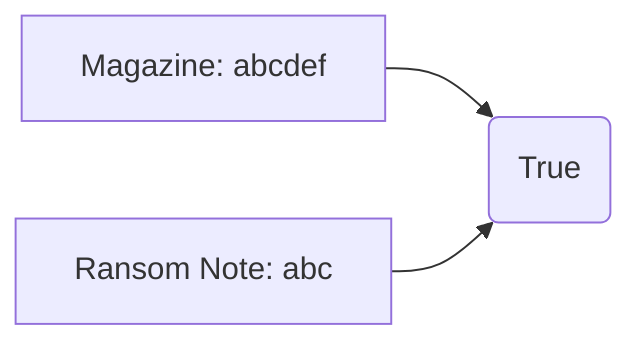

# Hash Table

## Table of Contents

- [x] [383. Ransom Note](https://leetcode.cn/problems/ransom-note/) (Easy)
- [ ] [205. Isomorphic Strings](https://leetcode.cn/problems/isomorphic-strings/) (Easy)
- [ ] [290. Word Pattern](https://leetcode.cn/problems/word-pattern/) (Easy)
- [x] [242. Valid Anagram](https://leetcode.cn/problems/valid-anagram/) (Easy)
- [x] [49. Group Anagrams](https://leetcode.cn/problems/group-anagrams/) (Medium)
- [x] [1. Two Sum](https://leetcode.cn/problems/two-sum/) (Easy)
- [x] [202. Happy Number](https://leetcode.cn/problems/happy-number/) (Easy)
- [x] [219. Contains Duplicate II](https://leetcode.cn/problems/contains-duplicate-ii/) (Easy)
- [x] [128. Longest Consecutive Sequence](https://leetcode.cn/problems/longest-consecutive-sequence/) (Medium)

## 383. Ransom Note

-   [LeetCode](https://leetcode.com/problems/ransom-note/) | [LeetCode CH](https://leetcode.cn/problems/ransom-note/) (Easy)

-   Tags: hash table, string, counting
-   Return `True` if the ransom note can be constructed from the magazines, otherwise, return `False`.




```python title="383. Ransom Note - Python Solution"
from collections import Counter, defaultdict


# Array
def canConstructArray(ransomNote: str, magazine: str) -> bool:
    if len(ransomNote) > len(magazine):
        return False

    record = [0 for _ in range(26)]

    for i in magazine:
        record[ord(i) - ord("a")] += 1

    for j in ransomNote:
        record[ord(j) - ord("a")] -= 1

    for i in record:
        if i < 0:
            return False

    return True


# Dict
def canConstructDict(ransomNote: str, magazine: str) -> bool:
    if len(ransomNote) > len(magazine):
        return False

    record = defaultdict(int)

    for i in magazine:
        record[i] += 1

    for j in ransomNote:
        if j not in record or record[j] == 0:
            return False
        record[j] -= 1

    return True


# Counter
def canConstructCounter(ransomNote: str, magazine: str) -> bool:
    return not Counter(ransomNote) - Counter(magazine)


ransomNote = "aa"
magazine = "aab"
print(canConstructArray(ransomNote, magazine))  # True
print(canConstructDict(ransomNote, magazine))  # True
print(canConstructCounter(ransomNote, magazine))  # True

```

## 205. Isomorphic Strings

-   [LeetCode](https://leetcode.com/problems/isomorphic-strings/) | [LeetCode CH](https://leetcode.cn/problems/isomorphic-strings/) (Easy)

-   Tags: hash table, string
## 290. Word Pattern

-   [LeetCode](https://leetcode.com/problems/word-pattern/) | [LeetCode CH](https://leetcode.cn/problems/word-pattern/) (Easy)

-   Tags: hash table, string
## 242. Valid Anagram

-   [LeetCode](https://leetcode.com/problems/valid-anagram/) | [LeetCode CH](https://leetcode.cn/problems/valid-anagram/) (Easy)

-   Tags: hash table, string, sorting
-   Return true if an input string is an anagram of another string.
-   An anagram is a word or phrase formed by rearranging the letters of a different word or phrase, typically using all the original letters exactly once, e.g., `listen` is an anagram of `silent`.


```python title="242. Valid Anagram - Python Solution"
from collections import Counter


# Hashmap
def isAnagramHash(s: str, t: str) -> bool:
    """Return True if t is an anagram of s, False otherwise."""
    if len(s) != len(t):
        return False

    count = dict()

    for i in s:
        if i in count:
            count[i] += 1
        else:
            count[i] = 1

    for j in t:
        if j in count:
            count[j] -= 1
        else:
            return False

    for count in count.values():
        if count != 0:
            return False

    return True


# Array
def isAnagramArray(s: str, t: str) -> bool:
    if len(s) != len(t):
        return False

    count = [0 for _ in range(26)]

    for i in s:
        count[ord(i) - ord("a")] += 1

    for j in t:
        count[ord(j) - ord("a")] -= 1

    for i in count:
        if i != 0:
            return False

    return True


# Counter
def isAnagramCounter(s: str, t: str) -> bool:
    return Counter(s) == Counter(t)


# |-------------|-----------------|--------------|
# |  Approach   |      Time       |    Space     |
# |-------------|-----------------|--------------|
# |   Hashmap   |       O(n)      |     O(1)     |
# |    Array    |       O(n)      |     O(1)     |
# |   Counter   |       O(n)      |     O(1)     |
# |-------------|-----------------|--------------|


s = "anagram"
t = "nagaram"
print(isAnagramHash(s, t))  # True
print(isAnagramArray(s, t))  # True
print(isAnagramCounter(s, t))  # True

```

## 49. Group Anagrams

-   [LeetCode](https://leetcode.com/problems/group-anagrams/) | [LeetCode CH](https://leetcode.cn/problems/group-anagrams/) (Medium)

-   Tags: array, hash table, string, sorting

```python title="49. Group Anagrams - Python Solution"
from collections import defaultdict
from typing import List


# Hash - List
def groupAnagrams(strs: List[str]) -> List[List[str]]:
    result = defaultdict(list)

    for s in strs:
        count = [0] * 26
        for i in s:
            count[ord(i) - ord("a")] += 1

        result[tuple(count)].append(s)

    return list(result.values())


# |-------------|-----------------|--------------|
# |  Approach   |      Time       |    Space     |
# |-------------|-----------------|--------------|
# |    Hash     |     O(n * k)    |     O(n)     |
# |-------------|-----------------|--------------|


strs = ["eat", "tea", "tan", "ate", "nat", "bat"]
print(groupAnagrams(strs))
# [['eat', 'tea', 'ate'], ['tan', 'nat'], ['bat']]

```

## 1. Two Sum

-   [LeetCode](https://leetcode.com/problems/two-sum/) | [LeetCode CH](https://leetcode.cn/problems/two-sum/) (Easy)

-   Tags: array, hash table
- Return the indices of the two numbers such that they add up to a specific target.
- Approach: Use a hashmap to store the indices of the numbers.
- Time Complexity: O(n)
- Space Complexity: O(n)


```python title="1. Two Sum - Python Solution"
from typing import List


def twoSum(nums: List[int], target: int) -> List[int]:
    hashmap = {}  # val: idx

    for idx, val in enumerate(nums):
        if (target - val) in hashmap:
            return [hashmap[target - val], idx]

        hashmap[val] = idx


if __name__ == "__main__":
    nums = [2, 7, 11, 15]
    target = 9
    assert twoSum(nums, target) == [0, 1]

```

```cpp title="1. Two Sum - C++ Solution"
#include <iostream>
#include <unordered_map>
#include <vector>

using namespace std;

vector<int> twoSum(vector<int> &nums, int target) {
    unordered_map<int, int> hashmap;

    for (size_t i = 0; i < nums.size(); i++) {
        int complement = target - nums[i];

        if (hashmap.find(complement) != hashmap.end()) {
            return {hashmap[complement], (int)i};
        }
        hashmap[nums[i]] = (int)i;
    }

    return {-1, -1};
}

int main() {
    vector<int> nums = {2, 7, 11, 15};
    int target = 9;
    vector<int> result = twoSum(nums, target);
    cout << result[0] << ", " << result[1] << endl;
    return 0;
}

```

## 202. Happy Number

-   [LeetCode](https://leetcode.com/problems/happy-number/) | [LeetCode CH](https://leetcode.cn/problems/happy-number/) (Easy)

-   Tags: hash table, math, two pointers
-   Return `True` if the number is a happy number, otherwise, return `False`.
-   A happy number is a number defined by the following process: Starting with any positive integer, replace the number by the sum of the squares of its digits, and repeat the process until the number equals 1 (where it will stay), or it loops endlessly in a cycle which does not include 1.


```python title="202. Happy Number - Python Solution"
def isHappy(n: int) -> bool:

    def getSum(n):
        sum_of_squares = 0
        while n:
            a, b = divmod(n, 10)
            sum_of_squares += b**2
            n = a
        return sum_of_squares

    record = set()

    while True:
        if n == 1:
            return True

        if n in record:
            return False
        else:
            record.add(n)

        n = getSum(n)


n = 19
print(isHappy(n))  # True

```

## 219. Contains Duplicate II

-   [LeetCode](https://leetcode.com/problems/contains-duplicate-ii/) | [LeetCode CH](https://leetcode.cn/problems/contains-duplicate-ii/) (Easy)

-   Tags: array, hash table, sliding window

```python title="219. Contains Duplicate II - Python Solution"
from typing import List


# Hash
def containsNearbyDuplicateHash(nums: List[int], k: int) -> bool:
    hashmap = {}  # num: last index

    for idx, num in enumerate(nums):
        if num in hashmap:
            if idx - hashmap[num] <= k:
                return True

        hashmap[num] = idx

    return False


# Sliding window - Fixed
def containsNearbyDuplicateWindow(nums: List[int], k: int) -> bool:
    window = set()
    left = 0

    for right in range(len(nums)):
        if right - left > k:
            window.remove(nums[left])
            left += 1
        if nums[right] in window:
            return True
        window.add(nums[right])

    return False


nums = [1, 2, 3, 1]
k = 3
print(containsNearbyDuplicateHash(nums, k))  # True
print(containsNearbyDuplicateWindow(nums, k))  # True

```

## 128. Longest Consecutive Sequence

-   [LeetCode](https://leetcode.com/problems/longest-consecutive-sequence/) | [LeetCode CH](https://leetcode.cn/problems/longest-consecutive-sequence/) (Medium)

-   Tags: array, hash table, union find

```python title="128. Longest Consecutive Sequence - Python Solution"
from typing import List


# Set
def longestConsecutiveSet(nums: List[int]) -> int:
    num_set = set(nums)  # O(n)
    longest = 0

    for n in nums:
        if (n - 1) not in num_set:  # left boundary
            length = 1

            while (n + length) in num_set:
                length += 1

            longest = max(longest, length)

    return longest


# Union Find
def longestConsecutiveUF(nums: List[int]) -> int:
    if not nums:
        return 0

    par = {num: num for num in nums}
    rank = {num: 1 for num in nums}

    def find(num):
        p = par[num]
        while p != par[p]:
            p = par[p]
        return p

    def union(num1, num2):
        p1, p2 = find(num1), find(num2)
        if p1 == p2:
            return

        if rank[p1] < rank[p2]:
            par[p1] = p2
            rank[p2] += rank[p1]
        else:
            par[p2] = p1
            rank[p1] += rank[p2]

    for num in nums:
        if num - 1 in par:
            union(num, num - 1)

    return max(rank.values())


# |------------|------- |---------|
# |  Approach  |  Time  |  Space  |
# |------------|--------|---------|
# |  Set       |  O(N)  |  O(N)   |
# | Union Find |  O(N)  |  O(N)   |
# |------------|--------|---------|


nums = [100, 4, 200, 1, 3, 2]
print(longestConsecutiveSet(nums))  # 4
print(longestConsecutiveUF(nums))  # 4

```
