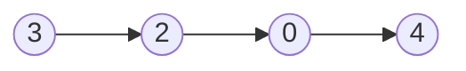
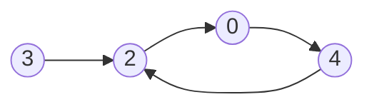
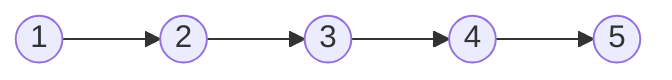
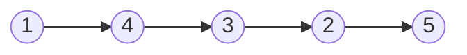

# Linked List

## Table of Contents

- [x] [141. Linked List Cycle](https://leetcode.cn/problems/linked-list-cycle/) (Easy)
- [x] [2. Add Two Numbers](https://leetcode.cn/problems/add-two-numbers/) (Medium)
- [x] [21. Merge Two Sorted Lists](https://leetcode.cn/problems/merge-two-sorted-lists/) (Easy)
- [x] [138. Copy List with Random Pointer](https://leetcode.cn/problems/copy-list-with-random-pointer/) (Medium)
- [x] [92. Reverse Linked List II](https://leetcode.cn/problems/reverse-linked-list-ii/) (Medium)
- [x] [25. Reverse Nodes in k-Group](https://leetcode.cn/problems/reverse-nodes-in-k-group/) (Hard)
- [x] [19. Remove Nth Node From End of List](https://leetcode.cn/problems/remove-nth-node-from-end-of-list/) (Medium)
- [x] [82. Remove Duplicates from Sorted List II](https://leetcode.cn/problems/remove-duplicates-from-sorted-list-ii/) (Medium)
- [ ] [61. Rotate List](https://leetcode.cn/problems/rotate-list/) (Medium)
- [ ] [86. Partition List](https://leetcode.cn/problems/partition-list/) (Medium)
- [x] [146. LRU Cache](https://leetcode.cn/problems/lru-cache/) (Medium)

## 141. Linked List Cycle

-   [LeetCode](https://leetcode.com/problems/linked-list-cycle/) | [LeetCode CH](https://leetcode.cn/problems/linked-list-cycle/) (Easy)

-   Tags: hash table, linked list, two pointers
-   Determine if a linked list has a cycle in it.





```python title="141. Linked List Cycle - Python Solution"
from typing import Optional

from template import ListNode


def hasCycle(head: Optional[ListNode]) -> bool:
    slow, fast = head, head

    while fast and fast.next:
        slow = slow.next
        fast = fast.next.next

        if slow == fast:
            return True

    return False


print(hasCycle(ListNode.create([3, 2, 0, -4])))  # False
print(hasCycle(ListNode.create([3, 2, 0, -4], 1)))  # True

```

```cpp title="141. Linked List Cycle - C++ Solution"
#include <iostream>

struct ListNode {
    int val;
    ListNode* next;
    ListNode(int x) : val(x), next(NULL) {}
};

class Solution {
   public:
    bool hasCycle(ListNode* head) {
        ListNode* slow = head;
        ListNode* fast = head;

        while (fast && fast->next) {
            slow = slow->next;
            fast = fast->next->next;

            if (fast == slow) return true;
        }
        return false;
    }
};
```

## 2. Add Two Numbers

-   [LeetCode](https://leetcode.com/problems/add-two-numbers/) | [LeetCode CH](https://leetcode.cn/problems/add-two-numbers/) (Medium)

-   Tags: linked list, math, recursion
-   Represent the sum of two numbers as a linked list.

```python title="2. Add Two Numbers - Python Solution"
from typing import Optional

from template import ListNode


# Linked List
def addTwoNumbers(
    l1: Optional[ListNode], l2: Optional[ListNode]
) -> Optional[ListNode]:
    dummy = ListNode()
    cur = dummy
    carry = 0

    while l1 or l2:
        v1 = l1.val if l1 else 0
        v2 = l2.val if l2 else 0

        carry, val = divmod(v1 + v2 + carry, 10)
        cur.next = ListNode(val)
        cur = cur.next

        if l1:
            l1 = l1.next
        if l2:
            l2 = l2.next

    if carry:
        cur.next = ListNode(val=carry)

    return dummy.next


l1 = ListNode.create([2, 4, 3])
l2 = ListNode.create([5, 6, 4])
print(addTwoNumbers(l1, l2))  # 7 -> 0 -> 8

```

```cpp title="2. Add Two Numbers - C++ Solution"
struct ListNode {
    int val;
    ListNode* next;
    ListNode() : val(0), next(nullptr) {}
    ListNode(int x) : val(x), next(nullptr) {}
    ListNode(int x, ListNode* next) : val(x), next(next) {}
};

class Solution {
   public:
    ListNode* addTwoNumbers(ListNode* l1, ListNode* l2) {
        ListNode dummy;
        ListNode* cur = &dummy;
        int carry = 0;

        while (l1 || l2 || carry) {
            if (l1) {
                carry += l1->val;
                l1 = l1->next;
            }
            if (l2) {
                carry += l2->val;
                l2 = l2->next;
            }
            cur->next = new ListNode(carry % 10);
            cur = cur->next;
            carry /= 10;
        }
        return dummy.next;
    }
};
```

## 21. Merge Two Sorted Lists

-   [LeetCode](https://leetcode.com/problems/merge-two-sorted-lists/) | [LeetCode CH](https://leetcode.cn/problems/merge-two-sorted-lists/) (Easy)

-   Tags: linked list, recursion
-   Merge the two lists into one sorted list.

<iframe width="560" height="315" src="https://www.youtube.com/embed/XIdigk956u0?si=2cVoU6DujA3Mgtlr" title="YouTube video player" frameborder="0" allow="accelerometer; autoplay; clipboard-write; encrypted-media; gyroscope; picture-in-picture; web-share" referrerpolicy="strict-origin-when-cross-origin" allowfullscreen></iframe>

```python title="21. Merge Two Sorted Lists - Python Solution"
from typing import Optional

from template import ListNode


# Linked List
def mergeTwoLists(
    list1: Optional[ListNode], list2: Optional[ListNode]
) -> Optional[ListNode]:
    dummy = ListNode()
    cur = dummy

    while list1 and list2:
        if list1.val < list2.val:
            cur.next = list1
            list1 = list1.next
        else:
            cur.next = list2
            list2 = list2.next
        cur = cur.next

    if list1:
        cur.next = list1
    elif list2:
        cur.next = list2

    return dummy.next


list1 = ListNode.create([1, 2, 4])
list2 = ListNode.create([1, 3, 4])
print(mergeTwoLists(list1, list2))
# 1 -> 1 -> 2 -> 3 -> 4 -> 4

```

```cpp title="21. Merge Two Sorted Lists - C++ Solution"
struct ListNode {
    int val;
    ListNode* next;
    ListNode() : val(0), next(nullptr) {}
    ListNode(int x) : val(x), next(nullptr) {}
    ListNode(int x, ListNode* next) : val(x), next(next) {}
};

class Solution {
   public:
    ListNode* mergeTwoLists(ListNode* list1, ListNode* list2) {
        ListNode dummy;
        ListNode* cur = &dummy;

        while (list1 && list2) {
            if (list1->val < list2->val) {
                cur->next = list1;
                list1 = list1->next;
            } else {
                cur->next = list2;
                list2 = list2->next;
            }
            cur = cur->next;
        }

        cur->next = list1 ? list1 : list2;

        return dummy.next;
    }
};
```

## 138. Copy List with Random Pointer

-   [LeetCode](https://leetcode.com/problems/copy-list-with-random-pointer/) | [LeetCode CH](https://leetcode.cn/problems/copy-list-with-random-pointer/) (Medium)

-   Tags: hash table, linked list
```python title="138. Copy List with Random Pointer - Python Solution"
from typing import Optional


class Node:
    def __init__(self, x: int, next: "Node" = None, random: "Node" = None):
        self.val = int(x)
        self.next = next
        self.random = random


def copyRandomList(head: "Optional[Node]") -> "Optional[Node]":
    if not head:
        return None

    # Copy nodes and link them together
    cur = head
    while cur:
        new_node = Node(cur.val)
        new_node.next = cur.next
        cur.next = new_node
        cur = new_node.next

    # Copy random pointers
    cur = head
    while cur:
        cur.next.random = cur.random.next if cur.random else None
        cur = cur.next.next

    # Separate the original and copied lists
    cur = head
    new_head = head.next
    while cur:
        new_node = cur.next
        cur.next = new_node.next
        new_node.next = new_node.next.next if new_node.next else None
        cur = cur.next

    return new_head

```

## 92. Reverse Linked List II

-   [LeetCode](https://leetcode.com/problems/reverse-linked-list-ii/) | [LeetCode CH](https://leetcode.cn/problems/reverse-linked-list-ii/) (Medium)

-   Tags: linked list
- Reverse a linked list from position left to position right. Return the linked list after reversing.





```python title="92. Reverse Linked List II - Python Solution"
from typing import Optional

from leetpattern.utils import ListNode, list_from_array, list_to_array


def reverseBetween(
    head: Optional[ListNode], left: int, right: int
) -> Optional[ListNode]:
    dummy = ListNode(next=head)
    p0 = dummy
    for _ in range(left - 1):
        if p0.next is None:
            break
        p0 = p0.next

    pre = None
    cur = p0.next
    for _ in range(right - left + 1):
        if not cur:
            break
        nxt = cur.next
        cur.next = pre
        pre = cur
        cur = nxt

    if p0.next:
        p0.next.next = cur
    p0.next = pre

    return dummy.next


def test_reverse_between():
    head = list_from_array([1, 2, 3, 4, 5])
    left = 2
    right = 4
    result = reverseBetween(head, left, right)
    assert list_to_array(result) == [1, 4, 3, 2, 5]

    head = list_from_array([5])
    left = 1
    right = 1
    result = reverseBetween(head, left, right)
    assert list_to_array(result) == [5]

    head = list_from_array([3, 5])
    left = 1
    right = 2
    result = reverseBetween(head, left, right)
    assert list_to_array(result) == [5, 3]

```

## 25. Reverse Nodes in k-Group

-   [LeetCode](https://leetcode.com/problems/reverse-nodes-in-k-group/) | [LeetCode CH](https://leetcode.cn/problems/reverse-nodes-in-k-group/) (Hard)

-   Tags: linked list, recursion
```python title="25. Reverse Nodes in k-Group - Python Solution"
from typing import Optional

from template import ListNode


# Linked List
def reverseKGroup(head: Optional[ListNode], k: int) -> Optional[ListNode]:
    n = 0
    cur = head
    while cur:
        n += 1
        cur = cur.next

    p0 = dummy = ListNode(next=head)
    pre = None
    cur = head

    while n >= k:
        n -= k
        for _ in range(k):
            nxt = cur.next
            cur.next = pre
            pre = cur
            cur = nxt

        nxt = p0.next
        nxt.next = cur
        p0.next = pre
        p0 = nxt

    return dummy.next


if __name__ == "__main__":
    head = [1, 2, 3, 4, 5]
    k = 2
    head = ListNode.create(head)
    print(head)  # 1 -> 2 -> 3 -> 4 -> 5
    print(reverseKGroup(head, k))  # 2 -> 1 -> 4 -> 3 -> 5

```

## 19. Remove Nth Node From End of List

-   [LeetCode](https://leetcode.com/problems/remove-nth-node-from-end-of-list/) | [LeetCode CH](https://leetcode.cn/problems/remove-nth-node-from-end-of-list/) (Medium)

-   Tags: linked list, two pointers
-   Given the `head` of a linked list, remove the `n-th` node from the end of the list and return its head.

```python title="19. Remove Nth Node From End of List - Python Solution"
from typing import Optional

from template import ListNode


# Linked List
def removeNthFromEnd(head: Optional[ListNode], n: int) -> Optional[ListNode]:
    dummy = ListNode(0, head)
    fast, slow = dummy, dummy

    for _ in range(n):
        fast = fast.next

    while fast.next:
        fast = fast.next
        slow = slow.next

    slow.next = slow.next.next

    return dummy.next


head = [1, 2, 3, 4, 5]
n = 2
head = ListNode.create(head)
print(head)  # 1 -> 2 -> 3 -> 4 -> 5
print(removeNthFromEnd(head, n))  # 1 -> 2 -> 3 -> 5

```

## 82. Remove Duplicates from Sorted List II

-   [LeetCode](https://leetcode.com/problems/remove-duplicates-from-sorted-list-ii/) | [LeetCode CH](https://leetcode.cn/problems/remove-duplicates-from-sorted-list-ii/) (Medium)

-   Tags: linked list, two pointers
```python title="82. Remove Duplicates from Sorted List II - Python Solution"
from typing import Optional

from template import ListNode


# Linked List
def deleteDuplicates(head: Optional[ListNode]) -> Optional[ListNode]:
    dummy = ListNode(0, head)
    cur = dummy

    while cur.next and cur.next.next:
        val = cur.next.val
        if cur.next.next.val == val:
            while cur.next and cur.next.val == val:
                cur.next = cur.next.next
        else:
            cur = cur.next

    return dummy.next


head = ListNode().create([1, 1, 2, 3, 3, 4, 5])
print(deleteDuplicates(head))  # 2 -> 4 -> 5

```

## 61. Rotate List

-   [LeetCode](https://leetcode.com/problems/rotate-list/) | [LeetCode CH](https://leetcode.cn/problems/rotate-list/) (Medium)

-   Tags: linked list, two pointers
## 86. Partition List

-   [LeetCode](https://leetcode.com/problems/partition-list/) | [LeetCode CH](https://leetcode.cn/problems/partition-list/) (Medium)

-   Tags: linked list, two pointers
## 146. LRU Cache

-   [LeetCode](https://leetcode.com/problems/lru-cache/) | [LeetCode CH](https://leetcode.cn/problems/lru-cache/) (Medium)

-   Tags: hash table, linked list, design, doubly linked list
- Design and implement a data structure for **Least Recently Used (LRU) cache**. It should support the following operations: get and put.
- [lru](https://media.geeksforgeeks.org/wp-content/uploads/20240909142802/Working-of-LRU-Cache-copy-2.webp)
- 

| Data structure     | Description                   |
| ------------------ | ----------------------------- |
| Doubly Linked List | To store the key-value pairs. |
| Hash Map           | To store the key-node pairs.  |

```python title="146. LRU Cache - Python Solution"
from collections import OrderedDict


# Doubly Linked List
class Node:
    def __init__(self, key=0, val=0):
        self.key = key
        self.val = val
        self.prev = None
        self.next = None


class LRUCache:

    def __init__(self, capacity: int):
        self.cap = capacity
        self.cache = {}
        self.head = Node()
        self.tail = Node()
        self.head.next = self.tail
        self.tail.prev = self.head

    def remove(self, node):
        node.prev.next = node.next
        node.next.prev = node.prev

    def add_to_last(self, node):
        self.tail.prev.next = node
        node.prev = self.tail.prev
        node.next = self.tail
        self.tail.prev = node

    def move_to_last(self, node):
        self.remove(node)
        self.add_to_last(node)

    def get(self, key: int) -> int:
        if key not in self.cache:
            return -1
        node = self.cache[key]
        self.move_to_last(node)
        return node.val

    def put(self, key: int, value: int) -> None:
        if key in self.cache:
            node = self.cache[key]
            node.val = value
            self.move_to_last(node)
            return None

        if len(self.cache) == self.cap:
            del self.cache[self.head.next.key]
            self.remove(self.head.next)

        node = Node(key=key, val=value)
        self.cache[key] = node
        self.add_to_last(node)


# OrderedDict
class LRUCacheOrderedDict:
    def __init__(self, capacity: int):
        self.cache = OrderedDict()
        self.cap = capacity

    def get(self, key: int):
        if key not in self.cache:
            return -1
        self.cache.move_to_end(key, last=True)
        return self.cache[key]

    def put(self, key: int, value: int):
        if key in self.cache:
            self.cache.move_to_end(key, last=True)
        elif len(self.cache) >= self.cap:
            self.cache.popitem(last=False)

        self.cache[key] = value


cache = LRUCache(2)
cache.put(1, 1)
cache.put(2, 2)
assert cache.get(1) == 1
cache.put(3, 3)
assert cache.get(2) == -1
cache.put(4, 4)
assert cache.get(1) == -1
assert cache.get(3) == 3
assert cache.get(4) == 4


cache = LRUCacheOrderedDict(2)
cache.put(1, 1)
cache.put(2, 2)
assert cache.get(1) == 1
cache.put(3, 3)
assert cache.get(2) == -1
cache.put(4, 4)
assert cache.get(1) == -1
assert cache.get(3) == 3
assert cache.get(4) == 4

print("LRU Cache passed")
print("LRU Cache Ordered Dict passed")

```

```cpp title="146. LRU Cache - C++ Solution"
#include <iostream>
#include <unordered_map>
using namespace std;

class Node {
   public:
    int key;
    int val;
    Node *prev;
    Node *next;

    Node(int k = 0, int v = 0) : key(k), val(v), prev(nullptr), next(nullptr) {}
};

class LRUCache {
   private:
    int cap;
    unordered_map<int, Node *> cache;
    Node *head;
    Node *tail;

    void remove(Node *node) {
        node->prev->next = node->next;
        node->next->prev = node->prev;
    }

    void insert_to_last(Node *node) {
        tail->prev->next = node;
        node->prev = tail->prev;
        tail->prev = node;
        node->next = tail;
    }

    void move_to_last(Node *node) {
        remove(node);
        insert_to_last(node);
    }

   public:
    LRUCache(int capacity) {
        this->cap = capacity;
        head = new Node();
        tail = new Node();
        head->next = tail;
        tail->prev = head;
    }

    int get(int key) {
        if (cache.find(key) != cache.end()) {
            Node *node = cache[key];
            move_to_last(node);
            return node->val;
        }
        return -1;
    }

    void put(int key, int value) {
        if (cache.find(key) != cache.end()) {
            Node *node = cache[key];
            node->val = value;
            move_to_last(node);
        } else {
            Node *newNode = new Node(key, value);
            cache[key] = newNode;
            insert_to_last(newNode);

            if ((int)cache.size() > cap) {
                Node *removed = head->next;
                remove(removed);
                cache.erase(removed->key);
                delete removed;
            }
        }
    }
};

int main() {
    LRUCache lru(2);
    lru.put(1, 1);
    lru.put(2, 2);
    cout << lru.get(1) << endl;  // 1
    lru.put(3, 3);
    cout << lru.get(2) << endl;  // -1
    lru.put(4, 4);
    cout << lru.get(1) << endl;  // -1
    cout << lru.get(3) << endl;  // 3
    cout << lru.get(4) << endl;  // 4
    return 0;
}
```
