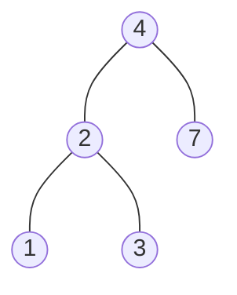

# BST

## Table of Contents

- [x] [700. Search in a Binary Search Tree](https://leetcode.cn/problems/search-in-a-binary-search-tree/) (Easy)
- [x] [98. Validate Binary Search Tree](https://leetcode.cn/problems/validate-binary-search-tree/) (Medium)
- [x] [530. Minimum Absolute Difference in BST](https://leetcode.cn/problems/minimum-absolute-difference-in-bst/) (Easy)
- [x] [501. Find Mode in Binary Search Tree](https://leetcode.cn/problems/find-mode-in-binary-search-tree/) (Easy)
- [x] [235. Lowest Common Ancestor of a Binary Search Tree](https://leetcode.cn/problems/lowest-common-ancestor-of-a-binary-search-tree/) (Medium)
- [x] [701. Insert into a Binary Search Tree](https://leetcode.cn/problems/insert-into-a-binary-search-tree/) (Medium)
- [x] [450. Delete Node in a BST](https://leetcode.cn/problems/delete-node-in-a-bst/) (Medium)
- [x] [669. Trim a Binary Search Tree](https://leetcode.cn/problems/trim-a-binary-search-tree/) (Medium)
- [x] [108. Convert Sorted Array to Binary Search Tree](https://leetcode.cn/problems/convert-sorted-array-to-binary-search-tree/) (Easy)
- [x] [109. Convert Sorted List to Binary Search Tree](https://leetcode.cn/problems/convert-sorted-list-to-binary-search-tree/) (Medium)
- [x] [538. Convert BST to Greater Tree](https://leetcode.cn/problems/convert-bst-to-greater-tree/) (Medium)
- [x] [230. Kth Smallest Element in a BST](https://leetcode.cn/problems/kth-smallest-element-in-a-bst/) (Medium)
- [x] [173. Binary Search Tree Iterator](https://leetcode.cn/problems/binary-search-tree-iterator/) (Medium)
- [x] [1586. Binary Search Tree Iterator II](https://leetcode.cn/problems/binary-search-tree-iterator-ii/) (Medium) 👑

## 700. Search in a Binary Search Tree

-   [LeetCode](https://leetcode.com/problems/search-in-a-binary-search-tree/) | [LeetCode CH](https://leetcode.cn/problems/search-in-a-binary-search-tree/) (Easy)

-   Tags: tree, binary search tree, binary tree
### Binary Search Tree

1. Binary Tree
2. Left subtree of a node contains only nodes with keys less than the node's key
3. Right subtree of a node contains only nodes with keys greater than the node's key
4. The left and right subtree each must also be a binary search tree
5. There must be no duplicate nodes
6. Inorder traversal of a BST gives a sorted list of keys



```python title="700. Search in a Binary Search Tree - Python Solution"
from typing import Optional

from binarytree import build


class TreeNode:
    def __init__(self, val=0, left=None, right=None):
        self.val = val
        self.left = left
        self.right = right


# 1. Recursive
def searchBSTRecursive(
    root: Optional[TreeNode], val: int
) -> Optional[TreeNode]:
    if not root:
        return None

    if root.val > val:
        return searchBSTRecursive(root.left, val)

    elif root.val < val:
        return searchBSTRecursive(root.right, val)

    else:
        return root


# 2. Iterative
def searchBSTIterative(
    root: Optional[TreeNode], val: int
) -> Optional[TreeNode]:
    while root:
        if root.val > val:
            root = root.left
        elif root.val < val:
            root = root.right
        else:
            return root
    return None


root = [4, 2, 7, 1, 3]
val = 2
root = build(root)
print(root)
#     __4
#    /   \
#   2     7
#  / \
# 1   3
print(searchBSTRecursive(root, val))
#   2
#  / \
# 1   3
print(searchBSTIterative(root, val))
#   2
#  / \
# 1   3

```

## 98. Validate Binary Search Tree

-   [LeetCode](https://leetcode.com/problems/validate-binary-search-tree/) | [LeetCode CH](https://leetcode.cn/problems/validate-binary-search-tree/) (Medium)

-   Tags: tree, depth first search, binary search tree, binary tree
```python title="98. Validate Binary Search Tree - Python Solution"
from typing import Optional

from binarytree import Node as TreeNode
from binarytree import build


def isValidBST(root: Optional[TreeNode]) -> bool:
    inorder = []  # inorder traversal of BST

    def dfs(node):
        if not node:
            return None
        dfs(node.left)
        inorder.append(node.val)
        dfs(node.right)

    dfs(root)

    for i in range(1, len(inorder)):
        if inorder[i] <= inorder[i - 1]:
            return False

    return True


root = [5, 1, 4, None, None, 3, 6]
root = build(root)
print(root)
#   5__
#  /   \
# 1     4
#      / \
#     3   6
print(isValidBST(root))  # False
# [1, 5, 3, 4, 6]

```

```cpp title="98. Validate Binary Search Tree - C++ Solution"
#include <cassert>
#include <vector>
using namespace std;

struct TreeNode {
    int val;
    TreeNode *left;
    TreeNode *right;
    TreeNode() : val(0), left(nullptr), right(nullptr) {}
    TreeNode(int x) : val(x), left(nullptr), right(nullptr) {}
    TreeNode(int x, TreeNode *left, TreeNode *right)
        : val(x), left(left), right(right) {}
};

class Solution {
   private:
    vector<int> inorder;
    bool check(vector<int> inorder) {
        int n = inorder.size();
        if (n <= 1) return true;
        for (int i = 1; i < n; i++) {
            if (inorder[i] <= inorder[i - 1]) return false;
        }
        return true;
    }

   public:
    bool isValidBST(TreeNode *root) {
        auto dfs = [&](auto &&self, TreeNode *node) -> void {
            if (!node) return;

            self(self, node->left);
            inorder.push_back(node->val);
            self(self, node->right);
        };

        dfs(dfs, root);

        return check(inorder);
    }
};

int main() {
    Solution s;
    TreeNode *root = new TreeNode(2);
    root->left = new TreeNode(1);
    root->right = new TreeNode(3);
    assert(s.isValidBST(root) == true);

    root = new TreeNode(5);
    root->left = new TreeNode(1);
    root->right = new TreeNode(4);
    root->right->left = new TreeNode(3);
    root->right->right = new TreeNode(6);
    assert(s.isValidBST(root) == false);

    root = new TreeNode(5);
    root->left = new TreeNode(4);
    root->right = new TreeNode(6);
    root->right->left = new TreeNode(3);
    root->right->right = new TreeNode(7);
    assert(s.isValidBST(root) == false);

    return 0;
}
```

## 530. Minimum Absolute Difference in BST

-   [LeetCode](https://leetcode.com/problems/minimum-absolute-difference-in-bst/) | [LeetCode CH](https://leetcode.cn/problems/minimum-absolute-difference-in-bst/) (Easy)

-   Tags: tree, depth first search, breadth first search, binary search tree, binary tree
```python title="530. Minimum Absolute Difference in BST - Python Solution"
from typing import Optional

from binarytree import build


class TreeNode:
    def __init__(self, val=0, left=None, right=None):
        self.val = val
        self.left = left
        self.right = right


def getMinimumDifference(root: Optional[TreeNode]) -> int:

    inorder = []
    result = float("inf")

    def dfs(node):
        if not node:
            return None
        dfs(node.left)
        inorder.append(node.val)
        dfs(node.right)

    dfs(root)

    for i in range(1, len(inorder)):
        result = min(result, abs(inorder[i] - inorder[i - 1]))

    return result


root = [4, 2, 6, 1, 3]
root = build(root)
print(root)
#     __4
#    /   \
#   2     6
#  / \
# 1   3
print(getMinimumDifference(root))  # 1

```

## 501. Find Mode in Binary Search Tree

-   [LeetCode](https://leetcode.com/problems/find-mode-in-binary-search-tree/) | [LeetCode CH](https://leetcode.cn/problems/find-mode-in-binary-search-tree/) (Easy)

-   Tags: tree, depth first search, binary search tree, binary tree
```python title="501. Find Mode in Binary Search Tree - Python Solution"
from typing import List, Optional

from binarytree import build


class TreeNode:
    def __init__(self, val=0, left=None, right=None):
        self.val = val
        self.left = left
        self.right = right


def findMode(root: Optional[TreeNode]) -> List[int]:
    hashmap = dict()

    def dfs(node):
        if not node:
            return None
        dfs(node.left)
        if node.val not in hashmap:
            hashmap[node.val] = 1
        else:
            hashmap[node.val] += 1
        dfs(node.right)

    dfs(root)
    max_counts = max(hashmap.values())
    result = []

    for key, value in hashmap.items():
        if value == max_counts:
            result.append(key)

    return result


root = [1, None, 2, None, None, 2]
root = build(root)
print(root)
# 1__
#    \
#     2
#    /
#   2
print(findMode(root))  # [2]

```

## 235. Lowest Common Ancestor of a Binary Search Tree

-   [LeetCode](https://leetcode.com/problems/lowest-common-ancestor-of-a-binary-search-tree/) | [LeetCode CH](https://leetcode.cn/problems/lowest-common-ancestor-of-a-binary-search-tree/) (Medium)

-   Tags: tree, depth first search, binary search tree, binary tree
```python title="235. Lowest Common Ancestor of a Binary Search Tree - Python Solution"
from binarytree import build


class TreeNode:
    def __init__(self, val=0, left=None, right=None):
        self.val = val
        self.left = left
        self.right = right


def lowestCommonAncestor(
    root: "TreeNode", p: "TreeNode", q: "TreeNode"
) -> "TreeNode":
    while root:
        if root.val > p.val and root.val > q.val:
            root = root.left
        elif root.val < p.val and root.val < q.val:
            root = root.right
        else:
            return root


root = [6, 2, 8, 0, 4, 7, 9, None, None, 3, 5]
root = build(root)
p = root.left
q = root.right
print(root)
#     ______6__
#    /         \
#   2__         8
#  /   \       / \
# 0     4     7   9
#      / \
#     3   5
print(lowestCommonAncestor(root, p, q))
#     ______6__
#    /         \
#   2__         8
#  /   \       / \
# 0     4     7   9
#      / \
#     3   5

```

## 701. Insert into a Binary Search Tree

-   [LeetCode](https://leetcode.com/problems/insert-into-a-binary-search-tree/) | [LeetCode CH](https://leetcode.cn/problems/insert-into-a-binary-search-tree/) (Medium)

-   Tags: tree, binary search tree, binary tree
```python title="701. Insert into a Binary Search Tree - Python Solution"
from typing import Optional


class TreeNode:
    def __init__(self, val=0, left=None, right=None):
        self.val = val
        self.left = left
        self.right = right


def insertIntoBST(root: Optional[TreeNode], val: int) -> Optional[TreeNode]:
    if root is None:
        return TreeNode(val)

    if root.val > val:
        root.left = insertIntoBST(root.left, val)
    if root.val < val:
        root.right = insertIntoBST(root.right, val)

    return root


root = TreeNode(4)
root.left = TreeNode(2)
root.right = TreeNode(6)
root.left.left = TreeNode(1)
root.left.right = TreeNode(3)
#     __4
#    /   \
#   2     6
#  / \
# 1   3

insertIntoBST(root, 5)
#     __4
#    /   \
#   2     6
#  / \   /
# 1   3 5

```

## 450. Delete Node in a BST

-   [LeetCode](https://leetcode.com/problems/delete-node-in-a-bst/) | [LeetCode CH](https://leetcode.cn/problems/delete-node-in-a-bst/) (Medium)

-   Tags: tree, binary search tree, binary tree
```python title="450. Delete Node in a BST - Python Solution"
from typing import Optional


class TreeNode:
    def __init__(self, val=0, left=None, right=None):
        self.val = val
        self.left = left
        self.right = right


def deleteNode(root: Optional[TreeNode], key: int) -> Optional[TreeNode]:
    if root is None:
        return root

    if root.val == key:
        if root.left is None and root.right is None:
            return None
        elif root.left is None:
            return root.right
        elif root.right is None:
            return root.left
        else:
            cur = root.right
            while cur.left is not None:
                cur = cur.left
            cur.left = root.left
            return root.right

    if root.val > key:
        root.left = deleteNode(root.left, key)
    if root.val < key:
        root.right = deleteNode(root.right, key)

    return root


root = TreeNode(5)
root.left = TreeNode(3)
root.right = TreeNode(6)
root.left.left = TreeNode(2)
root.left.right = TreeNode(4)
root.right.right = TreeNode(7)
#     __5
#    /   \
#   3     6
#  / \     \
# 2   4     7

deleteNode(root, 3)
#     __5
#    /   \
#   4     6
#  /       \
# 2         7

```

## 669. Trim a Binary Search Tree

-   [LeetCode](https://leetcode.com/problems/trim-a-binary-search-tree/) | [LeetCode CH](https://leetcode.cn/problems/trim-a-binary-search-tree/) (Medium)

-   Tags: tree, depth first search, binary search tree, binary tree
```python title="669. Trim a Binary Search Tree - Python Solution"
from typing import Optional


class TreeNode:
    def __init__(self, val=0, left=None, right=None):
        self.val = val
        self.left = left
        self.right = right


def trimBST(
    root: Optional[TreeNode], low: int, high: int
) -> Optional[TreeNode]:
    if root is None:
        return None

    if root.val < low:
        return trimBST(root.right, low, high)
    if root.val > high:
        return trimBST(root.left, low, high)

    root.left = trimBST(root.left, low, high)
    root.right = trimBST(root.right, low, high)

    return root


root = TreeNode(3)
root.left = TreeNode(0)
root.right = TreeNode(4)
root.left.right = TreeNode(2)
root.left.right.left = TreeNode(1)
#     __3
#    /   \
#   0     4
#    \
#     2
#    /
#   1

trimBST(root, 1, 3)
#     __3
#    /
#   2
#  /
# 1

```

## 108. Convert Sorted Array to Binary Search Tree

-   [LeetCode](https://leetcode.com/problems/convert-sorted-array-to-binary-search-tree/) | [LeetCode CH](https://leetcode.cn/problems/convert-sorted-array-to-binary-search-tree/) (Easy)

-   Tags: array, divide and conquer, tree, binary search tree, binary tree
```python title="108. Convert Sorted Array to Binary Search Tree - Python Solution"
from typing import List, Optional


class TreeNode:
    def __init__(self, val=0, left=None, right=None):
        self.val = val
        self.left = left
        self.right = right


def sortedArrayToBST(nums: List[int]) -> Optional[TreeNode]:
    if len(nums) == 0:
        return None

    mid = len(nums) // 2
    root = TreeNode(nums[mid])

    root.left = sortedArrayToBST(nums[:mid])
    root.right = sortedArrayToBST(nums[mid + 1 :])

    return root


nums = [-10, -3, 0, 5, 9]
root = sortedArrayToBST(nums)
#      0
#     / \
#   -3   9
#   /   /
# -10  5

```

```cpp title="108. Convert Sorted Array to Binary Search Tree - C++ Solution"
#include <vector>
using namespace std;

struct TreeNode {
    int val;
    TreeNode* left;
    TreeNode* right;
    TreeNode() : val(0), left(nullptr), right(nullptr) {}
    TreeNode(int x) : val(x), left(nullptr), right(nullptr) {}
    TreeNode(int x, TreeNode* left, TreeNode* right)
        : val(x), left(left), right(right) {}
};

class Solution {
   public:
    TreeNode* sortedArrayToBST(vector<int>& nums) {
        if (nums.size() == 0) return nullptr;

        int mid = nums.size() / 2;
        TreeNode* root = new TreeNode(nums[mid]);

        vector<int> left(nums.begin(), nums.begin() + mid);
        vector<int> right(nums.begin() + mid + 1, nums.end());

        root->left = sortedArrayToBST(left);
        root->right = sortedArrayToBST(right);

        return root;
    }
};

int main() { return 0; }
```

## 109. Convert Sorted List to Binary Search Tree

-   [LeetCode](https://leetcode.com/problems/convert-sorted-list-to-binary-search-tree/) | [LeetCode CH](https://leetcode.cn/problems/convert-sorted-list-to-binary-search-tree/) (Medium)

-   Tags: linked list, divide and conquer, tree, binary search tree, binary tree


```python title="109. Convert Sorted List to Binary Search Tree - Python Solution"
from typing import Optional


class ListNode:
    def __init__(self, val=0, next=None):
        self.val = val
        self.next = next


class TreeNode:
    def __init__(self, val=0, left=None, right=None):
        self.val = val
        self.left = left
        self.right = right


def sortedListToBST(head: Optional[ListNode]) -> Optional[TreeNode]:
    if not head:
        return None

    def find_mid(head: ListNode) -> ListNode:
        prev = None
        slow = head
        fast = head

        while fast and fast.next:
            prev = slow
            slow = slow.next
            fast = fast.next.next

        if prev:
            prev.next = None

        return slow

    mid = find_mid(head)

    node = TreeNode(mid.val)

    if head == mid:
        return node

    node.left = sortedListToBST(head)
    node.right = sortedListToBST(mid.next)

    return node


head = ListNode(-10)
head.next = ListNode(-3)
head.next.next = ListNode(0)
head.next.next.next = ListNode(5)
head.next.next.next.next = ListNode(9)

root = sortedListToBST(head)
assert root.val == 0
assert root.left.val == -3
assert root.left.left.val == -10
assert root.right.val == 9
assert root.right.left.val == 5
print("All passed")

#      0
#     / \
#   -3   9
#   /   /
# -10  5

```

## 538. Convert BST to Greater Tree

-   [LeetCode](https://leetcode.com/problems/convert-bst-to-greater-tree/) | [LeetCode CH](https://leetcode.cn/problems/convert-bst-to-greater-tree/) (Medium)

-   Tags: tree, depth first search, binary search tree, binary tree


```python title="538. Convert BST to Greater Tree - Python Solution"
from typing import Optional

from binarytree import build


class TreeNode:
    def __init__(self, val=0, left=None, right=None):
        self.val = val
        self.left = left
        self.right = right


def convertBST(root: Optional[TreeNode]) -> Optional[TreeNode]:
    prev = 0

    def dfs(node):
        if not node:
            return None
        nonlocal prev

        dfs(node.right)

        node.val += prev
        prev = node.val

        dfs(node.left)

    dfs(root)

    return root


root = [4, 1, 6, 0, 2, 5, 7, None, None, None, 3, None, None, None, 8]
root = build(root)
print(root)
#     ____4__
#    /       \
#   1         6
#  / \       / \
# 0   2     5   7
#      \         \
#       3         8
greater_tree = convertBST(root)
print(greater_tree)
#      _______30___
#     /            \
#   _36            _21
#  /   \          /   \
# 36    35       26    15
#         \              \
#          33             8

```

## 230. Kth Smallest Element in a BST

-   [LeetCode](https://leetcode.com/problems/kth-smallest-element-in-a-bst/) | [LeetCode CH](https://leetcode.cn/problems/kth-smallest-element-in-a-bst/) (Medium)

-   Tags: tree, depth first search, binary search tree, binary tree
```python title="230. Kth Smallest Element in a BST - Python Solution"
from typing import Optional

from binarytree import Node as TreeNode
from binarytree import build


# Recursive
def kthSmallestRecursive(root: Optional[TreeNode], k: int) -> int:
    inorder = []

    def dfs(node):
        if not node:
            return None
        dfs(node.left)
        inorder.append(node.val)
        dfs(node.right)

    dfs(root)
    return inorder[k - 1]


# Iteratve
def kthSmallestIteratve(root: Optional[TreeNode], k: int) -> int:
    stack = []
    while True:
        while root:
            stack.append(root)
            root = root.left
        root = stack.pop()
        k -= 1
        if not k:
            return root.val
        root = root.right


root = build([3, 1, 4, None, 2])
k = 1
print(root)
#   __3
#  /   \
# 1     4
#  \
#   2
print(kthSmallestRecursive(root, k))  # 1
print(kthSmallestIteratve(root, k))  # 1

```

## 173. Binary Search Tree Iterator

-   [LeetCode](https://leetcode.com/problems/binary-search-tree-iterator/) | [LeetCode CH](https://leetcode.cn/problems/binary-search-tree-iterator/) (Medium)

-   Tags: stack, tree, design, binary search tree, binary tree, iterator
```python title="173. Binary Search Tree Iterator - Python Solution"
from typing import Optional

from binarytree import Node as TreeNode
from binarytree import build


# BST
class BSTIterator:

    def __init__(self, root: Optional[TreeNode]):
        self.stack = []
        self._leftmost_inorder(root)

    def _leftmost_inorder(self, root):
        while root:
            self.stack.append(root)
            root = root.left

    def next(self) -> int:
        topmost_node = self.stack.pop()

        if topmost_node.right:
            self._leftmost_inorder(topmost_node.right)

        return topmost_node.val

    def hasNext(self) -> bool:
        return len(self.stack) > 0


root = build([7, 3, 15, None, None, 9, 20])
print(root)
#   7__
#  /   \
# 3     15
#      /  \
#     9    20
obj = BSTIterator(root)
print(obj.next())  # 3
print(obj.next())  # 7
print(obj.hasNext())  # True

```

## 1586. Binary Search Tree Iterator II

-   [LeetCode](https://leetcode.com/problems/binary-search-tree-iterator-ii/) | [LeetCode CH](https://leetcode.cn/problems/binary-search-tree-iterator-ii/) (Medium)

-   Tags: stack, tree, design, binary search tree, binary tree, iterator
```python title="1586. Binary Search Tree Iterator II - Python Solution"
from typing import Optional

from binarytree import Node as TreeNode
from binarytree import build


# BST
class BSTIterator:
    def __init__(self, root: Optional[TreeNode]):
        self.nodes = self._inorder(root)
        self.index = -1
        self.size = len(self.nodes)

    def _inorder(self, node):
        if not node:
            return []
        return (
            self._inorder(node.left) + [node.val] + self._inorder(node.right)
        )

    def hasNext(self) -> bool:
        return self.index < self.size - 1

    def next(self) -> int:
        self.index += 1
        return self.nodes[min(self.index, self.size - 1)]

    def hasPrev(self) -> bool:
        return self.index > 0

    def prev(self) -> int:
        self.index -= 1
        return self.nodes[max(self.index, 0)]


root = build([7, 3, 15, None, None, 9, 20])
print(root)
#   7__
#  /   \
# 3     15
#      /  \
#     9    20
obj = BSTIterator(root)
print(obj.next())  # 3
print(obj.next())  # 7
print(obj.hasNext())  # True
print(obj.prev())  # 3
print(obj.prev())  # None

```
