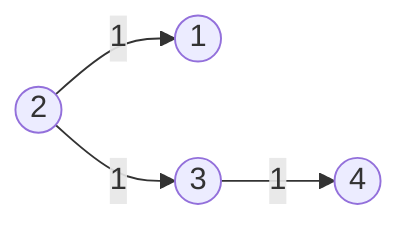
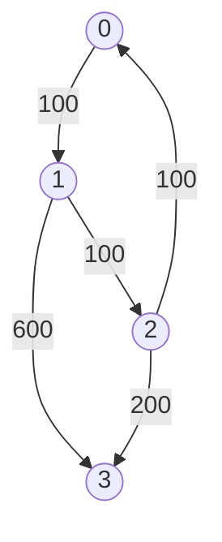

# Graph Bellman Ford

## Table of Contents

- [x] [743. Network Delay Time](https://leetcode.cn/problems/network-delay-time/) (Medium)
- [x] [787. Cheapest Flights Within K Stops](https://leetcode.cn/problems/cheapest-flights-within-k-stops/) (Medium)

## 743. Network Delay Time

-   [LeetCode](https://leetcode.com/problems/network-delay-time/) | [LeetCode CH](https://leetcode.cn/problems/network-delay-time/) (Medium)

-   Tags: depth first search, breadth first search, graph, heap priority queue, shortest path
-   Return the minimum time taken to reach all nodes in a network.



-   Shortest Path Problem: Find the shortest path between two vertices in a graph.
-   Dijkstra's Algorithm
    -   Shortest path algorithm
    -   Weighted graph (non-negative weights)
    -   Data Structure: Heap; Hash Set
    -   Time Complexity: O(E * logV)
    -   Space Complexity: O(V)

```python title="743. Network Delay Time - Python Solution"
import heapq
from collections import defaultdict
from typing import List


# Dijkstra - Set
def networkDelayTime1(times: List[List[int]], n: int, k: int) -> int:
    graph = defaultdict(list)
    for u, v, w in times:
        graph[u].append((v, w))

    heap = [(0, k)]
    visit = set()
    t = 0

    while heap:
        w1, n1 = heapq.heappop(heap)
        if n1 in visit:
            continue

        visit.add(n1)
        t = w1

        for n2, w2 in graph[n1]:
            heapq.heappush(heap, (w1 + w2, n2))

    return t if len(visit) == n else -1


# Dijkstra - Dict
def networkDelayTime2(times: List[List[int]], n: int, k: int) -> int:
    graph = defaultdict(list)
    for u, v, w in times:
        graph[u].append((v, w))

    heap = [(0, k)]
    dist = defaultdict(int)

    while heap:
        w1, n1 = heapq.heappop(heap)
        if n1 in dist:
            continue

        dist[n1] = w1

        for n2, w2 in graph[n1]:
            heapq.heappush(heap, (w1 + w2, n2))

    return max(dist.values()) if len(dist) == n else -1


# Bellman-Ford
def networkDelayTimeBF(times: List[List[int]], n: int, k: int) -> int:
    delay = {i: float("inf") for i in range(1, n + 1)}
    delay[k] = 0

    for _ in range(n - 1):
        for u, v, t in times:
            delay[v] = min(delay[v], delay[u] + t)

    max_delay = max(delay.values())
    return max_delay if max_delay < float("inf") else -1


# |--------------|-----------|--------|
# | Approach     | Time      | Space  |
# |--------------|-----------|--------|
# | Dijkstra     | O(E*logV) | O(V+E) |
# | Bellman-Ford | O(E*V)    | O(V)   |
# |--------------|-----------|--------|

if __name__ == "__main__":
    times = [[2, 1, 1], [2, 3, 1], [3, 4, 1]]
    n = 4
    k = 2
    print(networkDelayTime1(times, n, k))  # 2
    print(networkDelayTime2(times, n, k))  # 2
    print(networkDelayTimeBF(times, n, k))  # 2

```

## 787. Cheapest Flights Within K Stops

-   [LeetCode](https://leetcode.com/problems/cheapest-flights-within-k-stops/) | [LeetCode CH](https://leetcode.cn/problems/cheapest-flights-within-k-stops/) (Medium)

-   Tags: dynamic programming, depth first search, breadth first search, graph, heap priority queue, shortest path
-   Return the cheapest price from `src` to `dst` with at most `K` stops.



<iframe width="560" height="315" src="https://www.youtube.com/embed/5eIK3zUdYmE?si=aBR0VbHXTgNuVlGz" title="YouTube video player" frameborder="0" allow="accelerometer; autoplay; clipboard-write; encrypted-media; gyroscope; picture-in-picture; web-share" referrerpolicy="strict-origin-when-cross-origin" allowfullscreen></iframe>

```python title="787. Cheapest Flights Within K Stops - Python Solution"
import heapq
from collections import defaultdict
from typing import List


# Bellman-Ford
def findCheapestPriceBF(
    n: int, flights: List[List[int]], src: int, dst: int, k: int
) -> int:
    prices = [float("inf") for _ in range(n)]
    prices[src] = 0

    for _ in range(k + 1):
        temp = prices[:]
        for u, v, w in flights:
            temp[v] = min(temp[v], prices[u] + w)
        prices = temp

    return prices[dst] if prices[dst] != float("inf") else -1


# Dijkstra
def findCheapestPriceDijkstra(
    n: int, flights: List[List[int]], src: int, dst: int, k: int
) -> int:
    graph = defaultdict(list)
    for u, v, w in flights:
        graph[u].append((v, w))

    heap = [(0, src, 0)]  # (price, city, stops)
    visited = defaultdict(int)  # {city: stops}

    while heap:
        price, city, stops = heapq.heappop(heap)

        if city == dst:
            return price

        if stops > k:
            continue

        if city in visited and visited[city] <= stops:
            continue

        visited[city] = stops

        for neighbor, cost in graph[city]:
            heapq.heappush(heap, (price + cost, neighbor, stops + 1))

    return -1


# |------------|------------------|---------|
# |  Approach  |       Time       |  Space  |
# |------------|------------------|---------|
# |Bellman-Ford|    O(k * E)      |  O(n)   |
# | Dijkstra   | O(E * log(V))    |  O(n)   |
# |------------|------------------|---------|


n = 4
flights = [[0, 1, 100], [1, 2, 100], [2, 0, 100], [1, 3, 600], [2, 3, 200]]
src = 0
dst = 3
k = 1
print(findCheapestPriceBF(n, flights, src, dst, k))  # 700
print(findCheapestPriceDijkstra(n, flights, src, dst, k))  # 700

```
