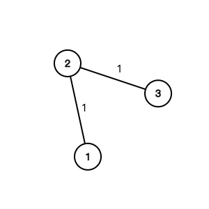
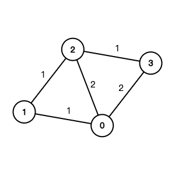

# Graph Minimum Spanning Tree

## Table of Contents

- [x] [1584. Min Cost to Connect All Points](https://leetcode.cn/problems/min-cost-to-connect-all-points/) (Medium)
- [x] [1135. Connecting Cities With Minimum Cost](https://leetcode.cn/problems/connecting-cities-with-minimum-cost/) (Medium) 👑
- [x] [1168. Optimize Water Distribution in a Village](https://leetcode.cn/problems/optimize-water-distribution-in-a-village/) (Hard) 👑
- [x] [1489. Find Critical and Pseudo-Critical Edges in Minimum Spanning Tree](https://leetcode.cn/problems/find-critical-and-pseudo-critical-edges-in-minimum-spanning-tree/) (Hard)
- [x] [1631. Path With Minimum Effort](https://leetcode.cn/problems/path-with-minimum-effort/) (Medium)
- [x] [1579. Remove Max Number of Edges to Keep Graph Fully Traversable](https://leetcode.cn/problems/remove-max-number-of-edges-to-keep-graph-fully-traversable/) (Hard)

## 1584. Min Cost to Connect All Points

-   [LeetCode](https://leetcode.com/problems/min-cost-to-connect-all-points/) | [LeetCode CH](https://leetcode.cn/problems/min-cost-to-connect-all-points/) (Medium)

-   Tags: array, union find, graph, minimum spanning tree
- Tree: a connected acyclic graph
- Spanning Tree: a subgraph that is a tree and connects all the vertices together
- Minimum Spanning Tree (MST): a spanning tree with the minimum possible sum of edge weights
- Prim's Algorithm
  - Data Structure: Heap
  - Time Complexity: O(E * logV)
  - Space Complexity: O(V + E)
- Kruskal's Algorithm
  - Union Find
  - Time Complexity: O(E * logV)
  - Space Complexity: O(V + E)

```python title="1584. Min Cost to Connect All Points - Python Solution"
import heapq
from collections import defaultdict
from typing import List


# Prim
def minCostConnectPointsPrim(points: List[List[int]]) -> int:
    n = len(points)
    graph = defaultdict(list)

    for i in range(n):
        for j in range(i + 1, n):
            x1, y1 = points[i]
            x2, y2 = points[j]
            dist = abs(x1 - x2) + abs(y1 - y2)
            graph[i].append((dist, j))
            graph[j].append((dist, i))

    cost = 0
    heap = [(0, 0)]  # (cost, node)
    visited = set()

    while heap:
        d1, n1 = heapq.heappop(heap)
        if n1 in visited:
            continue
        visited.add(n1)
        cost += d1

        for d2, n2 in graph[n1]:
            if n2 not in visited:
                heapq.heappush(heap, (d2, n2))

    return cost


# Kruskal
def minCostConnectPointsKruskal(points: List[List[int]]) -> int:
    n = len(points)
    par = {i: i for i in range(n)}
    rank = {i: 0 for i in range(n)}

    def find(n):
        p = par[n]
        while p != par[p]:
            par[p] = par[par[p]]
            p = par[p]
        return p

    def union(n1, n2):
        p1, p2 = find(n1), find(n2)

        if p1 == p2:
            return False

        if rank[p1] > rank[p2]:
            par[p2] = p1
        elif rank[p1] < rank[p2]:
            par[p1] = p2
        else:
            par[p2] = p1
            rank[p1] += 1

        return True

    heap = []
    for i in range(n):
        for j in range(i + 1, n):
            x1, y1 = points[i]
            x2, y2 = points[j]
            dist = abs(x1 - x2) + abs(y1 - y2)
            heapq.heappush(heap, (dist, i, j))

    cost = 0
    while heap:
        d, n1, n2 = heapq.heappop(heap)
        if union(n1, n2):
            cost += d

    return cost


if __name__ == "__main__":
    points = [[0, 0], [2, 2], [3, 10], [5, 2], [7, 0]]
    print(minCostConnectPointsPrim(points))  # 20
    print(minCostConnectPointsKruskal(points))  # 20

```

## 1135. Connecting Cities With Minimum Cost

-   [LeetCode](https://leetcode.com/problems/connecting-cities-with-minimum-cost/) | [LeetCode CH](https://leetcode.cn/problems/connecting-cities-with-minimum-cost/) (Medium)

-   Tags: union find, graph, heap priority queue, minimum spanning tree
```python title="1135. Connecting Cities With Minimum Cost - Python Solution"
import heapq
from collections import defaultdict
from typing import List


# Prim
def minimumCost(n: int, connections: List[List[int]]) -> int:
    graph = defaultdict(list)
    for u, v, c in connections:
        graph[u].append((c, v))
        graph[v].append((c, u))

    cost = 0
    heap = [(0, 1)]  # (cost, node)
    visited = set()

    while heap:
        c1, n1 = heapq.heappop(heap)

        if n1 in visited:
            continue

        visited.add(n1)

        cost += c1

        for c2, n2 in graph[n1]:
            if n2 not in visited:
                heapq.heappush(heap, (c2, n2))

    return cost if len(visited) == n else -1


n = 3
connections = [[1, 2, 5], [1, 3, 6], [2, 3, 1]]
print(minimumCost(n, connections))  # 6

```

## 1168. Optimize Water Distribution in a Village

-   [LeetCode](https://leetcode.com/problems/optimize-water-distribution-in-a-village/) | [LeetCode CH](https://leetcode.cn/problems/optimize-water-distribution-in-a-village/) (Hard)

-   Tags: union find, graph, heap priority queue, minimum spanning tree
- 

- 

```python title="1168. Optimize Water Distribution in a Village - Python Solution"
import heapq
from collections import defaultdict
from typing import List


# Prim
def minCostToSupplyWater1(
    n: int, wells: List[int], pipes: List[List[int]]
) -> int:
    graph = defaultdict(list)

    for h1, h2, cost in pipes:
        graph[h1].append((h2, cost))
        graph[h2].append((h1, cost))

    # Add the cost of the wells to the graph (house 0)
    for i in range(n):
        graph[0].append((i + 1, wells[i]))
        graph[i + 1].append((0, wells[i]))

    visited = set([0])
    heap = [(cost, dest) for dest, cost in graph[0]]
    heapq.heapify(heap)

    cost = 0

    while heap:
        c1, n1 = heapq.heappop(heap)
        if n1 in visited:
            continue
        visited.add(n1)
        cost += c1

        for n2, c2 in graph[n1]:
            if n2 not in visited:
                heapq.heappush(heap, (c2, n2))

    return cost


# Kruskal
def minCostToSupplyWater2(
    n: int, wells: List[int], pipes: List[List[int]]
) -> int:
    par = list(range(n + 1))
    rank = [0] * (n + 1)

    def find(n):
        p = par[n]
        while p != par[p]:
            par[p] = par[par[p]]
            p = par[p]
        return p

    def union(n1, n2):
        p1, p2 = find(n1), find(n2)
        if p1 != p2:
            if rank[p1] < rank[p2]:
                par[p1] = p2
            elif rank[p1] > rank[p2]:
                par[p2] = p1
            else:
                par[p1] = p2
                rank[p2] += 1
            return True
        return False

    graph = [(c, 0, i + 1) for i, c in enumerate(wells)]
    for h1, h2, c in pipes:
        graph.append((c, h1, h2))

    graph.sort()

    cost = 0

    for c, h1, h2 in graph:
        if union(h1, h2):
            cost += c

    return cost


# |------------|------------------|---------|
# |  Approach  |       Time       |  Space  |
# |------------|------------------|---------|
# |    Prim    | O((V + E) log V) | O(V + E)|
# |  Kruskal   |     O(E log E)   | O(V + E)|
# |------------|------------------|---------|


n = 3
wells = [1, 2, 2]
pipes = [[1, 2, 1], [2, 3, 1]]
print(minCostToSupplyWater1(n, wells, pipes))  # 3
print(minCostToSupplyWater2(n, wells, pipes))  # 3

```

## 1489. Find Critical and Pseudo-Critical Edges in Minimum Spanning Tree

-   [LeetCode](https://leetcode.com/problems/find-critical-and-pseudo-critical-edges-in-minimum-spanning-tree/) | [LeetCode CH](https://leetcode.cn/problems/find-critical-and-pseudo-critical-edges-in-minimum-spanning-tree/) (Hard)

-   Tags: union find, graph, sorting, minimum spanning tree, strongly connected component
```python title="1489. Find Critical and Pseudo-Critical Edges in Minimum Spanning Tree - Python Solution"
from typing import List


class UnionFind:
    def __init__(self, n):
        self.parent = [i for i in range(n)]
        self.rank = [1 for _ in range(n)]
        self.part = n

    def find(self, n):
        p = self.parent[n]
        while p != self.parent[p]:
            self.parent[p] = self.parent[self.parent[p]]
            p = self.parent[p]
        return p

    def union(self, n1, n2):
        p1, p2 = self.find(n1), self.find(n2)

        if p1 == p2:
            return False

        if self.rank[p1] > self.rank[p2]:
            self.parent[p2] = p1
        elif self.rank[p1] < self.rank[p2]:
            self.parent[p1] = p2
        else:
            self.parent[p2] = p1
            self.rank[p1] += 1

        self.part -= 1
        return True


# Kruskal
def findCriticalAndPseudoCriticalEdges(
    n: int, edges: List[List[int]]
) -> List[List[int]]:
    m = len(edges)

    # Add index to edges
    lst = list(range(m))
    lst.sort(key=lambda x: edges[x][2])

    # Calculate minimum cost
    min_cost = 0
    uf = UnionFind(n)
    for i in lst:
        x, y, cost = edges[i]
        if uf.union(x, y):
            min_cost += cost

    # Calculate key edges
    key = set()
    for i in lst:
        cur_cost = 0
        uf = UnionFind(n)
        for j in lst:
            if j != i:
                x, y, cost = edges[j]
                if uf.union(x, y):
                    cur_cost += cost
        if cur_cost > min_cost or uf.part != 1:
            key.add(i)

    # Calculate fake edges
    fake = set()
    for i in lst:
        if i not in key:
            cur_cost = edges[i][2]
            uf = UnionFind(n)
            uf.union(edges[i][0], edges[i][1])
            for j in lst:
                x, y, cost = edges[j]
                if uf.union(x, y):
                    cur_cost += cost
            if cur_cost == min_cost and uf.part == 1:
                fake.add(i)

    return [sorted(list(key)), sorted(list(fake))]


n = 5
edges = [
    [0, 1, 1],
    [1, 2, 1],
    [2, 3, 2],
    [0, 3, 2],
    [0, 4, 3],
    [3, 4, 3],
    [1, 4, 6],
]
print(findCriticalAndPseudoCriticalEdges(n, edges))

```

## 1631. Path With Minimum Effort

-   [LeetCode](https://leetcode.com/problems/path-with-minimum-effort/) | [LeetCode CH](https://leetcode.cn/problems/path-with-minimum-effort/) (Medium)

-   Tags: array, binary search, depth first search, breadth first search, union find, heap priority queue, matrix
-   Return the minimum effort required to travel from the top-left to the bottom-right corner.

```python title="1631. Path With Minimum Effort - Python Solution"
import heapq
from typing import List


# Prim
def minimumEffortPath(heights: List[List[int]]) -> int:
    m, n = len(heights), len(heights[0])
    directions = [(0, 1), (1, 0), (0, -1), (-1, 0)]
    visited = [[False] * n for _ in range(m)]
    heap = [(0, 0, 0)]  # (effort, row, col)

    while heap:
        effort, r, c = heapq.heappop(heap)

        if visited[r][c]:
            continue

        if r == m - 1 and c == n - 1:
            return effort

        visited[r][c] = True

        for dr, dc in directions:
            nr, nc = r + dr, c + dc

            if 0 <= nr < m and 0 <= nc < n and not visited[nr][nc]:
                updated = max(effort, abs(heights[r][c] - heights[nr][nc]))
                heapq.heappush(heap, (updated, nr, nc))

    return -1


heights = [[1, 2, 2], [3, 8, 2], [5, 3, 5]]
print(minimumEffortPath(heights))  # 2

```

## 1579. Remove Max Number of Edges to Keep Graph Fully Traversable

-   [LeetCode](https://leetcode.com/problems/remove-max-number-of-edges-to-keep-graph-fully-traversable/) | [LeetCode CH](https://leetcode.cn/problems/remove-max-number-of-edges-to-keep-graph-fully-traversable/) (Hard)

-   Tags: union find, graph
- Return the maximum number of edges you can remove so that the graph remains fully traversable.

{width=200px}

```python title="1579. Remove Max Number of Edges to Keep Graph Fully Traversable - Python Solution"
from typing import List


# Kruskal
def maxNumEdgesToRemove(n: int, edges: List[List[int]]) -> int:
    alice, bob = UnionFind(n), UnionFind(n)
    visited = 0

    for t, u, v in edges:
        if t == 3:
            if alice.union(u, v) | bob.union(u, v):
                visited += 1

    for t, u, v in edges:
        if t == 1:
            if alice.union(u, v):
                visited += 1
        elif t == 2:
            if bob.union(u, v):
                visited += 1

    if alice.components > 1 or bob.components > 1:
        return -1

    return len(edges) - visited


class UnionFind:
    def __init__(self, n):
        self.parent = {i: i for i in range(1, n + 1)}
        self.rank = {i: 0 for i in range(1, n + 1)}
        self.components = n

    def find(self, n):
        p = self.parent[n]
        while self.parent[p] != p:
            self.parent[p] = self.parent[self.parent[p]]
            p = self.parent[p]
        return p

    def union(self, n1, n2):
        p1, p2 = self.find(n1), self.find(n2)

        if p1 == p2:
            return False

        if self.rank[p1] > self.rank[p2]:
            self.parent[p2] = p1
        elif self.rank[p1] < self.rank[p2]:
            self.parent[p1] = p2
        else:
            self.parent[p2] = p1
            self.rank[p1] += 1

        self.components -= 1

        return True


n = 4
edges = [[3, 1, 2], [3, 2, 3], [1, 1, 3], [1, 2, 4], [1, 1, 2], [2, 3, 4]]
print(maxNumEdgesToRemove(n, edges))  # 2

```
