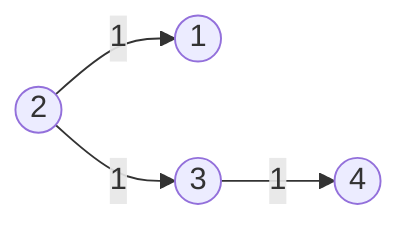
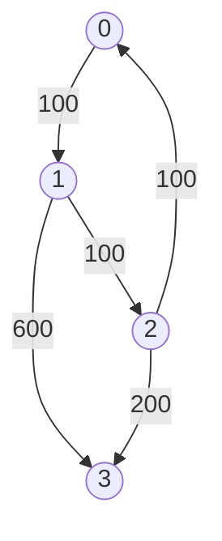

# Graph Shortest Path

- [x] [743. Network Delay Time](https://leetcode.cn/problems/network-delay-time/) (Medium)
- [x] [778. Swim in Rising Water](https://leetcode.cn/problems/swim-in-rising-water/) (Hard)
- [x] [1631. Path With Minimum Effort](https://leetcode.cn/problems/path-with-minimum-effort/) (Medium)
- [x] [787. Cheapest Flights Within K Stops](https://leetcode.cn/problems/cheapest-flights-within-k-stops/) (Medium)
- [x] [1514. Path with Maximum Probability](https://leetcode.cn/problems/path-with-maximum-probability/) (Medium)
- [x] [505. The Maze II](https://leetcode.cn/problems/the-maze-ii/) (Medium) 👑
- [x] [499. The Maze III](https://leetcode.cn/problems/the-maze-iii/) (Hard) 👑
- [x] [882. Reachable Nodes In Subdivided Graph](https://leetcode.cn/problems/reachable-nodes-in-subdivided-graph/) (Hard)
- [x] [1376. Time Needed to Inform All Employees](https://leetcode.cn/problems/time-needed-to-inform-all-employees/) (Medium)
- [x] [1168. Optimize Water Distribution in a Village](https://leetcode.cn/problems/optimize-water-distribution-in-a-village/) (Hard) 👑
- [x] [1976. Number of Ways to Arrive at Destination](https://leetcode.cn/problems/number-of-ways-to-arrive-at-destination/) (Medium)

## 743. Network Delay Time

-   [LeetCode](https://leetcode.com/problems/network-delay-time/) | [LeetCode CH](https://leetcode.cn/problems/network-delay-time/) (Medium)

-   Tags: depth first search, breadth first search, graph, heap priority queue, shortest path
-   Return the minimum time taken to reach all nodes in a network.



-   Shortest Path Problem: Find the shortest path between two vertices in a graph.
-   Dijkstra's Algorithm
    -   Shortest path algorithm
    -   Weighted graph (non-negative weights)
    -   Data Structure: Heap; Hash Set
    -   Time Complexity: O(E \* logV)
    -   Space Complexity: O(V)

```python title="743. Network Delay Time - Python Solution"
import heapq
from collections import defaultdict
from typing import List

from helper import complexity


# 1. Dijkstra - Set
def networkDelayTime1(times: List[List[int]], n: int, k: int) -> int:
    graph = defaultdict(list)
    for u, v, w in times:
        graph[u].append((v, w))

    heap = [(0, k)]
    visit = set()
    t = 0

    while heap:
        w1, n1 = heapq.heappop(heap)
        if n1 in visit:
            continue

        visit.add(n1)
        t = w1

        for n2, w2 in graph[n1]:
            heapq.heappush(heap, (w1 + w2, n2))

    return t if len(visit) == n else -1


# 2. Dijkstra - Dict
def networkDelayTime2(times: List[List[int]], n: int, k: int) -> int:
    graph = defaultdict(list)
    for u, v, w in times:
        graph[u].append((v, w))

    heap = [(0, k)]
    dist = defaultdict(int)

    while heap:
        w1, n1 = heapq.heappop(heap)
        if n1 in dist:
            continue

        dist[n1] = w1

        for n2, w2 in graph[n1]:
            heapq.heappush(heap, (w1 + w2, n2))

    return max(dist.values()) if len(dist) == n else -1


# Bellman-Ford
def networkDelayTimeBF(times: List[List[int]], n: int, k: int) -> int:
    delay = {i: float("inf") for i in range(1, n + 1)}
    delay[k] = 0

    for _ in range(n - 1):
        for u, v, t in times:
            delay[v] = min(delay[v], delay[u] + t)

    max_delay = max(delay.values())
    return max_delay if max_delay < float("inf") else -1


table = [
    ["Dijkstra", "O(E*logV)", "O(V+E)"],
    ["Bellman-Ford", "O(E*V)", "O(V)"],
]
complexity(table)
# |--------------|-----------|--------|
# | Approach     | Time      | Space  |
# |--------------|-----------|--------|
# | Dijkstra     | O(E*logV) | O(V+E) |
# | Bellman-Ford | O(E*V)    | O(V)   |
# |--------------|-----------|--------|


times = [[2, 1, 1], [2, 3, 1], [3, 4, 1]]
n = 4
k = 2
print(networkDelayTime1(times, n, k))  # 2
print(networkDelayTime2(times, n, k))  # 2
print(networkDelayTimeBF(times, n, k))  # 2

```

## 778. Swim in Rising Water

-   [LeetCode](https://leetcode.com/problems/swim-in-rising-water/) | [LeetCode CH](https://leetcode.cn/problems/swim-in-rising-water/) (Hard)

-   Tags: array, binary search, depth first search, breadth first search, union find, heap priority queue, matrix
-   Return the minimum time when you can reach the target.


```python title="778. Swim in Rising Water - Python Solution"
import heapq
from typing import List


# Dijkstra's
def swimInWater(grid: List[List[int]]) -> int:
    n = len(grid)
    visited = set()
    minHeap = [(grid[0][0], 0, 0)]
    directions = [(0, 1), (0, -1), (1, 0), (-1, 0)]

    visited.add((0, 0))

    while minHeap:
        time, r, c = heapq.heappop(minHeap)

        if r == n - 1 and c == n - 1:
            return time

        for dr, dc in directions:
            nr, nc = r + dr, c + dc

            if nr in range(n) and nc in range(n) and (nr, nc) not in visited:
                visited.add((nr, nc))
                heapq.heappush(minHeap, (max(time, grid[nr][nc]), nr, nc))


grid = [
    [0, 1, 2, 3, 4],
    [24, 23, 22, 21, 5],
    [12, 13, 14, 15, 16],
    [11, 17, 18, 19, 20],
    [10, 9, 8, 7, 6],
]
print(swimInWater(grid))  # 16

```

## 1631. Path With Minimum Effort

-   [LeetCode](https://leetcode.com/problems/path-with-minimum-effort/) | [LeetCode CH](https://leetcode.cn/problems/path-with-minimum-effort/) (Medium)

-   Tags: array, binary search, depth first search, breadth first search, union find, heap priority queue, matrix
-   Return the minimum effort required to travel from the top-left to the bottom-right corner.

```python title="1631. Path With Minimum Effort - Python Solution"
import heapq
from typing import List


# Prim
def minimumEffortPath(heights: List[List[int]]) -> int:
    m, n = len(heights), len(heights[0])
    directions = [(0, 1), (1, 0), (0, -1), (-1, 0)]
    visited = [[False] * n for _ in range(m)]
    heap = [(0, 0, 0)]  # (effort, row, col)

    while heap:
        effort, r, c = heapq.heappop(heap)

        if visited[r][c]:
            continue

        if r == m - 1 and c == n - 1:
            return effort

        visited[r][c] = True

        for dr, dc in directions:
            nr, nc = r + dr, c + dc

            if 0 <= nr < m and 0 <= nc < n and not visited[nr][nc]:
                updated = max(effort, abs(heights[r][c] - heights[nr][nc]))
                heapq.heappush(heap, (updated, nr, nc))

    return -1


heights = [[1, 2, 2], [3, 8, 2], [5, 3, 5]]
print(minimumEffortPath(heights))  # 2

```

## 787. Cheapest Flights Within K Stops

-   [LeetCode](https://leetcode.com/problems/cheapest-flights-within-k-stops/) | [LeetCode CH](https://leetcode.cn/problems/cheapest-flights-within-k-stops/) (Medium)

-   Tags: dynamic programming, depth first search, breadth first search, graph, heap priority queue, shortest path
-   Return the cheapest price from `src` to `dst` with at most `K` stops.



<iframe width="560" height="315" src="https://www.youtube.com/embed/5eIK3zUdYmE?si=aBR0VbHXTgNuVlGz" title="YouTube video player" frameborder="0" allow="accelerometer; autoplay; clipboard-write; encrypted-media; gyroscope; picture-in-picture; web-share" referrerpolicy="strict-origin-when-cross-origin" allowfullscreen></iframe>

```python title="787. Cheapest Flights Within K Stops - Python Solution"
import heapq
from collections import defaultdict
from typing import List


# Bellman-Ford
def findCheapestPriceBF(
    n: int, flights: List[List[int]], src: int, dst: int, k: int
) -> int:
    prices = [float("inf") for _ in range(n)]
    prices[src] = 0

    for _ in range(k + 1):
        temp = prices[:]
        for u, v, w in flights:
            temp[v] = min(temp[v], prices[u] + w)
        prices = temp

    return prices[dst] if prices[dst] != float("inf") else -1


# Dijkstra
def findCheapestPriceDijkstra(
    n: int, flights: List[List[int]], src: int, dst: int, k: int
) -> int:
    graph = defaultdict(list)
    for u, v, w in flights:
        graph[u].append((v, w))

    heap = [(0, src, 0)]  # (price, city, stops)
    visited = defaultdict(int)  # {city: stops}

    while heap:
        price, city, stops = heapq.heappop(heap)

        if city == dst:
            return price

        if stops > k:
            continue

        if city in visited and visited[city] <= stops:
            continue

        visited[city] = stops

        for neighbor, cost in graph[city]:
            heapq.heappush(heap, (price + cost, neighbor, stops + 1))

    return -1


# |------------|------------------|---------|
# |  Approach  |       Time       |  Space  |
# |------------|------------------|---------|
# |Bellman-Ford|    O(k * E)      |  O(n)   |
# | Dijkstra   | O(E * log(V))    |  O(n)   |
# |------------|------------------|---------|


n = 4
flights = [[0, 1, 100], [1, 2, 100], [2, 0, 100], [1, 3, 600], [2, 3, 200]]
src = 0
dst = 3
k = 1
print(findCheapestPriceBF(n, flights, src, dst, k))  # 700
print(findCheapestPriceDijkstra(n, flights, src, dst, k))  # 700

```

## 1514. Path with Maximum Probability

-   [LeetCode](https://leetcode.com/problems/path-with-maximum-probability/) | [LeetCode CH](https://leetcode.cn/problems/path-with-maximum-probability/) (Medium)

-   Tags: array, graph, heap priority queue, shortest path

```python title="1514. Path with Maximum Probability - Python Solution"
import heapq
from collections import defaultdict
from typing import List


# Dijkstra - Dict
def maxProbability1(
    n: int,
    edges: List[List[int]],
    succProb: List[float],
    start_node: int,
    end_node: int,
) -> float:
    graph = defaultdict(list)
    for i, (u, v) in enumerate(edges):
        graph[u].append((v, succProb[i]))
        graph[v].append((u, succProb[i]))

    heap = [(-1, start_node)]
    max_prob = {i: 0.0 for i in range(n)}
    max_prob[start_node] = 1.0

    while heap:
        p1, n1 = heapq.heappop(heap)

        if n1 == end_node:
            return -p1

        for n2, p2 in graph[n1]:
            p2 *= -p1
            if p2 > max_prob[n2]:
                max_prob[n2] = p2
                heapq.heappush(heap, (-p2, n2))

    return 0.0


# Dijkstra - Set
def maxProbability2(
    n: int,
    edges: List[List[int]],
    succProb: List[float],
    start_node: int,
    end_node: int,
) -> float:
    graph = defaultdict(list)
    for i, (u, v) in enumerate(edges):
        graph[u].append((v, succProb[i]))
        graph[v].append((u, succProb[i]))

    heap = [(-1, start_node)]
    visited = set()

    while heap:
        p1, n1 = heapq.heappop(heap)
        visited.add(n1)

        if n1 == end_node:
            return -p1

        for n2, p2 in graph[n1]:
            if n2 not in visited:
                heapq.heappush(heap, (p1 * p2, n2))

    return 0.0


# |------------|-----------|-----------|
# |  Approach  |    Time   |   Space   |
# |------------|-----------|-----------|
# |  Dijkstra  | O(E log V)|   O(E)    |
# |------------|-----------|-----------|


n = 3
edges = [[0, 1], [1, 2], [0, 2]]
succProb = [0.5, 0.5, 0.2]
start = 0
end = 2

print(maxProbability1(n, edges, succProb, start, end))  # 0.25
print(maxProbability2(n, edges, succProb, start, end))  # 0.25

```

## 505. The Maze II

-   [LeetCode](https://leetcode.com/problems/the-maze-ii/) | [LeetCode CH](https://leetcode.cn/problems/the-maze-ii/) (Medium)

-   Tags: array, depth first search, breadth first search, graph, heap priority queue, matrix, shortest path

```python title="505. The Maze II - Python Solution"
import heapq
from typing import List


# Dijkstra
def shortestDistance(
    maze: List[List[int]], start: List[int], destination: List[int]
) -> int:
    directions = [(0, 1), (0, -1), (1, 0), (-1, 0)]
    m, n = len(maze), len(maze[0])

    dist = [[float("inf")] * n for _ in range(m)]
    dist[start[0]][start[1]] = 0

    heap = [(0, start[0], start[1])]

    while heap:
        d, r, c = heapq.heappop(heap)

        if [r, c] == destination:
            return d

        for dr, dc in directions:
            nr, nc, nd = r, c, d

            while 0 <= nr + dr < m and 0 <= nc + dc < n and maze[nr + dr][nc + dc] == 0:
                nr += dr
                nc += dc
                nd += 1

            if nd < dist[nr][nc]:
                dist[nr][nc] = nd
                heapq.heappush(heap, (nd, nr, nc))

    return -1


maze = [
    [0, 0, 1, 0, 0],
    [0, 0, 0, 0, 0],
    [0, 0, 0, 1, 0],
    [1, 1, 0, 1, 1],
    [0, 0, 0, 0, 0],
]
start = [0, 4]
destination = [4, 4]
print(shortestDistance(maze, start, destination))  # 12

```

## 499. The Maze III

-   [LeetCode](https://leetcode.com/problems/the-maze-iii/) | [LeetCode CH](https://leetcode.cn/problems/the-maze-iii/) (Hard)

-   Tags: array, string, depth first search, breadth first search, graph, heap priority queue, matrix, shortest path

```python title="499. The Maze III - Python Solution"
import heapq
from typing import List


# Dijkstra
def findShortestWay(maze: List[List[int]], ball: List[int], hole: List[int]) -> str:
    directions = [(-1, 0, "u"), (1, 0, "d"), (0, -1, "l"), (0, 1, "r")]
    m, n = len(maze), len(maze[0])

    dist = [[float("inf")] * n for _ in range(m)]
    dist[ball[0]][ball[1]] = 0

    paths = [[""] * n for _ in range(m)]
    paths[ball[0]][ball[1]] = ""

    heap = [(0, "", ball[0], ball[1])]

    while heap:
        d, path, x, y = heapq.heappop(heap)

        if [x, y] == hole:
            return path

        for dx, dy, direction in directions:
            nx, ny, nd = x, y, d

            while 0 <= nx + dx < m and 0 <= ny + dy < n and maze[nx + dx][ny + dy] == 0:
                nx += dx
                ny += dy
                nd += 1

                if [nx, ny] == hole:
                    break

            new_path = path + direction
            if nd < dist[nx][ny] or (nd == dist[nx][ny] and new_path < paths[nx][ny]):
                dist[nx][ny] = nd
                paths[nx][ny] = new_path
                heapq.heappush(heap, (nd, new_path, nx, ny))

    return "impossible"


maze = [
    [0, 0, 0, 0, 0],
    [1, 1, 0, 0, 1],
    [0, 0, 0, 0, 0],
    [0, 1, 0, 0, 1],
    [0, 1, 0, 0, 0],
]
ball = [4, 3]
hole = [0, 1]
print(findShortestWay(maze, ball, hole))  # "lul"

```

## 882. Reachable Nodes In Subdivided Graph

-   [LeetCode](https://leetcode.com/problems/reachable-nodes-in-subdivided-graph/) | [LeetCode CH](https://leetcode.cn/problems/reachable-nodes-in-subdivided-graph/) (Hard)

-   Tags: graph, heap priority queue, shortest path

```python title="882. Reachable Nodes In Subdivided Graph - Python Solution"
import heapq
from typing import List


# Dijkstra's
def reachableNodes(self, edges: List[List[int]], maxMoves: int, n: int) -> int:
    graph = {i: {} for i in range(n)}
    for u, v, cnt in edges:
        graph[u][v] = cnt
        graph[v][u] = cnt

    heap = [(-maxMoves, 0)]
    seen = {}

    while heap:
        moves, node = heapq.heappop(heap)
        if node in seen:
            continue
        seen[node] = -moves
        for nxt, cnt in graph[node].items():
            movesLeft = -moves - cnt - 1
            if nxt not in seen and movesLeft >= 0:
                heapq.heappush(heap, (-movesLeft, nxt))

    res = len(seen)
    for u, v, cnt in edges:
        res += min(seen.get(u, 0) + seen.get(v, 0), cnt)

    return res


edges = [[0, 1, 10], [0, 2, 1], [1, 2, 2]]
maxMoves = 6
n = 3
print(reachableNodes(None, edges, maxMoves, n))  # 13

```

## 1376. Time Needed to Inform All Employees

-   [LeetCode](https://leetcode.com/problems/time-needed-to-inform-all-employees/) | [LeetCode CH](https://leetcode.cn/problems/time-needed-to-inform-all-employees/) (Medium)

-   Tags: tree, depth first search, breadth first search

```python title="1376. Time Needed to Inform All Employees - Python Solution"
from collections import defaultdict, deque
from typing import List


# DFS
def numOfMinutesDFS(
    n: int, headID: int, manager: List[int], informTime: List[int]
) -> int:
    graph = defaultdict(list)
    for i in range(n):
        if manager[i] != -1:
            graph[manager[i]].append(i)

    def dfs(node):
        time = 0
        for sub in graph[node]:
            time = max(time, dfs(sub))
        return time + informTime[node]

    return dfs(headID)


# BFS
def numOfMinutesBFS(
    n: int, headID: int, manager: List[int], informTime: List[int]
) -> int:
    graph = defaultdict(list)
    for i in range(n):
        if manager[i] != -1:
            graph[manager[i]].append(i)

    q = deque([(headID, 0)])
    max_time = 0

    while q:
        node, time = q.popleft()
        max_time = max(max_time, time)
        for sub in graph[node]:
            q.append((sub, time + informTime[node]))

    return max_time


n = 6
headID = 2
manager = [2, 2, -1, 2, 2, 2]
informTime = [0, 0, 1, 0, 0, 0]
print(numOfMinutesDFS(n, headID, manager, informTime))  # 1
print(numOfMinutesBFS(n, headID, manager, informTime))  # 1

```

## 1168. Optimize Water Distribution in a Village

-   [LeetCode](https://leetcode.com/problems/optimize-water-distribution-in-a-village/) | [LeetCode CH](https://leetcode.cn/problems/optimize-water-distribution-in-a-village/) (Hard)

-   Tags: union find, graph, heap priority queue, minimum spanning tree
- 

- 

```python title="1168. Optimize Water Distribution in a Village - Python Solution"
import heapq
from collections import defaultdict
from typing import List


# Prim
def minCostToSupplyWater1(n: int, wells: List[int], pipes: List[List[int]]) -> int:
    graph = defaultdict(list)

    for h1, h2, cost in pipes:
        graph[h1].append((h2, cost))
        graph[h2].append((h1, cost))

    # Add the cost of the wells to the graph (house 0)
    for i in range(n):
        graph[0].append((i + 1, wells[i]))
        graph[i + 1].append((0, wells[i]))

    visited = set([0])
    heap = [(cost, dest) for dest, cost in graph[0]]
    heapq.heapify(heap)

    cost = 0

    while heap:
        c1, n1 = heapq.heappop(heap)
        if n1 in visited:
            continue
        visited.add(n1)
        cost += c1

        for n2, c2 in graph[n1]:
            if n2 not in visited:
                heapq.heappush(heap, (c2, n2))

    return cost


# Kruskal
def minCostToSupplyWater2(n: int, wells: List[int], pipes: List[List[int]]) -> int:
    par = list(range(n + 1))
    rank = [0] * (n + 1)

    def find(n):
        p = par[n]
        while p != par[p]:
            par[p] = par[par[p]]
            p = par[p]
        return p

    def union(n1, n2):
        p1, p2 = find(n1), find(n2)
        if p1 != p2:
            if rank[p1] < rank[p2]:
                par[p1] = p2
            elif rank[p1] > rank[p2]:
                par[p2] = p1
            else:
                par[p1] = p2
                rank[p2] += 1
            return True
        return False

    graph = [(c, 0, i + 1) for i, c in enumerate(wells)]
    for h1, h2, c in pipes:
        graph.append((c, h1, h2))

    graph.sort()

    cost = 0

    for c, h1, h2 in graph:
        if union(h1, h2):
            cost += c

    return cost


# |------------|------------------|---------|
# |  Approach  |       Time       |  Space  |
# |------------|------------------|---------|
# |    Prim    | O((V + E) log V) | O(V + E)|
# |  Kruskal   |     O(E log E)   | O(V + E)|
# |------------|------------------|---------|


n = 3
wells = [1, 2, 2]
pipes = [[1, 2, 1], [2, 3, 1]]
print(minCostToSupplyWater1(n, wells, pipes))  # 3
print(minCostToSupplyWater2(n, wells, pipes))  # 3

```

## 1976. Number of Ways to Arrive at Destination

-   [LeetCode](https://leetcode.com/problems/number-of-ways-to-arrive-at-destination/) | [LeetCode CH](https://leetcode.cn/problems/number-of-ways-to-arrive-at-destination/) (Medium)

-   Tags: dynamic programming, graph, topological sort, shortest path

```python title="1976. Number of Ways to Arrive at Destination - Python Solution"
import heapq
from typing import List


# Dijkstra
def countPaths(n: int, roads: List[List[int]]) -> int:
    mod = 10**9 + 7
    graph = [[] for _ in range(n)]
    for u, v, w in roads:
        graph[u].append((v, w))
        graph[v].append((u, w))

    dist = [float("inf") for _ in range(n)]
    dist[0] = 0
    count = [0 for _ in range(n)]
    count[0] = 1

    heap = [(0, 0)]

    while heap:
        d, u = heapq.heappop(heap)
        if d > dist[u]:
            continue

        for v, w in graph[u]:
            if dist[u] + w < dist[v]:
                dist[v] = dist[u] + w
                count[v] = count[u]
                heapq.heappush(heap, (dist[v], v))
            elif dist[u] + w == dist[v]:
                count[v] += count[u]
                count[v] %= mod

    return count[-1]


n = 7
roads = [
    [0, 6, 7],
    [0, 1, 2],
    [1, 2, 3],
    [1, 3, 3],
    [6, 3, 3],
    [3, 5, 1],
    [6, 5, 1],
    [2, 5, 1],
    [0, 4, 5],
    [4, 6, 2],
]
print(countPaths(n, roads))  # 4

```
