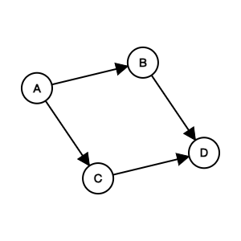
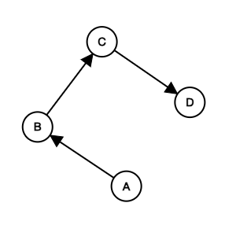
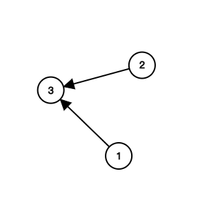

# Graph Topological Sort

## Table of Contents

- [x] [1557. Minimum Number of Vertices to Reach All Nodes](https://leetcode.cn/problems/minimum-number-of-vertices-to-reach-all-nodes/) (Medium)
- [x] [207. Course Schedule](https://leetcode.cn/problems/course-schedule/) (Medium)
- [x] [210. Course Schedule II](https://leetcode.cn/problems/course-schedule-ii/) (Medium)
- [x] [269. Alien Dictionary](https://leetcode.cn/problems/alien-dictionary/) (Hard) 👑
- [x] [1203. Sort Items by Groups Respecting Dependencies](https://leetcode.cn/problems/sort-items-by-groups-respecting-dependencies/) (Hard)
- [x] [1857. Largest Color Value in a Directed Graph](https://leetcode.cn/problems/largest-color-value-in-a-directed-graph/) (Hard)
- [x] [1136. Parallel Courses](https://leetcode.cn/problems/parallel-courses/) (Medium) 👑

## 1557. Minimum Number of Vertices to Reach All Nodes

-   [LeetCode](https://leetcode.com/problems/minimum-number-of-vertices-to-reach-all-nodes/) | [LeetCode CH](https://leetcode.cn/problems/minimum-number-of-vertices-to-reach-all-nodes/) (Medium)

-   Tags: graph
- Return a list of integers representing the minimum number of vertices needed to traverse all the nodes.
- ✅ Return the vertices with indegree 0.


- `edges = [[0, 1], [0, 2], [2, 5], [3, 4], [4, 2]]`
- Initialization

|   `src`   |  0  |  0  |  2  |  3  |  4  |     |
| :-------: | :-: | :-: | :-: | :-: | :-: | :-: |
|   `dst`   |  1  |  2  |  5  |  4  |  2  |     |
|   node    |  0  |  1  |  2  |  3  |  4  |  5  |
| in-degree |  0  |  0  |  0  |  0  |  0  |  0  |

|   `src`   |   0   |   0   |  2  |  3  |  4  |     |
| :-------: | :---: | :---: | :-: | :-: | :-: | :-: |
|   `dst`   | **1** |   2   |  5  |  4  |  2  |     |
|   node    |   0   | **1** |  2  |  3  |  4  |  5  |
| in-degree |   0   | **1** |  0  |  0  |  0  |  0  |

|   `src`   |  0  |   0   |   2   |  3  |  4  |     |
| :-------: | :-: | :---: | :---: | :-: | :-: | :-: |
|   `dst`   |  1  | **2** |   5   |  4  |  2  |     |
|   node    |  0  |   1   | **2** |  3  |  4  |  5  |
| in-degree |  0  |   1   | **1** |  0  |  0  |  0  |

|   `src`   |  0  |  0  |   2   |  3  |  4  |       |
| :-------: | :-: | :-: | :---: | :-: | :-: | :---: |
|   `dst`   |  1  |  2  | **5** |  4  |  2  |       |
|   node    |  0  |  1  |   2   |  3  |  4  | **5** |
| in-degree |  0  |  1  |   1   |  0  |  0  | **1** |

|   `src`   |  0  |  0  |  2  |   3   |   4   |     |
| :-------: | :-: | :-: | :-: | :---: | :---: | :-: |
|   `dst`   |  1  |  2  |  5  | **4** |   2   |     |
|   node    |  0  |  1  |  2  |   3   | **4** |  5  |
| in-degree |  0  |  1  |  1  |   0   | **1** |  1  |

|   `src`   |  0  |  0  |   2   |  3  |   4   |     |
| :-------: | :-: | :-: | :---: | :-: | :---: | :-: |
|   `dst`   |  1  |  2  |   5   |  4  | **2** |     |
|   node    |  0  |  1  | **2** |  3  |   4   |  5  |
| in-degree |  0  |  1  | **2** |  0  |   1   |  1  |


```python title="1557. Minimum Number of Vertices to Reach All Nodes - Python Solution"
from typing import List


# Graph
def findSmallestSetOfVertices(n: int, edges: List[List[int]]) -> List[int]:
    indegree = {i: 0 for i in range(n)}

    for a, b in edges:
        indegree[b] += 1

    return [i for i in range(n) if indegree[i] == 0]


n = 6
edges = [[0, 1], [0, 2], [2, 5], [3, 4], [4, 2]]
print(findSmallestSetOfVertices(n, edges))  # [0, 3]

```

## 207. Course Schedule

-   [LeetCode](https://leetcode.com/problems/course-schedule/) | [LeetCode CH](https://leetcode.cn/problems/course-schedule/) (Medium)

-   Tags: depth first search, breadth first search, graph, topological sort
- Return true if it is possible to finish all courses, otherwise return false.
- Dependency relationships imply the topological sort algorithm.
- Cycle detection
- Topological Sort
  - DAG (Directed Acyclic Graph)
  - Time complexity: O(V+E)
  - Space complexity: O(V+E)
  - Prerequisites: Indegree (Look at the problem 1557. Minimum Number of Vertices to Reach All Nodes)
    - Indegree: Number of incoming edges to a vertex
  - Applications: task scheduling, course scheduling, build systems, dependency resolution, compiler optimization, etc.





Course to prerequisites mapping


Prerequisites to course mapping


| course       | 0   | 0   | 1   | 1   | 3   |
| ------------ | --- | --- | --- | --- | --- |
| prerequisite | 1   | 2   | 3   | 4   | 4   |

| index     | 0   | 1   | 2   | 3   | 4   |
| --------- | --- | --- | --- | --- | --- |
| in-degree | 0   | 0   | 0   | 0   | 0   |

Initialize

- graph

| prerequisite | 1     | 2     | 3     | 4        |
| ------------ | ----- | ----- | ----- | -------- |
| course       | `[0]` | `[0]` | `[1]` | `[1, 3]` |

- in-degree

|           | 0   | 1   | 2   | 3   | 4   |
| --------- | --- | --- | --- | --- | --- |
| in-degree | 2   | 2   | 0   | 1   | 0   |

- queue: `[2, 4]`
- pop `2` from the queue


|           | 0   | 1   | 2   | 3   | 4   |
| --------- | --- | --- | --- | --- | --- |
| in-degree | 1   | 2   | 0   | 1   | 0   |

- queue: `[4]`
- pop `4` from the queue


|           | 0   | 1   | 2   | 3   | 4   |
| --------- | --- | --- | --- | --- | --- |
| in-degree | 1   | 1   | 0   | 0   | 0   |

- queue: `[3]`
- pop `3` from the queue


|           | 0   | 1   | 2   | 3   | 4   |
| --------- | --- | --- | --- | --- | --- |
| in-degree | 1   | 0   | 0   | 0   | 0   |

- queue: `[1]`
- pop `1` from the queue


|           | 0   | 1   | 2   | 3   | 4   |
| --------- | --- | --- | --- | --- | --- |
| in-degree | 0   | 0   | 0   | 0   | 0   |

- queue: `[0]`
- pop `0` from the queue
- All courses are taken. Return `True`.


```python title="207. Course Schedule - Python Solution"
from collections import defaultdict, deque
from typing import List


# BFS (Kahn's Algorithm)
def canFinishBFS(numCourses: int, prerequisites: List[List[int]]) -> bool:
    graph = defaultdict(list)
    indegree = defaultdict(int)

    for crs, pre in prerequisites:
        graph[pre].append(crs)
        indegree[crs] += 1

    q = deque([i for i in range(numCourses) if indegree[i] == 0])
    count = 0

    while q:
        crs = q.popleft()
        count += 1

        for nxt in graph[crs]:
            indegree[nxt] -= 1

            if indegree[nxt] == 0:
                q.append(nxt)

    return count == numCourses


# DFS + Set
def canFinishDFS1(numCourses: int, prerequisites: List[List[int]]) -> bool:
    graph = defaultdict(list)
    for crs, pre in prerequisites:
        graph[crs].append(pre)

    visiting = set()

    def dfs(crs):
        if crs in visiting:  # cycle detected
            return False
        if graph[crs] == []:
            return True

        visiting.add(crs)

        for pre in graph[crs]:
            if not dfs(pre):
                return False

        visiting.remove(crs)
        graph[crs] = []

        return True

    for crs in range(numCourses):
        if not dfs(crs):
            return False
    return True


# DFS + List
def canFinishDFS2(numCourses: int, prerequisites: List[List[int]]) -> bool:
    graph = defaultdict(list)
    for pre, crs in prerequisites:
        graph[crs].append(pre)

    # 0: init, 1: visiting, 2: visited
    status = [0] * numCourses

    def dfs(crs):
        if status[crs] == 1:  # cycle detected
            return False
        if status[crs] == 2:
            return True

        status[crs] = 1

        for pre in graph[crs]:
            if not dfs(pre):
                return False

        status[crs] = 2
        return True

    for crs in range(numCourses):
        if not dfs(crs):
            return False
    return True


prerequisites = [[0, 1], [0, 2], [1, 3], [1, 4], [3, 4]]
print(canFinishBFS(5, prerequisites))  # True
print(canFinishDFS1(5, prerequisites))  # True
print(canFinishDFS2(5, prerequisites))  # True

```

```cpp title="207. Course Schedule - C++ Solution"
#include <functional>
#include <iostream>
#include <queue>
#include <vector>
using namespace std;

class Solution {
   public:
    // BFS
    bool canFinishBFS(int numCourses, vector<vector<int>> &prerequisites) {
        vector<vector<int>> graph(numCourses);
        vector<int> indegree(numCourses, 0);
        for (auto &pre : prerequisites) {
            graph[pre[1]].push_back(pre[0]);
            indegree[pre[0]]++;
        }

        queue<int> q;
        for (int i = 0; i < numCourses; i++) {
            if (indegree[i] == 0) {
                q.push(i);
            }
        }

        int cnt = 0;
        while (!q.empty()) {
            int cur = q.front();
            q.pop();
            cnt++;

            for (int nxt : graph[cur]) {
                indegree[nxt]--;
                if (indegree[nxt] == 0) {
                    q.push(nxt);
                }
            }
        }
        return cnt == numCourses;
    }

    // DFS
    bool canFinishDFS(int numCourses, vector<vector<int>> &prerequisites) {
        vector<vector<int>> graph(numCourses);
        for (auto &pre : prerequisites) {
            graph[pre[1]].push_back(pre[0]);
        }
        // 0: not visited, 1: visiting, 2: visited
        vector<int> state(numCourses, 0);

        function<bool(int)> dfs = [&](int pre) -> bool {
            state[pre] = 1;  // visiting
            for (int crs : graph[pre]) {
                if (state[crs] == 1 || (state[crs] == 0 && dfs(crs))) {
                    return true;
                }
            }
            state[pre] = 2;  // visited
            return false;
        };

        for (int i = 0; i < numCourses; i++) {
            if (state[i] == 0 && dfs(i)) {
                return false;
            }
        }
        return true;
    }
};

int main() {
    Solution sol;
    vector<vector<int>> prerequisites = {{1, 0}, {2, 1}, {3, 2}, {4, 3},
                                         {5, 4}, {6, 5}, {7, 6}, {8, 7},
                                         {9, 8}, {10, 9}};
    int numCourses = 11;
    cout << sol.canFinishBFS(numCourses, prerequisites) << endl;
    cout << sol.canFinishDFS(numCourses, prerequisites) << endl;
    return 0;
}

```

## 210. Course Schedule II

-   [LeetCode](https://leetcode.com/problems/course-schedule-ii/) | [LeetCode CH](https://leetcode.cn/problems/course-schedule-ii/) (Medium)

-   Tags: depth first search, breadth first search, graph, topological sort
- Return the ordering of courses you should take to finish all courses. If there are multiple valid answers, return any of them.


```python title="210. Course Schedule II - Python Solution"
from collections import defaultdict, deque
from typing import List


# 1. BFS - Kahn's Algorithm
def findOrderBFS(numCourses: int, prerequisites: List[List[int]]) -> List[int]:
    graph = defaultdict(list)
    indegree = defaultdict(int)

    for crs, pre in prerequisites:
        graph[pre].append(crs)
        indegree[crs] += 1

    q = deque([i for i in range(numCourses) if indegree[i] == 0])
    order = []

    while q:
        pre = q.popleft()
        order.append(pre)

        for crs in graph[pre]:
            indegree[crs] -= 1
            if indegree[crs] == 0:
                q.append(crs)

    return order if len(order) == numCourses else []


# 2. DFS + Set
def findOrderDFS1(
    numCourses: int, prerequisites: List[List[int]]
) -> List[int]:
    adj = defaultdict(list)
    for crs, pre in prerequisites:
        adj[crs].append(pre)

    visit, cycle = set(), set()
    order = []

    def dfs(crs):
        if crs in cycle:
            return False
        if crs in visit:
            return True

        cycle.add(crs)
        for pre in adj[crs]:
            if not dfs(pre):
                return False

        cycle.remove(crs)
        visit.add(crs)
        order.append(crs)
        return True

    for crs in range(numCourses):
        if not dfs(crs):
            return []

    return order


# 3. DFS + List
def findOrderDFS2(
    numCourses: int, prerequisites: List[List[int]]
) -> List[int]:
    adj = defaultdict(list)
    for pre, crs in prerequisites:
        adj[crs].append(pre)

    # 0: not visited, 1: visiting, 2: visited
    state = [0] * numCourses
    order = []

    def dfs(crs):
        if state[crs] == 1:
            return False
        if state[crs] == 2:
            return True

        state[crs] = 1

        for pre in adj[crs]:
            if not dfs(pre):
                return False

        state[crs] = 2
        order.append(crs)
        return True

    for crs in range(numCourses):
        if not dfs(crs):
            return []

    return order[::-1]


numCourses = 5
prerequisites = [[0, 1], [0, 2], [1, 3], [1, 4], [3, 4]]
print(findOrderBFS(numCourses, prerequisites))  # [2, 4, 3, 1, 0]
print(findOrderDFS1(numCourses, prerequisites))  # [4, 3, 1, 2, 0]
print(findOrderDFS2(numCourses, prerequisites))  # [4, 3, 2, 1, 0]

```

```cpp title="210. Course Schedule II - C++ Solution"
#include <iostream>
#include <queue>
#include <vector>
using namespace std;

class Solution {
   public:
    // BFS
    vector<int> findOrderBFS(int numCourses,
                             vector<vector<int>> &prerequisites) {
        vector<vector<int>> graph(numCourses);
        vector<int> indegree(numCourses, 0);

        for (auto &pre : prerequisites) {
            graph[pre[1]].push_back(pre[0]);
            indegree[pre[0]]++;
        }

        queue<int> q;
        for (int i = 0; i < numCourses; i++)
            if (indegree[i] == 0) q.push(i);

        vector<int> order;

        while (!q.empty()) {
            int cur = q.front();
            q.pop();
            order.push_back(cur);

            for (int nxt : graph[cur]) {
                indegree[nxt]--;
                if (indegree[nxt] == 0) q.push(nxt);
            }
        }

        return (int)order.size() == numCourses ? order : vector<int>{};
    }
};

int main() {
    Solution obj;
    vector<vector<int>> prerequisites{{1, 0}, {2, 0}, {3, 1}, {3, 2}};
    vector<int> res = obj.findOrderBFS(4, prerequisites);
    for (size_t i = 0; i < res.size(); i++) cout << res[i] << "\n";
    return 0;
}

```

## 269. Alien Dictionary

-   [LeetCode](https://leetcode.com/problems/alien-dictionary/) | [LeetCode CH](https://leetcode.cn/problems/alien-dictionary/) (Hard)

-   Tags: array, string, depth first search, breadth first search, graph, topological sort
-   Return the correct order of characters in the alien language.


```python title="269. Alien Dictionary - Python Solution"
from collections import defaultdict, deque
from typing import List


# BFS - Kahn's algorithm (Topological Sort)
def alienOrderBFS(words: List[str]) -> str:
    graph = defaultdict(set)
    indegree = {c: 0 for word in words for c in word}

    for i in range(len(words) - 1):
        w1, w2 = words[i], words[i + 1]
        minLen = min(len(w1), len(w2))

        if len(w1) > len(w2) and w1[:minLen] == w2[:minLen]:
            return ""

        for j in range(minLen):
            if w1[j] != w2[j]:
                if w2[j] not in graph[w1[j]]:
                    graph[w1[j]].add(w2[j])
                    indegree[w2[j]] += 1
                break

    q = deque([c for c in indegree if indegree[c] == 0])
    result = []

    while q:
        char = q.popleft()
        result.append(char)

        for neighbor in graph[char]:
            indegree[neighbor] -= 1
            if indegree[neighbor] == 0:
                q.append(neighbor)

    return "".join(result) if len(result) == len(indegree) else ""


# DFS - Topological Sort
def alienOrderDFS(words: List[str]) -> str:
    graph = defaultdict(set)
    visited = {}
    result = []

    for i in range(len(words) - 1):
        w1, w2 = words[i], words[i + 1]
        minLen = min(len(w1), len(w2))

        if len(w1) > len(w2) and w1[:minLen] == w2[:minLen]:
            return ""

        for j in range(minLen):
            if w1[j] != w2[j]:
                if w2[j] not in graph[w1[j]]:
                    graph[w1[j]].add(w2[j])
                break

    def dfs(c):
        if c in visited:
            return visited[c]

        visited[c] = False
        for neighbor in graph[c]:
            if not dfs(neighbor):
                return False

        visited[c] = True
        result.append(c)
        return True

    for c in list(graph.keys()):
        if not dfs(c):
            return ""

    return "".join(result[::-1])


words = ["wrt", "wrf", "er", "ett", "rftt"]
print(alienOrderBFS(words))  # wertf
print(alienOrderDFS(words))  # wertf

```

## 1203. Sort Items by Groups Respecting Dependencies

-   [LeetCode](https://leetcode.com/problems/sort-items-by-groups-respecting-dependencies/) | [LeetCode CH](https://leetcode.cn/problems/sort-items-by-groups-respecting-dependencies/) (Hard)

-   Tags: depth first search, breadth first search, graph, topological sort
-   Return any permutation of the items that satisfies the requirements.


```python title="1203. Sort Items by Groups Respecting Dependencies - Python Solution"
from collections import defaultdict, deque
from typing import List


# BFS - Kahn's algorithm (Topological Sort)
def sortItems(
    n: int, m: int, group: List[int], beforeItems: List[List[int]]
) -> List[int]:
    def topological_sort(graph, indegree, nodes):
        q = deque([node for node in nodes if indegree[node] == 0])
        result = []

        while q:
            node = q.popleft()
            result.append(node)

            for neighbor in graph[node]:
                indegree[neighbor] -= 1
                if indegree[neighbor] == 0:
                    q.append(neighbor)

        return result if len(result) == len(nodes) else []

    groupItems = defaultdict(list)
    groupGraph = defaultdict(set)
    groupIndegree = defaultdict(int)
    itemGraph = defaultdict(set)
    itemIndegree = defaultdict(int)

    for i in range(n):
        if group[i] == -1:
            group[i] = m
            m += 1
        groupItems[group[i]].append(i)

    for i, beforeItem in enumerate(beforeItems):
        for before in beforeItem:
            if group[before] != group[i]:
                if group[i] not in groupGraph[group[before]]:
                    groupGraph[group[before]].add(group[i])
                    groupIndegree[group[i]] += 1
            else:
                itemGraph[before].add(i)
                itemIndegree[i] += 1

    allGroups = list(set(group))
    groupOrder = topological_sort(groupGraph, groupIndegree, allGroups)
    if not groupOrder:
        return []

    result = []
    for g in groupOrder:
        items = groupItems[g]
        itemOrder = topological_sort(itemGraph, itemIndegree, items)
        if not itemOrder:
            return []
        result.extend(itemOrder)

    return result


n = 8
m = 2
group = [-1, -1, 1, 0, 0, 1, 0, -1]
beforeItems = [[], [6], [5], [6], [3, 6], [], [], []]
print(sortItems(n, m, group, beforeItems))

```

## 1857. Largest Color Value in a Directed Graph

-   [LeetCode](https://leetcode.com/problems/largest-color-value-in-a-directed-graph/) | [LeetCode CH](https://leetcode.cn/problems/largest-color-value-in-a-directed-graph/) (Hard)

-   Tags: hash table, dynamic programming, graph, topological sort, memoization, counting

```python title="1857. Largest Color Value in a Directed Graph - Python Solution"
from collections import defaultdict, deque
from typing import List


# Topological Sort
def largestPathValue(colors: str, edges: List[List[int]]) -> int:
    n = len(colors)
    graph = defaultdict(list)
    indegree = [0 for _ in range(n)]

    for u, v in edges:
        graph[u].append(v)
        indegree[v] += 1

    q = deque([i for i in range(n) if indegree[i] == 0])

    dp = [[0] * 26 for _ in range(n)]

    for i in range(n):
        dp[i][ord(colors[i]) - ord("a")] = 1

    processed, max_color = 0, 0

    while q:
        n1 = q.popleft()
        processed += 1
        max_color = max(max_color, max(dp[n1]))

        for n2 in graph[n1]:
            indegree[n2] -= 1
            for i in range(26):
                dp[n2][i] = max(
                    dp[n2][i],
                    dp[n1][i] + (1 if i == ord(colors[n2]) - ord("a") else 0),
                )
            if indegree[n2] == 0:
                q.append(n2)

    return max_color if processed == n else -1


colors = "abaca"
edges = [[0, 1], [0, 2], [2, 3], [3, 4]]
print(largestPathValue(colors, edges))  # 3

```

## 1136. Parallel Courses

-   [LeetCode](https://leetcode.com/problems/parallel-courses/) | [LeetCode CH](https://leetcode.cn/problems/parallel-courses/) (Medium)

-   Tags: graph, topological sort
- Return the minimum number of semesters needed to take all courses.




```python title="1136. Parallel Courses - Python Solution"
from collections import deque
from typing import List


# Topological Sort
def minimumSemesters(n: int, relations: List[List[int]]) -> int:
    graph = {i: [] for i in range(1, n + 1)}
    indegree = {i: 0 for i in range(1, n + 1)}

    for pre, nxt in relations:
        graph[pre].append(nxt)
        indegree[nxt] += 1

    q = deque([i for i in range(1, n + 1) if indegree[i] == 0])
    semester = 0
    done = 0

    while q:
        semester += 1
        size = len(q)

        for _ in range(size):
            pre = q.popleft()
            done += 1

            for nxt in graph[pre]:
                indegree[nxt] -= 1
                if indegree[nxt] == 0:
                    q.append(nxt)

    return semester if done == n else -1


n = 3
relations = [[1, 3], [2, 3]]
print(minimumSemesters(n, relations))  # 2

```
