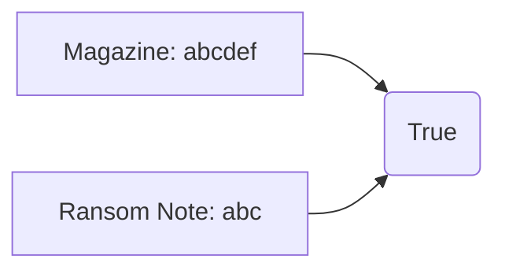

# Hash Map

## Table of Contents

- [x] [383. Ransom Note](https://leetcode.cn/problems/ransom-note/) (Easy)
- [x] [350. Intersection of Two Arrays II](https://leetcode.cn/problems/intersection-of-two-arrays-ii/) (Easy)
- [x] [1. Two Sum](https://leetcode.cn/problems/two-sum/) (Easy)
- [x] [409. Longest Palindrome](https://leetcode.cn/problems/longest-palindrome/) (Easy)
- [x] [1365. How Many Numbers Are Smaller Than the Current Number](https://leetcode.cn/problems/how-many-numbers-are-smaller-than-the-current-number/) (Easy)
- [x] [202. Happy Number](https://leetcode.cn/problems/happy-number/) (Easy)
- [x] [454. 4Sum II](https://leetcode.cn/problems/4sum-ii/) (Medium)

## 383. Ransom Note

-   [LeetCode](https://leetcode.com/problems/ransom-note/) | [LeetCode CH](https://leetcode.cn/problems/ransom-note/) (Easy)

-   Tags: hash table, string, counting
-   Return `True` if the ransom note can be constructed from the magazines, otherwise, return `False`.



```python title="383. Ransom Note - Python Solution"
from collections import Counter, defaultdict


# Array
def canConstructArray(ransomNote: str, magazine: str) -> bool:
    if len(ransomNote) > len(magazine):
        return False

    record = [0 for _ in range(26)]

    for i in magazine:
        record[ord(i) - ord("a")] += 1

    for j in ransomNote:
        record[ord(j) - ord("a")] -= 1

    for i in record:
        if i < 0:
            return False

    return True


# Dict
def canConstructDict(ransomNote: str, magazine: str) -> bool:
    if len(ransomNote) > len(magazine):
        return False

    record = defaultdict(int)

    for i in magazine:
        record[i] += 1

    for j in ransomNote:
        if j not in record or record[j] == 0:
            return False
        record[j] -= 1

    return True


# Counter
def canConstructCounter(ransomNote: str, magazine: str) -> bool:
    return not Counter(ransomNote) - Counter(magazine)


ransomNote = "aa"
magazine = "aab"
print(canConstructArray(ransomNote, magazine))  # True
print(canConstructDict(ransomNote, magazine))  # True
print(canConstructCounter(ransomNote, magazine))  # True

```

## 350. Intersection of Two Arrays II

-   [LeetCode](https://leetcode.com/problems/intersection-of-two-arrays-ii/) | [LeetCode CH](https://leetcode.cn/problems/intersection-of-two-arrays-ii/) (Easy)

-   Tags: array, hash table, two pointers, binary search, sorting
-   Return the intersection of two arrays.

```python title="350. Intersection of Two Arrays II - Python Solution"
from collections import defaultdict
from typing import List


# Hashmap
def intersect(nums1: List[int], nums2: List[int]) -> List[int]:
    hashmap = defaultdict(int)  # {num: count}
    result = []

    for i in nums1:
        hashmap[i] += 1

    for i in nums2:
        if hashmap[i] > 0:
            result.append(i)
            hashmap[i] -= 1

    return result


# |-------------|-------------|--------------|
# |   Approach  |    Time     |    Space     |
# |-------------|-------------|--------------|
# |   Hashmap   |   O(n + m)  | O(min(n, m)) |
# |-------------|-------------|--------------|

nums1 = [1, 2, 2, 1]
nums2 = [2, 2]
print(intersect(nums1, nums2))  # [2, 2]

```

## 1. Two Sum

-   [LeetCode](https://leetcode.com/problems/two-sum/) | [LeetCode CH](https://leetcode.cn/problems/two-sum/) (Easy)

-   Tags: array, hash table
- Return the indices of the two numbers such that they add up to a specific target.
- Approach: Use a hashmap to store the indices of the numbers.
- Time Complexity: O(n)
- Space Complexity: O(n)

```python title="1. Two Sum - Python Solution"
from typing import List


def two_sum(nums: List[int], target: int) -> List[int]:
    hashmap = {}  # val: idx

    for idx, val in enumerate(nums):
        if (target - val) in hashmap:
            return [hashmap[target - val], idx]

        hashmap[val] = idx

    return []


def test_two_sum():
    assert two_sum([2, 7, 11, 15], 9) == [0, 1]
    assert two_sum([3, 2, 4], 6) == [1, 2]
    assert two_sum([3, 3], 6) == [0, 1]
    assert two_sum([1, 2, 3, 4, 5], 10) == []
    assert two_sum([-1, -2, -3, -4, -5], -8) == [2, 4]

```

```cpp title="1. Two Sum - C++ Solution"
#include <iostream>
#include <unordered_map>
#include <vector>

using namespace std;

vector<int> twoSum(vector<int> &nums, int target) {
    unordered_map<int, int> hashmap;

    for (size_t i = 0; i < nums.size(); i++) {
        int complement = target - nums[i];

        if (hashmap.find(complement) != hashmap.end()) {
            return {hashmap[complement], (int)i};
        }
        hashmap[nums[i]] = (int)i;
    }

    return {-1, -1};
}

int main() {
    vector<int> nums = {2, 7, 11, 15};
    int target = 9;
    vector<int> result = twoSum(nums, target);
    cout << result[0] << ", " << result[1] << endl;
    return 0;
}
```

## 409. Longest Palindrome

-   [LeetCode](https://leetcode.com/problems/longest-palindrome/) | [LeetCode CH](https://leetcode.cn/problems/longest-palindrome/) (Easy)

-   Tags: hash table, string, greedy
-   Return the length of the longest palindrome that can be built with the characters in the string.

```python title="409. Longest Palindrome - Python Solution"
def longestPalindrome(s: str) -> int:
    hashmap = dict()
    result = 0

    for char in s:
        if char not in hashmap or hashmap[char] == 0:
            hashmap[char] = 1
        else:
            result += 2
            hashmap[char] = 0

    if any(hashmap.values()):
        result += 1

    return result


print(longestPalindrome("abccccdd"))  # 7

```

## 1365. How Many Numbers Are Smaller Than the Current Number

-   [LeetCode](https://leetcode.com/problems/how-many-numbers-are-smaller-than-the-current-number/) | [LeetCode CH](https://leetcode.cn/problems/how-many-numbers-are-smaller-than-the-current-number/) (Easy)

-   Tags: array, hash table, sorting, counting
-   For each number in the array, return how many numbers are smaller than it.

```python title="1365. How Many Numbers Are Smaller Than the Current Number - Python Solution"
from typing import List


def smallerNumbersThanCurrent(nums: List[int]) -> List[int]:
    sortedNums = sorted(nums)

    hashmap = dict()

    for i, num in enumerate(sortedNums):
        if num not in hashmap:
            hashmap[num] = i

    result = []
    for i in range(len(sortedNums)):
        result.append(hashmap[nums[i]])

    return result


nums = [8, 1, 2, 2, 3]
print(smallerNumbersThanCurrent(nums))  # [4, 0, 1, 1, 3]

```

## 202. Happy Number

-   [LeetCode](https://leetcode.com/problems/happy-number/) | [LeetCode CH](https://leetcode.cn/problems/happy-number/) (Easy)

-   Tags: hash table, math, two pointers
-   Return `True` if the number is a happy number, otherwise, return `False`.
-   A happy number is a number defined by the following process: Starting with any positive integer, replace the number by the sum of the squares of its digits, and repeat the process until the number equals 1 (where it will stay), or it loops endlessly in a cycle which does not include 1.

```python title="202. Happy Number - Python Solution"
def isHappy(n: int) -> bool:

    def getSum(n):
        sum_of_squares = 0
        while n:
            a, b = divmod(n, 10)
            sum_of_squares += b**2
            n = a
        return sum_of_squares

    record = set()

    while True:
        if n == 1:
            return True

        if n in record:
            return False
        else:
            record.add(n)

        n = getSum(n)


n = 19
print(isHappy(n))  # True

```

## 454. 4Sum II

-   [LeetCode](https://leetcode.com/problems/4sum-ii/) | [LeetCode CH](https://leetcode.cn/problems/4sum-ii/) (Medium)

-   Tags: array, hash table
-   Return the number of tuples `(i, j, k, l)` such that `A[i] + B[j] + C[k] + D[l] == 0`.

```python title="454. 4Sum II - Python Solution"
from collections import defaultdict
from typing import List


def fourSumCount(
    nums1: List[int], nums2: List[int], nums3: List[int], nums4: List[int]
) -> int:

    sumAB = defaultdict(int)
    result = 0

    for i in nums1:
        for j in nums2:
            sumAB[i + j] += 1

    for i in nums3:
        for j in nums4:
            if -(i + j) in sumAB:
                result += sumAB[-(i + j)]

    return result


nums1 = [1, 2]
nums2 = [-2, -1]
nums3 = [-1, 2]
nums4 = [0, 2]
print(fourSumCount(nums1, nums2, nums3, nums4))  # 2

```
