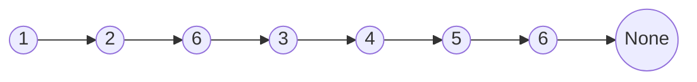
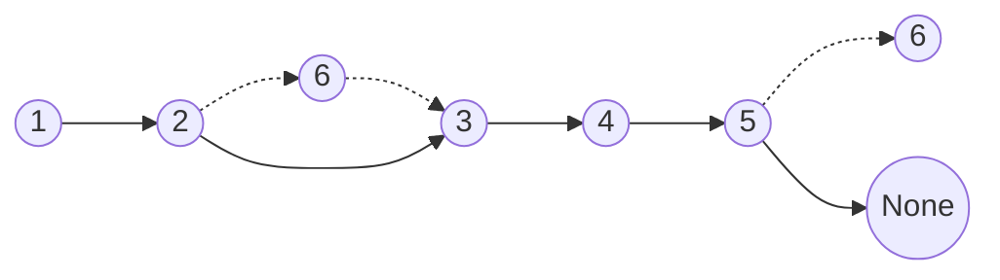
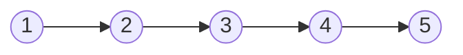
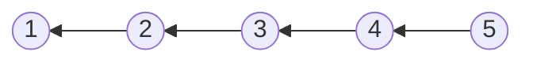
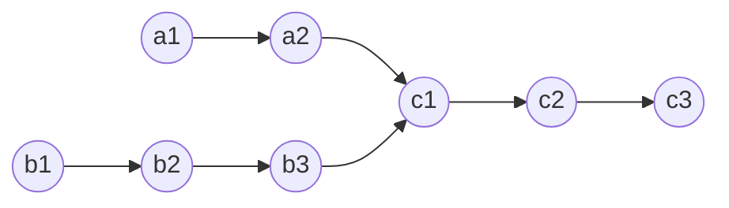
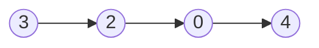
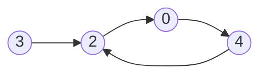
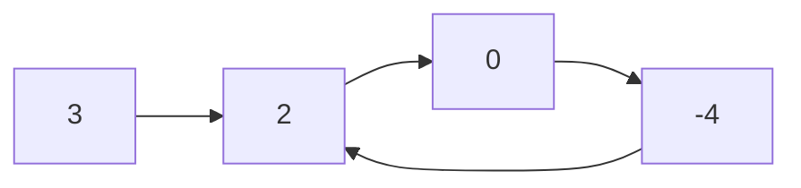

# Linked List

## Table of Contents

- [x] [203. Remove Linked List Elements](https://leetcode.cn/problems/remove-linked-list-elements/) (Easy)
- [x] [707. Design Linked List](https://leetcode.cn/problems/design-linked-list/) (Medium)
- [x] [206. Reverse Linked List](https://leetcode.cn/problems/reverse-linked-list/) (Easy)
- [x] [237. Delete Node in a Linked List](https://leetcode.cn/problems/delete-node-in-a-linked-list/) (Medium)
- [x] [2487. Remove Nodes From Linked List](https://leetcode.cn/problems/remove-nodes-from-linked-list/) (Medium)
- [x] [24. Swap Nodes in Pairs](https://leetcode.cn/problems/swap-nodes-in-pairs/) (Medium)
- [x] [19. Remove Nth Node From End of List](https://leetcode.cn/problems/remove-nth-node-from-end-of-list/) (Medium)
- [x] [160. Intersection of Two Linked Lists](https://leetcode.cn/problems/intersection-of-two-linked-lists/) (Easy)
- [x] [141. Linked List Cycle](https://leetcode.cn/problems/linked-list-cycle/) (Easy)
- [x] [142. Linked List Cycle II](https://leetcode.cn/problems/linked-list-cycle-ii/) (Medium)
- [x] [2816. Double a Number Represented as a Linked List](https://leetcode.cn/problems/double-a-number-represented-as-a-linked-list/) (Medium)
- [x] [2. Add Two Numbers](https://leetcode.cn/problems/add-two-numbers/) (Medium)

## 203. Remove Linked List Elements

-   [LeetCode](https://leetcode.com/problems/remove-linked-list-elements/) | [LeetCode CH](https://leetcode.cn/problems/remove-linked-list-elements/) (Easy)

-   Tags: linked list, recursion
-   Remove all elements from a linked list of integers that have value `val`.

-   Before



-   After




```python title="203. Remove Linked List Elements - Python Solution"
from typing import Optional

from template import ListNode


# Iterative
def removeElements(head: Optional[ListNode], val: int) -> Optional[ListNode]:
    dummy = ListNode(0)
    dummy.next = head
    cur = dummy

    while cur.next:
        if cur.next.val == val:
            cur.next = cur.next.next
        else:
            cur = cur.next

    return dummy.next


# |-------------|-----------------|--------------|
# |  Approach   |      Time       |    Space     |
# |-------------|-----------------|--------------|
# |  Iterative  |      O(N)       |    O(1)      |
# |-------------|-----------------|--------------|


nums = [1, 2, 6, 3, 4, 5, 6]
val = 6
head = ListNode.create(nums)
print(head)
# 1 -> 2 -> 6 -> 3 -> 4 -> 5 -> 6
print(removeElements(head, val))
# 1 -> 2 -> 3 -> 4 -> 5

```

## 707. Design Linked List

-   [LeetCode](https://leetcode.com/problems/design-linked-list/) | [LeetCode CH](https://leetcode.cn/problems/design-linked-list/) (Medium)

-   Tags: linked list, design
-   Design your implementation of the linked list. You can choose to use a singly or doubly linked list.


```python title="707. Design Linked List - Python Solution"
class ListNode:
    def __init__(self, val=0, next=None):
        self.val = val
        self.next = next


class MyLinkedList:

    def __init__(self):
        self.dummy = ListNode()
        self.size = 0

    def get(self, index: int) -> int:
        if index < 0 or index >= self.size:
            return -1

        current = self.dummy.next
        for _ in range(index):
            current = current.next

        return current.val

    def addAtHead(self, val: int) -> None:
        self.dummy.next = ListNode(val, self.dummy.next)
        self.size += 1

    def addAtTail(self, val: int) -> None:
        current = self.dummy
        while current.next:
            current = current.next
        current.next = ListNode(val)
        self.size += 1

    def addAtIndex(self, index: int, val: int) -> None:
        if index < 0 or index > self.size:
            return

        current = self.dummy
        for i in range(index):
            current = current.next
        current.next = ListNode(val, current.next)
        self.size += 1

    def deleteAtIndex(self, index: int) -> None:
        if index < 0 or index >= self.size:
            return

        current = self.dummy
        for i in range(index):
            current = current.next
        current.next = current.next.next
        self.size -= 1


ll = MyLinkedList()
ll.addAtHead(1)
ll.addAtTail(3)
ll.addAtIndex(1, 2)  # 1 -> 2 -> 3
print(ll.get(1))  # 2

```

## 206. Reverse Linked List

-   [LeetCode](https://leetcode.com/problems/reverse-linked-list/) | [LeetCode CH](https://leetcode.cn/problems/reverse-linked-list/) (Easy)

-   Tags: linked list, recursion
- Reverse a singly linked list.






```python title="206. Reverse Linked List - Python Solution"
from typing import Optional

from template import ListNode


# Iterative
def reverseListIterative(head: Optional[ListNode]) -> Optional[ListNode]:
    cur = head
    prev = None

    while cur:
        temp = cur.next
        cur.next = prev

        prev = cur
        cur = temp

    return prev


# Recursive
def reverseListRecursive(head: Optional[ListNode]) -> Optional[ListNode]:
    def reverse(cur, prev):
        if not cur:
            return prev

        temp = cur.next
        cur.next = prev

        return reverse(temp, cur)

    return reverse(head, None)


nums = [1, 2, 3, 4, 5]
head1 = ListNode.create(nums)
print(head1)
# 1 -> 2 -> 3 -> 4 -> 5
print(reverseListIterative(head1))
# 5 -> 4 -> 3 -> 2 -> 1
head2 = ListNode.create(nums)
print(reverseListRecursive(head2))
# 5 -> 4 -> 3 -> 2 -> 1

```

## 237. Delete Node in a Linked List

-   [LeetCode](https://leetcode.com/problems/delete-node-in-a-linked-list/) | [LeetCode CH](https://leetcode.cn/problems/delete-node-in-a-linked-list/) (Medium)

-   Tags: linked list
-   Delete a node in a singly linked list. You are given only the node to be deleted.


```python title="237. Delete Node in a Linked List - Python Solution"
from template import ListNode


def deleteNode(node: ListNode) -> None:
    node.val = node.next.val
    node.next = node.next.next


head = ListNode.create([4, 5, 1, 9])
node = head.next
deleteNode(node)
print(head)  # 4 -> 1 -> 9

```

## 2487. Remove Nodes From Linked List

-   [LeetCode](https://leetcode.com/problems/remove-nodes-from-linked-list/) | [LeetCode CH](https://leetcode.cn/problems/remove-nodes-from-linked-list/) (Medium)

-   Tags: linked list, stack, recursion, monotonic stack
-   Remove all nodes from a linked list that have a value greater than `maxValue`.


```python title="2487. Remove Nodes From Linked List - Python Solution"
from typing import Optional

from template import ListNode


# Recursive
def removeNodesRecursive(head: Optional[ListNode]) -> Optional[ListNode]:
    if not head:
        return None

    head.next = removeNodesRecursive(head.next)

    if head.next and head.val < head.next.val:
        return head.next

    return head


# Iterative
def removeNodesIterative(head: Optional[ListNode]) -> Optional[ListNode]:
    stack = []
    cur = head

    while cur:
        # pop all nodes in stack that are smaller than cur
        while stack and cur.val > stack[-1].val:
            stack.pop()

        stack.append(cur)
        cur = cur.next

    # link all nodes in stack
    dummy = ListNode()
    cur = dummy

    for node in stack:
        cur.next = node
        cur = cur.next

    return dummy.next


head = [5, 2, 13, 3, 8]
head1 = ListNode.create(head)
print(head1)  # 5 -> 2 -> 13 -> 3 -> 8
print(removeNodesRecursive(head1))  # 13 -> 8
head2 = ListNode.create(head)
print(removeNodesIterative(head2))  # 13 -> 8

```

## 24. Swap Nodes in Pairs

-   [LeetCode](https://leetcode.com/problems/swap-nodes-in-pairs/) | [LeetCode CH](https://leetcode.cn/problems/swap-nodes-in-pairs/) (Medium)

-   Tags: linked list, recursion
-   Given a linked list, swap every two adjacent nodes and return its head.


```python title="24. Swap Nodes in Pairs - Python Solution"
from typing import Optional

from template import ListNode


# Linked List
def swapPairs(head: Optional[ListNode]) -> Optional[ListNode]:
    dummy = ListNode(0, head)
    n0 = dummy
    n1 = dummy.next

    while n1 and n1.next:
        n2 = n1.next
        n3 = n2.next

        n0.next = n2
        n2.next = n1
        n1.next = n3

        n0 = n1
        n1 = n3

    return dummy.next


nums = [1, 2, 3, 4, 5]
head = ListNode.create(nums)
print(head)
# 1 -> 2 -> 3 -> 4 -> 5
print(swapPairs(head))
# 2 -> 1 -> 4 -> 3 -> 5

```

## 19. Remove Nth Node From End of List

-   [LeetCode](https://leetcode.com/problems/remove-nth-node-from-end-of-list/) | [LeetCode CH](https://leetcode.cn/problems/remove-nth-node-from-end-of-list/) (Medium)

-   Tags: linked list, two pointers
-   Given the `head` of a linked list, remove the `n-th` node from the end of the list and return its head.


```python title="19. Remove Nth Node From End of List - Python Solution"
from typing import Optional

from template import ListNode


# Linked List
def removeNthFromEnd(head: Optional[ListNode], n: int) -> Optional[ListNode]:
    dummy = ListNode(0, head)
    fast, slow = dummy, dummy

    for _ in range(n):
        fast = fast.next

    while fast.next:
        fast = fast.next
        slow = slow.next

    slow.next = slow.next.next

    return dummy.next


head = [1, 2, 3, 4, 5]
n = 2
head = ListNode.create(head)
print(head)  # 1 -> 2 -> 3 -> 4 -> 5
print(removeNthFromEnd(head, n))  # 1 -> 2 -> 3 -> 5

```

## 160. Intersection of Two Linked Lists

-   [LeetCode](https://leetcode.com/problems/intersection-of-two-linked-lists/) | [LeetCode CH](https://leetcode.cn/problems/intersection-of-two-linked-lists/) (Easy)

-   Tags: hash table, linked list, two pointers
-   Find the node at which the intersection of two singly linked lists begins.




```python title="160. Intersection of Two Linked Lists - Python Solution"
from typing import Optional

from template import ListNode


# Hash Set
def getIntersectionNodeHash(
    headA: ListNode, headB: ListNode
) -> Optional[ListNode]:
    if not headA or not headB:
        return None

    visited = set()
    cur = headA
    while cur:
        visited.add(cur)
        cur = cur.next

    cur = headB
    while cur:
        if cur in visited:
            return cur
        cur = cur.next

    return None


# Two Pointers
def getIntersectionNodeTP(
    headA: ListNode, headB: ListNode
) -> Optional[ListNode]:
    if not headA or not headB:
        return None

    a, b = headA, headB

    while a != b:
        a = a.next if a else headB
        b = b.next if b else headA

    return a


listA = [4, 1, 8, 4, 5]
listB = [5, 6, 1, 8, 4, 5]
headA = ListNode.create(listA)
print(headA)
# 4 -> 1 -> 8 -> 4 -> 5
headB = ListNode.create(listB)
print(headB)
# 5 -> 6 -> 1 -> 8 -> 4 -> 5

headA.intersect(headB, 8)

print(getIntersectionNodeHash(headA, headB))
# 8 -> 4 -> 5
print(getIntersectionNodeTP(headA, headB))
# 8 -> 4 -> 5

```

## 141. Linked List Cycle

-   [LeetCode](https://leetcode.com/problems/linked-list-cycle/) | [LeetCode CH](https://leetcode.cn/problems/linked-list-cycle/) (Easy)

-   Tags: hash table, linked list, two pointers
-   Determine if a linked list has a cycle in it.






```python title="141. Linked List Cycle - Python Solution"
from typing import Optional

from template import ListNode


def hasCycle(head: Optional[ListNode]) -> bool:
    slow, fast = head, head

    while fast and fast.next:
        slow = slow.next
        fast = fast.next.next

        if slow == fast:
            return True

    return False


print(hasCycle(ListNode.create([3, 2, 0, -4])))  # False
print(hasCycle(ListNode.create([3, 2, 0, -4], 1)))  # True

```

```cpp title="141. Linked List Cycle - C++ Solution"
#include <iostream>

struct ListNode {
    int val;
    ListNode* next;
    ListNode(int x) : val(x), next(NULL) {}
};

class Solution {
   public:
    bool hasCycle(ListNode* head) {
        ListNode* slow = head;
        ListNode* fast = head;

        while (fast && fast->next) {
            slow = slow->next;
            fast = fast->next->next;

            if (fast == slow) return true;
        }
        return false;
    }
};

```

## 142. Linked List Cycle II

-   [LeetCode](https://leetcode.com/problems/linked-list-cycle-ii/) | [LeetCode CH](https://leetcode.cn/problems/linked-list-cycle-ii/) (Medium)

-   Tags: hash table, linked list, two pointers
-   Given a linked list, return the node where the cycle begins. If there is no cycle, return `None`.




```python title="142. Linked List Cycle II - Python Solution"
from typing import Optional

from template import ListNode


def detectCycle(head: Optional[ListNode]) -> Optional[ListNode]:
    slow, fast = head, head

    while fast and fast.next:
        fast = fast.next.next
        slow = slow.next

        if slow == fast:
            slow = head
            while slow != fast:
                slow = slow.next
                fast = fast.next
            return slow

    return None


head1 = ListNode.create([3, 2, 0, -4], 1)
print(detectCycle(head1).val)  # 2
head2 = ListNode.create([3, 2, 0, -4])
print(detectCycle(head2))  # None

```

```cpp title="142. Linked List Cycle II - C++ Solution"
#include <iostream>

struct ListNode {
    int val;
    ListNode* next;
    ListNode(int x) : val(x), next(NULL) {}
};

class Solution {
   public:
    ListNode* detectCycle(ListNode* head) {
        ListNode* slow = head;
        ListNode* fast = head;

        while (fast && fast->next) {
            slow = slow->next;
            fast = fast->next->next;

            if (fast == slow) {
                slow = head;
                while (slow != fast) {
                    slow = slow->next;
                    fast = fast->next;
                }
                return slow;
            }
        }
        return nullptr;
    }
};

```

## 2816. Double a Number Represented as a Linked List

-   [LeetCode](https://leetcode.com/problems/double-a-number-represented-as-a-linked-list/) | [LeetCode CH](https://leetcode.cn/problems/double-a-number-represented-as-a-linked-list/) (Medium)

-   Tags: linked list, math, stack
-   Given a number represented as a linked list, double it and return the resulting linked list.


```python title="2816. Double a Number Represented as a Linked List - Python Solution"
from typing import Optional

from template import ListNode


def doubleIt(head: Optional[ListNode]) -> Optional[ListNode]:

    def twice(node):
        if not node:
            return 0
        doubled_value = node.val * 2 + twice(node.next)
        node.val = doubled_value % 10
        return doubled_value // 10

    carry = twice(head)

    if carry:
        head = ListNode(val=carry, next=head)

    return head


head = ListNode.create([1, 2, 3, 4])
print(head)
# 1 -> 2 -> 3 -> 4
print(doubleIt(head))
# 2 -> 4 -> 6 -> 8

```

## 2. Add Two Numbers

-   [LeetCode](https://leetcode.com/problems/add-two-numbers/) | [LeetCode CH](https://leetcode.cn/problems/add-two-numbers/) (Medium)

-   Tags: linked list, math, recursion
-   Represent the sum of two numbers as a linked list.


```python title="2. Add Two Numbers - Python Solution"
from typing import Optional

from template import ListNode


# Linked List
def addTwoNumbers(
    l1: Optional[ListNode], l2: Optional[ListNode]
) -> Optional[ListNode]:
    dummy = ListNode()
    cur = dummy
    carry = 0

    while l1 or l2:
        v1 = l1.val if l1 else 0
        v2 = l2.val if l2 else 0

        carry, val = divmod(v1 + v2 + carry, 10)
        cur.next = ListNode(val)
        cur = cur.next

        if l1:
            l1 = l1.next
        if l2:
            l2 = l2.next

    if carry:
        cur.next = ListNode(val=carry)

    return dummy.next


l1 = ListNode.create([2, 4, 3])
l2 = ListNode.create([5, 6, 4])
print(addTwoNumbers(l1, l2))  # 7 -> 0 -> 8

```

```cpp title="2. Add Two Numbers - C++ Solution"
struct ListNode {
    int val;
    ListNode* next;
    ListNode() : val(0), next(nullptr) {}
    ListNode(int x) : val(x), next(nullptr) {}
    ListNode(int x, ListNode* next) : val(x), next(next) {}
};

class Solution {
   public:
    ListNode* addTwoNumbers(ListNode* l1, ListNode* l2) {
        ListNode dummy;
        ListNode* cur = &dummy;
        int carry = 0;

        while (l1 || l2 || carry) {
            if (l1) {
                carry += l1->val;
                l1 = l1->next;
            }
            if (l2) {
                carry += l2->val;
                l2 = l2->next;
            }
            cur->next = new ListNode(carry % 10);
            cur = cur->next;
            carry /= 10;
        }
        return dummy.next;
    }
};

```
