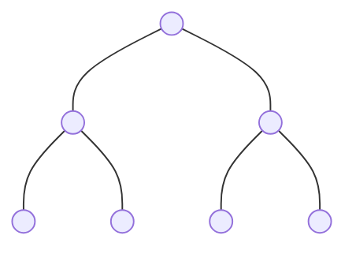
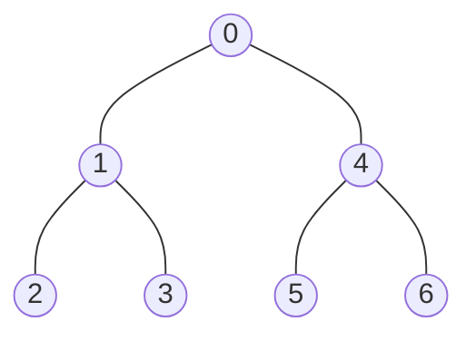
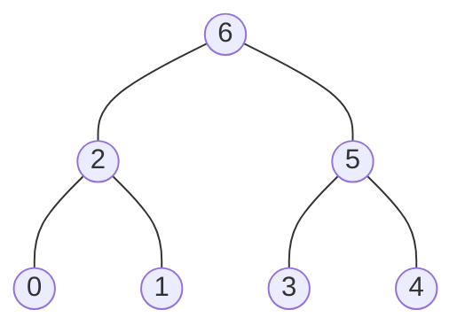
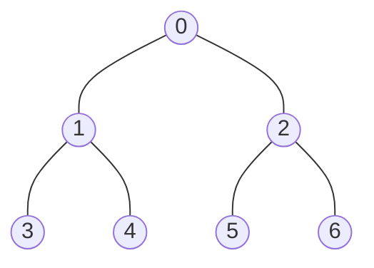

# Tree Traversal

- [x] [144. Binary Tree Preorder Traversal](https://leetcode.cn/problems/binary-tree-preorder-traversal/) (Easy)
- [x] [94. Binary Tree Inorder Traversal](https://leetcode.cn/problems/binary-tree-inorder-traversal/) (Easy)
- [x] [145. Binary Tree Postorder Traversal](https://leetcode.cn/problems/binary-tree-postorder-traversal/) (Easy)
- [x] [102. Binary Tree Level Order Traversal](https://leetcode.cn/problems/binary-tree-level-order-traversal/) (Medium)
- [x] [107. Binary Tree Level Order Traversal II](https://leetcode.cn/problems/binary-tree-level-order-traversal-ii/) (Medium)
- [x] [103. Binary Tree Zigzag Level Order Traversal](https://leetcode.cn/problems/binary-tree-zigzag-level-order-traversal/) (Medium)

## 144. Binary Tree Preorder Traversal

-   [LeetCode](https://leetcode.com/problems/binary-tree-preorder-traversal/) | [LeetCode CH](https://leetcode.cn/problems/binary-tree-preorder-traversal/) (Easy)

-   Tags: stack, tree, depth first search, binary tree


### Example 1



Pre-order Traversal



In-order Traversal


Post-order Traversal



Level Order Traversal


### Example 2



| Traversal   | Order             | Method         | Result                        |
| ----------- | ----------------- | -------------- | ----------------------------- |
| Preorder    | Root, Left, Right | DFS or Stack   | `[0, 1, 3, 4, 2, 5, 6]`       |
| Inorder     | Left, Root, Right | DFS or Stack   | `[3, 1, 4, 0, 5, 2, 6]`       |
| Postorder   | Left, Right, Root | DFS or Stack   | `[3, 4, 1, 5, 6, 2, 0]`       |
| Level Order | Level by Level    | BFS with Queue | `[[0], [1, 2], [3, 4, 5, 6]]` |

```python title="144. Binary Tree Preorder Traversal - Python Solution"
from typing import List, Optional

from binarytree import Node as TreeNode
from binarytree import build


# Recursive
def preorderTraversalRecursive(root: Optional[TreeNode]) -> List[int]:
    res = []

    def dfs(node):
        if not node:
            return None

        res.append(node.val)  # <--
        dfs(node.left)
        dfs(node.right)

    dfs(root)

    return res


# Iterative
def preorderTraversalIterative(root: Optional[TreeNode]) -> List[int]:
    if not root:
        return []

    stack = [root]
    res = []

    while stack:
        node = stack.pop()
        res.append(node.val)

        if node.right:
            stack.append(node.right)
        if node.left:
            stack.append(node.left)

    return res


tree = build([0, 1, 2, 3, 4, 5, 6])
print(tree)
#     __0__
#    /     \
#   1       2
#  / \     / \
# 3   4   5   6
print(preorderTraversalRecursive(tree))  # [0, 1, 3, 4, 2, 5, 6]
print(preorderTraversalIterative(tree))  # [0, 1, 3, 4, 2, 5, 6]

```

## 94. Binary Tree Inorder Traversal

-   [LeetCode](https://leetcode.com/problems/binary-tree-inorder-traversal/) | [LeetCode CH](https://leetcode.cn/problems/binary-tree-inorder-traversal/) (Easy)

-   Tags: stack, tree, depth first search, binary tree

```python title="94. Binary Tree Inorder Traversal - Python Solution"
from typing import List, Optional

from binarytree import Node as TreeNode
from binarytree import build


# Recursive
def inorderTraversalRecursive(root: TreeNode) -> List[int]:
    res = []

    def dfs(node):
        if not node:
            return

        dfs(node.left)
        res.append(node.val)  # <--
        dfs(node.right)

    dfs(root)

    return res


# Iterative
def inorderTraversalIterative(root: Optional[TreeNode]) -> List[int]:
    if not root:
        return []

    stack = []
    res = []
    cur = root

    while cur or stack:
        if cur:
            stack.append(cur)
            cur = cur.left
        else:
            cur = stack.pop()
            res.append(cur.val)
            cur = cur.right

    return res


tree = build([0, 1, 2, 3, 4, 5, 6])
print(tree)
#     __0__
#    /     \
#   1       2
#  / \     / \
# 3   4   5   6
print(inorderTraversalRecursive(tree))  # [3, 1, 4, 0, 5, 2, 6]
print(inorderTraversalIterative(tree))  # [3, 1, 4, 0, 5, 2, 6]

```

## 145. Binary Tree Postorder Traversal

-   [LeetCode](https://leetcode.com/problems/binary-tree-postorder-traversal/) | [LeetCode CH](https://leetcode.cn/problems/binary-tree-postorder-traversal/) (Easy)

-   Tags: stack, tree, depth first search, binary tree

```python title="145. Binary Tree Postorder Traversal - Python Solution"
from typing import List, Optional

from binarytree import Node as TreeNode
from binarytree import build


# Recursive
def postorderTraversalRecursive(root: Optional[TreeNode]) -> List[int]:
    res = []

    def dfs(node):
        if not node:
            return

        dfs(node.left)
        dfs(node.right)
        res.append(node.val)  # <--

    dfs(root)

    return res


# Iterative
def postorderTraversalIterative(root: Optional[TreeNode]) -> List[int]:
    if not root:
        return []

    res = []
    stack = [root]

    while stack:
        node = stack.pop()
        res.append(node.val)

        if node.left:
            stack.append(node.left)
        if node.right:
            stack.append(node.right)

    return res[::-1]


tree = build([0, 1, 2, 3, 4, 5, 6])
print(tree)
#     __0__
#    /     \
#   1       2
#  / \     / \
# 3   4   5   6
print(postorderTraversalRecursive(tree))  # [3, 4, 1, 5, 6, 2, 0]
print(postorderTraversalIterative(tree))  # [3, 4, 1, 5, 6, 2, 0]

```

## 102. Binary Tree Level Order Traversal

-   [LeetCode](https://leetcode.com/problems/binary-tree-level-order-traversal/) | [LeetCode CH](https://leetcode.cn/problems/binary-tree-level-order-traversal/) (Medium)

-   Tags: tree, breadth first search, binary tree

```python title="102. Binary Tree Level Order Traversal - Python Solution"
from collections import deque
from typing import List, Optional

from binarytree import Node as TreeNode
from binarytree import build


def levelOrder(root: Optional[TreeNode]) -> List[List[int]]:
    if not root:
        return []

    q = deque([root])
    res = []

    while q:
        level = []
        size = len(q)

        for _ in range(size):
            cur = q.popleft()
            level.append(cur.val)

            if cur.left:
                q.append(cur.left)
            if cur.right:
                q.append(cur.right)

        res.append(level)

    return res


tree = build([3, 9, 20, None, None, 15, 7])
print(tree)
#   3___
#  /    \
# 9     _20
#      /   \
#     15    7
print(levelOrder(tree))  # [[3], [9, 20], [15, 7]]

```

## 107. Binary Tree Level Order Traversal II

-   [LeetCode](https://leetcode.com/problems/binary-tree-level-order-traversal-ii/) | [LeetCode CH](https://leetcode.cn/problems/binary-tree-level-order-traversal-ii/) (Medium)

-   Tags: tree, breadth first search, binary tree

```python title="107. Binary Tree Level Order Traversal II - Python Solution"
from collections import deque
from typing import List, Optional

from binarytree import Node as TreeNode
from binarytree import build


def levelOrderBottom(root: Optional[TreeNode]) -> List[List[int]]:
    if not root:
        return []

    res = []
    q = deque([root])

    while q:
        level = []
        n = len(q)

        for _ in range(n):
            cur = q.popleft()
            level.append(cur.val)

            if cur.left:
                q.append(cur.left)
            if cur.right:
                q.append(cur.right)

        res.append(level)

    return res[::-1]


tree = build([3, 9, 20, None, None, 15, 7])
print(tree)
#   3___
#  /    \
# 9     _20
#      /   \
#     15    7
print(levelOrderBottom(tree))  # [[15, 7], [9, 20], [3]]

```

## 103. Binary Tree Zigzag Level Order Traversal

-   [LeetCode](https://leetcode.com/problems/binary-tree-zigzag-level-order-traversal/) | [LeetCode CH](https://leetcode.cn/problems/binary-tree-zigzag-level-order-traversal/) (Medium)

-   Tags: tree, breadth first search, binary tree

```python title="103. Binary Tree Zigzag Level Order Traversal - Python Solution"
from collections import deque
from typing import List, Optional

from binarytree import Node as TreeNode
from binarytree import build


def zigzagLevelOrder(root: Optional[TreeNode]) -> List[List[int]]:
    if not root:
        return []

    q = deque([root])
    res = []

    while q:
        level = []
        n = len(q)

        for _ in range(n):
            cur = q.popleft()
            level.append(cur.val)

            if cur.left:
                q.append(cur.left)
            if cur.right:
                q.append(cur.right)

        res.append(level if len(res) % 2 == 0 else level[::-1])

    return res


tree = build([3, 9, 20, None, None, 15, 7])
print(tree)
#   3___
#  /    \
# 9     _20
#      /   \
#     15    7
print(zigzagLevelOrder(tree))  # [[3], [20, 9], [15, 7]]

```
