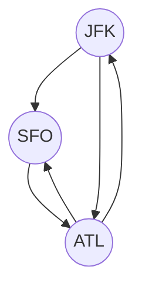
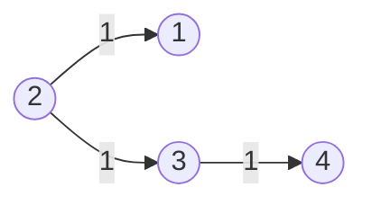
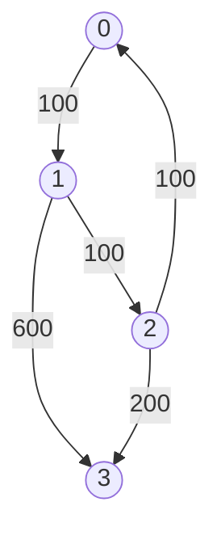

# Advanced Graphs

- [x] [332. Reconstruct Itinerary](https://leetcode.cn/problems/reconstruct-itinerary/) (Hard)
- [x] [1584. Min Cost to Connect All Points](https://leetcode.cn/problems/min-cost-to-connect-all-points/) (Medium)
- [x] [743. Network Delay Time](https://leetcode.cn/problems/network-delay-time/) (Medium)
- [x] [778. Swim in Rising Water](https://leetcode.cn/problems/swim-in-rising-water/) (Hard)
- [x] [269. Alien Dictionary](https://leetcode.cn/problems/alien-dictionary/) (Hard) 👑
- [x] [787. Cheapest Flights Within K Stops](https://leetcode.cn/problems/cheapest-flights-within-k-stops/) (Medium)

## 332. Reconstruct Itinerary

-   [LeetCode](https://leetcode.com/problems/reconstruct-itinerary/) | [LeetCode CH](https://leetcode.cn/problems/reconstruct-itinerary/) (Hard)

-   Tags: depth first search, graph, eulerian circuit
-   Return the itinerary in order that visits every airport exactly once.
-   The starting airport is `JFK`.
-   If there are multiple valid itineraries, return the lexicographically smallest one.
-   Eulerian path: A path that visits every edge exactly once.



```python title="332. Reconstruct Itinerary - Python Solution"
from collections import defaultdict
from typing import List


# Hierholzer
def findItinerary1(tickets: List[List[str]]) -> List[str]:
    graph = defaultdict(list)
    for u, v in sorted(tickets, reverse=True):
        graph[u].append(v)

    route = []

    def dfs(node):
        while graph[node]:
            dest = graph[node].pop()
            dfs(dest)
        route.append(node)

    dfs("JFK")

    return route[::-1]


# Backtracking
def findItinerary2(tickets: List[List[str]]) -> List[str]:
    graph = defaultdict(list)
    tickets.sort()
    for u, v in tickets:
        graph[u].append(v)

    route = ["JFK"]

    def backtraking(node):
        if len(route) == len(tickets) + 1:
            return True
        if node not in graph:
            return False

        temp = list(graph[node])
        for i, v in enumerate(temp):
            graph[node].pop(i)
            route.append(v)

            if backtraking(v):
                return True

            graph[node].insert(i, v)
            route.pop()

        return False

    backtraking("JFK")

    return route


tickets = tickets = [
    ["JFK", "SFO"],
    ["JFK", "ATL"],
    ["SFO", "ATL"],
    ["ATL", "JFK"],
    ["ATL", "SFO"],
]
print(findItinerary1(tickets))
# ['JFK', 'ATL', 'JFK', 'SFO', 'ATL', 'SFO']
print(findItinerary2(tickets))
# ['JFK', 'ATL', 'JFK', 'SFO', 'ATL', 'SFO']

```

## 1584. Min Cost to Connect All Points

-   [LeetCode](https://leetcode.com/problems/min-cost-to-connect-all-points/) | [LeetCode CH](https://leetcode.cn/problems/min-cost-to-connect-all-points/) (Medium)

-   Tags: array, union find, graph, minimum spanning tree
-   **Tree**: a connected acyclic graph
-   **Spanning Tree**: a subgraph that is a tree and connects all the vertices together
-   **Minimum Spanning Tree (MST)**: a spanning tree with the minimum possible sum of edge weights
-   Prim's Algorithm
    -   Data Structure: Heap
    -   Time Complexity: O(E \* logV)
    -   Space Complexity: O(V + E)
-   Kruskal's Algorithm

    -   Union Find
    -   Time Complexity: O(E \* logV)
    -   Space Complexity: O(V + E)

-   Demonstration

Example graph


MST


```python title="1584. Min Cost to Connect All Points - Python Solution"
import heapq
from collections import defaultdict
from typing import List


# Prim
def minCostConnectPointsPrim(points: List[List[int]]) -> int:
    n = len(points)
    graph = defaultdict(list)

    for i in range(n):
        for j in range(i + 1, n):
            x1, y1 = points[i]
            x2, y2 = points[j]
            dist = abs(x1 - x2) + abs(y1 - y2)
            graph[i].append((dist, j))
            graph[j].append((dist, i))

    cost = 0
    heap = [(0, 0)]  # (cost, node)
    visited = set()

    while heap:
        d1, n1 = heapq.heappop(heap)
        if n1 in visited:
            continue
        visited.add(n1)
        cost += d1

        for d2, n2 in graph[n1]:
            if n2 not in visited:
                heapq.heappush(heap, (d2, n2))

    return cost


# Kruskal
def minCostConnectPointsKruskal(points: List[List[int]]) -> int:
    n = len(points)
    par = {i: i for i in range(n)}
    rank = {i: 0 for i in range(n)}

    def find(n):
        p = par[n]
        while p != par[p]:
            par[p] = par[par[p]]
            p = par[p]
        return p

    def union(n1, n2):
        p1, p2 = find(n1), find(n2)

        if p1 == p2:
            return False

        if rank[p1] > rank[p2]:
            par[p2] = p1
        elif rank[p1] < rank[p2]:
            par[p1] = p2
        else:
            par[p2] = p1
            rank[p1] += 1

        return True

    heap = []
    for i in range(n):
        for j in range(i + 1, n):
            x1, y1 = points[i]
            x2, y2 = points[j]
            dist = abs(x1 - x2) + abs(y1 - y2)
            heapq.heappush(heap, (dist, i, j))

    cost = 0
    while heap:
        d, n1, n2 = heapq.heappop(heap)
        if union(n1, n2):
            cost += d

    return cost


points = [[0, 0], [2, 2], [3, 10], [5, 2], [7, 0]]
print(minCostConnectPointsPrim(points))  # 20
print(minCostConnectPointsKruskal(points))  # 20

```

## 743. Network Delay Time

-   [LeetCode](https://leetcode.com/problems/network-delay-time/) | [LeetCode CH](https://leetcode.cn/problems/network-delay-time/) (Medium)

-   Tags: depth first search, breadth first search, graph, heap priority queue, shortest path
-   Return the minimum time taken to reach all nodes in a network.



-   Shortest Path Problem: Find the shortest path between two vertices in a graph.
-   Dijkstra's Algorithm
    -   Shortest path algorithm
    -   Weighted graph (non-negative weights)
    -   Data Structure: Heap; Hash Set
    -   Time Complexity: O(E \* logV)
    -   Space Complexity: O(V)

```python title="743. Network Delay Time - Python Solution"
import heapq
from collections import defaultdict
from typing import List

from helper import complexity


# 1. Dijkstra - Set
def networkDelayTime1(times: List[List[int]], n: int, k: int) -> int:
    graph = defaultdict(list)
    for u, v, w in times:
        graph[u].append((v, w))

    heap = [(0, k)]
    visit = set()
    t = 0

    while heap:
        w1, n1 = heapq.heappop(heap)
        if n1 in visit:
            continue

        visit.add(n1)
        t = w1

        for n2, w2 in graph[n1]:
            heapq.heappush(heap, (w1 + w2, n2))

    return t if len(visit) == n else -1


# 2. Dijkstra - Dict
def networkDelayTime2(times: List[List[int]], n: int, k: int) -> int:
    graph = defaultdict(list)
    for u, v, w in times:
        graph[u].append((v, w))

    heap = [(0, k)]
    dist = defaultdict(int)

    while heap:
        w1, n1 = heapq.heappop(heap)
        if n1 in dist:
            continue

        dist[n1] = w1

        for n2, w2 in graph[n1]:
            heapq.heappush(heap, (w1 + w2, n2))

    return max(dist.values()) if len(dist) == n else -1


# Bellman-Ford
def networkDelayTimeBF(times: List[List[int]], n: int, k: int) -> int:
    delay = {i: float("inf") for i in range(1, n + 1)}
    delay[k] = 0

    for _ in range(n - 1):
        for u, v, t in times:
            delay[v] = min(delay[v], delay[u] + t)

    max_delay = max(delay.values())
    return max_delay if max_delay < float("inf") else -1


table = [
    ["Dijkstra", "O(E*logV)", "O(V+E)"],
    ["Bellman-Ford", "O(E*V)", "O(V)"],
]
complexity(table)
# |--------------|-----------|--------|
# | Approach     | Time      | Space  |
# |--------------|-----------|--------|
# | Dijkstra     | O(E*logV) | O(V+E) |
# | Bellman-Ford | O(E*V)    | O(V)   |
# |--------------|-----------|--------|


times = [[2, 1, 1], [2, 3, 1], [3, 4, 1]]
n = 4
k = 2
print(networkDelayTime1(times, n, k))  # 2
print(networkDelayTime2(times, n, k))  # 2
print(networkDelayTimeBF(times, n, k))  # 2

```

## 778. Swim in Rising Water

-   [LeetCode](https://leetcode.com/problems/swim-in-rising-water/) | [LeetCode CH](https://leetcode.cn/problems/swim-in-rising-water/) (Hard)

-   Tags: array, binary search, depth first search, breadth first search, union find, heap priority queue, matrix
-   Return the minimum time when you can reach the target.


```python title="778. Swim in Rising Water - Python Solution"
import heapq
from typing import List


# Dijkstra's
def swimInWater(grid: List[List[int]]) -> int:
    n = len(grid)
    visited = set()
    minHeap = [(grid[0][0], 0, 0)]
    directions = [(0, 1), (0, -1), (1, 0), (-1, 0)]

    visited.add((0, 0))

    while minHeap:
        time, r, c = heapq.heappop(minHeap)

        if r == n - 1 and c == n - 1:
            return time

        for dr, dc in directions:
            nr, nc = r + dr, c + dc

            if nr in range(n) and nc in range(n) and (nr, nc) not in visited:
                visited.add((nr, nc))
                heapq.heappush(minHeap, (max(time, grid[nr][nc]), nr, nc))


grid = [
    [0, 1, 2, 3, 4],
    [24, 23, 22, 21, 5],
    [12, 13, 14, 15, 16],
    [11, 17, 18, 19, 20],
    [10, 9, 8, 7, 6],
]
print(swimInWater(grid))  # 16

```

## 269. Alien Dictionary

-   [LeetCode](https://leetcode.com/problems/alien-dictionary/) | [LeetCode CH](https://leetcode.cn/problems/alien-dictionary/) (Hard)

-   Tags: array, string, depth first search, breadth first search, graph, topological sort
-   Return the correct order of characters in the alien language.

```python title="269. Alien Dictionary - Python Solution"
from collections import defaultdict, deque
from typing import List


# BFS - Kahn's algorithm (Topological Sort)
def alienOrderBFS(words: List[str]) -> str:
    graph = defaultdict(set)
    indegree = {c: 0 for word in words for c in word}

    for i in range(len(words) - 1):
        w1, w2 = words[i], words[i + 1]
        minLen = min(len(w1), len(w2))

        if len(w1) > len(w2) and w1[:minLen] == w2[:minLen]:
            return ""

        for j in range(minLen):
            if w1[j] != w2[j]:
                if w2[j] not in graph[w1[j]]:
                    graph[w1[j]].add(w2[j])
                    indegree[w2[j]] += 1
                break

    q = deque([c for c in indegree if indegree[c] == 0])
    result = []

    while q:
        char = q.popleft()
        result.append(char)

        for neighbor in graph[char]:
            indegree[neighbor] -= 1
            if indegree[neighbor] == 0:
                q.append(neighbor)

    return "".join(result) if len(result) == len(indegree) else ""


# DFS - Topological Sort
def alienOrderDFS(words: List[str]) -> str:
    graph = defaultdict(set)
    visited = {}
    result = []

    for i in range(len(words) - 1):
        w1, w2 = words[i], words[i + 1]
        minLen = min(len(w1), len(w2))

        if len(w1) > len(w2) and w1[:minLen] == w2[:minLen]:
            return ""

        for j in range(minLen):
            if w1[j] != w2[j]:
                if w2[j] not in graph[w1[j]]:
                    graph[w1[j]].add(w2[j])
                break

    def dfs(c):
        if c in visited:
            return visited[c]

        visited[c] = False
        for neighbor in graph[c]:
            if not dfs(neighbor):
                return False

        visited[c] = True
        result.append(c)
        return True

    for c in list(graph.keys()):
        if not dfs(c):
            return ""

    return "".join(result[::-1])


words = ["wrt", "wrf", "er", "ett", "rftt"]
print(alienOrderBFS(words))  # wertf
print(alienOrderDFS(words))  # wertf

```

## 787. Cheapest Flights Within K Stops

-   [LeetCode](https://leetcode.com/problems/cheapest-flights-within-k-stops/) | [LeetCode CH](https://leetcode.cn/problems/cheapest-flights-within-k-stops/) (Medium)

-   Tags: dynamic programming, depth first search, breadth first search, graph, heap priority queue, shortest path
-   Return the cheapest price from `src` to `dst` with at most `K` stops.



<iframe width="560" height="315" src="https://www.youtube.com/embed/5eIK3zUdYmE?si=aBR0VbHXTgNuVlGz" title="YouTube video player" frameborder="0" allow="accelerometer; autoplay; clipboard-write; encrypted-media; gyroscope; picture-in-picture; web-share" referrerpolicy="strict-origin-when-cross-origin" allowfullscreen></iframe>

```python title="787. Cheapest Flights Within K Stops - Python Solution"
import heapq
from collections import defaultdict
from typing import List


# Bellman-Ford
def findCheapestPriceBF(
    n: int, flights: List[List[int]], src: int, dst: int, k: int
) -> int:
    prices = [float("inf") for _ in range(n)]
    prices[src] = 0

    for _ in range(k + 1):
        temp = prices[:]
        for u, v, w in flights:
            temp[v] = min(temp[v], prices[u] + w)
        prices = temp

    return prices[dst] if prices[dst] != float("inf") else -1


# Dijkstra
def findCheapestPriceDijkstra(
    n: int, flights: List[List[int]], src: int, dst: int, k: int
) -> int:
    graph = defaultdict(list)
    for u, v, w in flights:
        graph[u].append((v, w))

    heap = [(0, src, 0)]  # (price, city, stops)
    visited = defaultdict(int)  # {city: stops}

    while heap:
        price, city, stops = heapq.heappop(heap)

        if city == dst:
            return price

        if stops > k:
            continue

        if city in visited and visited[city] <= stops:
            continue

        visited[city] = stops

        for neighbor, cost in graph[city]:
            heapq.heappush(heap, (price + cost, neighbor, stops + 1))

    return -1


# |------------|------------------|---------|
# |  Approach  |       Time       |  Space  |
# |------------|------------------|---------|
# |Bellman-Ford|    O(k * E)      |  O(n)   |
# | Dijkstra   | O(E * log(V))    |  O(n)   |
# |------------|------------------|---------|


n = 4
flights = [[0, 1, 100], [1, 2, 100], [2, 0, 100], [1, 3, 600], [2, 3, 200]]
src = 0
dst = 3
k = 1
print(findCheapestPriceBF(n, flights, src, dst, k))  # 700
print(findCheapestPriceDijkstra(n, flights, src, dst, k))  # 700

```
