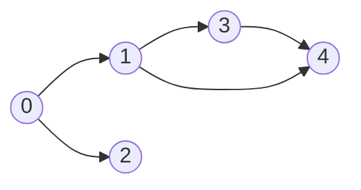
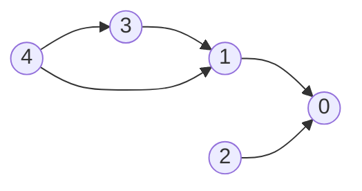
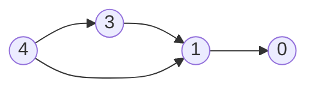
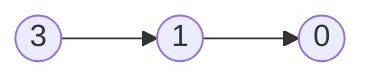
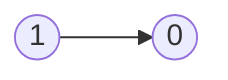
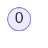

# Graphs

- [x] [200. Number of Islands](https://leetcode.cn/problems/number-of-islands/) (Medium)
- [x] [695. Max Area of Island](https://leetcode.cn/problems/max-area-of-island/) (Medium)
- [x] [133. Clone Graph](https://leetcode.cn/problems/clone-graph/) (Medium)
- [x] [286. Walls and Gates](https://leetcode.cn/problems/walls-and-gates/) (Medium) 👑
- [x] [994. Rotting Oranges](https://leetcode.cn/problems/rotting-oranges/) (Medium)
- [x] [417. Pacific Atlantic Water Flow](https://leetcode.cn/problems/pacific-atlantic-water-flow/) (Medium)
- [x] [130. Surrounded Regions](https://leetcode.cn/problems/surrounded-regions/) (Medium)
- [x] [207. Course Schedule](https://leetcode.cn/problems/course-schedule/) (Medium)
- [x] [210. Course Schedule II](https://leetcode.cn/problems/course-schedule-ii/) (Medium)
- [x] [261. Graph Valid Tree](https://leetcode.cn/problems/graph-valid-tree/) (Medium) 👑
- [x] [323. Number of Connected Components in an Undirected Graph](https://leetcode.cn/problems/number-of-connected-components-in-an-undirected-graph/) (Medium) 👑
- [x] [684. Redundant Connection](https://leetcode.cn/problems/redundant-connection/) (Medium)
- [x] [127. Word Ladder](https://leetcode.cn/problems/word-ladder/) (Hard)

## 200. Number of Islands

-   [LeetCode](https://leetcode.com/problems/number-of-islands/) | [LeetCode CH](https://leetcode.cn/problems/number-of-islands/) (Medium)

-   Tags: array, depth first search, breadth first search, union find, matrix
-   Count the number of islands in a 2D grid.
-   Method 1: DFS
-   Method 2: BFS (use a queue to traverse the grid)

-   How to keep track of visited cells?

    1. Mark the visited cell as `0` (or any other value) to avoid revisiting it.
    2. Use a set to store the visited cells.

-   Steps:
    1. Init: variables
    2. DFS/BFS: starting from the cell with `1`, turn all the connected `1`s to `0`.
    3. Traverse the grid, and if the cell is `1`, increment the count and call DFS/BFS.


```python title="200. Number of Islands - Python Solution"
from collections import deque
from copy import deepcopy
from typing import List


# DFS
def numIslandsDFS(grid: List[List[str]]) -> int:
    if not grid:
        return 0

    m, n = len(grid), len(grid[0])
    res = 0

    def dfs(r, c):
        if r < 0 or r >= m or c < 0 or c >= n or grid[r][c] != "1":
            return

        grid[r][c] = "2"

        dfs(r + 1, c)
        dfs(r - 1, c)
        dfs(r, c + 1)
        dfs(r, c - 1)

    for r in range(m):
        for c in range(n):
            if grid[r][c] == "1":
                dfs(r, c)
                res += 1

    return res


# BFS + Set
def numIslandsBFS1(grid: List[List[str]]) -> int:
    if not grid:
        return 0

    m, n = len(grid), len(grid[0])
    dirs = [(1, 0), (-1, 0), (0, 1), (0, -1)]
    visited = set()
    res = 0

    def bfs(r, c):
        q = deque([(r, c)])

        while q:
            row, col = q.popleft()

            for dr, dc in dirs:
                nr, nc = row + dr, col + dc
                if (
                    nr < 0
                    or nr >= m
                    or nc < 0
                    or nc >= n
                    or grid[nr][nc] == "0"
                    or (nr, nc) in visited
                ):
                    continue

                visited.add((nr, nc))
                q.append((nr, nc))

    for r in range(m):
        for c in range(n):
            if grid[r][c] == "1" and (r, c) not in visited:
                visited.add((r, c))
                bfs(r, c)
                res += 1

    return res


# BFS + Grid
def numIslandsBFS2(grid: List[List[str]]) -> int:
    if not grid:
        return 0

    m, n = len(grid), len(grid[0])
    dirs = [[0, 1], [0, -1], [1, 0], [-1, 0]]
    res = 0

    def bfs(r, c):
        q = deque([(r, c)])

        while q:
            row, col = q.popleft()

            for dr, dc in dirs:
                nr, nc = dr + row, dc + col
                if nr < 0 or nr >= m or nc < 0 or nc >= n or grid[nr][nc] != "1":
                    continue
                grid[nr][nc] = "2"
                q.append((nr, nc))

    for i in range(m):
        for j in range(n):
            if grid[i][j] == "1":
                grid[i][j] = "2"
                bfs(i, j)
                res += 1

    return res


grid = [
    ["1", "1", "1", "1", "0"],
    ["1", "1", "0", "1", "0"],
    ["1", "1", "0", "0", "0"],
    ["0", "0", "0", "0", "0"],
]

print(numIslandsDFS(deepcopy(grid)))  # 1
print(numIslandsBFS1(deepcopy(grid)))  # 1
print(numIslandsBFS2(deepcopy(grid)))  # 1

```

```cpp title="200. Number of Islands - C++ Solution"
#include <vector>
#include <iostream>
using namespace std;

class Solution
{
private:
    void dfs(vector<vector<char>> &grid, int r, int c)
    {
        int row = grid.size();
        int col = grid[0].size();

        if (r < 0 || r >= row || c < 0 || c >= col || grid[r][c] != '1')
        {
            return;
        }
        grid[r][c] = '0';

        dfs(grid, r - 1, c);
        dfs(grid, r + 1, c);
        dfs(grid, r, c - 1);
        dfs(grid, r, c + 1);
    }

public:
    int numIslands(vector<vector<char>> &grid)
    {
        int m = grid.size(), n = grid[0].size();
        int res = 0;
        for (int i = 0; i < m; i++)
        {
            for (int j = 0; j < n; j++)
            {
                if (grid[i][j] == '1')
                {
                    res++;
                    dfs(grid, i, j);
                }
            }
        }
        return res;
    }
};

int main()
{
    Solution s;
    vector<vector<char>> grid = {
        {'1', '1', '0', '0', '0'},
        {'1', '1', '0', '0', '0'},
        {'0', '0', '1', '0', '0'},
        {'0', '0', '0', '1', '1'}};
    cout << s.numIslands(grid) << endl;
    return 0;
}

```

## 695. Max Area of Island

-   [LeetCode](https://leetcode.com/problems/max-area-of-island/) | [LeetCode CH](https://leetcode.cn/problems/max-area-of-island/) (Medium)

-   Tags: array, depth first search, breadth first search, union find, matrix

```python title="695. Max Area of Island - Python Solution"
from collections import deque
from typing import List


# DFS
def maxAreaOfIslandDFS(grid: List[List[int]]) -> int:
    if not grid:
        return 0

    m, n = len(grid), len(grid[0])

    def dfs(r, c):
        if r < 0 or r >= m or c < 0 or c >= n or grid[r][c] != 1:
            return 0

        grid[r][c] = 2

        return 1 + dfs(r - 1, c) + dfs(r + 1, c) + dfs(r, c + 1) + dfs(r, c - 1)

    area = 0
    for r in range(m):
        for c in range(n):
            if grid[r][c] == 1:
                area = max(area, dfs(r, c))

    return area


# BFS
def maxAreaOfIslandBFS1(grid: List[List[int]]) -> int:
    if not grid:
        return 0

    m, n = len(grid), len(grid[0])
    dirs = [(1, 0), (-1, 0), (0, 1), (0, -1)]
    visited = set()
    res = 0

    def bfs(r, c):
        q = deque([(r, c)])
        area = 0

        while q:
            row, col = q.popleft()
            area += 1

            for dr, dc in dirs:
                nr, nc = row + dr, col + dc

                if (
                    nr < 0
                    or nr >= m
                    or nc < 0
                    or nc >= n
                    or grid[nr][nc] == 0
                    or (nr, nc) in visited
                ):
                    continue

                visited.add((nr, nc))
                q.append((nr, nc))

        return area

    for r in range(m):
        for c in range(n):
            if grid[r][c] == 1 and (r, c) not in visited:
                visited.add((r, c))
                res = max(res, bfs(r, c))

    return res


# BFS + Grid
def numIslandsBFS2(grid: List[List[str]]) -> int:
    if not grid:
        return 0

    m, n = len(grid), len(grid[0])
    dirs = [(1, 0), (-1, 0), (0, 1), (0, -1)]
    res = 0

    def bfs(r, c):
        q = deque([(r, c)])
        area = 0

        while q:
            row, col = q.popleft()
            area += 1

            for dr, dc in dirs:
                nr, nc = row + dr, col + dc

                if nr < 0 or nr >= m or nc < 0 or nc >= n or grid[nr][nc] == 0:
                    continue

                q.append((nr, nc))
                grid[nr][nc] = 0

        return area

    for r in range(m):
        for c in range(n):
            if grid[r][c] == 1:
                grid[r][c] = 0
                res = max(res, bfs(r, c))

    return res


grid = [
    [0, 0, 1, 0, 0, 0, 0, 1, 0, 0, 0, 0, 0],
    [0, 0, 0, 0, 0, 0, 0, 1, 1, 1, 0, 0, 0],
    [0, 1, 1, 0, 1, 0, 0, 0, 0, 0, 0, 0, 0],
    [0, 1, 0, 0, 1, 1, 0, 0, 1, 0, 1, 0, 0],
    [0, 1, 0, 0, 1, 1, 0, 0, 1, 1, 1, 0, 0],
    [0, 0, 0, 0, 0, 0, 0, 0, 0, 0, 1, 0, 0],
    [0, 0, 0, 0, 0, 0, 0, 1, 1, 1, 0, 0, 0],
    [0, 0, 0, 0, 0, 0, 0, 1, 1, 0, 0, 0, 0],
]
print(maxAreaOfIslandDFS(grid))  # 6
print(maxAreaOfIslandBFS1(grid))  # 6
print(numIslandsBFS2(grid))  # 6

```

```cpp title="695. Max Area of Island - C++ Solution"
#include <algorithm>
#include <iostream>
#include <vector>
using namespace std;

class Solution {
   public:
    int maxAreaOfIsland(vector<vector<int>>& grid) {
        int m = grid.size(), n = grid[0].size();
        int res = 0;

        auto dfs = [&](auto&& self, int r, int c) -> int {
            if (r < 0 || r >= m || c < 0 || c >= n || grid[r][c] != 1) {
                return 0;
            }
            grid[r][c] = 0;

            return 1 + self(self, r - 1, c) + self(self, r, c - 1) +
                   self(self, r + 1, c) + self(self, r, c + 1);
        };
        for (int i = 0; i < m; i++) {
            for (int j = 0; j < n; j++) {
                if (grid[i][j] == 1) {
                    int area = dfs(dfs, i, j);
                    res = max(res, area);
                }
            }
        }
        return res;
    }
};

int main() {
    Solution s;
    vector<vector<int>> grid = {{0, 0, 1, 0, 0, 0, 0, 1, 0, 0, 0, 0, 0},
                                {0, 0, 0, 0, 0, 0, 0, 1, 1, 1, 0, 0, 0},
                                {0, 1, 1, 0, 1, 0, 0, 0, 0, 0, 0, 0, 0},
                                {0, 1, 0, 0, 1, 1, 0, 0, 1, 0, 1, 0, 0},
                                {0, 1, 0, 0, 1, 1, 0, 0, 1, 1, 1, 0, 0},
                                {0, 0, 0, 0, 0, 0, 0, 0, 0, 0, 1, 0, 0},
                                {0, 0, 0, 0, 0, 0, 0, 1, 1, 1, 0, 0, 0},
                                {0, 0, 0, 0, 0, 0, 0, 1, 1, 0, 0, 0, 0}};
    cout << s.maxAreaOfIsland(grid) << endl;
    return 0;
}

```

## 133. Clone Graph

-   [LeetCode](https://leetcode.com/problems/clone-graph/) | [LeetCode CH](https://leetcode.cn/problems/clone-graph/) (Medium)

-   Tags: hash table, depth first search, breadth first search, graph

```python title="133. Clone Graph - Python Solution"
from collections import deque
from typing import Optional


class Node:
    def __init__(self, val=0, neighbors=None):
        self.val = val
        self.neighbors = neighbors if neighbors is not None else []


# 1. DFS
def cloneGraphDFS(node: Optional["Node"]) -> Optional["Node"]:
    if not node:
        return None

    cloned = {}  # {old: new}

    def dfs(node):
        if node in cloned:
            return cloned[node]

        new = Node(node.val)
        cloned[node] = new

        for neighbor in node.neighbors:
            new.neighbors.append(dfs(neighbor))

        return new

    return dfs(node)


# 2. BFS
def cloneGraphBFS(node: Optional["Node"]) -> Optional["Node"]:
    if not node:
        return None

    cloned = {node: Node(node.val)}
    q = deque([node])

    while q:
        cur = q.popleft()

        for neighbor in cur.neighbors:
            if neighbor not in cloned:
                cloned[neighbor] = Node(neighbor.val)
                q.append(neighbor)

            cloned[cur].neighbors.append(cloned[neighbor])

    return cloned[node]

```

## 286. Walls and Gates

-   [LeetCode](https://leetcode.com/problems/walls-and-gates/) | [LeetCode CH](https://leetcode.cn/problems/walls-and-gates/) (Medium)

-   Tags: array, breadth first search, matrix


```python title="286. Walls and Gates - Python Solution"
from collections import deque
from typing import List


# Multi-source BFS
def wallsAndGates(rooms: List[List[int]]) -> None:
    """
    Do not return anything, modify rooms in-place instead.
    """
    m, n = len(rooms), len(rooms[0])
    visited = set()
    directions = [(0, 1), (0, -1), (1, 0), (-1, 0)]

    def addRoom(r, c):
        if (
            r in range(m)
            and c in range(n)
            and (r, c) not in visited
            and rooms[r][c] != -1
        ):
            q.append((r, c))
            visited.add((r, c))

    q = deque()
    for r in range(m):
        for c in range(n):
            if rooms[r][c] == 0:
                q.append((r, c))
                visited.add((r, c))

    dist = 0

    while q:
        for _ in range(len(q)):
            r, c = q.popleft()
            rooms[r][c] = dist

            for dr, dc in directions:
                addRoom(r + dr, c + dc)
        dist += 1


rooms = [
    [2147483647, -1, 0, 2147483647],
    [2147483647, 2147483647, 2147483647, -1],
    [2147483647, -1, 2147483647, -1],
    [0, -1, 2147483647, 2147483647],
]
wallsAndGates(rooms)
print(rooms)
# [[3, -1, 0,  1],
#  [2,  2, 1, -1],
#  [1, -1, 2, -1],
#  [0, -1, 3,  4]]

```

## 994. Rotting Oranges

-   [LeetCode](https://leetcode.com/problems/rotting-oranges/) | [LeetCode CH](https://leetcode.cn/problems/rotting-oranges/) (Medium)

-   Tags: array, breadth first search, matrix
-   Return the minimum number of minutes that must elapse until no cell has a fresh orange.
-   Hint: Multi-source BFS to count the level.


```python title="994. Rotting Oranges - Python Solution"
from collections import deque
from typing import List


# BFS
def orangesRotting(grid: List[List[int]]) -> int:
    # 1. Init
    q = deque()
    time, fresh = 0, 0
    m, n = len(grid), len(grid[0])
    dirs = [[1, 0], [-1, 0], [0, 1], [0, -1]]

    # 2. Make a queue of rotten oranges and count fresh oranges
    for r in range(m):
        for c in range(n):
            if grid[r][c] == 1:
                fresh += 1
            if grid[r][c] == 2:
                q.append([r, c])

    # 3. BFS
    while q and fresh > 0:
        size = len(q)

        for _ in range(size):
            r, c = q.popleft()

            for dr, dc in dirs:
                nr, nc = r + dr, c + dc
                if nr < 0 or nc < 0 or nr >= m or nc >= n or grid[nr][nc] != 1:
                    continue
                grid[nr][nc] = 2
                q.append([nr, nc])
                fresh -= 1
        time += 1

    return time if fresh == 0 else -1


grid = [[2, 1, 1], [1, 1, 0], [0, 1, 1]]
print(orangesRotting(grid))

```

## 417. Pacific Atlantic Water Flow

-   [LeetCode](https://leetcode.com/problems/pacific-atlantic-water-flow/) | [LeetCode CH](https://leetcode.cn/problems/pacific-atlantic-water-flow/) (Medium)

-   Tags: array, depth first search, breadth first search, matrix

```python title="417. Pacific Atlantic Water Flow - Python Solution"
from collections import deque
from typing import List


# DFS
def pacificAtlanticDFS(heights: List[List[int]]) -> List[List[int]]:
    m, n = len(heights), len(heights[0])
    pac, atl = set(), set()
    directions = [(1, 0), (0, 1), (-1, 0), (0, -1)]

    def dfs(r, c, visited, prev_height):
        if (
            r not in range(m)
            or c not in range(n)
            or heights[r][c] < prev_height
            or (r, c) in visited
        ):
            return None

        visited.add((r, c))
        height = heights[r][c]
        for dr, dc in directions:
            dfs(dr + r, dc + c, visited, height)

    for c in range(n):
        dfs(0, c, pac, heights[0][c])
        dfs(m - 1, c, atl, heights[m - 1][c])

    for r in range(m):
        dfs(r, 0, pac, heights[r][0])
        dfs(r, n - 1, atl, heights[r][n - 1])

    return list(pac & atl)


# BFS
def pacificAtlanticBFS(heights: List[List[int]]) -> List[List[int]]:
    m, n = len(heights), len(heights[0])
    pac, atl = set(), set()
    directions = [(1, 0), (-1, 0), (0, 1), (0, -1)]

    def bfs(r, c, visited):
        q = deque([(r, c)])
        visited.add((r, c))

        while q:
            row, col = q.popleft()

            for dr, dc in directions:
                nr, nc = row + dr, col + dc

                if (
                    nr in range(m)
                    and nc in range(n)
                    and heights[row][col] <= heights[nr][nc]
                    and (nr, nc) not in visited
                ):
                    q.append((nr, nc))
                    visited.add((nr, nc))

    for c in range(n):
        bfs(0, c, pac)  # top
        bfs(m - 1, c, atl)  # bottom

    for r in range(m):
        bfs(r, 0, pac)  # left
        bfs(r, n - 1, atl)  # right

    return list(pac & atl)


heights = [
    [1, 2, 2, 3, 5],
    [3, 2, 3, 4, 4],
    [2, 4, 5, 3, 1],
    [6, 7, 1, 4, 5],
    [5, 1, 1, 2, 4],
]
print(pacificAtlanticDFS(heights))
# [(4, 0), (0, 4), (3, 1), (1, 4), (3, 0), (2, 2), (1, 3)]
print(pacificAtlanticBFS(heights))
# [(4, 0), (0, 4), (3, 1), (1, 4), (3, 0), (2, 2), (1, 3)]

```

## 130. Surrounded Regions

-   [LeetCode](https://leetcode.com/problems/surrounded-regions/) | [LeetCode CH](https://leetcode.cn/problems/surrounded-regions/) (Medium)

-   Tags: array, depth first search, breadth first search, union find, matrix

```python title="130. Surrounded Regions - Python Solution"
from collections import deque
from copy import deepcopy
from pprint import pprint
from typing import List


# 1. DFS
def solveDFS(board: List[List[str]]) -> None:
    """
    Do not return anything, modify board in-place instead.
    """
    if not board and not board[0]:
        return None

    m, n = len(board), len(board[0])

    def capture(r, c):
        if r not in range(m) or c not in range(n) or board[r][c] != "O":
            return None

        board[r][c] = "T"
        capture(r + 1, c)
        capture(r - 1, c)
        capture(r, c + 1)
        capture(r, c - 1)

    for r in range(m):
        for c in range(n):
            if board[r][c] == "O" and (r in [0, m - 1] or c in [0, n - 1]):
                capture(r, c)

    for r in range(m):
        for c in range(n):
            if board[r][c] == "O":
                board[r][c] = "X"

    for r in range(m):
        for c in range(n):
            if board[r][c] == "T":
                board[r][c] = "O"


# 2. BFS
def solveBFS(board: List[List[str]]) -> None:
    """
    Do not return anything, modify board in-place instead.
    """
    if not board and not board[0]:
        return None

    m, n = len(board), len(board[0])
    directions = [(1, 0), (-1, 0), (0, 1), (0, -1)]

    def capture(r, c):
        q = deque([(r, c)])

        while q:
            row, col = q.popleft()

            for dr, dc in directions:
                nr = row + dr
                nc = col + dc
                if nr in range(m) and nc in range(n) and board[nr][nc] == "O":
                    q.append((nr, nc))
                    board[nr][nc] = "T"

    for r in range(m):
        for c in range(n):
            if board[r][c] == "O" and (r in [0, m - 1] or c in [0, n - 1]):
                board[r][c] = "T"
                capture(r, c)

    for r in range(m):
        for c in range(n):
            if board[r][c] == "O":
                board[r][c] = "X"

    for r in range(m):
        for c in range(n):
            if board[r][c] == "T":
                board[r][c] = "O"


board = [
    ["X", "X", "X", "X"],
    ["X", "O", "O", "X"],
    ["X", "X", "O", "X"],
    ["X", "O", "X", "X"],
]
board1 = deepcopy(board)
solveDFS(board1)
pprint(board1)
# [['X', 'X', 'X', 'X'],
#  ['X', 'X', 'X', 'X'],
#  ['X', 'X', 'X', 'X'],
#  ['X', 'O', 'X', 'X']]

board2 = deepcopy(board)
solveBFS(board2)
pprint(board2)
# [['X', 'X', 'X', 'X'],
#  ['X', 'X', 'X', 'X'],
#  ['X', 'X', 'X', 'X'],
#  ['X', 'O', 'X', 'X']]

```

## 207. Course Schedule

-   [LeetCode](https://leetcode.com/problems/course-schedule/) | [LeetCode CH](https://leetcode.cn/problems/course-schedule/) (Medium)

-   Tags: depth first search, breadth first search, graph, topological sort
- Return true if it is possible to finish all courses, otherwise return false.
- Dependency relationships imply the topological sort algorithm.
- Cycle detection
- Topological Sort
  - DAG (Directed Acyclic Graph)
  - Time complexity: O(V+E)
  - Space complexity: O(V+E)
  - Prerequisites: Indegree (Look at the problem 1557. Minimum Number of Vertices to Reach All Nodes)
    - Indegree: Number of incoming edges to a vertex
  - Applications: task scheduling, course scheduling, build systems, dependency resolution, compiler optimization, etc.


Course to prerequisites mapping



Prerequisites to course mapping



| course       | 0   | 0   | 1   | 1   | 3   |
| ------------ | --- | --- | --- | --- | --- |
| prerequisite | 1   | 2   | 3   | 4   | 4   |

| index     | 0   | 1   | 2   | 3   | 4   |
| --------- | --- | --- | --- | --- | --- |
| in-degree | 0   | 0   | 0   | 0   | 0   |

Initialize

- graph

| prerequisite | 1     | 2     | 3     | 4        |
| ------------ | ----- | ----- | ----- | -------- |
| course       | `[0]` | `[0]` | `[1]` | `[1, 3]` |

- in-degree

|           | 0   | 1   | 2   | 3   | 4   |
| --------- | --- | --- | --- | --- | --- |
| in-degree | 2   | 2   | 0   | 1   | 0   |

- queue: `[2, 4]`
- pop `2` from the queue



|           | 0   | 1   | 2   | 3   | 4   |
| --------- | --- | --- | --- | --- | --- |
| in-degree | 1   | 2   | 0   | 1   | 0   |

- queue: `[4]`
- pop `4` from the queue



|           | 0   | 1   | 2   | 3   | 4   |
| --------- | --- | --- | --- | --- | --- |
| in-degree | 1   | 1   | 0   | 0   | 0   |

- queue: `[3]`
- pop `3` from the queue



|           | 0   | 1   | 2   | 3   | 4   |
| --------- | --- | --- | --- | --- | --- |
| in-degree | 1   | 0   | 0   | 0   | 0   |

- queue: `[1]`
- pop `1` from the queue



|           | 0   | 1   | 2   | 3   | 4   |
| --------- | --- | --- | --- | --- | --- |
| in-degree | 0   | 0   | 0   | 0   | 0   |

- queue: `[0]`
- pop `0` from the queue
- All courses are taken. Return `True`.

```python title="207. Course Schedule - Python Solution"
from collections import defaultdict, deque
from typing import List


# BFS (Kahn's Algorithm)
def canFinishBFS(numCourses: int, prerequisites: List[List[int]]) -> bool:
    graph = defaultdict(list)
    indegree = defaultdict(int)

    for crs, pre in prerequisites:
        graph[pre].append(crs)
        indegree[crs] += 1

    q = deque([i for i in range(numCourses) if indegree[i] == 0])
    count = 0

    while q:
        crs = q.popleft()
        count += 1

        for nxt in graph[crs]:
            indegree[nxt] -= 1

            if indegree[nxt] == 0:
                q.append(nxt)

    return count == numCourses


# DFS + Set
def canFinishDFS1(numCourses: int, prerequisites: List[List[int]]) -> bool:
    graph = defaultdict(list)
    for crs, pre in prerequisites:
        graph[crs].append(pre)

    visiting = set()

    def dfs(crs):
        if crs in visiting:  # cycle detected
            return False
        if graph[crs] == []:
            return True

        visiting.add(crs)

        for pre in graph[crs]:
            if not dfs(pre):
                return False

        visiting.remove(crs)
        graph[crs] = []

        return True

    for crs in range(numCourses):
        if not dfs(crs):
            return False
    return True


# DFS + List
def canFinishDFS2(numCourses: int, prerequisites: List[List[int]]) -> bool:
    graph = defaultdict(list)
    for pre, crs in prerequisites:
        graph[crs].append(pre)

    # 0: init, 1: visiting, 2: visited
    status = [0] * numCourses

    def dfs(crs):
        if status[crs] == 1:  # cycle detected
            return False
        if status[crs] == 2:
            return True

        status[crs] = 1

        for pre in graph[crs]:
            if not dfs(pre):
                return False

        status[crs] = 2
        return True

    for crs in range(numCourses):
        if not dfs(crs):
            return False
    return True


prerequisites = [[0, 1], [0, 2], [1, 3], [1, 4], [3, 4]]
print(canFinishBFS(5, prerequisites))  # True
print(canFinishDFS1(5, prerequisites))  # True
print(canFinishDFS2(5, prerequisites))  # True

```

```cpp title="207. Course Schedule - C++ Solution"
#include <functional>
#include <iostream>
#include <queue>
#include <vector>
using namespace std;

class Solution {
   public:
    // BFS
    bool canFinishBFS(int numCourses, vector<vector<int>> &prerequisites) {
        vector<vector<int>> graph(numCourses);
        vector<int> indegree(numCourses, 0);
        for (auto &pre : prerequisites) {
            graph[pre[1]].push_back(pre[0]);
            indegree[pre[0]]++;
        }

        queue<int> q;
        for (int i = 0; i < numCourses; i++) {
            if (indegree[i] == 0) {
                q.push(i);
            }
        }

        int cnt = 0;
        while (!q.empty()) {
            int cur = q.front();
            q.pop();
            cnt++;

            for (int nxt : graph[cur]) {
                indegree[nxt]--;
                if (indegree[nxt] == 0) {
                    q.push(nxt);
                }
            }
        }
        return cnt == numCourses;
    }

    // DFS
    bool canFinishDFS(int numCourses, vector<vector<int>> &prerequisites) {
        vector<vector<int>> graph(numCourses);
        for (auto &pre : prerequisites) {
            graph[pre[1]].push_back(pre[0]);
        }
        // 0: not visited, 1: visiting, 2: visited
        vector<int> state(numCourses, 0);

        function<bool(int)> dfs = [&](int pre) -> bool {
            state[pre] = 1;  // visiting
            for (int crs : graph[pre]) {
                if (state[crs] == 1 || (state[crs] == 0 && dfs(crs))) {
                    return true;
                }
            }
            state[pre] = 2;  // visited
            return false;
        };

        for (int i = 0; i < numCourses; i++) {
            if (state[i] == 0 && dfs(i)) {
                return false;
            }
        }
        return true;
    }
};

int main() {
    Solution sol;
    vector<vector<int>> prerequisites = {{1, 0}, {2, 1}, {3, 2}, {4, 3},
                                         {5, 4}, {6, 5}, {7, 6}, {8, 7},
                                         {9, 8}, {10, 9}};
    int numCourses = 11;
    cout << sol.canFinishBFS(numCourses, prerequisites) << endl;
    cout << sol.canFinishDFS(numCourses, prerequisites) << endl;
    return 0;
}

```

## 210. Course Schedule II

-   [LeetCode](https://leetcode.com/problems/course-schedule-ii/) | [LeetCode CH](https://leetcode.cn/problems/course-schedule-ii/) (Medium)

-   Tags: depth first search, breadth first search, graph, topological sort
- Return the ordering of courses you should take to finish all courses. If there are multiple valid answers, return any of them.


```python title="210. Course Schedule II - Python Solution"
from collections import defaultdict, deque
from typing import List


# 1. BFS - Kahn's Algorithm
def findOrderBFS(numCourses: int, prerequisites: List[List[int]]) -> List[int]:
    graph = defaultdict(list)
    indegree = defaultdict(int)

    for crs, pre in prerequisites:
        graph[pre].append(crs)
        indegree[crs] += 1

    q = deque([i for i in range(numCourses) if indegree[i] == 0])
    order = []

    while q:
        pre = q.popleft()
        order.append(pre)

        for crs in graph[pre]:
            indegree[crs] -= 1
            if indegree[crs] == 0:
                q.append(crs)

    return order if len(order) == numCourses else []


# 2. DFS + Set
def findOrderDFS1(numCourses: int, prerequisites: List[List[int]]) -> List[int]:
    adj = defaultdict(list)
    for crs, pre in prerequisites:
        adj[crs].append(pre)

    visit, cycle = set(), set()
    order = []

    def dfs(crs):
        if crs in cycle:
            return False
        if crs in visit:
            return True

        cycle.add(crs)
        for pre in adj[crs]:
            if not dfs(pre):
                return False

        cycle.remove(crs)
        visit.add(crs)
        order.append(crs)
        return True

    for crs in range(numCourses):
        if not dfs(crs):
            return []

    return order


# 3. DFS + List
def findOrderDFS2(numCourses: int, prerequisites: List[List[int]]) -> List[int]:
    adj = defaultdict(list)
    for pre, crs in prerequisites:
        adj[crs].append(pre)

    # 0: not visited, 1: visiting, 2: visited
    state = [0] * numCourses
    order = []

    def dfs(crs):
        if state[crs] == 1:
            return False
        if state[crs] == 2:
            return True

        state[crs] = 1

        for pre in adj[crs]:
            if not dfs(pre):
                return False

        state[crs] = 2
        order.append(crs)
        return True

    for crs in range(numCourses):
        if not dfs(crs):
            return []

    return order[::-1]


numCourses = 5
prerequisites = [[0, 1], [0, 2], [1, 3], [1, 4], [3, 4]]
print(findOrderBFS(numCourses, prerequisites))  # [2, 4, 3, 1, 0]
print(findOrderDFS1(numCourses, prerequisites))  # [4, 3, 1, 2, 0]
print(findOrderDFS2(numCourses, prerequisites))  # [4, 3, 2, 1, 0]

```

```cpp title="210. Course Schedule II - C++ Solution"
#include <iostream>
#include <queue>
#include <vector>
using namespace std;

class Solution {
   public:
    // BFS
    vector<int> findOrderBFS(int numCourses,
                             vector<vector<int>> &prerequisites) {
        vector<vector<int>> graph(numCourses);
        vector<int> indegree(numCourses, 0);

        for (auto &pre : prerequisites) {
            graph[pre[1]].push_back(pre[0]);
            indegree[pre[0]]++;
        }

        queue<int> q;
        for (int i = 0; i < numCourses; i++)
            if (indegree[i] == 0) q.push(i);

        vector<int> order;

        while (!q.empty()) {
            int cur = q.front();
            q.pop();
            order.push_back(cur);

            for (int nxt : graph[cur]) {
                indegree[nxt]--;
                if (indegree[nxt] == 0) q.push(nxt);
            }
        }

        return (int)order.size() == numCourses ? order : vector<int>{};
    }
};

int main() {
    Solution obj;
    vector<vector<int>> prerequisites{{1, 0}, {2, 0}, {3, 1}, {3, 2}};
    vector<int> res = obj.findOrderBFS(4, prerequisites);
    for (size_t i = 0; i < res.size(); i++) cout << res[i] << "\n";
    return 0;
}

```

## 261. Graph Valid Tree

-   [LeetCode](https://leetcode.com/problems/graph-valid-tree/) | [LeetCode CH](https://leetcode.cn/problems/graph-valid-tree/) (Medium)

-   Tags: depth first search, breadth first search, union find, graph

```python title="261. Graph Valid Tree - Python Solution"
from collections import defaultdict
from typing import List


# Graph
def validTree(n: int, edges: List[List[int]]) -> bool:
    if n == 0:
        return False
    if len(edges) != n - 1:
        return False

    graph = defaultdict(list)
    for u, v in edges:
        graph[u].append(v)
        graph[v].append(u)

    visited = set()

    def dfs(node, parent):
        if node in visited:
            return False
        visited.add(node)
        for neighbor in graph[node]:
            if neighbor != parent and not dfs(neighbor, node):
                return False
        return True

    return dfs(0, -1) and len(visited) == n


print(validTree(5, [[0, 1], [0, 2], [0, 3], [1, 4]]))  # True
print(validTree(5, [[0, 1], [1, 2], [2, 3], [1, 3], [1, 4]]))  # False

```

## 323. Number of Connected Components in an Undirected Graph

-   [LeetCode](https://leetcode.com/problems/number-of-connected-components-in-an-undirected-graph/) | [LeetCode CH](https://leetcode.cn/problems/number-of-connected-components-in-an-undirected-graph/) (Medium)

-   Tags: depth first search, breadth first search, union find, graph

```python title="323. Number of Connected Components in an Undirected Graph - Python Solution"
from typing import List


# Union Find
def countComponents(n: int, edges: List[List[int]]) -> int:
    uf = UnionFind(n)
    count = n

    for u, v in edges:
        count -= uf.union(u, v)

    return count


class UnionFind:
    def __init__(self, n):
        self.par = {i: i for i in range(n)}
        self.rank = {i: 1 for i in range(n)}

    def find(self, n):
        p = self.par[n]
        while self.par[p] != p:
            self.par[p] = self.par[self.par[p]]
            p = self.par[p]
        return p

    def union(self, n1, n2):
        p1, p2 = self.find(n1), self.find(n2)

        if p1 == p2:
            return 0

        if self.rank[p1] > self.rank[p2]:
            self.par[p2] = p1
        elif self.rank[p1] < self.rank[p2]:
            self.par[p1] = p2
        else:
            self.par[p2] = p1
            self.rank[p1] += 1

        return 1


print(countComponents(5, [[0, 1], [1, 2], [3, 4]]))  # 2

```

## 684. Redundant Connection

-   [LeetCode](https://leetcode.com/problems/redundant-connection/) | [LeetCode CH](https://leetcode.cn/problems/redundant-connection/) (Medium)

-   Tags: depth first search, breadth first search, union find, graph

```python title="684. Redundant Connection - Python Solution"
from typing import List


class UnionFind:
    def __init__(self, n):
        self.par = {i: i for i in range(1, n + 1)}
        self.rank = {i: 1 for i in range(1, n + 1)}

    def find(self, n):
        p = self.par[n]
        while self.par[p] != p:
            self.par[p] = self.par[self.par[p]]
            p = self.par[p]
        return p

    def union(self, n1, n2):
        p1, p2 = self.find(n1), self.find(n2)

        if p1 == p2:
            return False

        if self.rank[p1] > self.rank[p2]:
            self.par[p2] = p1
        elif self.rank[p1] < self.rank[p2]:
            self.par[p1] = p2
        else:
            self.par[p2] = p1
            self.rank[p1] += 1

        return True


# Union Find
def findRedundantConnectionUF(edges: List[List[int]]) -> List[int]:
    n = len(edges)
    uf = UnionFind(n)

    for u, v in edges:
        if not uf.union(u, v):
            return (u, v)


# DFS
def findRedundantConnectionDFS(edges: List[List[int]]) -> List[int]:
    graph, cycle = {}, {}
    for a, b in edges:
        graph.setdefault(a, []).append(b)
        graph.setdefault(b, []).append(a)

    def dfs(node, parent):
        if node in cycle:
            for k in list(cycle.keys()):
                if k == node:
                    return True
                del cycle[k]

        cycle[node] = None
        for child in graph[node]:
            if child != parent and dfs(child, node):
                return True
        del cycle[node]
        return False

    dfs(edges[0][0], -1)
    for a, b in edges[::-1]:
        if a in cycle and b in cycle:
            return (a, b)


edges = [[1, 2], [1, 3], [2, 3]]
print(findRedundantConnectionUF(edges))  # (2, 3)
print(findRedundantConnectionDFS(edges))  # (2, 3)

```

## 127. Word Ladder

-   [LeetCode](https://leetcode.com/problems/word-ladder/) | [LeetCode CH](https://leetcode.cn/problems/word-ladder/) (Hard)

-   Tags: hash table, string, breadth first search
-   The most classic BFS problem.
-   Return the number of words in the shortest transformation sequence from beginWord to endWord, or 0 if no such sequence exists.

<iframe width="560" height="315" src="https://www.youtube.com/embed/h9iTnkgv05E?si=51-3ZwweoJrPqRW9" title="YouTube video player" frameborder="0" allow="accelerometer; autoplay; clipboard-write; encrypted-media; gyroscope; picture-in-picture; web-share" referrerpolicy="strict-origin-when-cross-origin" allowfullscreen></iframe>

| Approach | Time        | Space     |
| -------- | ----------- | --------- |
| BFS      | O(n \* m^2) | O(n \* m) |

```python title="127. Word Ladder - Python Solution"
from collections import defaultdict, deque
from typing import List


# BFS
def ladderLength(beginWord: str, endWord: str, wordList: List[str]) -> int:
    if endWord not in wordList:
        return 0

    n = len(beginWord)
    graph = defaultdict(list)  # pattern: words
    wordList.append(beginWord)

    for word in wordList:
        for i in range(n):
            pattern = word[:i] + "*" + word[i + 1 :]
            graph[pattern].append(word)

    visited = set([beginWord])
    q = deque([beginWord])
    res = 1

    while q:
        size = len(q)
        for _ in range(size):
            word = q.popleft()
            if word == endWord:
                return res

            for i in range(n):
                pattern = word[:i] + "*" + word[i + 1 :]
                for neighbor in graph[pattern]:
                    if neighbor not in visited:
                        visited.add(neighbor)
                        q.append(neighbor)
        res += 1

    return 0


beginWord = "hit"
endWord = "cog"
wordList = ["hot", "dot", "dog", "lot", "log", "cog"]
print(ladderLength(beginWord, endWord, wordList))  # 5

```
