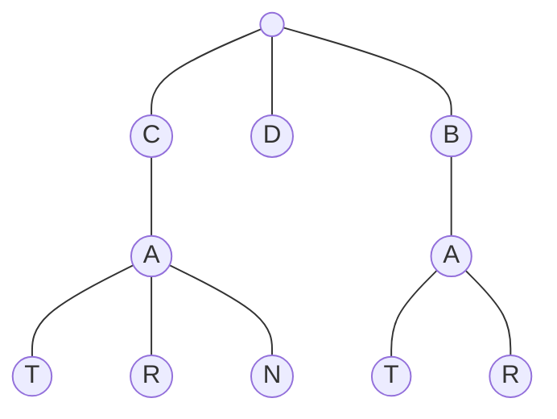

# Tries

## Table of Contents

- [x] [208. Implement Trie (Prefix Tree)](https://leetcode.cn/problems/implement-trie-prefix-tree/) (Medium)
- [x] [211. Design Add and Search Words Data Structure](https://leetcode.cn/problems/design-add-and-search-words-data-structure/) (Medium)
- [x] [212. Word Search II](https://leetcode.cn/problems/word-search-ii/) (Hard)

## 208. Implement Trie (Prefix Tree)

-   [LeetCode](https://leetcode.com/problems/implement-trie-prefix-tree/) | [LeetCode CH](https://leetcode.cn/problems/implement-trie-prefix-tree/) (Medium)

-   Tags: hash table, string, design, trie
### Trie

- A trie is a tree-like data structure whose nodes store the letters of an alphabet.



```python title="208. Implement Trie (Prefix Tree) - Python Solution"
class TrieNode:
    def __init__(self):
        self.children = {}
        self.endOfWord = None


class Trie:
    def __init__(self):
        self.root = TrieNode()

    def insert(self, word: str) -> None:
        node = self.root

        for c in word:
            if c not in node.children:
                node.children[c] = TrieNode()
            node = node.children[c]
        node.endOfWord = True

    def search(self, word: str) -> bool:
        node = self.root

        for c in word:
            if c not in node.children:
                return False
            node = node.children[c]
        return node.endOfWord

    def startsWith(self, prefix: str) -> bool:
        node = self.root

        for c in prefix:
            if c not in node.children:
                return False
            node = node.children[c]
        return True


# Your Trie object will be instantiated and called as such:
obj = Trie()
obj.insert("apple")
print(obj.search("word"))  # False
print(obj.startsWith("app"))  # True

```

## 211. Design Add and Search Words Data Structure

-   [LeetCode](https://leetcode.com/problems/design-add-and-search-words-data-structure/) | [LeetCode CH](https://leetcode.cn/problems/design-add-and-search-words-data-structure/) (Medium)

-   Tags: string, depth first search, design, trie
```python title="211. Design Add and Search Words Data Structure - Python Solution"
class TrieNode:
    def __init__(self):
        self.children = {}
        self.word = False


class WordDictionary:
    def __init__(self):
        self.root = TrieNode()

    def addWord(self, word: str) -> None:
        node = self.root

        for c in word:
            if c not in node.children:
                node.children[c] = TrieNode()
            node = node.children[c]
        node.word = True

    def search(self, word: str) -> bool:

        def dfs(j, root):
            node = root

            for i in range(j, len(word)):
                c = word[i]

                if c == ".":
                    for child in node.children.values():
                        if dfs(i + 1, child):
                            return True
                    return False
                else:
                    if c not in node.children:
                        return False
                    node = node.children[c]
            return node.word

        return dfs(0, self.root)


# Your WordDictionary object will be instantiated and called as such:
obj = WordDictionary()
obj.addWord("word")
print(obj.search("word"))
print(obj.search("w.rd"))

```

## 212. Word Search II

-   [LeetCode](https://leetcode.com/problems/word-search-ii/) | [LeetCode CH](https://leetcode.cn/problems/word-search-ii/) (Hard)

-   Tags: array, string, backtracking, trie, matrix
```python title="212. Word Search II - Python Solution"
from typing import List

from template import TrieNode


# Backtracking + Trie
def findWords(board: List[List[str]], words: List[str]) -> List[str]:
    root = TrieNode()
    for word in words:
        root.addWord(word)

    m, n = len(board), len(board[0])
    result, visit = set(), set()

    def dfs(r, c, node, word):
        if (
            r < 0
            or r >= m
            or c < 0
            or c >= n
            or (r, c) in visit
            or board[r][c] not in node.children
        ):
            return None

        visit.add((r, c))

        node = node.children[board[r][c]]
        word += board[r][c]
        if node.isWord:
            result.add(word)

        dfs(r - 1, c, node, word)
        dfs(r + 1, c, node, word)
        dfs(r, c - 1, node, word)
        dfs(r, c + 1, node, word)

        visit.remove((r, c))

    for r in range(m):
        for c in range(n):
            dfs(r, c, root, "")

    return list(result)


board = [
    ["o", "a", "a", "n"],
    ["e", "t", "a", "e"],
    ["i", "h", "k", "r"],
    ["i", "f", "l", "v"],
]
words = ["oath", "pea", "eat", "rain"]
print(findWords(board, words))
# ['eat', 'oath']

```
