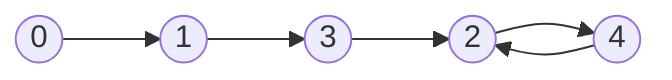

# Techniques

## Table of Contents

- [x] [136. Single Number](https://leetcode.cn/problems/single-number/) (Easy)
- [x] [169. Majority Element](https://leetcode.cn/problems/majority-element/) (Easy)
- [x] [75. Sort Colors](https://leetcode.cn/problems/sort-colors/) (Medium)
- [x] [31. Next Permutation](https://leetcode.cn/problems/next-permutation/) (Medium)
- [x] [287. Find the Duplicate Number](https://leetcode.cn/problems/find-the-duplicate-number/) (Medium)

## 136. Single Number

-   [LeetCode](https://leetcode.com/problems/single-number/) | [LeetCode CH](https://leetcode.cn/problems/single-number/) (Easy)

-   Tags: array, bit manipulation
```python title="136. Single Number - Python Solution"
from functools import reduce
from operator import xor
from typing import List


# XOR
def singleNumber(nums: List[int]) -> int:
    res = 0
    for num in nums:
        res ^= num
    return res


# XOR
def singleNumberXOR(nums: List[int]) -> int:
    return reduce(xor, nums)


# XOR
def singleNumberXORLambda(nums: List[int]) -> int:
    return reduce(lambda x, y: x ^ y, nums)


nums = [4, 1, 2, 1, 2]
print(singleNumber(nums))  # 4
print(singleNumberXOR(nums))  # 4
print(singleNumberXORLambda(nums))  # 4

```

## 169. Majority Element

-   [LeetCode](https://leetcode.com/problems/majority-element/) | [LeetCode CH](https://leetcode.cn/problems/majority-element/) (Easy)

-   Tags: array, hash table, divide and conquer, sorting, counting
-   Return the majority element in an array. The majority element is the element that appears more than `n // 2` times.

<iframe width="560" height="315" src="https://www.youtube.com/embed/7pnhv842keE?si=fBYlNfKzdkiLgkF1" title="YouTube video player" frameborder="0" allow="accelerometer; autoplay; clipboard-write; encrypted-media; gyroscope; picture-in-picture; web-share" referrerpolicy="strict-origin-when-cross-origin" allowfullscreen></iframe>

| `num` | `count` | `res` |
| ----- | ------- | ----- |
| 2     | 1       | 2     |
| 2     | 2       | 2     |
| 1     | 1       | 2     |
| 1     | 0       | 2     |
| 1     | 1       | 1     |
| 2     | 0       | 1     |
| 2     | 1       | 2     |

```python title="169. Majority Element - Python Solution"
from collections import defaultdict
from typing import List


# Hash Map
def majorityElementHashMap(nums: List[int]) -> int:
    n = len(nums)
    freq = defaultdict(int)

    for num in nums:
        freq[num] += 1
        if freq[num] > n // 2:
            return num


# Array - Boyer-Moore Voting Algorithm
def majorityElementArray(nums: List[int]) -> int:
    res = None
    count = 0

    for num in nums:
        if count == 0:
            res = num
        count += 1 if num == res else -1

    return res


# | Algorithm | Time Complexity | Space Complexity |
# |-----------|-----------------|------------------|
# | HashMap   | O(N)            | O(N)             |
# | Array     | O(N)            | O(1)             |
# |-----------|-----------------|------------------|


nums = [2, 2, 1, 1, 1, 2, 2]
print(majorityElementArray(nums))  # 2
print(majorityElementHashMap(nums))  # 2

```

## 75. Sort Colors

-   [LeetCode](https://leetcode.com/problems/sort-colors/) | [LeetCode CH](https://leetcode.cn/problems/sort-colors/) (Medium)

-   Tags: array, two pointers, sorting
```python title="75. Sort Colors - Python Solution"
from copy import deepcopy
from typing import List


# Left Right Pointers
def sort_colors_lr_pointers(nums: List[int]) -> None:
    """
    Do not return anything, modify nums in-place instead.
    """
    n = len(nums)
    left = 0
    for right in range(n):
        if nums[right] == 0:
            nums[left], nums[right] = nums[right], nums[left]
            left += 1

    for right in range(left, n):
        if nums[right] == 1:
            nums[left], nums[right] = nums[right], nums[left]
            left += 1


# Three Pointers
def sort_colors_three_pointers(nums: List[int]) -> None:
    """
    Do not return anything, modify nums in-place instead.
    """
    left, right = 0, len(nums) - 1
    cur = 0

    while cur <= right:
        if nums[cur] == 0:
            nums[left], nums[cur] = nums[cur], nums[left]
            left += 1
            cur += 1
        elif nums[cur] == 2:
            nums[right], nums[cur] = nums[cur], nums[right]
            right -= 1
        else:
            cur += 1


nums = [2, 0, 2, 1, 1, 0]
nums1, nums2 = deepcopy(nums), deepcopy(nums)
sort_colors_lr_pointers(nums1)
print(nums1)  # [0, 0, 1, 1, 2, 2]
sort_colors_three_pointers(nums2)
print(nums2)  # [0, 0, 1, 1, 2, 2]

```

## 31. Next Permutation

-   [LeetCode](https://leetcode.com/problems/next-permutation/) | [LeetCode CH](https://leetcode.cn/problems/next-permutation/) (Medium)

-   Tags: array, two pointers
```python title="31. Next Permutation - Python Solution"
from typing import List


def nextPermutation(nums: List[int]) -> None:
    """
    Do not return anything, modify nums in-place instead.
    """
    n = len(nums)
    i = n - 1
    while i > 0 and nums[i - 1] >= nums[i]:
        i -= 1
    if i != 0:
        j = n - 1
        while nums[j] <= nums[i - 1]:
            j -= 1
        nums[i - 1], nums[j] = nums[j], nums[i - 1]

    left, right = i, n - 1
    while left < right:
        nums[left], nums[right] = nums[right], nums[left]
        left += 1
        right -= 1


nums = [1, 2, 3]
nextPermutation(nums)
print(nums)  # [1, 3, 2]
nums = [1, 2, 3, 4, 6, 5]
nextPermutation(nums)
print(nums)  # [1, 2, 3, 5, 4, 6]

```

## 287. Find the Duplicate Number

-   [LeetCode](https://leetcode.com/problems/find-the-duplicate-number/) | [LeetCode CH](https://leetcode.cn/problems/find-the-duplicate-number/) (Medium)

-   Tags: array, two pointers, binary search, bit manipulation
-   Find the duplicate number in an array containing `n + 1` integers where each integer is between `1` and `n` inclusive.
-   Floyd's Tortoise and Hare (Cycle Detection)
    -   141. Linked List Cycle
    -   142. Linked List Cycle II
-   Time Complexity: O(n)
-   Space Complexity: O(1)

Example: `nums = [1, 3, 4, 2, 2]`

|  0   |  1   |  2   |  3   |  4   |
| :--: | :--: | :--: | :--: | :--: |
|  1   |  3   |  4   |  2   |  2   |




```python title="287. Find the Duplicate Number - Python Solution"
from typing import List


# Floyd Cycle Detection Algorithm
def findDuplicate(nums: List[int]) -> int:
    fast, slow = nums[0], nums[0]

    while True:
        slow = nums[slow]
        fast = nums[nums[fast]]
        if slow == fast:
            break

    slow = nums[0]
    while slow != fast:
        slow = nums[slow]
        fast = nums[fast]

    return slow


nums = [1, 3, 4, 2, 2]
print(findDuplicate(nums))  # 2

```

