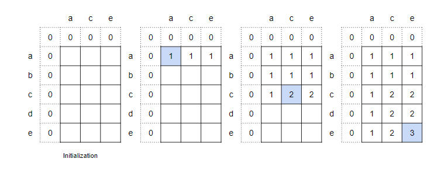

# Dynamic Programming - Longest Common Subsequence

## LeetCode Problems

1. 1143 - [Longest Common Subsequence](https://leetcode.com/problems/longest-common-subsequence/) (Medium)
2. 0005 - [Longest Palindromic Substring](https://leetcode.com/problems/longest-palindromic-substring/) (Medium)
3. 0072 - [Edit Distance](https://leetcode.com/problems/edit-distance/) (Hard)
4. 0115 - [Distinct Subsequences](https://leetcode.com/problems/distinct-subsequences/) (Hard)
5. 0392 - [Is Subsequence](https://leetcode.com/problems/is-subsequence/) (Easy)
6. 0583 - [Delete Operation for Two Strings](https://leetcode.com/problems/delete-operation-for-two-strings/) (Medium)
7. 0674 - [Longest Continuous Increasing Subsequence](https://leetcode.com/problems/longest-continuous-increasing-subsequence/) (Easy)
8. 0718 - [Maximum Length of Repeated Subarray](https://leetcode.com/problems/maximum-length-of-repeated-subarray/) (Medium)
9. 1035 - [Uncrossed Lines](https://leetcode.com/problems/uncrossed-lines/) (Medium)

## 1143. Longest Common Subsequence

-   Return the length of the longest common subsequence of two strings.



```python
--8<-- "1143_longest_common_subsequence.py"
```

## 5. Longest Palindromic Substring

-   Given a string `s`, return the longest palindromic substring in `s`.

```python
--8<-- "0005_longest_palindromic_substring.py"
```

## 72. Edit Distance

```python
--8<-- "0072_edit_distance.py"
```

## 115. Distinct Subsequences

```python
--8<-- "0115_distinct_subsequences.py"
```

## 392. Is Subsequence

```python
--8<-- "0392_is_subsequence.py"
```

## 583. Delete Operation for Two Strings

```python
--8<-- "0583_delete_operation_for_two_strings.py"
```

## 674. Longest Continuous Increasing Subsequence

```python
--8<-- "0674_longest_continuous_increasing_subsequence.py"
```

## 718. Maximum Length of Repeated Subarray

```python
--8<-- "0718_maximum_length_of_repeated_subarray.py"
```

## 1035. Uncrossed Lines

```python
--8<-- "1035_uncrossed_lines.py"
```
