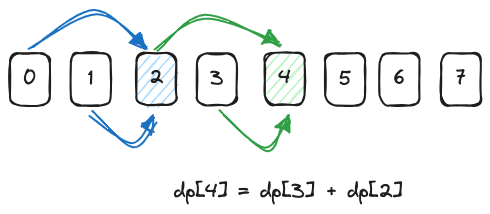

# Dynamic Programming - Basic

1. 0509 - [Fibonacci Number](https://leetcode.com/problems/fibonacci-number/) (Easy)
2. 0070 - [Climbing Stairs](https://leetcode.com/problems/climbing-stairs/) (Easy)
3. 0746 - [Min Cost Climbing Stairs](https://leetcode.com/problems/min-cost-climbing-stairs/) (Easy)
4. 0198 - [House Robber](https://leetcode.com/problems/house-robber/) (Easy)
5. 0213 - [House Robber II](https://leetcode.com/problems/house-robber-ii/) (Medium)
6. 0376 - [Wiggle Subsequence](https://leetcode.com/problems/wiggle-subsequence/) (Medium)
7. 0343 - [Integer Break](https://leetcode.com/problems/integer-break/) (Medium)
8. 1025 - [Divisor Game](https://leetcode.com/problems/divisor-game/) (Easy)

## DP Resources

- [[Leetcode Discuss] Solved all dynamic programming (dp) problems in 7 months](https://leetcode.com/discuss/general-discussion/1000929/solved-all-dynamic-programming-dp-problems-in-7-months)

## Steps to Solve DP Problems

1. Define the `dp` array and its meaning.
2. Define the `dp` formula.
3. Initialize the `dp` array.
4. Determine the traversal direction.
5. Derive the `dp` array.

## 509. Fibonacci Number

```python
--8<-- "0509_fibonacci_number.py"
```

## 70. Climbing Stairs

- Return the number of distinct ways to reach the top of the stairs.



```python
--8<-- "0070_climbing_stairs.py"
```

## 746. Min Cost Climbing Stairs

```python
--8<-- "0746_min_cost_climbing_stairs.py"
```

## 198. House Robber

```python
--8<-- "0198_house_robber.py"
```

## 213. House Robber II

```python
--8<-- "0213_house_robber_ii.py"
```

## 376. Wiggle Subsequence

```python
--8<-- "0376_wiggle_subsequence.py"
```

## 343. Integer Break

```python
--8<-- "0343_integer_break.py"
```

## 1025. Divisor Game

```python
--8<-- "1025_divisor_game.py"
```
