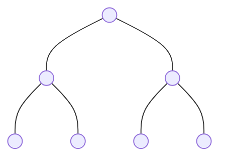
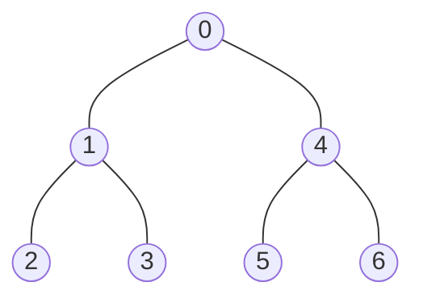
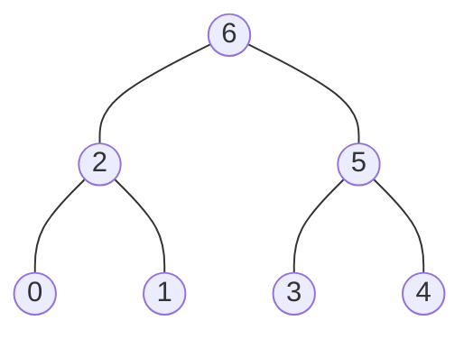
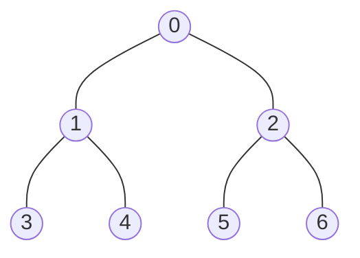

# Binary Tree Traversal

- [x] [144. Binary Tree Preorder Traversal](https://leetcode.cn/problems/binary-tree-preorder-traversal/) (Easy)
- [x] [94. Binary Tree Inorder Traversal](https://leetcode.cn/problems/binary-tree-inorder-traversal/) (Easy)
- [x] [145. Binary Tree Postorder Traversal](https://leetcode.cn/problems/binary-tree-postorder-traversal/) (Easy)
- [x] [872. Leaf-Similar Trees](https://leetcode.cn/problems/leaf-similar-trees/) (Easy)
- [x] [404. Sum of Left Leaves](https://leetcode.cn/problems/sum-of-left-leaves/) (Easy)
- [ ] [671. Second Minimum Node In a Binary Tree](https://leetcode.cn/problems/second-minimum-node-in-a-binary-tree/) (Easy)
- [ ] [1469. Find All The Lonely Nodes](https://leetcode.cn/problems/find-all-the-lonely-nodes/) (Easy) 👑
- [ ] [1214. Two Sum BSTs](https://leetcode.cn/problems/two-sum-bsts/) (Medium) 👑
- [ ] [2764. Is Array a Preorder of Some ‌Binary Tree](https://leetcode.cn/problems/is-array-a-preorder-of-some-binary-tree/) (Medium) 👑

## 144. Binary Tree Preorder Traversal

-   [LeetCode](https://leetcode.com/problems/binary-tree-preorder-traversal/) | [LeetCode CH](https://leetcode.cn/problems/binary-tree-preorder-traversal/) (Easy)

-   Tags: stack, tree, depth first search, binary tree


### Example 1



Pre-order Traversal



In-order Traversal


Post-order Traversal



Level Order Traversal


### Example 2



| Traversal   | Order             | Method         | Result                        |
| ----------- | ----------------- | -------------- | ----------------------------- |
| Preorder    | Root, Left, Right | DFS or Stack   | `[0, 1, 3, 4, 2, 5, 6]`       |
| Inorder     | Left, Root, Right | DFS or Stack   | `[3, 1, 4, 0, 5, 2, 6]`       |
| Postorder   | Left, Right, Root | DFS or Stack   | `[3, 4, 1, 5, 6, 2, 0]`       |
| Level Order | Level by Level    | BFS with Queue | `[[0], [1, 2], [3, 4, 5, 6]]` |

```python title="144. Binary Tree Preorder Traversal - Python Solution"
--8<-- "0144_binary_tree_preorder_traversal.py"
```

## 94. Binary Tree Inorder Traversal

-   [LeetCode](https://leetcode.com/problems/binary-tree-inorder-traversal/) | [LeetCode CH](https://leetcode.cn/problems/binary-tree-inorder-traversal/) (Easy)

-   Tags: stack, tree, depth first search, binary tree

```python title="94. Binary Tree Inorder Traversal - Python Solution"
--8<-- "0094_binary_tree_inorder_traversal.py"
```

## 145. Binary Tree Postorder Traversal

-   [LeetCode](https://leetcode.com/problems/binary-tree-postorder-traversal/) | [LeetCode CH](https://leetcode.cn/problems/binary-tree-postorder-traversal/) (Easy)

-   Tags: stack, tree, depth first search, binary tree

```python title="145. Binary Tree Postorder Traversal - Python Solution"
--8<-- "0145_binary_tree_postorder_traversal.py"
```

## 872. Leaf-Similar Trees

-   [LeetCode](https://leetcode.com/problems/leaf-similar-trees/) | [LeetCode CH](https://leetcode.cn/problems/leaf-similar-trees/) (Easy)

-   Tags: tree, depth first search, binary tree

```python title="872. Leaf-Similar Trees - Python Solution"
--8<-- "0872_leaf_similar_trees.py"
```

## 404. Sum of Left Leaves

-   [LeetCode](https://leetcode.com/problems/sum-of-left-leaves/) | [LeetCode CH](https://leetcode.cn/problems/sum-of-left-leaves/) (Easy)

-   Tags: tree, depth first search, breadth first search, binary tree

```python title="404. Sum of Left Leaves - Python Solution"
--8<-- "0404_sum_of_left_leaves.py"
```

## 671. Second Minimum Node In a Binary Tree

-   [LeetCode](https://leetcode.com/problems/second-minimum-node-in-a-binary-tree/) | [LeetCode CH](https://leetcode.cn/problems/second-minimum-node-in-a-binary-tree/) (Easy)

-   Tags: tree, depth first search, binary tree

## 1469. Find All The Lonely Nodes

-   [LeetCode](https://leetcode.com/problems/find-all-the-lonely-nodes/) | [LeetCode CH](https://leetcode.cn/problems/find-all-the-lonely-nodes/) (Easy)

-   Tags: tree, depth first search, breadth first search, binary tree

## 1214. Two Sum BSTs

-   [LeetCode](https://leetcode.com/problems/two-sum-bsts/) | [LeetCode CH](https://leetcode.cn/problems/two-sum-bsts/) (Medium)

-   Tags: two pointers, binary search, stack, tree, depth first search, binary search tree, binary tree

## 2764. Is Array a Preorder of Some ‌Binary Tree

-   [LeetCode](https://leetcode.com/problems/is-array-a-preorder-of-some-binary-tree/) | [LeetCode CH](https://leetcode.cn/problems/is-array-a-preorder-of-some-binary-tree/) (Medium)

-   Tags: stack, tree, depth first search, binary tree
