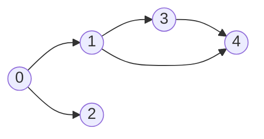
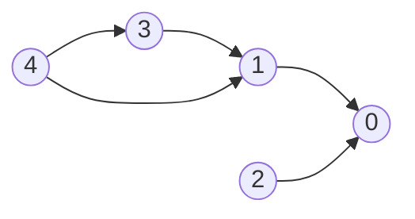
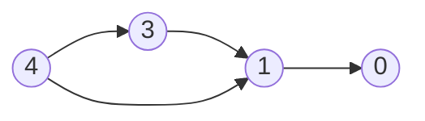
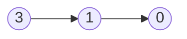
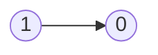

# DFS Basics

- [x] [547. Number of Provinces](https://leetcode.cn/problems/number-of-provinces/) (Medium)
- [x] [1971. Find if Path Exists in Graph](https://leetcode.cn/problems/find-if-path-exists-in-graph/) (Easy)
- [x] [797. All Paths From Source to Target](https://leetcode.cn/problems/all-paths-from-source-to-target/) (Medium)
- [x] [841. Keys and Rooms](https://leetcode.cn/problems/keys-and-rooms/) (Medium)
- [ ] [2316. Count Unreachable Pairs of Nodes in an Undirected Graph](https://leetcode.cn/problems/count-unreachable-pairs-of-nodes-in-an-undirected-graph/) (Medium)
- [ ] [1319. Number of Operations to Make Network Connected](https://leetcode.cn/problems/number-of-operations-to-make-network-connected/) (Medium)
- [ ] [2492. Minimum Score of a Path Between Two Cities](https://leetcode.cn/problems/minimum-score-of-a-path-between-two-cities/) (Medium)
- [ ] [3387. Maximize Amount After Two Days of Conversions](https://leetcode.cn/problems/maximize-amount-after-two-days-of-conversions/) (Medium)
- [ ] [3310. Remove Methods From Project](https://leetcode.cn/problems/remove-methods-from-project/) (Medium)
- [ ] [2685. Count the Number of Complete Components](https://leetcode.cn/problems/count-the-number-of-complete-components/) (Medium)
- [ ] [2192. All Ancestors of a Node in a Directed Acyclic Graph](https://leetcode.cn/problems/all-ancestors-of-a-node-in-a-directed-acyclic-graph/) (Medium)
- [x] [924. Minimize Malware Spread](https://leetcode.cn/problems/minimize-malware-spread/) (Hard)
- [ ] [2101. Detonate the Maximum Bombs](https://leetcode.cn/problems/detonate-the-maximum-bombs/) (Medium)
- [x] [721. Accounts Merge](https://leetcode.cn/problems/accounts-merge/) (Medium)
- [x] [207. Course Schedule](https://leetcode.cn/problems/course-schedule/) (Medium)
- [x] [802. Find Eventual Safe States](https://leetcode.cn/problems/find-eventual-safe-states/) (Medium)
- [ ] [928. Minimize Malware Spread II](https://leetcode.cn/problems/minimize-malware-spread-ii/) (Hard)
- [ ] [2092. Find All People With Secret](https://leetcode.cn/problems/find-all-people-with-secret/) (Hard)
- [ ] [3108. Minimum Cost Walk in Weighted Graph](https://leetcode.cn/problems/minimum-cost-walk-in-weighted-graph/) (Hard)
- [x] [261. Graph Valid Tree](https://leetcode.cn/problems/graph-valid-tree/) (Medium)
- [x] [323. Number of Connected Components in an Undirected Graph](https://leetcode.cn/problems/number-of-connected-components-in-an-undirected-graph/) (Medium)

## 547. Number of Provinces

-   [LeetCode](https://leetcode.com/problems/number-of-provinces/) | [LeetCode CH](https://leetcode.cn/problems/number-of-provinces/) (Medium)
-   Tags: depth first search, breadth first search, union find, graph
-   Return the number of provinces.

### Union Find

-   Find by Path Compression
-   Union by Rank
-   Time Complexity: O(log(n))
-   Space Complexity: O(n)

```python title="template/union_find.py"
--8<-- "template/union_find.py"
```

```python title="547. Number of Provinces - Python Solution"
--8<-- "0547_number_of_provinces.py"
```

## 1971. Find if Path Exists in Graph

-   [LeetCode](https://leetcode.com/problems/find-if-path-exists-in-graph/) | [LeetCode CH](https://leetcode.cn/problems/find-if-path-exists-in-graph/) (Easy)
-   Tags: depth first search, breadth first search, union find, graph

```python title="1971. Find if Path Exists in Graph - Python Solution"
--8<-- "1971_find_if_path_exists_in_graph.py"
```

## 797. All Paths From Source to Target

-   [LeetCode](https://leetcode.com/problems/all-paths-from-source-to-target/) | [LeetCode CH](https://leetcode.cn/problems/all-paths-from-source-to-target/) (Medium)
-   Tags: backtracking, depth first search, breadth first search, graph

```python title="797. All Paths From Source to Target - Python Solution"
--8<-- "0797_all_paths_from_source_to_target.py"
```

## 841. Keys and Rooms

-   [LeetCode](https://leetcode.com/problems/keys-and-rooms/) | [LeetCode CH](https://leetcode.cn/problems/keys-and-rooms/) (Medium)
-   Tags: depth first search, breadth first search, graph

```python title="841. Keys and Rooms - Python Solution"
--8<-- "0841_keys_and_rooms.py"
```

## 2316. Count Unreachable Pairs of Nodes in an Undirected Graph

-   [LeetCode](https://leetcode.com/problems/count-unreachable-pairs-of-nodes-in-an-undirected-graph/) | [LeetCode CH](https://leetcode.cn/problems/count-unreachable-pairs-of-nodes-in-an-undirected-graph/) (Medium)
-   Tags: depth first search, breadth first search, union find, graph

## 1319. Number of Operations to Make Network Connected

-   [LeetCode](https://leetcode.com/problems/number-of-operations-to-make-network-connected/) | [LeetCode CH](https://leetcode.cn/problems/number-of-operations-to-make-network-connected/) (Medium)
-   Tags: depth first search, breadth first search, union find, graph

## 2492. Minimum Score of a Path Between Two Cities

-   [LeetCode](https://leetcode.com/problems/minimum-score-of-a-path-between-two-cities/) | [LeetCode CH](https://leetcode.cn/problems/minimum-score-of-a-path-between-two-cities/) (Medium)
-   Tags: depth first search, breadth first search, union find, graph

## 3387. Maximize Amount After Two Days of Conversions

-   [LeetCode](https://leetcode.com/problems/maximize-amount-after-two-days-of-conversions/) | [LeetCode CH](https://leetcode.cn/problems/maximize-amount-after-two-days-of-conversions/) (Medium)
-   Tags: array, string, depth first search, breadth first search, graph

## 3310. Remove Methods From Project

-   [LeetCode](https://leetcode.com/problems/remove-methods-from-project/) | [LeetCode CH](https://leetcode.cn/problems/remove-methods-from-project/) (Medium)
-   Tags: depth first search, breadth first search, graph

## 2685. Count the Number of Complete Components

-   [LeetCode](https://leetcode.com/problems/count-the-number-of-complete-components/) | [LeetCode CH](https://leetcode.cn/problems/count-the-number-of-complete-components/) (Medium)
-   Tags: depth first search, breadth first search, union find, graph

## 2192. All Ancestors of a Node in a Directed Acyclic Graph

-   [LeetCode](https://leetcode.com/problems/all-ancestors-of-a-node-in-a-directed-acyclic-graph/) | [LeetCode CH](https://leetcode.cn/problems/all-ancestors-of-a-node-in-a-directed-acyclic-graph/) (Medium)
-   Tags: depth first search, breadth first search, graph, topological sort

## 924. Minimize Malware Spread

-   [LeetCode](https://leetcode.com/problems/minimize-malware-spread/) | [LeetCode CH](https://leetcode.cn/problems/minimize-malware-spread/) (Hard)
-   Tags: array, hash table, depth first search, breadth first search, union find, graph

```python title="924. Minimize Malware Spread - Python Solution"
--8<-- "0924_minimize_malware_spread.py"
```

## 2101. Detonate the Maximum Bombs

-   [LeetCode](https://leetcode.com/problems/detonate-the-maximum-bombs/) | [LeetCode CH](https://leetcode.cn/problems/detonate-the-maximum-bombs/) (Medium)
-   Tags: array, math, depth first search, breadth first search, graph, geometry

## 721. Accounts Merge

-   [LeetCode](https://leetcode.com/problems/accounts-merge/) | [LeetCode CH](https://leetcode.cn/problems/accounts-merge/) (Medium)
-   Tags: array, hash table, string, depth first search, breadth first search, union find, sorting

```python title="721. Accounts Merge - Python Solution"
--8<-- "0721_accounts_merge.py"
```

## 207. Course Schedule

-   [LeetCode](https://leetcode.com/problems/course-schedule/) | [LeetCode CH](https://leetcode.cn/problems/course-schedule/) (Medium)
-   Tags: depth first search, breadth first search, graph, topological sort
-   Return true if it is possible to finish all courses, otherwise return false.
-   Dependency relationships imply the topological sort algorithm.
-   Cycle detection
-   Topological Sort
    -   DAG (Directed Acyclic Graph)
    -   Time complexity: O(V+E)
    -   Space complexity: O(V+E)
    -   Prerequisites: Indegree (Look at the problem 1557. Minimum Number of Vertices to Reach All Nodes)
        -   Indegree: Number of incoming edges to a vertex
    -   Applications: task scheduling, course scheduling, build systems, dependency resolution, compiler optimization, etc.

{width=300px}

{width=300px}

Course to prerequisites mapping



Prerequisites to course mapping



| course       | 0   | 0   | 1   | 1   | 3   |
| ------------ | --- | --- | --- | --- | --- |
| prerequisite | 1   | 2   | 3   | 4   | 4   |

| index     | 0   | 1   | 2   | 3   | 4   |
| --------- | --- | --- | --- | --- | --- |
| in-degree | 0   | 0   | 0   | 0   | 0   |

Initialize

-   graph

| prerequisite | 1     | 2     | 3     | 4        |
| ------------ | ----- | ----- | ----- | -------- |
| course       | `[0]` | `[0]` | `[1]` | `[1, 3]` |

-   in-degree

|           | 0   | 1   | 2   | 3   | 4   |
| --------- | --- | --- | --- | --- | --- |
| in-degree | 2   | 2   | 0   | 1   | 0   |

-   queue: `[2, 4]`
-   pop `2` from the queue



|           | 0   | 1   | 2   | 3   | 4   |
| --------- | --- | --- | --- | --- | --- |
| in-degree | 1   | 2   | 0   | 1   | 0   |

-   queue: `[4]`
-   pop `4` from the queue



|           | 0   | 1   | 2   | 3   | 4   |
| --------- | --- | --- | --- | --- | --- |
| in-degree | 1   | 1   | 0   | 0   | 0   |

-   queue: `[3]`
-   pop `3` from the queue



|           | 0   | 1   | 2   | 3   | 4   |
| --------- | --- | --- | --- | --- | --- |
| in-degree | 1   | 0   | 0   | 0   | 0   |

-   queue: `[1]`
-   pop `1` from the queue


|           | 0   | 1   | 2   | 3   | 4   |
| --------- | --- | --- | --- | --- | --- |
| in-degree | 0   | 0   | 0   | 0   | 0   |

-   queue: `[0]`
-   pop `0` from the queue
-   All courses are taken. Return `True`.

```python title="207. Course Schedule - Python Solution"
--8<-- "0207_course_schedule.py"
```

## 802. Find Eventual Safe States

-   [LeetCode](https://leetcode.com/problems/find-eventual-safe-states/) | [LeetCode CH](https://leetcode.cn/problems/find-eventual-safe-states/) (Medium)
-   Tags: depth first search, breadth first search, graph, topological sort

```python title="802. Find Eventual Safe States - Python Solution"
--8<-- "0802_find_eventual_safe_states.py"
```

## 928. Minimize Malware Spread II

-   [LeetCode](https://leetcode.com/problems/minimize-malware-spread-ii/) | [LeetCode CH](https://leetcode.cn/problems/minimize-malware-spread-ii/) (Hard)
-   Tags: array, hash table, depth first search, breadth first search, union find, graph

## 2092. Find All People With Secret

-   [LeetCode](https://leetcode.com/problems/find-all-people-with-secret/) | [LeetCode CH](https://leetcode.cn/problems/find-all-people-with-secret/) (Hard)
-   Tags: depth first search, breadth first search, union find, graph, sorting

## 3108. Minimum Cost Walk in Weighted Graph

-   [LeetCode](https://leetcode.com/problems/minimum-cost-walk-in-weighted-graph/) | [LeetCode CH](https://leetcode.cn/problems/minimum-cost-walk-in-weighted-graph/) (Hard)
-   Tags: array, bit manipulation, union find, graph

## 261. Graph Valid Tree

-   [LeetCode](https://leetcode.com/problems/graph-valid-tree/) | [LeetCode CH](https://leetcode.cn/problems/graph-valid-tree/) (Medium)
-   Tags: depth first search, breadth first search, union find, graph

```python title="261. Graph Valid Tree - Python Solution"
--8<-- "0261_graph_valid_tree.py"
```

## 323. Number of Connected Components in an Undirected Graph

-   [LeetCode](https://leetcode.com/problems/number-of-connected-components-in-an-undirected-graph/) | [LeetCode CH](https://leetcode.cn/problems/number-of-connected-components-in-an-undirected-graph/) (Medium)
-   Tags: depth first search, breadth first search, union find, graph

```python title="323. Number of Connected Components in an Undirected Graph - Python Solution"
--8<-- "0323_number_of_connected_components_in_an_undirected_graph.py"
```
